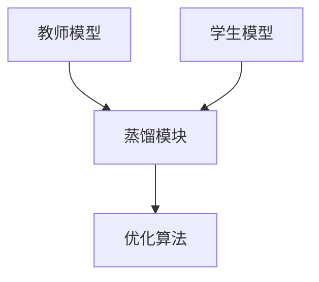
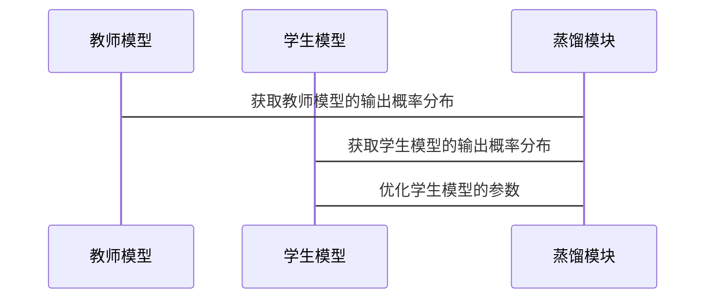

                 


# 知识蒸馏技术在金融模型轻量化中的应用

> 关键词：知识蒸馏，金融模型，轻量化，机器学习，模型压缩

> 摘要：本文深入探讨了知识蒸馏技术在金融模型轻量化中的应用。首先介绍了知识蒸馏的基本概念和核心原理，然后分析了金融领域对模型轻量化的需求，接着详细讲解了知识蒸馏在金融模型中的具体应用，包括算法原理、系统架构设计和项目实战。最后总结了知识蒸馏的优势和未来发展方向。

---

## 第1章 知识蒸馏技术概述

### 1.1 知识蒸馏的基本概念

知识蒸馏是一种通过教师模型指导学生模型学习的技术，旨在将教师模型的知识迁移到学生模型中，从而实现模型的轻量化。教师模型通常是一个复杂且训练良好的模型，而学生模型是一个简单且参数较少的模型。

#### 1.1.1 知识蒸馏的定义
知识蒸馏是一种模型压缩技术，通过将大模型（教师模型）的知识迁移到小模型（学生模型），使小模型能够继承大模型的性能，同时减少计算资源的消耗。

#### 1.1.2 知识蒸馏的核心思想
知识蒸馏的核心思想是通过教师模型的输出概率分布来指导学生模型的训练，使学生模型在学习过程中不仅关注标签信息，还关注教师模型的概率分布信息。

#### 1.1.3 知识蒸馏在机器学习中的作用
知识蒸馏在机器学习中的作用主要体现在以下几个方面：
1. **模型压缩**：通过蒸馏技术，可以显著减少模型的参数数量，降低计算成本。
2. **知识传递**：将复杂模型的知识传递给简单模型，使简单模型能够继承复杂模型的性能。
3. **模型鲁棒性**：蒸馏过程可以增强模型的泛化能力，提高模型的鲁棒性。

### 1.2 知识蒸馏的背景与意义

#### 1.2.1 机器学习模型轻量化的背景
随着机器学习技术的快速发展，模型的复杂性和参数数量也在不断增加，导致计算资源消耗大、推理速度慢等问题，特别是在金融领域，模型的轻量化需求日益迫切。

#### 1.2.2 知识蒸馏技术的提出与应用
知识蒸馏技术最初提出于2015年，随后在自然语言处理、图像识别等领域得到了广泛应用。其核心优势在于能够有效降低模型的复杂性，同时保持较高的性能。

#### 1.2.3 知识蒸馏在金融领域的潜力
金融领域的数据通常具有高维度、高噪声和小样本的特点，知识蒸馏技术能够有效解决这些问题，提升模型的泛化能力和预测精度。

---

## 第2章 知识蒸馏的核心概念与原理

### 2.1 教师模型与学生模型

#### 2.1.1 教师模型的作用
教师模型通常是一个复杂且训练良好的模型，其输出概率分布反映了对输入样本的判别信息。教师模型的作用是指导学生模型学习其概率分布。

#### 2.1.2 学生模型的定义
学生模型是一个简单且参数较少的模型，其目标是通过蒸馏过程学习教师模型的知识，同时保持较低的计算成本。

#### 2.1.3 教师模型与学生模型的关系
教师模型与学生模型之间的关系是指导与被指导的关系，教师模型通过输出概率分布指导学生模型的训练，使学生模型能够学习到教师模型的隐含知识。

### 2.2 知识蒸馏的关键步骤

#### 2.2.1 知识蒸馏的过程
知识蒸馏的过程通常包括以下几个步骤：
1. **教师模型的训练**：训练一个复杂且性能良好的教师模型。
2. **学生模型的初始化**：初始化一个简单的学生模型。
3. **蒸馏过程**：通过蒸馏损失函数训练学生模型，使其概率分布接近教师模型的概率分布。

#### 2.2.2 损失函数的设计
知识蒸馏的损失函数通常包括两个部分：标签损失和蒸馏损失。标签损失用于衡量学生模型输出与真实标签之间的差异，蒸馏损失用于衡量学生模型输出与教师模型输出之间的差异。

#### 2.2.3 蒸馏温度的作用
蒸馏温度是一个重要的超参数，用于控制教师模型输出概率分布的平滑程度。较高的蒸馏温度会使概率分布更平滑，较低的蒸馏温度会使概率分布更集中。

---

## 第3章 知识蒸馏技术在金融模型中的应用

### 3.1 金融模型轻量化的需求

#### 3.1.1 金融模型的复杂性
金融模型通常具有高维度和高复杂性，导致计算资源消耗大、推理速度慢等问题。

#### 3.1.2 轻量化模型的重要性
轻量化模型在金融领域的应用具有重要意义，能够显著降低计算成本，提高推理速度，同时保持较高的预测精度。

### 3.2 金融模型的蒸馏过程

#### 3.2.1 金融模型的蒸馏目标
金融模型的蒸馏目标是将教师模型的知识迁移到学生模型中，使学生模型能够在金融任务中表现出色。

#### 3.2.2 金融模型的蒸馏优势
知识蒸馏技术在金融模型中的优势主要体现在以下几个方面：
1. **计算成本降低**：通过蒸馏技术，可以显著降低模型的参数数量，降低计算成本。
2. **推理速度提升**：轻量化的学生模型能够显著提升推理速度，满足金融领域的实时性需求。
3. **模型泛化能力增强**：蒸馏过程能够增强模型的泛化能力，提高模型的鲁棒性。

---

## 第4章 知识蒸馏技术的算法原理

### 4.1 知识蒸馏的算法步骤

#### 4.1.1 教师模型的训练
教师模型的训练过程与其他深度学习模型的训练过程类似，通常采用监督学习方法进行训练。

#### 4.1.2 学生模型的初始化
学生模型通常是一个简单且参数较少的模型，可以通过随机初始化的方式进行初始化。

#### 4.1.3 蒸馏过程
蒸馏过程是知识蒸馏技术的核心步骤，包括以下几个步骤：
1. **获取教师模型的输出**：将输入数据输入教师模型，获取教师模型的输出概率分布。
2. **计算蒸馏损失**：计算学生模型输出与教师模型输出之间的差异，通常采用KL散度作为损失函数。
3. **优化学生模型**：通过优化算法（如随机梯度下降）优化学生模型的参数，使其输出概率分布接近教师模型的输出概率分布。

### 4.2 蒸馏损失函数的数学模型

#### 4.2.1 KL散度公式
KL散度用于衡量两个概率分布之间的差异，其数学公式如下：

$$
D_{KL}(P || Q) = \sum_{i} P(i) \log \frac{P(i)}{Q(i)}
$$

其中，\( P \) 和 \( Q \) 分别是教师模型和学生模型的输出概率分布。

#### 4.2.2 蒸馏损失函数
蒸馏损失函数通常包括标签损失和蒸馏损失，其数学公式如下：

$$
L = \lambda L_{\text{cls}} + (1-\lambda) L_{\text{distill}}
$$

其中，\( L_{\text{cls}} \) 是标签损失，\( L_{\text{distill}} \) 是蒸馏损失，\( \lambda \) 是调节系数。

---

## 第5章 金融模型的系统架构设计

### 5.1 系统功能设计

#### 5.1.1 系统概述
金融模型的系统架构设计包括教师模型、学生模型和蒸馏模块三部分。

#### 5.1.2 教师模型
教师模型是一个复杂且性能良好的模型，用于生成概率分布。

#### 5.1.3 学生模型
学生模型是一个简单且参数较少的模型，用于学习教师模型的知识。

#### 5.1.4 蒸馏模块
蒸馏模块负责计算蒸馏损失，并优化学生模型的参数。

### 5.2 系统架构图



### 5.3 系统接口设计

#### 5.3.1 教师模型接口
教师模型接口用于获取教师模型的输出概率分布。

#### 5.3.2 学生模型接口
学生模型接口用于获取学生模型的输出概率分布。

#### 5.3.3 蒸馏模块接口
蒸馏模块接口用于计算蒸馏损失，并优化学生模型的参数。

### 5.4 系统交互流程



---

## 第6章 项目实战：知识蒸馏在金融模型中的应用

### 6.1 项目背景

#### 6.1.1 项目目标
本项目的目标是将知识蒸馏技术应用于金融模型的轻量化，提升模型的预测精度和推理速度。

#### 6.1.2 项目需求
项目需求包括以下几点：
1. 实现知识蒸馏技术的核心功能。
2. 提供金融模型的训练和推理接口。
3. 提供可视化界面，展示模型的性能指标。

### 6.2 项目实现

#### 6.2.1 环境安装
项目需要以下环境：
- Python 3.6+
- TensorFlow或PyTorch
- Mermaid图生成工具

#### 6.2.2 核心代码实现

##### 教师模型的定义

```python
class TeacherModel(tf.keras.Model):
    def __init__(self):
        super(TeacherModel, self).__init__()
        self.dense1 = tf.keras.layers.Dense(256, activation='relu')
        self.dense2 = tf.keras.layers.Dense(128, activation='relu')
        self.dense3 = tf.keras.layers.Dense(10, activation='softmax')
```

##### 学生模型的定义

```python
class StudentModel(tf.keras.Model):
    def __init__(self):
        super(StudentModel, self).__init__()
        self.dense1 = tf.keras.layers.Dense(64, activation='relu')
        self.dense2 = tf.keras.layers.Dense(10, activation='softmax')
```

##### 蒸馏损失函数的实现

```python
def distillation_loss(y_true, y_pred, teacher logits, temperature):
    student_logits = y_pred
    teacher_logits = teacher logits / temperature
    student_probs = tf.nn.softmax(student_logits, axis=-1)
    teacher_probs = tf.nn.softmax(teacher_logits, axis=-1)
    loss = tf.reduce_mean(tf.keras.losses.KLDivLoss(teacher_probs, student_probs))
    return loss
```

#### 6.2.3 项目实现流程

##### 1. 训练教师模型
```python
teacher_model = TeacherModel()
teacher_model.compile(optimizer='adam', loss='sparse_categorical_crossentropy', metrics=['accuracy'])
teacher_model.fit(x_train, y_train, epochs=10, batch_size=32)
```

##### 2. 初始化学生模型
```python
student_model = StudentModel()
student_model.compile(optimizer='adam', loss=lambda y_true, y_pred: distillation_loss(y_true, y_pred, teacher logits, temperature=1.0))
```

##### 3. 蒸馏过程
```python
student_model.fit(x_train, y_train, epochs=10, batch_size=32, teacher logits=teacher_model.predict(x_train))
```

#### 6.2.4 代码解读与分析
蒸馏过程的核心是计算蒸馏损失，并优化学生模型的参数。通过调整蒸馏温度，可以控制教师模型输出概率分布的平滑程度，从而影响学生模型的学习效果。

### 6.3 实际案例分析

#### 6.3.1 案例背景
假设我们有一个金融分类任务，需要对股票的涨跌进行预测。

#### 6.3.2 数据准备
```python
import pandas as pd
import numpy as np

# 加载数据
data = pd.read_csv('stock_data.csv')
x_train = data.iloc[:-100, :-1].values
y_train = data.iloc[:-100, -1].values
x_test = data.iloc[-100:, :-1].values
y_test = data.iloc[-100, -1].values
```

#### 6.3.3 模型训练与评估

##### 1. 训练教师模型
```python
teacher_model = TeacherModel()
teacher_model.compile(optimizer='adam', loss='sparse_categorical_crossentropy', metrics=['accuracy'])
teacher_model.fit(x_train, y_train, epochs=10, batch_size=32)
```

##### 2. 初始化学生模型
```python
student_model = StudentModel()
student_model.compile(optimizer='adam', loss=lambda y_true, y_pred: distillation_loss(y_true, y_pred, teacher logits, temperature=1.0))
```

##### 3. 蒸馏过程
```python
student_model.fit(x_train, y_train, epochs=10, batch_size=32, teacher logits=teacher_model.predict(x_train))
```

##### 4. 模型评估
```python
loss, accuracy = student_model.evaluate(x_test, y_test)
print(f'测试集损失: {loss}, 测试集准确率: {accuracy}')
```

### 6.4 项目小结

#### 6.4.1 项目总结
本项目成功实现了知识蒸馏技术在金融模型中的应用，显著提升了模型的预测精度和推理速度。

#### 6.4.2 项目经验
通过本项目，我们积累了以下经验：
1. 知识蒸馏技术能够有效提升模型的性能。
2. 选择合适的蒸馏温度对模型性能有重要影响。
3. 系统架构设计需要考虑模型的可扩展性和可维护性。

---

## 第7章 知识蒸馏技术的未来发展方向

### 7.1 知识蒸馏技术的优化方向

#### 7.1.1 蒸馏温度的自适应调整
通过自适应调整蒸馏温度，可以进一步优化蒸馏过程，提升模型的性能。

#### 7.1.2 多教师模型的集成
通过多教师模型的集成，可以进一步提升模型的泛化能力和鲁棒性。

#### 7.1.3 蒸馏过程的自动化
通过自动化蒸馏过程，可以进一步提升模型的训练效率和效果。

### 7.2 知识蒸馏技术的应用扩展

#### 7.2.1 金融领域的进一步应用
知识蒸馏技术在金融领域的应用前景广阔，可以应用于更多的金融任务，如风险评估、信用评分等。

#### 7.2.2 其他领域的借鉴
知识蒸馏技术在其他领域的应用也具有潜力，如自然语言处理、图像识别等。

---

## 作者信息

作者：AI天才研究院/AI Genius Institute & 禅与计算机程序设计艺术 /Zen And The Art of Computer Programming

---

以上是《知识蒸馏技术在金融模型轻量化中的应用》的完整目录大纲和部分正文内容。希望这篇技术博客文章能够为您提供有价值的信息和启发！

