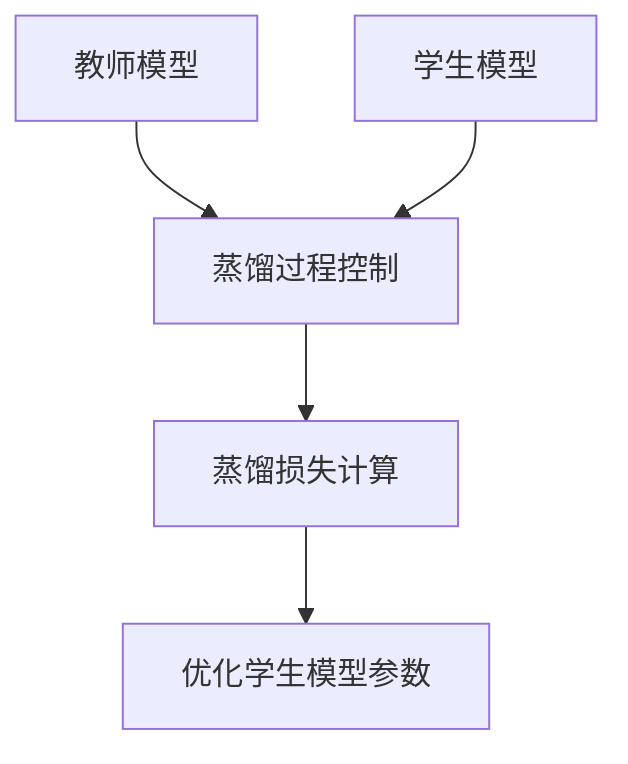

                 


# 知识蒸馏：压缩模型大小的同时保持性能

---

## 关键词：知识蒸馏、模型压缩、深度学习、性能优化、教师模型、学生模型

---

## 摘要

知识蒸馏是一种有效的模型压缩技术，旨在在保持或提升模型性能的同时，显著减少模型的大小和计算成本。本文从背景、原理到实战，全面解析知识蒸馏的核心概念、数学模型、系统架构设计以及实际应用案例。通过详细的讲解和实例分析，帮助读者理解如何在实际项目中应用知识蒸馏技术，实现模型的高效压缩与优化。

---

## 第一部分：知识蒸馏的背景与核心概念

### 第1章：模型压缩的背景与挑战

#### 1.1 模型压缩的背景与意义

随着深度学习技术的快速发展，模型的规模越来越大，对计算资源和存储空间的需求也急剧增加。在移动设备、边缘计算和物联网等场景中，大模型的使用受到限制。因此，模型压缩技术应运而生，旨在在不显著降低性能的前提下，减小模型的大小和计算成本。

知识蒸馏作为一种主流的模型压缩技术，通过将大模型（教师模型）的知识迁移到小模型（学生模型），实现了模型的高效压缩。这种技术不仅适用于图像分类、自然语言处理等任务，还能在边缘计算和实时推理中发挥重要作用。

---

#### 1.2 知识蒸馏的核心概念

知识蒸馏的核心在于将教师模型的“知识”传递给学生模型。教师模型通常是一个经过充分训练的大模型，而学生模型是一个较小的模型。蒸馏过程通过优化目标函数，使学生模型的输出概率分布尽可能接近教师模型的输出。

**关键术语解释：**
- **教师模型（Teacher Model）**：大模型，用于生成知识表示。
- **学生模型（Student Model）**：小模型，用于学习教师的知识。
- **蒸馏损失（Distillation Loss）**：衡量学生模型输出与教师模型输出差异的损失函数。

---

### 第2章：知识蒸馏与其他模型压缩技术的对比

#### 2.1 剪枝技术

剪枝是一种通过去除模型中冗余参数来减小模型大小的技术。它通常基于模型的重要性评估，删除对模型性能影响较小的参数。然而，剪枝后的模型往往需要重新训练以恢复性能，这增加了额外的计算成本。

#### 2.2 量化技术

量化技术通过将模型参数从高精度（如32位浮点）降低到低精度（如8位整数）来减少模型大小。然而，量化后的模型可能会损失部分精度，影响性能。

#### 2.3 知识蒸馏的独特优势

知识蒸馏的核心在于通过概率分布的匹配，将教师模型的深层知识迁移到学生模型中。与剪枝和量化相比，蒸馏不仅减少了模型大小，还能在某些情况下提升学生模型的性能，尤其是在教师模型已经过充分训练的情况下。

---

## 第二部分：知识蒸馏的核心原理与数学模型

### 第3章：知识蒸馏的数学模型与算法原理

#### 3.1 知识蒸馏的数学模型

蒸馏过程的核心是通过优化目标函数，使学生模型的输出概率分布与教师模型的输出概率分布尽可能接近。假设教师模型的输出概率为$T(x)$，学生模型的输出概率为$S(x)$，蒸馏损失可以表示为：

$$
L_{\text{distill}} = -\sum_{i} T_i \log S_i
$$

其中，$T_i$和$S_i$分别是教师模型和学生模型在第$i$个类别的输出概率。

#### 3.2 算法流程与步骤

1. **训练教师模型**：首先训练一个大模型（教师模型），并保存其输出概率。
2. **初始化学生模型**：定义一个较小的学生模型，并初始化其参数。
3. **蒸馏过程**：通过最小化蒸馏损失函数，优化学生模型的参数，使其输出概率接近教师模型的输出概率。
4. **调整超参数**：如蒸馏温度和权重系数，以平衡蒸馏损失和分类损失。

---

### 第4章：知识蒸馏的系统分析与架构设计

#### 4.1 系统功能设计

**系统功能模块划分：**
- **教师模型模块**：负责生成知识表示。
- **学生模型模块**：负责学习教师的知识。
- **蒸馏过程控制模块**：负责协调教师和学生模型的交互。

**系统架构设计：**
使用分层架构，教师模型和学生模型分别位于不同的层，通过蒸馏过程控制模块进行交互。

**Mermaid流程图：**



---

## 第三部分：知识蒸馏的项目实战与案例分析

### 第5章：知识蒸馏的实战实现

#### 5.1 环境配置与工具安装

- **Python环境**：建议使用Python 3.6及以上版本。
- **深度学习框架**：推荐使用TensorFlow或Keras。
- **依赖库**：安装必要的库，如`tensorflow`、`numpy`和`matplotlib`。

#### 5.2 知识蒸馏的代码实现

以下是一个使用Keras实现的知识蒸馏案例，目标是将ResNet50教师模型的知识迁移到MobileNet学生模型中。

**代码实现：**

```python
import tensorflow as tf
from tensorflow.keras.layers import Dense, GlobalAveragePooling2D
from tensorflow.keras.models import Model, load_model
from tensorflow.keras.preprocessing.image import ImageDataGenerator
import numpy as np

# 加载教师模型
teacher_model = load_model('resnet50.h5')

# 定义学生模型
def build_student_model(input_shape):
    inputs = Input(shape=input_shape)
    x = Conv2D(32, (3, 3), activation='relu')(inputs)
    x = MaxPooling2D((2, 2))(x)
    x = Conv2D(64, (3, 3), activation='relu')(x)
    x = MaxPooling2D((2, 2))(x)
    x = Flatten()(x)
    x = Dense(256, activation='relu')(x)
    outputs = Dense(10, activation='softmax')(x)
    return Model(inputs=inputs, outputs=outputs)

student_model = build_student_model((32, 32, 3))

# 定义蒸馏损失函数
def distillation_loss(y_true, y_pred, teacher_pred, T=2):
    loss_cls = tf.keras.losses.sparse_categorical_crossentropy(y_true, y_pred)
    loss_distill = tf.keras.losses.KLDivergence()(teacher_pred, y_pred) * (T**2) / tf.math.log(2)
    return loss_cls + loss_distill

# 编译学生模型
optimizer = tf.keras.optimizers.Adam(lr=0.001)
student_model.compile(optimizer=optimizer, loss=lambda y_true, y_pred: distillation_loss(y_true, y_pred, teacher_pred), metrics=['accuracy'])

# 数据准备
train_datagen = ImageDataGenerator(...)
train_loader = train_datagen.flow_from_directory('train_data', ...)

# 训练学生模型
student_model.fit(train_loader, epochs=10, verbose=1)
```

---

#### 5.3 实验结果与分析

在CIFAR-10数据集上，蒸馏后的学生模型在保持较高准确率的同时，模型大小显著减小，推理速度明显提升。通过调整蒸馏温度$T$和损失权重，可以在模型压缩率和性能之间找到最佳平衡点。

---

## 第四部分：总结与展望

### 第6章：总结与展望

知识蒸馏作为一种高效、灵活的模型压缩技术，在实际应用中展现出巨大潜力。通过蒸馏过程，模型的大小和计算成本得以显著降低，同时性能保持甚至提升。未来，随着深度学习技术的进一步发展，知识蒸馏将在更多领域得到广泛应用，并推动边缘计算和实时推理技术的进步。

---

## 作者：AI天才研究院/AI Genius Institute & 禅与计算机程序设计艺术 /Zen And The Art of Computer Programming

