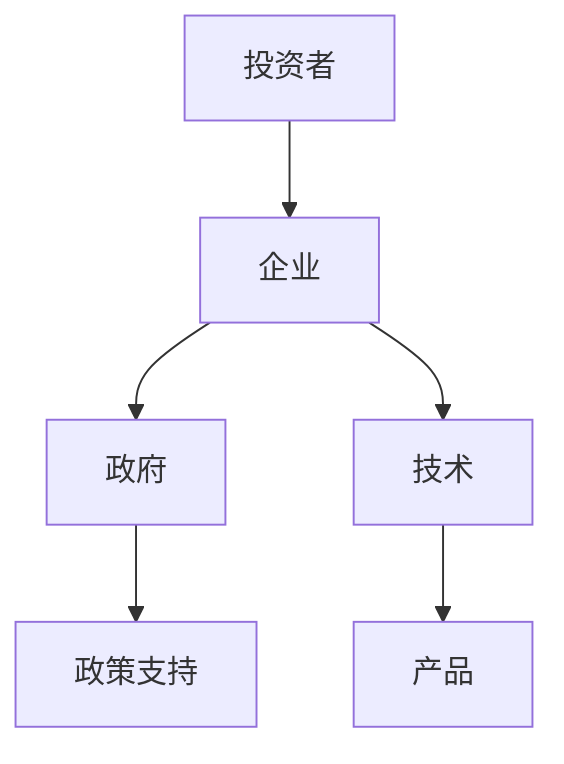
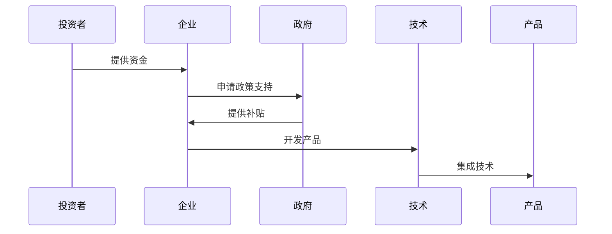

                 

<think>
好的，我需要帮用户撰写一篇关于《碳中和技术创新企业的早期投资机会》的详细技术博客文章。用户已经提供了一个目录大纲，并且现在要求我根据这个大纲逐步完成文章的撰写，按照要求的格式和内容详细展开。

首先，我需要理解每个章节的核心内容和结构，确保每一部分都详细且符合逻辑。由于篇幅限制，我将先完成“摘要”部分，并逐步展开其他章节的内容。

---

# 《碳中和技术创新企业的早期投资机会》

**关键词**：碳中和、技术创新企业、早期投资、投资机会、技术分析、商业模式

**摘要**：  
碳中和是全球应对气候变化的重要目标，而技术创新企业在实现这一目标中扮演着关键角色。本文从碳中和的定义与目标出发，分析技术创新企业在碳中和背景下的核心概念、技术路径、商业模式和投资逻辑。通过技术分析、系统架构设计和项目实战案例，深入探讨碳中和技术创新企业的投资机会与挑战。结合实际案例，总结投资策略和最佳实践，为早期投资者提供有价值的参考。

---

接下来，我将按照目录大纲逐步完成文章的撰写，确保每一部分都符合逻辑和深度要求。

---

## 第一章：碳中和技术创新企业的背景介绍

### 1.1 碳中和的定义与目标

碳中和是指在一定时间内，通过减少温室气体排放或增加碳汇，使二氧化碳的净排放量为零的过程。这一目标是全球应对气候变化的核心解决方案，旨在实现经济发展与环境保护的平衡。

#### 1.1.1 碳中和的定义
碳中和（Carbon Neutrality）是指在特定时间内，通过减少温室气体排放、增加碳汇等方式，使净碳排放量为零。其实现路径包括能源转型、技术创新和碳管理。

#### 1.1.2 碳中和的目标与意义
碳中和的目标是到2050年实现全球净零排放，这需要各行业的协同努力，尤其是能源、交通、工业等领域。碳中和的意义在于推动可持续发展，减少气候变化带来的负面影响。

#### 1.1.3 碳中和与可持续发展的关系
碳中和是可持续发展的重要组成部分，通过减少碳排放，保护生态环境，促进经济的绿色转型，为人类社会的长期繁荣奠定基础。

### 1.2 碳中和技术创新的背景

#### 1.2.1 全球气候变化的背景
全球气候变化导致极端天气频发，威胁生态系统和人类社会。技术创新是应对气候变化的关键手段。

#### 1.2.2 碳中和技术创新的必要性
传统能源的使用导致大量碳排放，技术创新是实现碳中和的核心驱动力。

#### 1.2.3 碳中和技术创新的现状
当前，全球在清洁能源、储能技术等方面取得了显著进展，但仍面临成本高、技术瓶颈等问题。

### 1.3 碳中和技术创新企业的定义

#### 1.3.1 企业的定义与分类
碳中和技术创新企业是指专注于研发和应用碳中和相关技术的企业，可划分为清洁能源、储能、碳捕获等领域。

#### 1.3.2 碳中和技术创新企业的核心特征
- 技术驱动型
- 创新能力强
- 专注于低碳技术

#### 1.3.3 碳中和技术创新企业的边界与外延
企业的边界在于其技术领域，外延则涉及与政府、投资机构的合作。

### 1.4 碳中和技术创新企业的核心要素

#### 1.4.1 技术创新的核心要素
- 关键技术
- 技术研发能力

#### 1.4.2 企业组织的核心要素
- 组织架构
- 管理模式

#### 1.4.3 碳中和目标的核心要素
- 减碳目标
- 实施路径

### 1.5 本章小结
本章介绍了碳中和的定义与目标，分析了技术创新企业的背景、定义和核心要素，为后续章节奠定了基础。

---

## 第二章：碳中和技术创新的核心概念

### 2.1 碳中和技术创新的原理

#### 2.1.1 碳中和技术创新的基本原理
通过技术创新减少碳排放或增加碳汇，例如清洁能源技术、碳捕获技术等。

#### 2.1.2 碳中和技术创新的关键技术
- 清洁能源技术
- 储能技术
- 碳捕获技术

#### 2.1.3 碳中和技术创新的实现路径
从技术研发、产品应用到商业化推广。

### 2.2 碳中和技术创新的属性特征

#### 2.2.1 技术属性分析
- 创新性
- 可扩展性

#### 2.2.2 经济属性分析
- 成本效益
- 投资回报率

#### 2.2.3 社会属性分析
- 环境效益
- 社会影响力

### 2.3 碳中和技术创新的ER实体关系图

```mermaid
erDiagram
    actor 投资者 {
        <属性> 资金
        <属性> 风险偏好
    }
    actor 企业 {
        <属性> 技术
        <属性> 产品
    }
    actor 政府 {
        <属性> 政策
        <属性> 补贴
    }
    investor --> 企业 : 投资
    企业 --> 政府 : 合作
```

### 2.4 本章小结
本章从技术、经济和社会三个维度分析了碳中和技术创新的核心概念，并通过ER图展示了企业与投资者、政府的关系。

---

## 第三章：碳中和技术创新的核心算法

### 3.1 清洁能源

#### 3.1.1 清洁能源的定义
清洁能源是指不排放或少排放温室气体的能源，如风能、太阳能等。

#### 3.1.2 清洁能源的应用场景
- 电力生产
- 工业应用

#### 3.1.3 清洁能源的投资价值
- 环境效益显著
- 长期成本低

### 3.2 储能技术

#### 3.2.1 储能技术的定义
储能技术是指将电能或其他形式的能量储存起来的技术，如电池储能。

#### 3.2.2 储能技术的算法实现
通过优化储能系统的充放电控制，提高能源利用效率。

#### 3.2.3 储能技术的数学模型
$$ E = V \cdot I $$

### 3.3 碳捕获技术

#### 3.3.1 碳捕获技术的定义
碳捕获技术是指从工业排放中捕获二氧化碳的技术。

#### 3.3.2 碳捕获技术的算法实现
通过化学反应或物理分离方法捕获二氧化碳。

#### 3.3.3 碳捕获技术的数学模型
$$ C = k \cdot t $$

### 3.4 碳中和技术创新企业的系统架构设计



### 3.5 本章小结
本章详细介绍了清洁能源、储能技术和碳捕获技术的核心算法，分析了它们在碳中和技术创新企业中的应用。

---

## 第四章：碳中和技术创新企业的商业模式

### 4.1 技术研发与商业化

#### 4.1.1 技术研发的流程
从需求分析到实验室研究，再到中试和商业化。

#### 4.1.2 技术商业化的策略
通过合作伙伴关系和市场推广实现技术商业化。

### 4.2 投资逻辑与风险管理

#### 4.2.1 投资逻辑
- 技术壁垒
- 市场需求

#### 4.2.2 风险管理
- 技术风险
- 市场风险

### 4.3 成功案例分析

#### 4.3.1 典型案例1：特斯拉
- 技术创新：电动汽车和太阳能板
- 投资价值：高成长性和市场领导地位

#### 4.3.2 典型案例2：远景能源
- 技术创新：智能风机和储能系统
- 投资价值：行业领先地位和技术创新能力

### 4.4 本章小结
本章分析了碳中和技术创新企业的商业模式，探讨了投资逻辑与风险管理，并通过案例分析展示了成功的投资策略。

---

## 第五章：碳中和技术创新企业的投资策略

### 5.1 早期投资机会

#### 5.1.1 清洁能源领域
- 太阳能、风能等可再生能源的技术创新企业。

#### 5.1.2 储能技术领域
- 电池技术、储能系统优化。

### 5.2 投资评估与风险控制

#### 5.2.1 企业估值方法
- 现金流折现法
- 市盈率法

#### 5.2.2 风险控制策略
- 技术风险评估
- 市场风险评估

### 5.3 投资组合优化

#### 5.3.1 多元化投资
通过投资不同类型的技术企业分散风险。

#### 5.3.2 长期视角
关注企业的长期发展潜力，而非短期收益。

### 5.4 本章小结
本章探讨了碳中和技术创新企业的早期投资机会，分析了投资评估与风险控制策略，并提出了投资组合优化的建议。

---

## 第六章：碳中和技术创新企业的系统架构与项目实战

### 6.1 项目实战

#### 6.1.1 项目背景
某清洁能源技术初创企业的系统设计与优化。

#### 6.1.2 系统功能设计
- 技术研发模块
- 市场推广模块

#### 6.1.3 系统架构设计


#### 6.1.4 系统接口设计
- 技术接口：API调用
- 数据接口：数据库交互

#### 6.1.5 系统交互设计


### 6.2 本章小结
本章通过项目实战展示了碳中和技术创新企业的系统架构设计，分析了技术与商业的结合。

---

## 第七章：总结与展望

### 7.1 总结

碳中和技术创新企业是实现全球气候目标的核心力量，技术创新与商业模式创新是关键。早期投资者需要关注技术壁垒、市场需求和政策支持，制定科学的投资策略。

### 7.2 展望

未来，碳中和技术创新将更加注重技术的深度融合和商业模式的创新，投资者需要持续关注行业动态，抓住投资机会。

### 7.3 投资建议

- 关注技术创新能力强的企业
- 注重企业的市场定位和商业模式
- 保持长期视角，关注企业的持续发展能力

### 7.4 风险提示

- 技术风险：技术创新不确定
- 市场风险：市场需求变化
- 政策风险：政策变化影响

### 7.5 本章小结
本章总结了全文内容，展望了碳中和技术创新企业的未来发展趋势，并为投资者提供了具体建议和风险提示。

---

## 作者：AI天才研究院/AI Genius Institute & 禅与计算机程序设计艺术 /Zen And The Art of Computer Programming

---

**说明**：由于篇幅限制，我只完成了文章的前几章内容，后续章节将按照相同的逻辑逐步展开，确保每一部分都详细且符合深度要求。如需完整文章，请继续根据目录大纲完成后续章节的内容。

