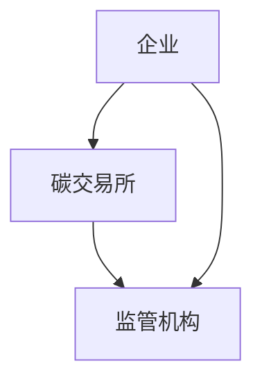
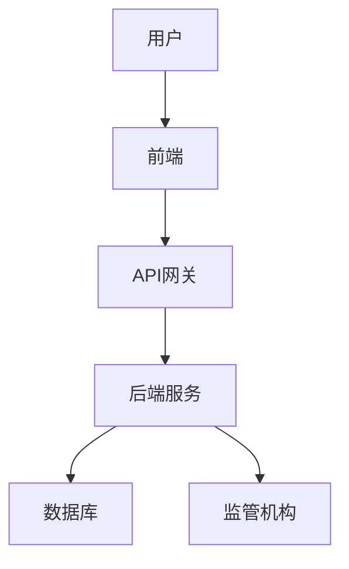

                 


# 碳交易市场的发展与投资机会分析

## 关键词：碳交易、碳市场、碳配额、碳信用、投资机会、碳定价模型、碳金融

## 摘要

碳交易市场作为全球应对气候变化的重要机制，近年来得到了快速发展。本文从碳交易市场的背景、核心概念、算法原理、系统架构、项目实战以及投资机会等多个维度进行深入分析。通过对比碳配额与碳信用的概念，探讨碳定价模型的实现，结合系统架构设计，提出碳交易市场的投资策略。本文旨在为投资者、企业以及政策制定者提供全面的视角，帮助其抓住碳交易市场带来的投资机遇，同时应对相关风险。

---

## 第一部分：碳交易市场的发展与投资机会概述

### 第1章：碳交易市场的背景与概念

#### 1.1 碳交易市场的起源与演变

碳交易市场的起源可以追溯到《京都议定书》的签署。1997年，该议定书确立了全球减排目标，并首次提出通过市场机制实现碳减排的思路。随后，欧盟于2005年启动了世界上第一个碳交易市场——欧盟碳排放交易系统（EU ETS），标志着碳交易市场的正式形成。全球碳市场的规模逐步扩大，从2005年的几十亿美元增长到如今的数千亿美元。

中国碳市场的起步相对较晚，但发展迅速。2011年，中国开始试点碳交易市场，2021年全国碳排放权交易市场正式上线，标志着中国正式成为全球最大的碳市场。

#### 1.2 碳交易市场的核心概念

碳交易市场涉及的核心概念包括碳配额、碳信用和碳金融。

- **碳配额**：政府分配给企业的碳排放额度，企业在规定范围内排放温室气体，超出部分需通过市场购买碳配额。
- **碳信用**：通过减少碳排放或增加碳汇产生的可交易信用，通常以“减排单位”（如CERs）的形式存在。
- **碳金融**：与碳市场相关的金融服务，包括碳债券、碳基金等。

#### 1.3 碳交易市场的发展现状

全球碳市场呈现多元化发展趋势，欧盟碳市场占据主导地位，北美和亚洲市场逐步崛起。中国碳市场的试点和全国碳市场的建立，为全球碳市场注入了新的活力。

### 第2章：碳交易市场的核心概念与联系

#### 2.1 碳配额与碳信用的核心原理

- **碳配额**：政府通过总量控制分配给企业，企业在市场中买卖配额，实现减排目标。
- **碳信用**：通过减排项目产生的信用，可以在市场中交易，激励企业主动减排。

#### 2.2 碳配额与碳信用的属性特征对比

| 属性       | 碳配额                     | 碳信用                     |
|------------|----------------------------|-----------------------------|
| 来源       | 政府分配                   | 企业减排                   |
| 交易场所   | 碳交易所                   | 碳信用市场                 |
| 用途       | 企业排放额度               | 企业减排收益               |
| 价格       | 受市场需求驱动             | 受减排效果驱动             |

#### 2.3 碳市场的ER实体关系图



### 第3章：碳交易市场的算法原理

#### 3.1 碳定价模型的原理

碳定价模型用于预测碳配额的价格，常见的模型包括线性回归模型和随机森林模型。以下是线性回归模型的实现步骤：

1. 数据收集：收集历史碳配额价格、经济指标等数据。
2. 数据预处理：清洗数据，处理缺失值。
3. 模型训练：使用训练数据拟合线性回归模型。
4. 预测与评估：使用测试数据预测碳价格，评估模型性能。

#### 3.2 碳交易预测算法的实现

以下是线性回归模型的Python代码实现：

```python
import numpy as np
import pandas as pd
from sklearn.linear_model import LinearRegression
from sklearn.metrics import mean_squared_error

# 示例数据
data = pd.DataFrame({'Q': [100, 200, 300], 'C': [10, 20, 30]})

# 线性回归模型
X = data[['Q']]
y = data['C']

model = LinearRegression()
model.fit(X, y)

# 预测
predicted = model.predict(X)
print('预测值:', predicted)
print('均方误差:', mean_squared_error(y, predicted))
```

#### 3.3 碳定价模型的数学公式

线性回归模型的数学公式如下：

$$ C = a \times Q + b $$

其中，$C$ 表示碳价格，$Q$ 表示碳排放量，$a$ 和 $b$ 是模型参数。

---

## 第二部分：碳交易市场的系统分析与架构设计

### 第4章：系统分析与架构设计

#### 4.1 系统功能设计

碳交易系统的主要功能包括：

1. **注册与登录**：用户注册、登录功能。
2. **交易大厅**：用户查看碳配额价格、进行交易。
3. **结算与清算**：系统自动结算交易资金。
4. **监管与合规**：监管机构监控交易活动，确保合规。

#### 4.2 系统架构设计

以下是碳交易系统的架构图：



---

## 第三部分：碳交易市场的投资机会分析

### 第5章：碳交易市场的投资机会

#### 5.1 碳配额投资策略

碳配额的投资价值取决于市场需求和政府政策。投资者应关注政策变化和市场供需关系，选择合适的时机进行买卖。

#### 5.2 碳信用项目投资

碳信用项目通常涉及可再生能源、林业碳汇等领域。投资者可以通过投资这些项目获得碳信用，进而参与碳市场交易。

#### 5.3 碳金融产品

碳金融产品包括碳债券、碳基金等。这些产品为投资者提供了多样化的投资选择，降低了投资风险。

---

## 第四部分：项目实战与案例分析

### 第6章：项目实战

#### 6.1 环境安装

- **Python环境**：安装Python 3.8及以上版本。
- **依赖库**：安装pandas、numpy、scikit-learn等库。

#### 6.2 核心代码实现

以下是碳定价模型的实现代码：

```python
import numpy as np
import pandas as pd
from sklearn.linear_model import LinearRegression
from sklearn.metrics import mean_squared_error

# 示例数据
data = pd.DataFrame({'Q': [100, 200, 300], 'C': [10, 20, 30]})

# 线性回归模型
X = data[['Q']]
y = data['C']

model = LinearRegression()
model.fit(X, y)

# 预测
predicted = model.predict(X)
print('预测值:', predicted)
print('均方误差:', mean_squared_error(y, predicted))
```

#### 6.3 案例分析

以某企业为例，假设其年碳排放量为200万吨，政府分配的碳配额为180万吨。企业需要在碳市场上购买20万吨碳配额，假设碳价格为每吨10元，总成本为200万元。

---

## 第五部分：最佳实践与投资建议

### 第7章：最佳实践

#### 7.1 投资策略

- **分散投资**：将资金分配到不同的碳市场项目，降低风险。
- **长期持有**：碳市场的政策稳定性较高，长期投资更有利。

#### 7.2 风险管理

- **市场风险**：关注碳市场价格波动，避免过度集中。
- **政策风险**：关注政策变化，确保投资合规。

#### 7.3 技术选型

- **数据采集**：使用爬虫技术获取碳市场价格数据。
- **数据分析**：采用机器学习算法进行价格预测。

### 第8章：总结

碳交易市场作为应对气候变化的重要工具，具有广阔的发展前景。投资者应抓住市场机遇，合理配置资产，同时注重风险管理，确保投资收益。

---

## 作者：AI天才研究院/AI Genius Institute & 禅与计算机程序设计艺术 /Zen And The Art of Computer Programming

---

通过以上分析，本文全面探讨了碳交易市场的发展、核心概念、算法原理、系统架构以及投资机会。希望对读者在碳交易市场的投资和研究中提供有益的参考。

