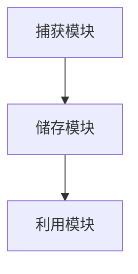
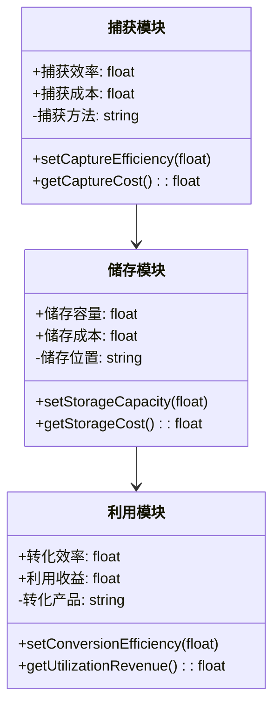

                 

# 碳捕获与利用技术的经济可行性分析

## 关键词：碳捕获、二氧化碳利用、经济可行性、技术经济模型、系统设计

## 摘要：碳捕获与利用技术是应对气候变化的重要手段，本文通过分析不同碳捕获技术的原理、优缺点及经济性，构建技术经济模型，评估其可行性，并结合实际案例进行分析，为决策者提供参考。

---

# 第一部分：碳捕获与利用技术概述

## 第1章：碳捕获技术的基本概念

### 1.1 碳捕获技术的定义与背景

#### 1.1.1 碳捕获技术的定义
碳捕获技术是指通过物理或化学手段从排放源中捕获二氧化碳（CO₂）的过程，是减少温室气体排放的重要手段。其核心目标是将CO₂从排放源中分离出来，避免其进入大气层，从而减缓气候变化。

#### 1.1.2 碳捕获技术的发展背景
随着全球气候变化问题的加剧，碳捕获技术逐渐成为全球关注的焦点。工业革命以来，化石燃料的大量使用导致CO₂排放急剧增加，传统的减排手段已难以满足需求。碳捕获技术作为一种补充手段，能够有效减少CO₂的排放。

#### 1.1.3 碳捕获技术的全球发展趋势
全球范围内，碳捕获技术的研究和应用正在快速发展。欧洲、北美和亚洲的多个国家和地区都在积极推动碳捕获技术的研发和应用，尤其是在电力、化工和钢铁等行业。

---

### 1.2 碳捕获技术的核心要素与边界

#### 1.2.1 碳捕获技术的核心要素
碳捕获技术的核心要素包括捕获剂、捕获设备、分离过程和后续处理。其中，捕获剂的选择直接影响捕获效率和成本。

#### 1.2.2 碳捕获技术的边界与外延
碳捕获技术的边界通常包括从CO₂排放源到捕获设备的前端部分，而后续的储存或利用则属于外延部分。外延部分可能涉及CO₂的运输、储存或再利用。

#### 1.2.3 碳捕获技术与相关领域的联系
碳捕获技术与能源、环境、材料科学等领域密切相关。例如，捕获技术的选择可能影响能源系统的效率，而后续的利用可能涉及材料科学中的催化剂开发。

---

### 1.3 碳捕获技术的经济可行性分析框架

#### 1.3.1 经济可行性分析的基本概念
经济可行性分析是评估一个技术或项目是否具备经济可行性的过程，通常包括成本分析、收益分析和净现值（NPV）计算等。

#### 1.3.2 碳捕获技术的经济可行性分析框架
经济可行性分析框架包括初始投资、运营成本、收益来源和净现值计算。这些因素共同决定了技术的经济可行性。

#### 1.3.3 经济可行性分析的关键指标
关键指标包括投资回收期（IRR）、净现值（NPV）、内部收益率（ROI）等。这些指标帮助评估项目的经济回报。

---

## 第2章：碳捕获技术的分类与原理

### 2.1 碳捕获技术的主要类型

#### 2.1.1 化学吸收法
化学吸收法利用特定化学试剂（如胺类）与CO₂反应，实现捕获。该方法广泛应用于燃煤电厂的烟气处理。

#### 2.1.2 物理吸附法
物理吸附法通过吸附剂（如活性炭）捕获CO₂。该方法适用于低浓度排放源。

#### 2.1.3 生物吸附法
生物吸附法利用微生物或植物捕获CO₂，是一种生态友好的方法，但效率较低。

#### 2.1.4 膜分离法
膜分离法通过选择性透过膜分离CO₂，适用于高浓度排放源。

---

### 2.2 碳捕获技术的原理与特点

#### 2.2.1 化学吸收法的原理
化学吸收法通过化学反应捕获CO₂，通常需要再生过程以恢复捕获剂。

#### 2.2.2 物理吸附法的原理
物理吸附法通过物理作用（如范德华力）捕获CO₂，吸附剂可重复使用。

#### 2.2.3 生物吸附法的原理
生物吸附法利用生物体的代谢活动捕获CO₂，通常用于小规模应用。

#### 2.2.4 膜分离法的原理
膜分离法利用气体分子的大小差异，通过膜的选择性透过实现CO₂分离。

---

### 2.3 碳捕获技术的优缺点对比

#### 2.3.1 各种碳捕获技术的优缺点
| 技术类型 | 优点 | 缺点 |
|----------|------|------|
| 化学吸收法 | 高效率 | 高成本 |
| 物理吸附法 | 成本低 | 低效率 |
| 生物吸附法 | 生态友好 | 低效率 |
| 膜分离法 | 高选择性 | 适用范围窄 |

#### 2.3.2 不同技术的适用场景
化学吸收法适用于高浓度排放源，而物理吸附法适用于低浓度排放源。生物吸附法适用于小规模应用，膜分离法则适用于特定场景。

#### 2.3.3 技术选择的经济性分析
经济性分析需要考虑捕获成本、设备投资和运营成本。不同技术的成本和效率 trade-off 需要根据具体应用场景进行权衡。

---

## 第3章：碳利用技术的分类与经济性分析

### 3.1 碳利用技术的主要类型

#### 3.1.1 碳转化为燃料
将CO₂转化为甲醇或合成燃料，实现资源化利用。

#### 3.1.2 碳转化为化学品
将CO₂转化为尿素、碳酸盐等化学品，应用于工业领域。

#### 3.1.3 碳转化为建筑材料
将CO₂固化为碳酸盐，用于生产生态水泥。

#### 3.1.4 碳封存技术
将CO₂注入地下或海底，实现长期储存。

---

### 3.2 碳利用技术的经济性分析

#### 3.2.1 各种碳利用技术的成本分析
成本分析需要考虑技术研发、设备投资和运营成本。例如，碳转化为燃料的成本较高，但市场需求大。

#### 3.2.2 碳利用技术的收益分析
收益分析包括产品售价、市场容量和技术创新带来的收益。例如，碳转化为燃料的收益可能较高，但依赖于油价波动。

#### 3.2.3 技术经济性的综合评估
综合评估需要考虑技术的可行性、经济性和环境效益。例如，碳封存技术的环境效益显著，但经济性较低。

---

## 第4章：碳捕获与利用技术的经济可行性模型

### 4.1 技术经济模型的构建

#### 4.1.1 模型的基本假设
假设：碳捕获技术的初始投资为1000万元，年运营成本为200万元，年收益为500万元，贴现率为5%，项目周期为10年。

#### 4.1.2 技术经济模型的数学表达
净现值公式：
$$ NPV = \sum_{t=0}^{n} \frac{C_t}{(1 + r)^t} $$

其中，$C_t$ 是第t年的现金流，$r$ 是贴现率，$n$ 是项目周期。

#### 4.1.3 模型的验证与优化
通过实际数据验证模型的准确性，并根据反馈进行优化。

---

## 第5章：系统设计与实现

### 5.1 系统架构设计

#### 5.1.1 系统功能模块
- 捕获模块：负责CO₂的捕获。
- 储存模块：负责CO₂的储存。
- 利用模块：负责CO₂的再利用。

#### 5.1.2 系统架构图

### 5.2 系统功能设计

#### 5.2.1 领域模型

---

## 第6章：案例分析与实际应用

### 6.1 案例分析

#### 6.1.1 某公司碳捕获项目
该公司采用化学吸收法捕获CO₂，年捕获量为10万吨，年成本为500万元，年收益为1000万元。

#### 6.1.2 项目经济性分析
NPV计算结果为正，表明项目具有经济可行性。

---

## 第7章：结论与展望

### 7.1 结论
碳捕获与利用技术在应对气候变化中具有重要作用，但其经济性仍需进一步提升。未来，随着技术进步和政策支持，碳捕获与利用技术的经济可行性将得到进一步优化。

### 7.2 展望
未来，碳捕获与利用技术将在全球范围内得到更广泛的应用，特别是在工业领域。技术创新和成本下降将推动技术的普及。

---

## 作者：AI天才研究院 & 禅与计算机程序设计艺术

---

以上是《碳捕获与利用技术的经济可行性分析》的技术博客文章，内容涵盖了从基础概念到实际应用的各个方面，结合理论分析和案例研究，为读者提供了全面的视角。

