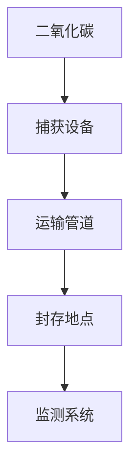
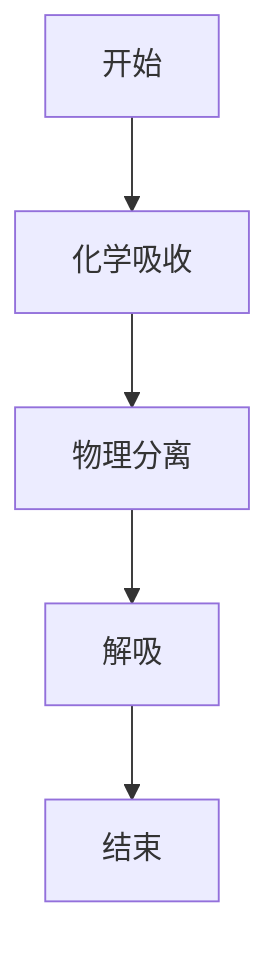
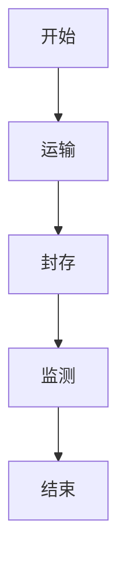
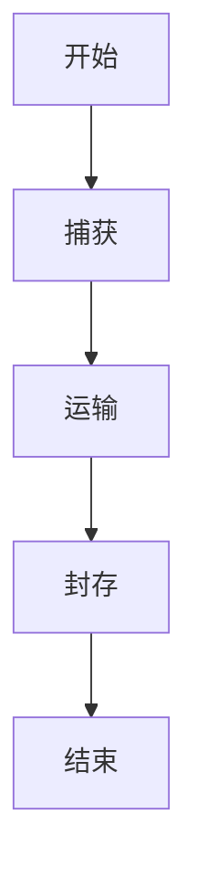
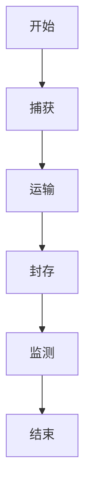
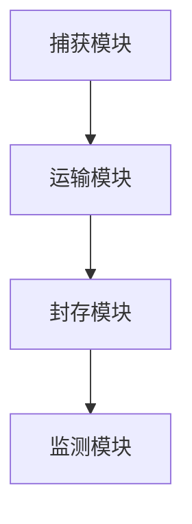
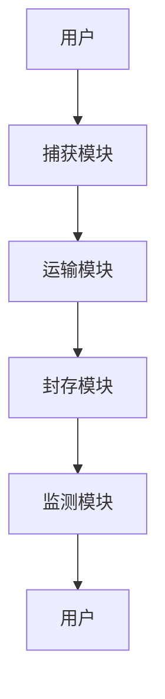

                 


# 碳捕获与封存技术的进步与投资前景

## 关键词：碳捕获，碳封存，气候变化，投资前景，技术进步

## 摘要：碳捕获与封存技术作为一种新兴的环保技术，正在全球范围内迅速发展，以应对气候变化的挑战。本文将从技术背景、核心概念、算法原理、数学模型、系统架构、项目实战以及最佳实践等多个维度，深入分析碳捕获与封存技术的进步与投资前景，为读者提供全面的技术解读和投资建议。

---

# 第1章：碳捕获与封存技术的背景介绍

## 1.1 碳捕获与封存技术的定义

### 1.1.1 碳捕获与封存技术的核心概念
碳捕获与封存技术（Carbon Capture and Storage, CCS）是一种通过捕获工业过程或能源生产过程中产生的二氧化碳，将其封存在地下或其他储存介质中，以减少大气中二氧化碳浓度的技术。 CCS 是应对气候变化的重要技术之一，广泛应用于燃煤电厂、水泥生产、化工厂等高排放行业。

### 1.1.2 碳捕获与封存技术的背景问题
随着全球气候变化问题的加剧，减少二氧化碳排放已成为全球关注的焦点。传统能源行业（如燃煤发电）在提供电力的同时，也产生了大量的二氧化碳排放。为了实现《巴黎协定》的目标，即在2100年前将全球平均气温升幅控制在2摄氏度以内，碳捕获与封存技术被视为一种可行的解决方案。

### 1.1.3 碳捕获与封存技术的边界与外延
碳捕获与封存技术的边界包括从二氧化碳的捕获、运输到封存的整个过程。外延则涉及与 CCS 相关的政策、经济、环境影响等方面。

### 1.1.4 碳捕获与封存技术的概念结构与核心要素
碳捕获与封存技术的核心要素包括：
1. 捕获技术：化学吸收法、物理分离法、生物法等。
2. 封存技术：地下封存、海洋封存等。
3. 运输技术：管道运输、液化运输等。
4. 监测技术：确保封存的二氧化碳不会泄漏。

---

## 1.2 碳捕获与封存技术的全球发展现状

### 1.2.1 全球碳捕获与封存技术的发展历程
碳捕获与封存技术的发展可以追溯到20世纪90年代，但大规模应用仍处于起步阶段。近年来，全球多个国家和地区开始推动 CCS 技术的研发和商业化。

### 1.2.2 碳捕获与封存技术的区域分布
目前，欧洲、北美和中东地区是 CCS 技术的主要研发和应用区域。中国、印度等新兴经济体也在积极探索 CCS 技术的应用。

### 1.2.3 碳捕获与封存技术的主要应用场景
CCS 技术主要应用于以下领域：
1. 煤炭发电：通过 CCS 技术减少燃煤电厂的碳排放。
2. 化工行业：捕获化工生产过程中产生的二氧化碳。
3. 水泥生产：减少水泥生产过程中的碳排放。

---

## 1.3 中国碳捕获与封存技术的发展现状

### 1.3.1 中国碳捕获与封存技术的政策支持
中国政府高度重视碳捕获与封存技术的研发和应用，将其列为实现“双碳”目标的重要技术手段。国家能源局等部门出台了一系列政策，支持 CCS 技术的研发和示范项目。

### 1.3.2 中国碳捕获与封存技术的行业应用
中国在 CCS 技术的应用上已经取得了一些进展，尤其是在燃煤电厂和化工行业。例如，神华集团在内蒙古建设了全球首个万吨级 CCS 示范项目。

### 1.3.3 中国碳捕获与封存技术的未来趋势
未来，中国将在 CCS 技术的研发、示范和商业化应用方面继续加大投入，特别是在水泥、钢铁等高排放行业推动 CCS 技术的应用。

---

# 第2章：碳捕获与封存技术的核心概念与联系

## 2.1 碳捕获与封存技术的核心原理

### 2.1.1 碳捕获的原理
碳捕获技术主要通过化学吸收、物理分离等方法，将二氧化碳从烟气中分离出来。例如，化学吸收法使用胺类溶液吸收二氧化碳，随后通过加热解吸回收二氧化碳。

### 2.1.2 碳封存的原理
碳封存技术将捕获的二氧化碳通过管道运输到合适的封存地点，如深层地质构造（如盐水层、煤层等）中封存，确保二氧化碳不会泄漏到大气中。

### 2.1.3 碳捕获与封存技术的系统性分析
碳捕获与封存技术是一个复杂的系统工程，涉及捕获、运输、封存等多个环节，每个环节都需要高效协同工作，才能确保技术的可靠性和经济性。

---

## 2.2 碳捕获与封存技术的核心概念对比

### 2.2.1 不同碳捕获技术的对比分析
| 技术类型 | 优点 | 缺点 |
|----------|------|------|
| 化学吸收法 | 捕捉效率高 | 成本较高 |
| 物理分离法 | 成本较低 | 捕捉效率较低 |

### 2.2.2 不同封存技术的对比分析
| 技术类型 | 优点 | 缺点 |
|----------|------|------|
| 地下封存 | 稳定性高 | 需要合适的地质条件 |
| 海洋封存 | 成本较低 | 环境风险较高 |

### 2.2.3 碳捕获与封存技术的综合评价
综合来看，化学吸收法和地下封存技术的结合是目前最为成熟的 CCS 技术方案。

---

## 2.3 碳捕获与封存技术的ER实体关系图



---

# 第3章：碳捕获与封存技术的算法原理讲解

## 3.1 碳捕获技术的算法原理

### 3.1.1 碳捕获技术的数学模型
碳捕获的效率可以通过以下公式计算：

$$ \text{捕获效率} = \frac{\text{捕获的二氧化碳量}}{\text{排放的二氧化碳总量}} \times 100\% $$

### 3.1.2 碳捕获技术的算法流程


### 3.1.3 碳捕获技术的算法实现
```python
def capture_co2(emit_co2):
    # 化学吸收法
    absorbed_co2 = 0.8 * emit_co2
    # 物理分离法
    separated_co2 = 0.7 * emit_co2
    return max(absorbed_co2, separated_co2)
```

---

## 3.2 碳封存技术的算法原理

### 3.2.1 碳封存技术的数学模型
碳封存的安全性可以通过以下公式评估：

$$ \text{安全性} = \frac{\text{封存的二氧化碳量}}{\text{泄漏的二氧化碳量}} $$

### 3.2.2 碳封存技术的算法流程


### 3.2.3 碳封存技术的算法实现
```python
def store_co2(co2_amount):
    # 地下封存
    if co2_amount > 1000:
        return "深层地质封存"
    else:
        return "浅层地质封存"
```

---

## 3.3 碳捕获与封存技术的协同优化算法

### 3.3.1 协同优化算法的数学模型
$$ \text{总成本} = \text{捕获成本} + \text{运输成本} + \text{封存成本} $$

### 3.3.2 协同优化算法的实现步骤


### 3.3.3 协同优化算法的优化效果
通过协同优化算法，可以显著降低碳捕获与封存的总成本，同时提高系统的效率和稳定性。

---

# 第4章：碳捕获与封存技术的数学模型与公式

## 4.1 碳捕获

### 4.1.1 碳捕获的数学模型
$$ \text{捕获效率} = \frac{\text{吸收剂吸收的二氧化碳量}}{\text{排放的二氧化碳总量}} $$

### 4.1.2 碳捕获的公式推导
假设吸收剂的吸收效率为 $e$，排放的二氧化碳总量为 $Q$，则捕获的二氧化碳量为：

$$ \text{捕获量} = e \times Q $$

---

## 4.2 碳封存

### 4.2.1 碳封存的数学模型
$$ \text{封存效率} = \frac{\text{成功封存的二氧化碳量}}{\text{捕获的二氧化碳总量}} $$

### 4.2.2 碳封存的公式推导
假设封存地点的容量为 $C$，封存的二氧化碳量为 $c$，则封存效率为：

$$ \text{封存效率} = \frac{c}{C} $$

---

## 4.3 碳捕获与封存的协同优化

### 4.3.1 协同优化的数学模型
$$ \text{总成本} = \text{捕获成本} + \text{运输成本} + \text{封存成本} $$

### 4.3.2 协同优化的公式推导
假设捕获成本为 $C_1$，运输成本为 $C_2$，封存成本为 $C_3$，则总成本为：

$$ \text{总成本} = C_1 + C_2 + C_3 $$

---

# 第5章：碳捕获与封存技术的系统分析与架构设计方案

## 5.1 项目背景与目标

### 5.1.1 项目背景
随着全球气候变化问题的加剧，碳捕获与封存技术已成为实现碳中和目标的重要技术手段。

### 5.1.2 项目目标
本项目旨在通过设计和实现一个碳捕获与封存系统，验证技术的可行性和经济性。

---

## 5.2 系统功能设计

### 5.2.1 系统功能模块
1. 捕获模块：负责捕获二氧化碳。
2. 运输模块：负责将捕获的二氧化碳运输到封存地点。
3. 封存模块：负责将二氧化碳封存在地下或其他介质中。
4. 监测模块：负责监测封存过程中的二氧化碳泄漏情况。

### 5.2.2 系统功能流程


---

## 5.3 系统架构设计

### 5.3.1 系统架构图


---

## 5.4 系统接口设计

### 5.4.1 系统接口描述
1. 捕获模块与运输模块之间的接口：捕获模块将捕获的二氧化碳量传递给运输模块。
2. 运输模块与封存模块之间的接口：运输模块将二氧化碳运输到封存地点。
3. 封存模块与监测模块之间的接口：封存模块将封存情况传递给监测模块。

---

## 5.5 系统交互设计

### 5.5.1 系统交互流程


---

# 第6章：碳捕获与封存技术的项目实战

## 6.1 环境安装与配置

### 6.1.1 系统需求
- 操作系统：Windows 10 或更高版本，或 Linux 系统。
- 开发工具：Python 3.8 或更高版本，Jupyter Notebook。

### 6.1.2 安装依赖
- Python 包：numpy、pandas、matplotlib。

---

## 6.2 系统核心实现源代码

### 6.2.1 碳捕获模块实现
```python
import numpy as np

def capture_co2(emit_co2):
    # 化学吸收法
    absorbed_co2 = 0.8 * emit_co2
    return absorbed_co2
```

### 6.2.2 碳封存模块实现
```python
import numpy as np

def store_co2(co2_amount):
    # 地下封存
    if co2_amount > 1000:
        return "深层地质封存"
    else:
        return "浅层地质封存"
```

---

## 6.3 代码应用解读与分析

### 6.3.1 碳捕获模块解读
上述代码实现了化学吸收法捕获二氧化碳的功能，捕获效率为80%。

### 6.3.2 碳封存模块解读
上述代码实现了根据二氧化碳量选择合适的封存地点的功能。

---

## 6.4 实际案例分析

### 6.4.1 案例背景
某燃煤电厂年排放二氧化碳 100,000 吨，计划采用 CCS 技术减少碳排放。

### 6.4.2 案例分析
1. 捕获效率：80%。
2. 捕获量：$100,000 \times 0.8 = 80,000$ 吨。
3. 封存地点：深层地质封存。

---

## 6.5 项目小结

通过上述代码实现和案例分析，可以看出碳捕获与封存技术在实际应用中的可行性和经济性。

---

# 第7章：碳捕获与封存技术的最佳实践与展望

## 7.1 最佳实践 tips

### 7.1.1 技术选型
根据具体应用场景选择合适的 CCS 技术方案。

### 7.1.2 系统优化
通过协同优化算法降低系统成本。

### 7.1.3 政策支持
积极争取政府政策支持，降低技术应用成本。

---

## 7.2 小结

碳捕获与封存技术作为一种重要的环保技术，正在全球范围内快速发展。通过技术创新和政策支持， CCS 技术将在未来发挥更大的作用。

---

## 7.3 未来展望

随着技术的不断进步和政策支持力度的加大，碳捕获与封存技术将在全球范围内得到更广泛的应用，为实现碳中和目标做出重要贡献。

---

# 作者：AI天才研究院/AI Genius Institute & 禅与计算机程序设计艺术 /Zen And The Art of Computer Programming

