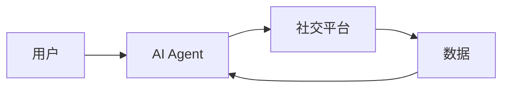
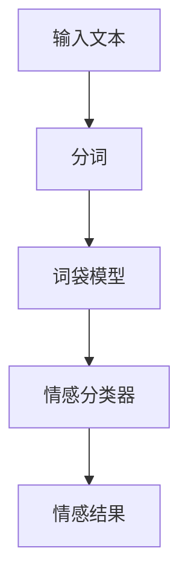
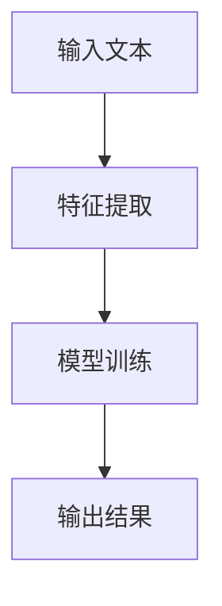
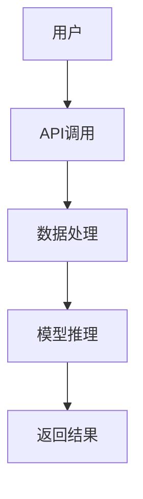

                 


# 社交AI：提升AI Agent的人际交互能力

> 关键词：社交AI，AI Agent，人际交互，情感分析，对话生成，社交网络分析

> 摘要：本文深入探讨了社交AI的核心概念、算法原理、系统架构及实际应用。通过分析AI Agent在社交场景中的交互能力，结合情感分析、对话生成和社交网络分析等技术，详细讲解了如何提升AI Agent的社交能力，帮助读者全面理解社交AI的实现与应用。

---

# 第一部分: 社交AI与AI Agent的背景介绍

## 第1章: 社交AI与AI Agent概述

### 1.1 社交AI的基本概念

#### 1.1.1 社交AI的定义与核心要素
社交AI（Social AI）是一种结合了人工智能技术与社交交互能力的新型技术，旨在通过AI Agent（智能体）实现与人类的自然交互。其核心要素包括自然语言处理、情感分析、对话生成和社交网络分析等。

#### 1.1.2 AI Agent的定义与特点
AI Agent是一种能够感知环境并采取行动以实现目标的智能实体。其特点包括自主性、反应性、主动性和社会性。

#### 1.1.3 社交AI与传统AI的区别
社交AI不仅具备传统AI的数据处理和分析能力，还具有情感理解和社交互动能力，能够更好地适应复杂的社交场景。

### 1.2 社交AI的发展背景

#### 1.2.1 人工智能技术的演进
从早期的规则驱动AI到现在的深度学习AI，技术的进步为社交AI的发展奠定了基础。

#### 1.2.2 社交媒体的智能化需求
随着社交媒体的普及，人们对智能化交互的需求日益增长，推动了社交AI的发展。

#### 1.2.3 当前社交AI的应用场景
社交AI已在客服、教育、娱乐等领域展现出广泛的应用。

### 1.3 社交AI的核心问题与挑战

#### 1.3.1 人机交互的复杂性
人类语言的模糊性和情感的多样性增加了AI Agent理解用户意图的难度。

#### 1.3.2 用户需求的理解与匹配
如何准确理解用户需求并提供个性化的服务是社交AI的核心挑战。

#### 1.3.3 数据隐私与伦理问题
数据隐私和伦理问题也是社交AI发展中的重要议题。

### 1.4 本章小结
本章介绍了社交AI的基本概念、发展背景及其核心问题与挑战，为后续内容奠定了基础。

---

# 第二部分: 社交AI的核心概念与联系

## 第2章: 社交AI的核心概念解析

### 2.1 AI Agent的属性与特征

#### 2.1.1 智能性
AI Agent能够通过学习和推理理解复杂的信息。

#### 2.1.2 适应性
AI Agent能够根据环境变化调整自己的行为。

#### 2.1.3 社交能力
AI Agent能够通过自然语言与人类进行有效沟通。

### 2.2 社交AI与其他相关概念的对比

#### 2.2.1 自然语言处理
自然语言处理是社交AI实现人机交互的基础技术。

#### 2.2.2 机器学习
机器学习为社交AI提供了数据驱动的模型训练能力。

#### 2.2.3 社交网络分析
社交网络分析帮助AI Agent理解社交关系和网络结构。

### 2.3 社交AI的实体关系图



通过实体关系图可以看出，用户、AI Agent、社交平台和数据之间的关系构成了社交AI的核心架构。

---

# 第三部分: 社交AI的算法原理

## 第3章: 社交AI的核心算法

### 3.1 情感分析算法

#### 3.1.1 基于词袋模型的情感分析



#### 3.1.2 基于深度学习的情感分析
使用深度学习模型（如LSTM）进行情感分析，能够捕捉文本中的上下文信息。

#### 3.1.3 情感分析的优缺点
情感分析的优点是能够快速理解用户情绪，缺点是容易受到文本模糊性的影响。

### 3.2 对话生成算法

#### 3.2.1 基于规则的对话生成
通过预定义的规则生成简单的对话响应。

#### 3.2.2 基于统计模型的对话生成
使用统计模型（如马尔可夫链）生成对话。

#### 3.2.3 基于深度学习的对话生成
使用生成对抗网络（GAN）或Transformer模型生成高质量的对话。

### 3.3 社交网络分析算法

#### 3.3.1 社会网络分析的基本概念
社会网络分析用于研究社交网络中的关系和结构。

#### 3.3.2 社会网络分析的算法实现
常用的算法包括中心性分析、社群检测和网络可视化。

#### 3.3.3 社交网络分析的应用案例
通过分析社交网络数据，可以发现用户之间的关系和影响力。

### 3.4 算法流程图



---

# 第四部分: 社交AI的系统分析与架构设计

## 第4章: 社交AI系统的架构设计

### 4.1 系统功能设计

#### 4.1.1 用户交互模块
负责接收用户的输入并返回响应。

#### 4.1.2 数据处理模块
对输入数据进行清洗和预处理。

#### 4.1.3 模型训练模块
对模型进行训练和优化。

### 4.2 系统架构设计

#### 4.2.1 分层架构设计
将系统划分为数据层、业务逻辑层和表现层。

#### 4.2.2 微服务架构设计
采用微服务架构提高系统的扩展性和维护性。

#### 4.2.3 高可用性设计
通过负载均衡和容灾备份确保系统的高可用性。

### 4.3 系统接口设计

#### 4.3.1 API接口定义
定义RESTful API接口规范。

#### 4.3.2 接口调用流程
描述接口调用的详细流程。

#### 4.3.3 接口安全设计
采用JWT进行身份认证和权限控制。

### 4.4 系统交互流程图



---

# 第五部分: 社交AI的项目实战

## 第5章: 社交AI项目的实现

### 5.1 项目环境安装

#### 5.1.1 安装Python
```bash
python --version
```

#### 5.1.2 安装依赖库
```bash
pip install numpy
pip install scikit-learn
pip install transformers
```

### 5.2 系统核心实现源代码

#### 5.2.1 情感分析模块
```python
from sklearn.feature_extraction.text import TfidfVectorizer
from sklearn.linear_model import LogisticRegression

# 训练情感分类器
vectorizer = TfidfVectorizer()
X = vectorizer.fit_transform(texts)
model = LogisticRegression().fit(X, labels)
```

#### 5.2.2 对话生成模块
```python
from transformers import GPT2Tokenizer, GPT2LMHeadModel

tokenizer = GPT2Tokenizer.from_pretrained("gpt2")
model = GPT2LMHeadModel.from_pretrained("gpt2")

def generate_response(input_text):
    inputs = tokenizer.encode(input_text, return_tensors="pt")
    outputs = model.generate(inputs, max_length=50)
    return tokenizer.decode(outputs[0], skip_special_tokens=True)
```

### 5.3 案例分析与详细讲解

#### 5.3.1 情感分析案例
```python
texts = ["I love this product!", "This is terrible."]
labels = [1, 0]
X = vectorizer.fit_transform(texts)
model = LogisticRegression().fit(X, labels)
print(model.predict(vectorizer.transform(["I love you."])))
```

#### 5.3.2 对话生成案例
```python
input_text = "What's your favorite color?"
print(generate_response(input_text))
```

### 5.4 项目小结
本章通过实际案例展示了社交AI项目的实现过程，包括环境安装、代码实现和案例分析。

---

# 第六部分: 社交AI的最佳实践与总结

## 第6章: 社交AI的最佳实践

### 6.1 小结
社交AI的核心在于实现自然流畅的人机交互，需要结合多种技术手段。

### 6.2 注意事项
在实际应用中，需注意数据隐私和模型的可解释性问题。

### 6.3 扩展阅读
推荐阅读《深度学习入门》和《自然语言处理实战》等书籍。

---

# 作者：AI天才研究院/AI Genius Institute & 禅与计算机程序设计艺术 /Zen And The Art of Computer Programming

