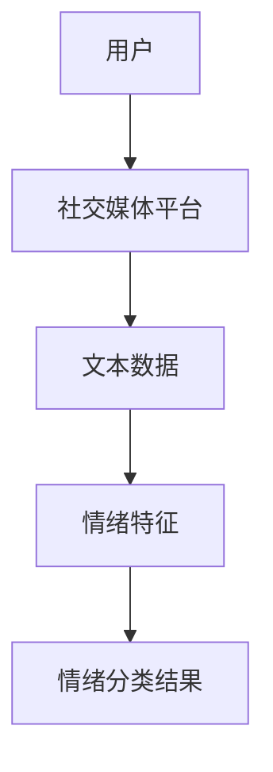
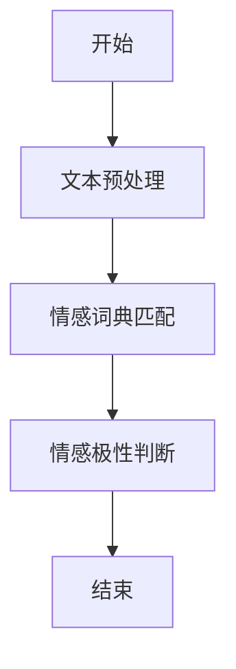
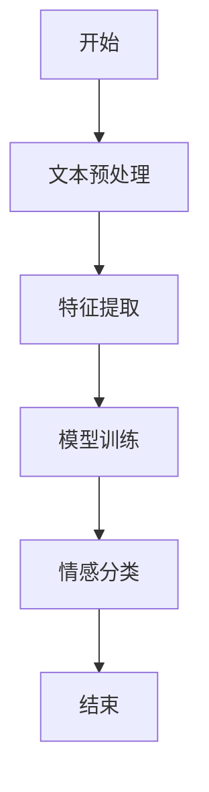
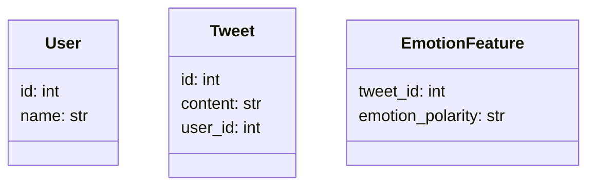
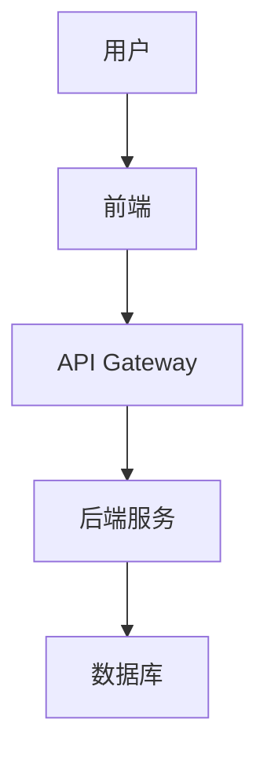

                 


# 社交媒体情绪分析：新型市场预测指标

## 关键词：社交媒体、情绪分析、市场预测、大数据、自然语言处理

## 摘要：社交媒体情绪分析是一种新兴的市场预测方法，通过分析社交媒体上的用户情绪和 sentiment，揭示市场趋势和消费者行为。本文系统介绍了社交媒体情绪分析的背景、核心概念、算法实现、系统架构，并通过实际案例展示了其在市场预测中的应用。文章还探讨了当前技术的局限性及未来发展方向，为读者提供了全面的视角。

---

# 第一部分：社交媒体情绪分析概述

## 第1章：社交媒体情绪分析的背景与意义

### 1.1 什么是社交媒体情绪分析
- **社交媒体的定义与特点**：社交媒体是用户在线分享信息、互动的平台，具有实时性、广泛性和社交性。
- **情绪分析的定义与目标**：情绪分析是利用自然语言处理技术，从文本中提取情感倾向，目标是理解用户情绪。
- **社交媒体情绪分析的背景与应用领域**：社交媒体数据的海量性使其成为市场预测的重要来源。

### 1.2 社交媒体情绪分析的重要性
- **传统市场预测的局限性**：依赖历史数据和统计模型，难以捕捉实时消费者情绪。
- **社交媒体数据的独特价值**：实时、海量、多样，反映消费者真实情绪。
- **情绪分析在市场预测中的作用**：帮助预测市场趋势、识别潜在风险、优化营销策略。

### 1.3 社交媒体情绪分析的边界与外延
- **数据来源的边界**：仅限于公开的社交媒体数据，不包括私密数据。
- **情绪分析的适用场景**：适用于消费者行为分析、品牌声誉管理等。
- **与其他市场预测指标的关系**：情绪分析是传统指标的补充，二者结合使用效果更佳。

---

## 第2章：社交媒体情绪分析的核心概念与联系

### 2.1 核心概念原理
- **文本数据的特征提取**：通过词袋模型或词嵌入提取文本特征。
- **情感分类的算法原理**：基于规则、统计学习或深度学习进行分类。
- **情绪强度的量化方法**：从极性（正面、负面）到情感强度（0到1）。

### 2.2 核心概念属性特征对比
- **不同情绪分类算法的对比分析**：基于规则的简单但准确率低；统计学习的准确率高但依赖特征工程；深度学习的准确率高但计算复杂。
- **不同情绪强度量化方法的优缺点**：情感词典法简单但不够精细；机器学习模型更准确但需要大量数据。

### 2.3 ER实体关系图


---

# 第二部分：情绪分析算法原理

## 第3章：基于规则的情绪分析算法

### 3.1 算法流程


### 3.2 算法实现
```python
def sentiment_analysis_rule(text):
    # 文本预处理
    words = text.lower().split()
    # 情感词典匹配
    positive_words = ["happy", "good"]
    negative_words = ["sad", "bad"]
    positive_count = sum(1 for word in words if word in positive_words)
    negative_count = sum(1 for word in words if word in negative_words)
    # 情感极性判断
    if positive_count > negative_count:
        return "positive"
    elif positive_count < negative_count:
        return "negative"
    else:
        return "neutral"
```

### 3.3 算法原理的数学模型
- **情感词典匹配**：使用情感词典中的词汇进行匹配，计算正面和负面词汇的数量。
- **情感极性判断**：通过比较正面和负面词汇的数量，得出整体情感倾向。

---

## 第4章：基于机器学习的情绪分析算法

### 4.1 算法流程


### 4.2 算法实现
```python
from sklearn.feature_extraction.text import TfidfVectorizer
from sklearn.svm import SVC
from sklearn.pipeline import Pipeline

pipeline = Pipeline([
    ('vectorizer', TfidfVectorizer()),
    ('classifier', SVC())
])

pipeline.fit(X_train, y_train)
y_pred = pipeline.predict(X_test)
```

---

# 第三部分：系统分析与架构设计

## 第5章：社交媒体情绪分析系统架构

### 5.1 项目介绍
- **项目目标**：构建一个基于社交媒体数据的情绪分析系统，用于市场预测。

### 5.2 系统功能设计


### 5.3 系统架构设计


---

## 第6章：项目实战

### 6.1 环境安装
```bash
pip install tweepy
pip install scikit-learn
```

### 6.2 核心实现
```python
import tweepy
from tweepy import OAuthHandler
from textblob import TextBlob

def get_tweet_sentiment():
    # 认证信息
    consumer_key = 'your_consumer_key'
    consumer_secret = 'your_consumer_secret'
    access_token = 'your_access_token'
    access_secret = 'your_access_secret'
    
    auth = OAuthHandler(consumer_key, consumer_secret)
    auth.set_access_token(access_token, access_secret)
    api = tweepy.API(auth)
    
    # 获取推文
    public_tweets = api.search('Bitcoin', count=100)
    sentiments = []
    for tweet in public_tweets:
        analysis = TextBlob(tweet.text)
        sentiment = analysis.sentiment.polarity
        sentiments.append(sentiment)
    return sentiments
```

### 6.3 实际案例分析
- **案例分析**：分析比特币市场的社交媒体情绪。
- **结果可视化**：使用Matplotlib绘制情绪分布图。

### 6.4 项目小结
- **代码实现**：实现从数据采集到结果分析的完整流程。
- **系统设计**：展示系统的模块划分和交互流程。

---

## 第7章：总结与展望

### 7.1 本章总结
- **核心内容回顾**：社交媒体情绪分析的背景、核心概念、算法实现和系统架构。
- **技术局限性**：情感词典的局限性、模型的泛化能力。

### 7.2 未来展望
- **技术进步**：深度学习模型的优化、多语言支持。
- **应用拓展**：应用于更多领域，如金融、医疗。

### 7.3 最佳实践 tips
- **数据质量**：数据清洗的重要性。
- **模型调优**：交叉验证和超参数优化。

### 7.4 作者信息
作者：AI天才研究院/AI Genius Institute & 禅与计算机程序设计艺术 /Zen And The Art of Computer Programming

---

这篇文章系统地介绍了社交媒体情绪分析的背景、核心概念、算法实现和实际应用，为读者提供了全面的技术视角。

