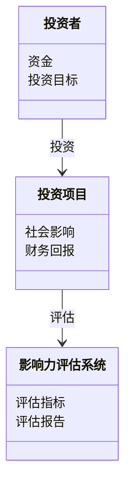

                 


# 社会影响力投资：追求双重回报的策略

## 关键词：
社会影响力投资, 双重回报, 可持续发展, 影响力评估, 多目标优化模型

## 摘要：
社会影响力投资是一种新兴的投资策略，旨在在追求财务回报的同时，实现社会和环境的积极影响。本文从背景、核心概念、算法原理、系统设计、项目实战和最佳实践等多个角度，详细分析了社会影响力投资的策略和实施方法，为投资者提供了全面的指导。

---

## 第一部分：社会影响力投资的背景与概念

### 第1章：社会影响力投资概述

#### 1.1 社会影响力投资的背景
社会影响力投资（Social Impact Investment）起源于21世纪初，随着全球可持续发展目标的提出，投资者开始关注投资对社会和环境的影响。这一趋势在联合国2030年可持续发展议程的推动下迅速发展，成为全球投资领域的重要组成部分。

#### 1.2 社会影响力投资的定义与特点
社会影响力投资是指通过投资实现财务回报的同时，积极促进社会和环境的可持续发展。其特点包括：
1. **双重目标**：既追求财务回报，又关注社会价值。
2. **长期导向**：注重长期影响，而非短期收益。
3. **多样性**：涵盖教育、医疗、环保等多个领域。

#### 1.3 社会影响力投资的核心要素
1. **明确的目标**：投资需明确解决的社会问题。
2. **可衡量的影响力**：通过指标量化社会影响。
3. **可持续性**：确保投资在经济、社会和环境三方面均可持续。

---

## 第二部分：社会影响力投资的核心概念与联系

### 第2章：影响力评估与测量

#### 2.1 影响力评估的框架
影响力评估是社会影响力投资的关键步骤。常见的评估框架包括：
- **GIIRS（Global Impact Investing Rating System）**：通过量化指标评估投资的社会影响。
- **IRIS（Impact-Weighted Accounts）**：基于影响力加权会计的方法。

#### 2.2 影响力评估的工具与方法
- **工具**：使用问卷调查、数据分析等方法收集数据。
- **方法**：采用成本效益分析、生命周期评估等技术。

#### 2.3 影响力评估的挑战与解决方案
- **挑战**：数据不一致、评估标准不统一。
- **解决方案**：建立统一的评估标准，推动行业合作。

---

## 第三部分：社会影响力投资的算法原理

### 第3章：影响力投资的数学模型

#### 3.1 多目标优化模型
多目标优化模型是社会影响力投资的核心算法。模型旨在在多个目标（如财务回报、社会影响）之间找到最优平衡。

#### 3.2 影响力回报的计算公式
影响力的回报可以通过以下公式计算：
$$
\text{影响力回报} = \alpha \times \text{财务回报} + \beta \times \text{社会影响}
$$
其中，$\alpha$ 和 $\beta$ 是权重系数，根据具体目标调整。

#### 3.3 算法实现
以下是一个简单的Python代码示例：
```python
def calculate_impact_return(finance_return, social_impact, alpha=0.5, beta=0.5):
    return alpha * finance_return + beta * social_impact

# 示例
finance_return = 10
social_impact = 8
alpha = 0.6
beta = 0.4

impact_return = calculate_impact_return(finance_return, social_impact, alpha, beta)
print(f"影响力回报：{impact_return}")
```

---

## 第四部分：社会影响力投资的系统分析与架构设计

### 第4章：系统功能设计

#### 4.1 领域模型
以下是社会影响力投资系统的领域模型：


#### 4.2 系统架构设计
以下是系统架构图：
```mermaid
architecturalDiagram
    component 投资者界面 {
        登录
        提交投资
    }
    component 投资项目数据库 {
        存储项目信息
    }
    component 影响力评估模块 {
        计算影响力回报
    }
    投资者界面 --> 投资项目数据库
    投资者界面 --> 影响力评估模块
    投资项目数据库 --> 影响力评估模块
```

---

## 第五部分：社会影响力投资的项目实战

### 第5章：绿色能源项目案例分析

#### 5.1 项目背景
某绿色能源公司计划投资太阳能项目，旨在减少碳排放并实现财务回报。

#### 5.2 影响力评估
- **社会影响**：减少碳排放，改善空气质量。
- **财务回报**：预计投资回报率为8%。

#### 5.3 投资决策
使用多目标优化模型计算影响力回报：
$$
\text{影响力回报} = 0.6 \times 8\% + 0.4 \times 5\% = 6.2\%
$$

---

## 第六部分：总结与展望

### 6.1 总结
社会影响力投资通过平衡财务回报和社会价值，为投资者提供了新的选择。本文详细探讨了其背景、核心概念、算法原理和系统设计，并通过案例分析展示了其实际应用。

### 6.2 最佳实践
1. **明确目标**：确保投资目标与社会价值一致。
2. **数据驱动**：依赖可靠的数据进行评估和决策。
3. **持续监测**：定期评估投资的社会和财务回报。

### 6.3 展望
随着技术进步和社会需求的增加，社会影响力投资将继续发展，成为未来投资的重要方向。

---

## 作者：AI天才研究院 & 禅与计算机程序设计艺术

