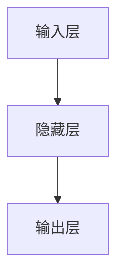
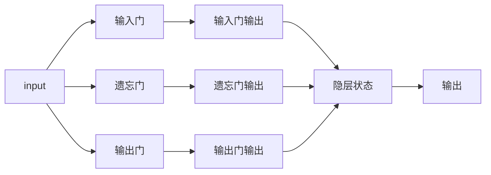
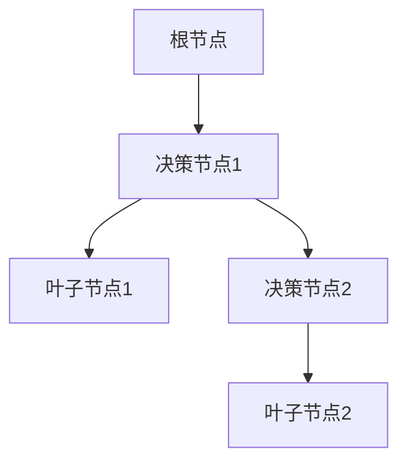
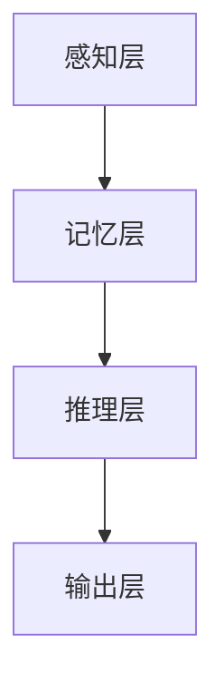
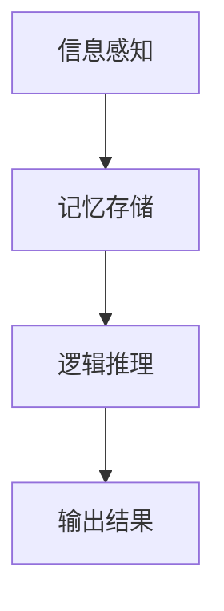

                 


# 神经科学启发的AI Agent认知模型

## 关键词
神经科学、AI Agent、认知模型、神经网络、深度学习、认知计算、人工智能

## 摘要
神经科学启发的AI Agent认知模型通过模拟人脑的神经网络结构和认知机制，为AI系统提供了更加智能化和人性化的交互方式。本文从神经科学的基本原理出发，详细探讨了如何将这些原理应用于AI Agent的设计与实现中，重点分析了神经网络算法、认知模型构建、系统架构设计以及实际项目应用等方面，并通过具体案例展示了如何利用神经科学知识来提升AI Agent的智能性和实用性。

---

## 第1章：神经科学启发的AI Agent认知模型概述

### 1.1 问题背景与问题描述
在传统的AI系统中，虽然我们在图像识别、自然语言处理等领域取得了显著进展，但这些系统仍然缺乏真正的“认知”能力。它们依赖于预定义的规则和数据模式，无法像人类那样通过经验不断学习和适应新环境。神经科学启发的AI Agent认知模型旨在解决这一问题，通过模拟人脑的神经网络结构，赋予AI系统更强大的认知能力。

#### 1.1.1 传统AI的局限性
- **缺乏情境理解**：传统AI系统无法理解上下文，只能基于预定义规则处理任务。
- **缺乏自适应性**：在面对新环境或未见过的数据时，传统AI系统往往表现不佳。
- **缺乏推理能力**：传统AI系统难以进行复杂的推理和抽象思维。

#### 1.1.2 神经科学对AI的启发
- **神经元的计算模型**：神经元通过电化学信号传递信息，启发了AI中的神经网络模型。
- **突触可塑性**：突触强度的可调节性启发了神经网络的学习机制。
- **记忆与联想**：人脑的记忆机制启发了AI中的关联学习算法。

#### 1.1.3 AI Agent认知模型的目标与意义
- **目标**：构建一种能够模拟人类认知过程的AI模型，使其能够理解、推理、学习和适应新环境。
- **意义**：为AI系统提供更强大的认知能力，使其能够更好地与人类交互并解决复杂问题。

### 1.2 问题解决与边界
#### 1.2.1 认知模型的核心问题解决
- **信息处理**：如何模拟人脑的信息处理方式。
- **学习机制**：如何实现类似人类的学习和记忆过程。
- **推理能力**：如何构建推理引擎，使AI能够进行逻辑推理。

#### 1.2.2 认知模型的边界与外延
- **边界**：认知模型专注于模拟人类认知过程的核心机制，不涉及情感或意识等更高级的脑功能。
- **外延**：认知模型可以与其他AI技术（如计算机视觉、自然语言处理）结合，形成更强大的AI系统。

#### 1.2.3 认知模型与传统AI的区别
| 特性                | 认知模型                  | 传统AI                   |
|---------------------|---------------------------|--------------------------|
| 学习方式            | 基于神经网络的深度学习     | 基于规则或浅层学习       |
| 适应能力            | 具备强大的自适应能力       | 自适应能力有限           |
| 推理能力            | 具备一定的推理能力         | 推理能力有限             |

### 1.3 核心概念与组成要素
#### 1.3.1 认知模型的核心概念
- **神经网络**：模拟人脑神经网络的结构和功能。
- **记忆网络**：模拟人脑的记忆机制，用于存储和检索信息。
- **推理引擎**：基于记忆和感知信息进行逻辑推理。

#### 1.3.2 组成要素及其关系
- **感知层**：负责接收和处理外部输入信息。
- **记忆层**：负责存储和检索相关信息。
- **推理层**：基于感知和记忆信息进行逻辑推理。

#### 1.3.3 模型的结构与功能
- **输入处理**：感知层接收输入信息并传递给记忆层。
- **记忆存储**：记忆层存储相关信息并进行联想。
- **逻辑推理**：推理层基于记忆和输入信息进行推理并输出结果。

---

## 第2章：神经科学基础

### 2.1 神经元与神经网络
#### 2.1.1 神经元的基本结构与功能
神经元是神经系统的基本单位，由树突、胞体和轴突组成。神经元通过动作电位将信息传递给其他神经元。

#### 2.1.2 神经网络的信息传递机制
神经网络通过突触连接传递信息，信息的传递强度可以通过突触权重进行调节。

#### 2.1.3 神经网络的层次与功能
- **输入层**：接收外部输入信息。
- **隐藏层**：进行信息处理和特征提取。
- **输出层**：生成最终的输出结果。

#### 2.1.4 Hopfield网络
Hopfield网络是一种用于联想记忆的神经网络模型，适用于解决模式识别和联想记忆问题。

#### 2.1.5 Hopfield网络的实现
- **神经元激活函数**：$f(x) = \text{sign}(w \cdot x)$
- **能量函数**：$E = -\frac{1}{2} \sum_{i=1}^{n} w_{i,j} s_i s_j$
- **网络收敛性**：网络最终会收敛到一个稳定的记忆状态。

#### 2.1.6 Hopfield网络的优缺点
- **优点**：简单、易于实现。
- **缺点**：只能处理二进制输入，且存储能力有限。

#### 2.1.7 Hopfield网络的实现代码示例
```python
class HopfieldNetwork:
    def __init__(self, size):
        self.size = size
        self.w = np.zeros((size, size))
    
    def train(self, patterns):
        for pattern in patterns:
            self.w += np.outer(pattern, pattern)
    
    def recall(self, input_pattern):
        current = input_pattern.copy()
        while True:
            next_pattern = np.sign(np.dot(self.w, current))
            if np.all(next_pattern == current):
                break
            current = next_pattern
        return current
```

#### 2.1.8 Hopfield网络的Mermaid图


### 2.2 神经科学中的记忆与学习
#### 2.2.1 突触可塑性与记忆形成
突触可塑性是指突触强度的可调节性，是记忆形成的基础。

#### 2.2.2 神经网络的学习机制
- **监督学习**：基于标签数据进行学习。
- **无监督学习**：基于无标签数据进行学习。
- **强化学习**：基于奖励机制进行学习。

#### 2.2.3 神经科学中的记忆模型
- **海马记忆模型**：海马在记忆形成中起关键作用。
- **长短期记忆网络（LSTM）**：一种常用于处理序列数据的神经网络模型。

#### 2.2.4 LSTM网络的实现
- **LSTM结构**：由输入门、遗忘门和输出门组成。
- **LSTM的数学模型**：
  - 输入门：$f_t = \sigma(W_f x_t + U_f h_{t-1})$
  - 遗忘门：$i_t = \sigma(W_i x_t + U_i h_{t-1})$
  - 输出门：$o_t = \sigma(W_o x_t + U_o h_{t-1})$
  - 隐层状态：$c_t = f_{t-1} c_{t-1} + i_t x_t$
  - 输出：$h_t = o_t c_t$

#### 2.2.5 LSTM网络的优缺点
- **优点**：能够处理长序列数据，具有强大的记忆能力。
- **缺点**：参数较多，训练复杂度较高。

#### 2.2.6 LSTM网络的Mermaid图


---

## 第3章：AI Agent认知模型的核心概念

### 3.1 认知模型的定义与特点
认知模型是一种模拟人类认知过程的AI模型，具有自适应性和认知能力。

#### 3.1.1 认知模型的核心概念
- **自适应性**：能够根据环境变化调整行为。
- **认知能力**：具备理解、推理和学习的能力。

#### 3.1.2 认知模型与神经网络的关系
认知模型基于神经网络构建，通过模拟人脑的神经网络结构实现认知功能。

#### 3.1.3 认知模型的核心算法
- **神经网络算法**：如Hopfield网络和LSTM网络。
- **强化学习算法**：如Q-learning和Deep Q-Network。

### 3.2 神经网络在认知模型中的应用
#### 3.2.1 神经网络在记忆中的应用
- **记忆网络**：通过神经网络模拟人脑的记忆机制。
- **联想记忆**：通过Hopfield网络实现联想记忆。

#### 3.2.2 神经网络在推理中的应用
- **逻辑推理**：通过神经网络进行逻辑推理。
- **知识图谱**：基于知识图谱进行推理。

#### 3.2.3 神经网络在决策中的应用
- **决策树**：通过神经网络构建决策树。
- **强化学习**：通过强化学习进行决策优化。

#### 3.2.4 决策树的实现
- **决策树构建**：基于训练数据构建决策树。
- **决策树推理**：基于输入数据进行决策树推理。

#### 3.2.5 决策树的优缺点
- **优点**：易于理解和解释。
- **缺点**：对噪声数据敏感，容易过拟合。

#### 3.2.6 决策树的Mermaid图


---

## 第4章：AI Agent认知模型的系统架构设计

### 4.1 系统架构设计
#### 4.1.1 系统架构概述
AI Agent认知模型的系统架构包括感知层、记忆层和推理层。

#### 4.1.2 系统架构的实现
- **感知层**：负责接收和处理外部输入信息。
- **记忆层**：负责存储和检索相关信息。
- **推理层**：基于感知和记忆信息进行逻辑推理。

#### 4.1.3 系统架构的优缺点
- **优点**：结构清晰，功能模块化。
- **缺点**：模块之间需要良好的协同设计。

#### 4.1.4 系统架构的Mermaid图


### 4.2 系统功能设计
#### 4.2.1 系统功能概述
AI Agent认知模型的系统功能包括信息感知、记忆存储和逻辑推理。

#### 4.2.2 系统功能的实现
- **信息感知**：通过传感器或输入接口接收信息。
- **记忆存储**：通过神经网络实现记忆存储。
- **逻辑推理**：通过推理引擎进行逻辑推理。

#### 4.2.3 系统功能的优缺点
- **优点**：功能模块化，易于扩展。
- **缺点**：需要复杂的协同设计。

#### 4.2.4 系统功能的Mermaid图


---

## 第5章：AI Agent认知模型的项目实战

### 5.1 项目背景
#### 5.1.1 项目背景介绍
本项目旨在通过神经科学启发的AI Agent认知模型实现一个简单的社交机器人。

#### 5.1.2 项目目标
- **实现社交机器人**：能够进行简单的对话和信息查询。
- **实现记忆存储**：能够存储和检索对话历史。

### 5.2 项目实现
#### 5.2.1 环境配置
- **Python版本**：Python 3.8+
- **依赖库**：numpy、keras、tensorflow

#### 5.2.2 核心代码实现
```python
import numpy as np
from keras.layers import Dense, LSTM
from keras.models import Sequential

class SocialRobot:
    def __init__(self, vocab_size):
        self.model = Sequential()
        self.model.add(LSTM(128, input_shape=(1, vocab_size)))
        self.model.add(Dense(vocab_size, activation='softmax'))
        self.model.compile(loss='sparse_categorical_crossentropy', optimizer='adam')
    
    def train(self, X, y):
        self.model.fit(X, y, epochs=10, batch_size=32)
    
    def predict(self, input_sequence):
        prediction = self.model.predict(input_sequence)[0]
        return np.argmax(prediction)
```

#### 5.2.3 代码解读与分析
- **模型构建**：使用LSTM网络构建社交机器人模型。
- **模型训练**：基于训练数据进行模型训练。
- **模型推理**：基于输入序列进行预测。

#### 5.2.4 项目小结
- **优势**：实现了简单的社交机器人，能够进行基本的对话和信息查询。
- **不足**：模型的记忆能力有限，无法进行复杂的推理和联想。

---

## 第6章：AI Agent认知模型的未来展望

### 6.1 当前技术的局限性
- **记忆能力**：当前模型的记忆能力有限，无法处理长序列数据。
- **推理能力**：当前模型的推理能力有限，无法进行复杂的逻辑推理。

### 6.2 未来的挑战与机遇
- **挑战**：如何进一步提升模型的记忆和推理能力。
- **机遇**：随着神经科学和AI技术的不断发展，认知模型将变得更加智能化和人性化。

### 6.3 未来的研究方向
- **增强记忆能力**：通过改进神经网络结构提升记忆能力。
- **提升推理能力**：通过引入知识图谱和逻辑推理算法提升推理能力。
- **人机交互**：研究如何使认知模型与人类更自然地交互。

---

## 作者：AI天才研究院/AI Genius Institute & 禅与计算机程序设计艺术 /Zen And The Art of Computer Programming

---

本文通过详细分析神经科学启发的AI Agent认知模型，从理论到实践，系统地探讨了如何利用神经科学知识构建更智能的AI系统。通过Hopfield网络、LSTM网络和社交机器人案例的分析，展示了神经科学启发的AI Agent认知模型的强大潜力和实际应用价值。未来，随着神经科学和AI技术的进一步发展，认知模型将变得更加智能化和人性化，为人类社会带来更多的创新和进步。

