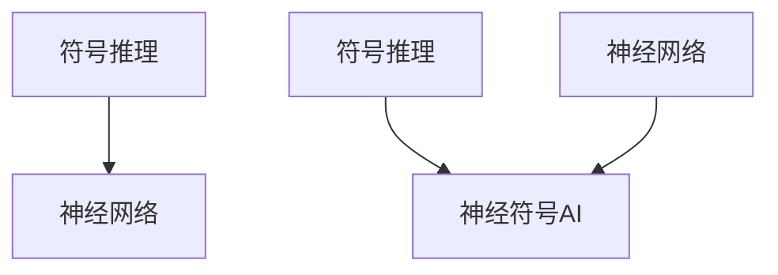
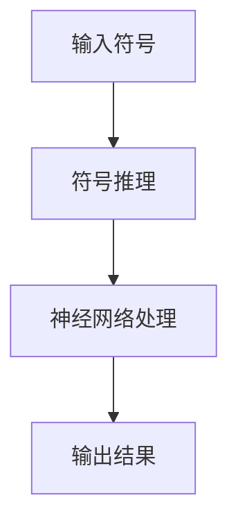
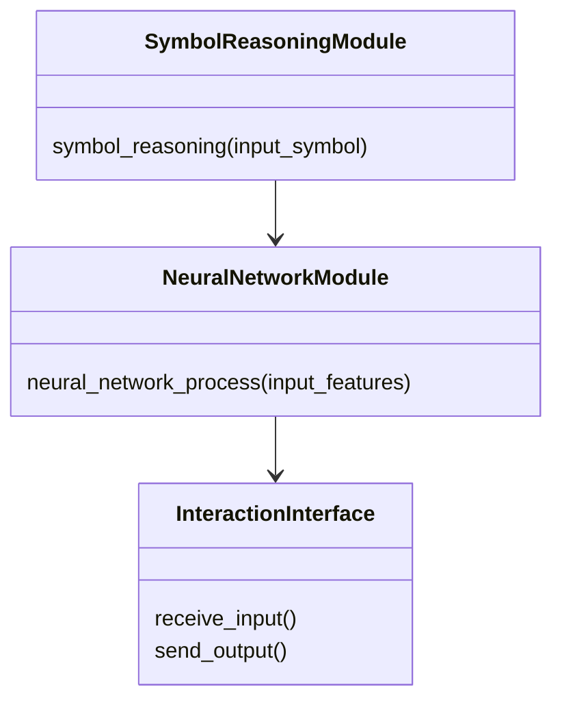
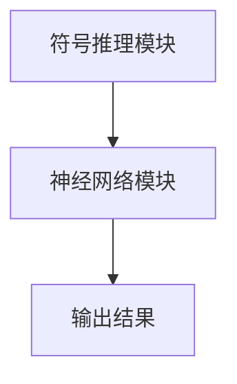
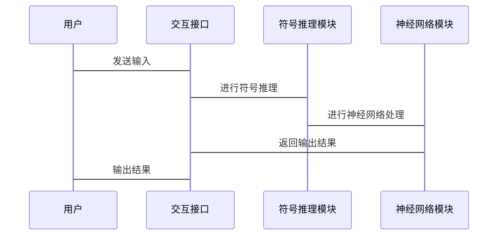

                 


# 神经符号AI：结合符号推理与神经网络的AI Agent

## 关键词：神经符号AI、符号推理、神经网络、AI代理、知识图谱、逻辑推理、机器学习

## 摘要：神经符号AI是一种结合符号推理与神经网络的新型人工智能技术，旨在通过符号推理的逻辑性和神经网络的表征学习能力，构建更强大的AI代理。本文将从背景介绍、核心概念、算法原理、系统架构设计、项目实战到最佳实践，全面探讨神经符号AI的实现与应用。

---

# 第一部分: 神经符号AI概述

## 第1章: 神经符号AI的背景与重要性

### 1.1 神经符号AI的定义与背景

#### 1.1.1 符号推理与神经网络的结合
神经符号AI是符号推理与神经网络结合的产物。符号推理通过逻辑规则进行推理，而神经网络则擅长从数据中学习特征。两者的结合旨在利用符号推理的可解释性和神经网络的泛化能力。

#### 1.1.2 神经符号AI的背景与重要性
随着AI技术的发展，符号推理在处理复杂逻辑任务中表现优异，而神经网络在处理非结构化数据方面具有优势。神经符号AI的出现，填补了两者之间的鸿沟，为解决复杂问题提供了新的思路。

#### 1.1.3 神经符号AI的核心概念与目标
神经符号AI的目标是构建能够同时处理符号推理和感知任务的AI代理，通过结合逻辑推理和深度学习，提升模型的解释性和学习能力。

### 1.2 神经符号AI的典型应用场景

#### 1.2.1 自然语言处理中的符号推理
在自然语言处理中，神经符号AI可以通过符号推理增强模型的逻辑推理能力，例如问答系统和对话系统。

#### 1.2.2 逻辑推理与知识图谱的结合
神经符号AI可以利用知识图谱中的符号知识，结合神经网络的语义理解能力，提升知识推理的准确性。

#### 1.2.3 神经符号AI在机器人控制中的应用
在机器人控制中，神经符号AI可以通过符号推理处理任务逻辑，结合神经网络处理传感器数据，实现更智能的机器人控制。

### 1.3 神经符号AI的挑战与未来方向

#### 1.3.1 当前技术的局限性
神经符号AI面临符号与神经网络结合的困难，以及训练效率和可解释性的挑战。

#### 1.3.2 未来研究方向
未来的研究将集中在如何更高效地结合符号推理和神经网络，提升模型的泛化能力和可解释性。

#### 1.3.3 神经符号AI的潜在影响
神经符号AI有望在多个领域实现突破，例如自动驾驶、智能助手和医疗诊断。

### 1.4 本章小结
本章介绍了神经符号AI的背景、定义和应用场景，并指出了当前的挑战和未来的发展方向。

---

## 第2章: 符号推理与神经网络的结合

### 2.1 符号推理的基本原理

#### 2.1.1 符号推理的定义
符号推理是一种基于逻辑规则的推理方法，通过符号表示和逻辑推理来处理问题。

#### 2.1.2 知识表示与逻辑推理
符号推理需要将知识表示为符号形式，并通过逻辑规则进行推理。

#### 2.1.3 符号推理的核心算法
符号推理的核心算法包括逻辑演绎、归纳推理和 abduction推理。

### 2.2 神经网络的基本原理

#### 2.2.1 神经网络的定义与特点
神经网络是一种模拟人脑结构的计算模型，具有非线性映射和自适应学习能力。

#### 2.2.2 常见神经网络模型
常见的神经网络模型包括卷积神经网络（CNN）、循环神经网络（RNN）和图神经网络（GNN）。

#### 2.2.3 神经网络的训练与优化
神经网络的训练通常采用梯度下降算法，并通过反向传播计算损失函数的梯度。

### 2.3 神经符号AI的核心原理

#### 2.3.1 符号推理与神经网络的结合方式
神经符号AI通过将符号推理嵌入神经网络中，或在符号推理中引入神经网络特征。

#### 2.3.2 神经符号AI的模型架构
神经符号AI的模型架构包括符号嵌入层、神经网络层和符号推理层。

#### 2.3.3 符号与概率的结合
神经符号AI结合符号推理和概率模型，通过概率推理提升符号推理的鲁棒性。

### 2.4 核心概念对比与关系

#### 2.4.1 符号推理与神经网络的对比分析
| 特性          | 符号推理         | 神经网络         |
|---------------|------------------|------------------|
| 可解释性      | 高               | 低               |
| 处理任务      | 结构化数据        | 非结构化数据      |
| 训练方式      | 基于规则         | 基于数据         |

#### 2.4.2 神经符号AI的ER实体关系图


### 2.5 本章小结
本章详细介绍了符号推理和神经网络的基本原理，并探讨了它们的结合方式和关系。

---

## 第3章: 神经符号AI的算法原理

### 3.1 神经符号AI的核心算法

#### 3.1.1 符号推理算法
符号推理算法包括逻辑演绎、归纳推理和 abduction推理。

#### 3.1.2 神经网络算法
神经网络算法包括前向传播和反向传播，用于训练神经网络模型。

#### 3.1.3 神经符号AI的联合算法
神经符号AI的联合算法结合符号推理和神经网络的特征，实现端到端的学习与推理。

### 3.2 神经符号AI的数学模型

#### 3.2.1 符号表示的数学模型
符号表示通常采用向量形式，例如one-hot编码或嵌入向量。

#### 3.2.2 神经网络的数学模型
神经网络的数学模型包括输入层、隐藏层和输出层，通过激活函数和权重矩阵进行计算。

#### 3.2.3 神经符号AI的联合模型
神经符号AI的联合模型将符号推理嵌入神经网络中，通过符号嵌入层和神经网络层的交互进行推理。

### 3.3 算法流程图


### 3.4 算法实现代码示例

```python
def neural_symbolic_algorithm(input_symbol):
    # 符号推理阶段
    symbols = symbol_reasoning(input_symbol)
    # 神经网络处理
    output = neural_network_process(symbols)
    return output

def symbol_reasoning(input_symbol):
    # 假设input_symbol是符号表示
    # 这里进行逻辑推理，返回符号推理结果
    return symbols_result

def neural_network_process(symbols):
    # 将符号结果输入神经网络进行处理
    # 返回最终输出
    return output
```

### 3.5 本章小结
本章详细介绍了神经符号AI的核心算法和数学模型，并通过流程图和代码示例进行了说明。

---

## 第4章: 神经符号AI的系统分析与架构设计

### 4.1 系统功能设计

#### 4.1.1 系统功能模块
神经符号AI系统主要包括符号推理模块、神经网络模块和交互接口模块。

#### 4.1.2 功能模块的ER类图


### 4.2 系统架构设计

#### 4.2.1 系统架构图


#### 4.2.2 系统接口设计
系统接口设计包括输入接口和输出接口，分别用于接收输入数据和输出结果。

#### 4.2.3 系统交互序列图


### 4.3 本章小结
本章详细设计了神经符号AI系统的功能模块、架构和交互流程。

---

## 第5章: 神经符号AI的项目实战

### 5.1 环境安装

#### 5.1.1 安装Python
安装Python 3.8或更高版本。

#### 5.1.2 安装依赖库
安装必要的依赖库，例如TensorFlow、Keras和符号推理库。

### 5.2 核心代码实现

#### 5.2.1 符号推理模块实现
实现符号推理模块，包括符号表示和逻辑推理。

#### 5.2.2 神经网络模块实现
实现神经网络模块，包括模型定义和训练。

#### 5.2.3 交互接口实现
实现交互接口，接收输入并输出结果。

### 5.3 代码应用解读与分析

#### 5.3.1 代码解读
详细解读符号推理模块和神经网络模块的代码，解释每个部分的功能。

#### 5.3.2 案例分析
通过具体案例分析，说明神经符号AI如何结合符号推理和神经网络进行推理和学习。

### 5.4 项目小结
本章通过项目实战，详细展示了神经符号AI的实现过程，并通过具体案例分析了其应用场景。

---

## 第6章: 神经符号AI的最佳实践

### 6.1 小结
总结神经符号AI的核心概念和应用场景。

### 6.2 注意事项
在实现神经符号AI时，需要注意符号推理与神经网络的结合方式和训练效率。

### 6.3 拓展阅读
推荐相关的论文和书籍，供读者进一步学习。

---

# 作者信息

作者：AI天才研究院/AI Genius Institute & 禅与计算机程序设计艺术 /Zen And The Art of Computer Programming

---

通过以上目录和内容安排，文章将系统地介绍神经符号AI的背景、核心概念、算法原理、系统架构设计、项目实战以及最佳实践，帮助读者全面理解和掌握神经符号AI的技术与应用。

