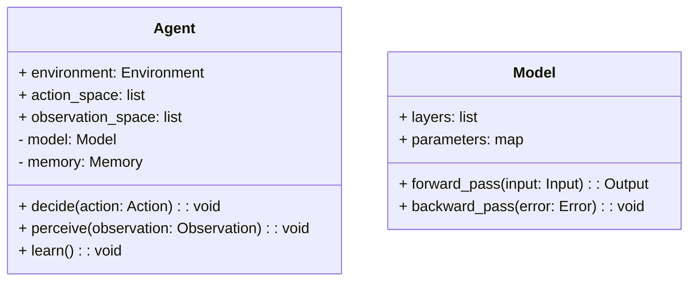
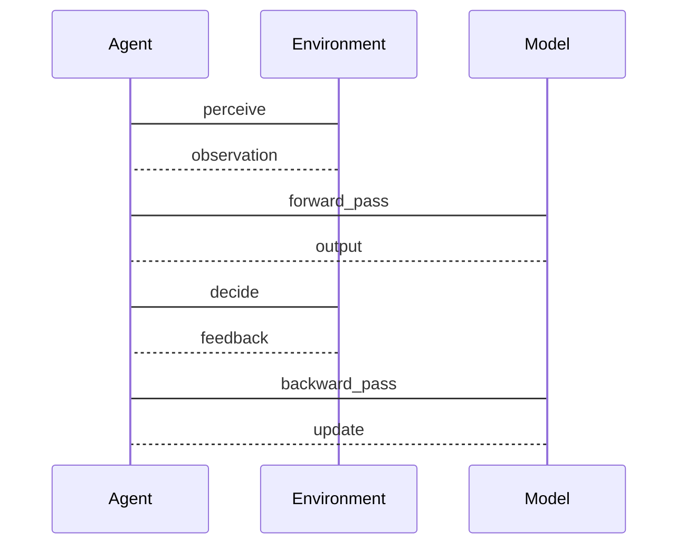

                 


# 神经网络架构搜索在AI Agent优化中的应用

> 关键词：神经网络架构搜索，AI Agent，深度学习，优化算法，强化学习

> 摘要：本文探讨了神经网络架构搜索（Neural Architecture Search, NAS）在AI Agent优化中的应用。通过分析NAS的基本原理、核心算法、系统架构设计以及实际应用案例，本文详细阐述了如何利用NAS技术提升AI Agent的性能和效率。文章内容涵盖从基础概念到高级算法的详细讲解，为读者提供了一套系统性的知识框架。

---

# 第1章: 神经网络架构搜索（NAS）概述

## 1.1 神经网络架构搜索的定义与背景

### 1.1.1 神经网络架构搜索的定义
神经网络架构搜索（Neural Architecture Search, NAS）是一种自动优化神经网络结构的方法。通过算法搜索， NAS能够在给定的搜索空间中找到最优的网络架构，从而在特定任务上实现更好的性能。

### 1.1.2 神经网络架构搜索的发展历程
- **早期阶段**：基于手动设计的网络架构，如LeNet、AlexNet等。
- **自动搜索阶段**：利用强化学习、遗传算法等方法自动搜索网络架构。
- **现代阶段**：引入深度强化学习（Deep RL）和进化策略（Evolution Strategies）等技术，提升搜索效率和架构质量。

### 1.1.3 神经网络架构搜索的应用场景
- **图像识别**：如Inception系列模型。
- **自然语言处理**：如BERT、Transformer等架构。
- **推荐系统**：自动优化推荐模型的架构。

## 1.2 AI Agent的基本概念

### 1.2.1 AI Agent的定义
AI Agent是一种智能体，能够在环境中感知、决策和行动，以实现特定目标。AI Agent可以是软件程序、机器人或其他智能系统。

### 1.2.2 AI Agent的核心功能
- **感知**：通过传感器或数据输入获取环境信息。
- **决策**：基于感知信息做出决策。
- **行动**：执行决策动作，影响环境状态。

### 1.2.3 AI Agent与传统AI的区别
- **自主性**：AI Agent具备自主决策的能力。
- **适应性**：能够根据环境变化动态调整行为。
- **实时性**：需要在实时环境中做出快速响应。

## 1.3 神经网络架构搜索在AI Agent中的应用

### 1.3.1 神经网络架构搜索在AI Agent优化中的作用
- **提升性能**：通过自动优化网络架构，提高AI Agent的决策准确性和响应速度。
- **降低开发成本**：减少手动设计网络架构的时间和精力。
- **增强可扩展性**：支持大规模和复杂任务的优化。

### 1.3.2 神经网络架构搜索的优势与挑战
- **优势**：
  - 自动化：无需人工干预，自动寻找最优架构。
  - 高效性：相比手动设计，搜索速度更快，覆盖更多可能的架构。
- **挑战**：
  - 计算成本高：NAS需要大量的计算资源。
  - 搜索空间大：复杂的任务导致搜索空间过于庞大。
  - 过拟合风险：可能导致过度优化，降低泛化能力。

### 1.3.3 神经网络架构搜索的未来发展方向
- **多目标优化**：在多个目标之间找到平衡，如性能、计算效率和可扩展性。
- **轻量化设计**：优化低资源消耗的架构，适用于边缘计算和实时任务。
- **结合强化学习**：将强化学习与NAS结合，进一步提升搜索效率和架构质量。

---

# 第2章: 神经网络架构搜索的核心原理

## 2.1 神经网络架构搜索的基本原理

### 2.1.1 搜索空间的定义
搜索空间包括所有可能的网络架构，如卷积层、全连接层、池化层等的组合和排列。

### 2.1.2 搜索策略的选择
- **强化学习策略**：通过强化学习代理（通常是基于RNN的解码器）生成候选架构。
- **遗传算法策略**：利用遗传算法的变异和交叉操作生成新的候选架构。
- **进化策略**：基于梯度的搜索方法，优化架构超参数。

### 2.1.3 架构评估方法
- **准确率评估**：在验证集上评估候选架构的性能。
- **训练时间评估**：评估架构在特定任务上的训练时间。
- **计算复杂度评估**：评估架构的计算复杂度和资源消耗。

## 2.2 神经网络架构搜索的算法流程

### 2.2.1 确定搜索空间
定义搜索空间的范围，包括可能的层类型、连接方式和超参数范围。

### 2.2.2 定义搜索策略
选择适合的搜索算法，如强化学习、遗传算法或进化策略。

### 2.2.3 架构评估与优化
通过多次迭代评估候选架构，逐步优化搜索策略，找到最优架构。

## 2.3 神经网络架构搜索的关键技术

### 2.3.1 超参数搜索
通过搜索算法优化网络架构的超参数，如学习率、批量大小和网络深度。

### 2.3.2 架构搜索的加速方法
- **剪枝技术**：通过剪枝操作减少搜索空间的规模。
- **迁移学习**：利用已有任务的优化结果加速新任务的搜索过程。
- **多任务搜索**：同时优化多个相关任务的架构，共享搜索空间。

### 2.3.3 神经网络架构的可解释性
通过可视化和分析网络架构，提升搜索过程的透明度和可解释性。

---

# 第3章: AI Agent的优化需求与架构特点

## 3.1 AI Agent的优化目标

### 3.1.1 性能优化
- 提高决策准确性和响应速度。
- 降低计算资源消耗。

### 3.1.2 资源利用率优化
- 在有限的计算资源下，最大化任务性能。
- 提升能源效率，减少功耗。

### 3.1.3 可扩展性优化
- 支持大规模数据和复杂任务的处理。
- 提升并行计算能力和分布式部署能力。

## 3.2 AI Agent的架构特点

### 3.2.1 模块化设计
- 各模块独立，便于维护和升级。
- 支持模块间的高效通信和数据共享。

### 3.2.2 可配置性
- 支持多种配置方式，适应不同的任务需求。
- 灵活调整架构参数，适应动态变化的环境。

### 3.2.3 实时响应能力
- 快速处理输入数据，及时做出决策。
- 支持实时反馈机制，动态调整行为策略。

## 3.3 神经网络架构搜索在AI Agent优化中的具体需求

### 3.3.1 架构搜索的目标函数
- 定义性能指标：如准确率、响应时间等。
- 定义约束条件：如计算资源限制、任务时间限制。

### 3.3.2 架构搜索的约束条件
- 硬件资源限制：如计算能力、内存和存储空间。
- 任务复杂度：任务类型和规模影响架构设计。
- 时间限制：优化算法的收敛速度。

### 3.3.3 架构搜索的性能指标
- 搜索效率：单位时间内找到的候选架构数量。
- 架构质量：候选架构的性能和资源消耗。
- 搜索成本：计算资源消耗和时间消耗。

---

# 第4章: 神经网络架构搜索在AI Agent中的应用实例

## 4.1 神经网络架构搜索在自然语言处理中的应用

### 4.1.1 神经网络架构搜索在自然语言处理中的作用
- 自动优化语言模型的架构，提升文本理解和生成能力。
- 提高模型的可解释性和泛化能力。

### 4.1.2 具体案例分析
- **案例一**：使用NAS优化Transformer模型的架构，提升机器翻译的准确性。
- **案例二**：利用强化学习驱动的搜索算法，优化问答系统的架构。

### 4.1.3 总结与启示
- NAS在自然语言处理中的应用证明了其有效性。
- 未来需要进一步优化搜索算法，降低计算成本。

## 4.2 神经网络架构搜索在强化学习中的应用

### 4.2.1 强化学习与NAS的结合
- NAS用于优化强化学习模型的网络架构，提升决策能力和收敛速度。
- 强化学习作为搜索策略，驱动NAS的搜索过程。

### 4.2.2 具体案例分析
- **案例一**：使用强化学习驱动的NAS优化智能体的决策网络，提升游戏AI的表现。
- **案例二**：利用NAS技术优化机器人控制模型的架构，提高动作规划的效率。

### 4.2.3 总结与启示
- 强化学习与NAS的结合是未来的重要研究方向。
- 需要进一步研究如何在复杂环境中高效应用NAS技术。

## 4.3 神经网络架构搜索在推荐系统中的应用

### 4.3.1 NAS在推荐系统中的优势
- 自动优化推荐模型的架构，提升推荐效果。
- 支持大规模数据处理和实时推荐需求。

### 4.3.2 具体案例分析
- **案例一**：使用NAS技术优化协同过滤模型的架构，提高推荐准确率。
- **案例二**：利用NAS优化深度学习推荐模型，降低计算成本。

### 4.3.3 总结与启示
- NAS在推荐系统中的应用前景广阔。
- 需要结合具体业务需求，优化搜索策略和架构设计。

---

# 第5章: 神经网络架构搜索算法的数学模型与公式推导

## 5.1 强化学习驱动的NAS算法

### 5.1.1 算法概述
- 使用强化学习代理（通常是基于RNN的解码器）生成候选网络架构。
- 通过探索和利用策略，在搜索空间中寻找最优架构。

### 5.1.2 算法流程
1. 初始化搜索空间和强化学习代理。
2. 生成候选网络架构，并进行训练和评估。
3. 根据评估结果更新强化学习策略，优化搜索过程。

### 5.1.3 数学公式
- **损失函数**：$$ L = -\sum_{t} r_t \log p(\theta_t) $$
- **目标函数**：$$ J(\theta) = \mathbb{E}_{\theta \sim p_\theta} [R(\theta)] $$
- **策略梯度**：$$ \nabla J = \mathbb{E}[ \nabla \log p_\theta(a_t) Q(s_t, a_t)] $$

## 5.2 进化策略驱动的NAS算法

### 5.2.1 算法概述
- 基于进化策略（Evolution Strategies）优化网络架构的超参数。
- 通过变异和选择操作，逐步优化候选架构。

### 5.2.2 算法流程
1. 初始化种群，生成一组候选网络架构。
2. 训练并评估每组架构的性能。
3. 根据评估结果选择优秀的架构进行变异和交叉操作，生成新一代种群。

### 5.2.3 数学公式
- **变异操作**：$$ \theta_{new} = \theta + \sigma \cdot \mathcal{N}(0, I) $$
- **选择操作**：$$ P(\theta_i) \propto \exp(\frac{Q(\theta_i)}{\sigma^2}) $$

---

# 第6章: 系统分析与架构设计方案

## 6.1 问题场景介绍

### 6.1.1 问题描述
- 在复杂的动态环境中，AI Agent需要实时感知、决策和行动。
- 需要优化网络架构，提升决策准确性和响应速度。

### 6.1.2 项目介绍
- 开发一个基于NAS的AI Agent系统，优化网络架构，提升任务性能。

## 6.2 系统功能设计

### 6.2.1 领域模型


### 6.2.2 系统架构设计


### 6.2.3 系统接口设计
- **输入接口**：接收环境感知数据和用户输入。
- **输出接口**：输出决策动作和状态更新。
- **通信接口**：与其他系统组件进行数据交互。

### 6.2.4 系统交互设计


---

# 第7章: 项目实战与代码实现

## 7.1 环境安装

### 7.1.1 系统环境
- Python 3.7+
- TensorFlow 2.0+
- Keras 2.4.3+
- gym库或其他相关库

### 7.1.2 安装依赖
```bash
pip install numpy
pip install keras
pip install tensorflow
pip install gym
```

## 7.2 核心实现代码

### 7.2.1 网络架构搜索算法

```python
def nas_algorithm(search_space, num_epochs=100):
    import random
    best_architecture = None
    best_accuracy = 0.0

    for _ in range(num_epochs):
        candidate = generate_candidate_architecture(search_space)
        accuracy = evaluate_candidate(candidate)
        if accuracy > best_accuracy:
            best_accuracy = accuracy
            best_architecture = candidate
    return best_architecture
```

### 7.2.2 强化学习驱动的搜索策略

```python
class NASAgent:
    def __init__(self, action_space):
        self.action_space = action_space
        self.memory = []
        self.learning_rate = 0.01
        self.model = self._build_model()

    def _build_model(self):
        # 构建强化学习模型
        pass

    def perceive(self, observation):
        # 处理观察，生成动作
        pass

    def decide(self, observation):
        # 根据观察选择动作
        pass

    def learn(self):
        # 更新模型参数
        pass
```

## 7.3 代码应用解读与分析

### 7.3.1 网络架构生成函数
```python
def generate_candidate_architecture(search_space):
    import random
    architecture = {}
    for layer in search_space['layers']:
        architecture[layer] = random.choice(search_space['config'][layer])
    return architecture
```

### 7.3.2 网络架构评估函数
```python
def evaluate_candidate(architecture):
    # 构建模型
    model = build_model(architecture)
    # 训练模型
    model.train()
    # 评估性能
    return model.evaluate()
```

## 7.4 实际案例分析与详细讲解

### 7.4.1 案例分析
- **案例一**：使用NAS优化图像分类模型的架构，提升分类准确率。
- **案例二**：在自然语言处理任务中，利用NAS技术优化文本生成模型的架构。

### 7.4.2 代码实现步骤
1. **定义搜索空间**：包括层类型、参数范围和连接方式。
2. **生成候选架构**：随机生成满足搜索空间的网络架构。
3. **训练和评估**：训练候选模型，评估其性能。
4. **更新搜索策略**：根据评估结果优化搜索算法，生成新的候选架构。

## 7.5 项目小结

### 7.5.1 核心代码总结
- 网络架构搜索算法：生成和评估候选架构。
- 强化学习驱动的搜索策略：优化搜索过程。
- 网络架构评估函数：评估候选模型的性能。

### 7.5.2 项目实现的关键点
- 确定合适的搜索空间和搜索策略。
- 优化评估函数，提升评估效率。
- 处理计算资源限制，降低搜索成本。

---

# 第8章: 总结与展望

## 8.1 总结
- 本文详细探讨了神经网络架构搜索（NAS）在AI Agent优化中的应用。
- 通过分析NAS的基本原理、系统架构设计和实际应用案例，本文展示了NAS技术在提升AI Agent性能和效率方面的巨大潜力。

## 8.2 展望
- **算法优化**：进一步优化NAS算法，降低计算成本和时间复杂度。
- **多模态优化**：探索NAS在多模态数据处理中的应用，如图像、文本和语音的联合优化。
- **结合边缘计算**：将NAS技术应用于边缘计算环境，提升AI Agent的实时性和响应速度。

---

# 作者信息

作者：AI天才研究院/AI Genius Institute & 禅与计算机程序设计艺术 /Zen And The Art of Computer Programming

---

以上是《神经网络架构搜索在AI Agent优化中的应用》的完整目录和部分正文内容。

