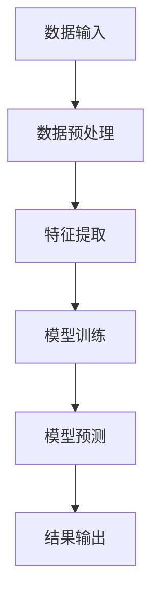

                 


---

# 神经网络模型在资产定价中的应用研究

---

## 关键词  
神经网络模型, 资产定价, 金融建模, 机器学习, 深度学习, 人工智能

---

## 摘要  
神经网络模型作为一种强大的机器学习工具，近年来在金融领域的应用取得了显著进展。本文系统探讨了神经网络模型在资产定价中的应用研究，从基本概念、算法原理到实际应用，逐一展开分析。文章首先介绍了资产定价的基本概念和神经网络模型的核心原理，然后详细分析了神经网络模型的算法原理与数学基础，接着从系统分析与架构设计的角度探讨了资产定价系统的构建，最后通过项目实战展示了神经网络模型在资产定价中的具体应用。本文旨在为读者提供一个全面、深入的技术视角，帮助理解神经网络模型在资产定价中的潜力与挑战。

---

# 第一部分: 神经网络模型在资产定价中的应用概述

## 第1章: 资产定价与神经网络模型的背景介绍

### 1.1 资产定价的基本概念

#### 1.1.1 资产定价的定义与意义  
资产定价是指通过市场信息、资产特征和风险因素，确定资产在市场上的合理价格的过程。资产定价的核心在于发现资产的内在价值，从而为投资决策提供依据。传统资产定价模型（如CAPM和APT）基于假设和简化，但在复杂金融市场中往往难以捕捉非线性关系和高频数据中的隐含信息。  

#### 1.1.2 资产定价的核心问题与挑战  
资产定价面临的主要挑战包括：  
1. **数据复杂性**：金融市场数据通常具有高维性、非线性和噪声干扰。  
2. **模型假设的局限性**：传统模型依赖于严格的假设，难以适应实际市场的动态变化。  
3. **市场异效**：市场中存在噪声交易者、信息不对称等问题，影响资产定价的准确性。  

#### 1.1.3 神经网络模型在资产定价中的应用前景  
神经网络模型作为一种非线性工具，能够有效处理复杂数据，捕捉市场中的隐含模式。其在资产定价中的应用前景广阔，尤其是在高频交易、风险评估和市场情绪分析等领域。

---

### 1.2 神经网络模型的基本概念

#### 1.2.1 神经网络的定义与特点  
神经网络是一种模拟人脑神经网络结构的计算模型，具有以下特点：  
1. **非线性**：能够处理复杂的非线性关系。  
2. **自适应性**：通过训练可以自动调整参数以适应数据。  
3. **容错性**：即使部分节点失效，网络仍能保持一定的功能。  

#### 1.2.2 神经网络的主要类型  
1. **前馈神经网络（FNN）**：最常用的神经网络类型，数据单向流动。  
2. **卷积神经网络（CNN）**：适用于处理具有空间结构的数据（如图像）。  
3. **循环神经网络（RNN）**：适合处理序列数据，如时间序列。  

#### 1.2.3 神经网络在金融领域的应用现状  
神经网络在金融领域的应用包括股票价格预测、信用评分、风险管理等。资产定价作为金融的核心问题，是神经网络的重要应用场景之一。

---

## 第2章: 神经网络模型与资产定价的核心概念与联系

### 2.1 神经网络模型的原理

#### 2.1.1 神经网络的结构与功能  
神经网络由输入层、隐藏层和输出层组成，通过权重和激活函数进行信息处理。其核心功能是通过训练数据调整权重，使模型能够近似目标函数。

#### 2.1.2 神经网络的训练过程  
训练过程包括前向传播和反向传播两个阶段：  
- **前向传播**：输入数据经过网络计算得到输出。  
- **反向传播**：通过损失函数计算误差，并调整权重以最小化误差。  

#### 2.1.3 神经网络的特征提取能力  
神经网络能够自动提取数据中的特征，无需手动特征工程，这在资产定价中具有重要意义。

---

### 2.2 资产定价的核心要素

#### 2.2.1 资产的内在价值与市场价值  
资产的内在价值是其未来现金流的现值，而市场价值是资产在市场上的交易价格。两者之间的差异反映了市场的有效性和异效性。

#### 2.2.2 影响资产价格的主要因素  
1. **基本面因素**：如收益、利润、负债等。  
2. **市场情绪**：如投资者情绪、市场波动性等。  
3. **宏观经济因素**：如利率、通货膨胀等。  

#### 2.2.3 资产定价模型的分类与选择  
资产定价模型主要包括：  
1. **单因素模型**：如CAPM。  
2. **多因素模型**：如APT。  
3. **行为模型**：基于投资者心理的定价模型。  

---

### 2.3 神经网络模型在资产定价中的应用框架

#### 2.3.1 数据输入与特征提取  
神经网络模型需要将资产定价的相关数据输入网络。这些数据可以是历史价格、财务指标、市场情绪等。

#### 2.3.2 神经网络模型的构建与训练  
根据输入数据和目标（如预测价格）构建神经网络模型，并通过训练数据进行优化。

#### 2.3.3 模型输出与结果解释  
模型输出的结果需要结合金融知识进行解释，以指导投资决策。

---

# 第二部分: 神经网络模型的算法原理与数学基础

## 第3章: 神经网络模型的算法原理

### 3.1 神经网络的基本算法

#### 3.1.1 前馈神经网络（FNN）  
FNN是最简单的神经网络类型，常用于分类和回归任务。其结构包括输入层、隐藏层和输出层，通过权重和激活函数进行信息处理。

#### 3.1.2 卷积神经网络（CNN）  
CNN适用于处理具有空间结构的数据，如图像和时间序列。其卷积层能够提取局部特征。

#### 3.1.3 循环神经网络（RNN）  
RNN适用于处理序列数据，如股票价格的时间序列。其循环层能够捕捉序列中的时序信息。

---

### 3.2 神经网络的训练算法

#### 3.2.1 梯度下降法  
梯度下降法是一种优化算法，通过计算损失函数的梯度来调整权重，使损失函数最小化。

#### 3.2.2 随机梯度下降法  
随机梯度下降法是梯度下降法的一种变体，通过随机选择子批量进行优化，适用于大数据集。

#### 3.2.3 动量优化与Adam优化器  
动量优化和Adam优化器是常用的优化算法，能够加速收敛并提高训练效率。

---

### 3.3 神经网络的激活函数

#### 3.3.1 Sigmoid函数  
Sigmoid函数将输入压缩到(0,1)区间，常用于分类任务。

#### 3.3.2 ReLU函数  
ReLU函数将输入小于0的部分置零，具有计算简单且不易梯度消失的优点。

#### 3.3.3 Tanh函数  
Tanh函数将输入压缩到(-1,1)区间，适用于隐藏层的激活。

---

## 第4章: 神经网络模型的数学公式与推导

### 4.1 神经网络的数学模型

#### 4.1.1 神经网络的输入输出关系  
神经网络的输入为$x_i$，输出为$y_j$，权重为$w_{ij}$，偏置为$b_j$，激活函数为$f$。输出可以表示为：  
$$ y_j = f\left(\sum_{i} w_{ij} x_i + b_j\right) $$

#### 4.1.2 神经网络的权重与偏置  
权重和偏置是神经网络的参数，通过训练数据进行优化。

#### 4.1.3 神经网络的损失函数  
损失函数通常采用均方误差（MSE）：  
$$ \text{损失} = \frac{1}{N} \sum_{i=1}^{N} (y_i - \hat{y}_i)^2 $$

---

### 4.2 神经网络的训练过程

#### 4.2.1 前向传播  
输入数据经过网络计算得到输出：  
$$ a^{(l)} = f\left( w^{(l)} a^{(l-1)} + b^{(l)} \right) $$

#### 4.2.2 反向传播  
通过链式法则计算梯度，并更新权重和偏置：  
$$ \frac{\partial L}{\partial w^{(l)}} = a^{(l-1)} \frac{\partial L}{\partial a^{(l)}} $$  
$$ \frac{\partial L}{\partial b^{(l)}} = \frac{\partial L}{\partial a^{(l)}} $$

#### 4.2.3 参数更新  
通过优化算法（如Adam）更新权重和偏置：  
$$ w^{(l)} = w^{(l)} - \eta \frac{\partial L}{\partial w^{(l)}} $$

---

### 4.3 神经网络的优化技巧

#### 4.3.1 正则化技术  
正则化技术（如L2正则化）可以防止过拟合：  
$$ \text{损失} = \frac{1}{N} \sum_{i=1}^{N} (y_i - \hat{y}_i)^2 + \lambda \sum_{j} w_j^2 $$

#### 4.3.2 模型集成  
通过集成多个模型（如投票法和加权平均）可以提高模型的泛化能力。

#### 4.3.3 超参数调优  
超参数（如学习率和批量大小）需要通过网格搜索或随机搜索进行优化。

---

# 第三部分: 资产定价系统的系统分析与架构设计

## 第5章: 资产定价系统的系统分析

### 5.1 系统目标与范围

#### 5.1.1 系统目标  
本系统的目标是利用神经网络模型对资产价格进行预测和定价。

#### 5.1.2 系统范围  
系统适用于股票、债券等金融资产的定价。

---

### 5.2 系统功能设计

#### 5.2.1 数据输入与处理  
系统需要输入历史价格、财务指标和市场情绪等数据。

#### 5.2.2 模型训练与优化  
系统需要对神经网络模型进行训练和优化，以提高预测精度。

#### 5.2.3 结果输出与解释  
系统需要输出预测价格，并结合金融知识进行解释。

---

## 第6章: 系统架构设计

### 6.1 系统架构设计

#### 6.1.1 系统架构图  
以下是系统架构的Mermaid图：  



---

### 6.2 系统接口设计

#### 6.2.1 输入接口  
系统需要通过API接口接收外部数据。

#### 6.2.2 输出接口  
系统需要通过API接口输出预测结果。

---

## 第7章: 项目实战

### 7.1 环境安装

#### 7.1.1 安装Python  
安装Python 3.x版本，并配置虚拟环境。

#### 7.1.2 安装依赖库  
安装以下依赖库：  
```bash
pip install numpy pandas tensorflow matplotlib
```

---

### 7.2 系统核心实现源代码

#### 7.2.1 数据预处理代码  
```python
import numpy as np
import pandas as pd

# 读取数据
data = pd.read_csv('stock_prices.csv')

# 数据预处理
def preprocess(data):
    # 标准化处理
    from sklearn.preprocessing import StandardScaler
    scaler = StandardScaler()
    data_scaled = scaler.fit_transform(data)
    return data_scaled

processed_data = preprocess(data)
```

#### 7.2.2 神经网络模型实现代码  
```python
import tensorflow as tf
from tensorflow.keras import layers

# 构建神经网络模型
def build_model(input_dim):
    model = tf.keras.Sequential()
    model.add(layers.Dense(64, activation='relu', input_dim=input_dim))
    model.add(layers.Dense(32, activation='relu'))
    model.add(layers.Dense(1, activation='linear'))
    model.compile(optimizer='adam', loss='mean_squared_error')
    return model

# 训练模型
model = build_model(input_dim)
model.fit(X_train, y_train, epochs=100, batch_size=32)
```

---

### 7.3 代码应用解读与分析

#### 7.3.1 数据预处理  
数据预处理包括标准化处理，以消除不同特征的量纲影响。

#### 7.3.2 模型训练  
神经网络模型通过反向传播算法进行训练，优化权重以最小化预测误差。

---

### 7.4 实际案例分析

#### 7.4.1 数据来源与特征  
数据来源包括历史价格、成交量、财务指标等。

#### 7.4.2 模型预测与分析  
通过训练好的模型对测试数据进行预测，并分析预测结果与实际价格的差异。

---

### 7.5 项目小结  
通过项目实战，我们验证了神经网络模型在资产定价中的有效性，并总结了实践经验。

---

## 第8章: 总结与展望

### 8.1 总结  
本文系统探讨了神经网络模型在资产定价中的应用，从理论到实践进行了全面分析。

### 8.2 展望  
未来，随着深度学习技术的进步，神经网络模型在资产定价中的应用将更加广泛和深入。

---

## 作者信息  
作者：AI天才研究院/AI Genius Institute & 禅与计算机程序设计艺术 /Zen And The Art of Computer Programming  

---

