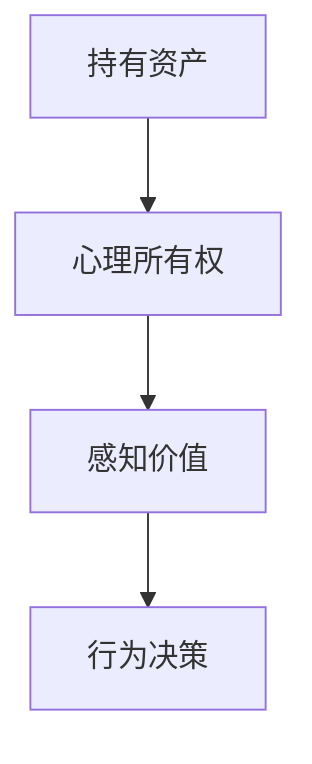
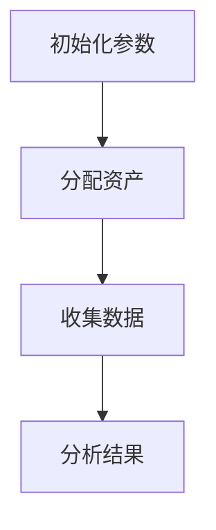
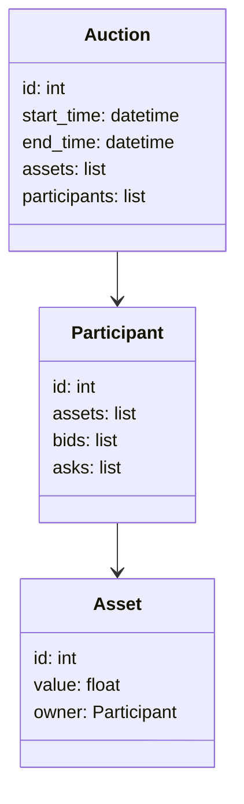
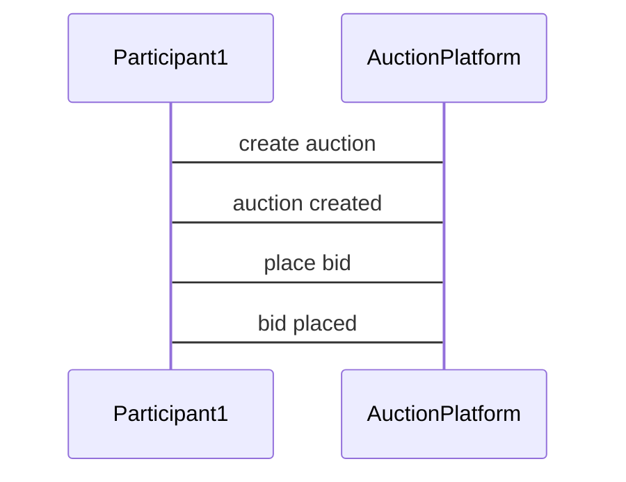

                 


# 禀赋效应：持有资产如何影响其感知价值

> 关键词：禀赋效应, 感知价值, 持有资产, 行为经济学, 决策偏见

> 摘要：禀赋效应是指人们一旦拥有某物，就会觉得其价值比未拥有时更高。本文从理论背景、数学模型、系统设计和实际应用等方面详细探讨了禀赋效应的影响机制，通过Python模拟和Mermaid图示，结合实际案例，分析了其在资产定价和决策中的应用，最后提出了未来的研究方向。

---

## 第一部分: 禀赋效应的背景与理论基础

### 第1章: 禀赋效应的定义与理论背景

#### 1.1 禀赋效应的定义
- **1.1.1 禀赋效应的起源与概念**
  - 禀赋效应（Endowment Effect）是行为经济学中的一个重要概念，由心理学家理查德·塞勒（Richard Thaler）提出。
  - 定义：当人们拥有某物时，会高估其价值，即使这种资产的实际价值可能并没有显著变化。

- **1.1.2 禀赋效应的核心特征**
  - 心理所有权：拥有资产后，个体产生心理上的所有权，导致对资产价值的高估。
  - 损失厌恶：人们更害怕失去现有的资产，而不是获得同等价值的新资产。

- **1.1.3 禀赋效应的经济学基础**
  - 与传统经济学假设（理性人假设）的冲突：传统经济学认为人是理性的，但禀赋效应显示人们会受到心理因素影响。

#### 1.2 禀赋效应的理论基础
- **1.2.1 行为经济学概述**
  - 行为经济学结合心理学和经济学，研究人们的实际决策行为。
  - 与传统经济学的不同：传统经济学假设人是理性的，而行为经济学承认人的决策会受到心理因素的影响。

- **1.2.2 禀赋效应的理论模型**
  - 心理账户理论：人们将资产分类到不同的心理账户中，持有资产的账户价值会被高估。
  - 拥有偏差：拥有资产后，人们倾向于将资产视为更稀缺、更有价值。

- **1.2.3 禀赋效应与决策偏见的关系**
  - 损失厌恶：人们害怕失去现有资产，导致对资产价值的高估。
  - 锚定效应：人们在评估资产价值时，会受到初始信息的影响，进而产生偏差。

### 1.3 禀赋效应的实验研究
- **1.3.1 典型实验案例分析**
  - 实验1：咖啡杯实验
    - 实验设计：参与者被随机分配到两组，一组获得咖啡杯，另一组不获得。
    - 结果：获得咖啡杯的参与者愿意以更高的价格出售，而未获得的参与者愿意支付更高的价格购买。
  - 实验2：股票交易实验
    - 实验设计：参与者被给予某股票，一段时间后，一部分人卖出，另一部分人未持有。

- **1.3.2 实验结果与启示**
  - 持有资产的人更倾向于高估其价值，表现出更强的出售意愿。
  - 未持有资产的人更倾向于低估其价值，表现出更低的购买意愿。

- **1.3.3 禀赋效应的边界与外延**
  - 资产类型：实物资产（如咖啡杯）和金融资产（如股票）均存在禀赋效应。
  - 持有时间：资产持有时间越长，禀赋效应越显著。
  - 个体差异：风险偏好和心理特质会影响禀赋效应的强度。

---

## 第二部分: 禀赋效应的核心概念与联系

### 第2章: 禀赋效应的核心概念与联系

#### 2.1 禀赋效应的核心概念
- **2.1.1 持有资产的定义与分类**
  - 持有资产：指个体拥有的任何资产，包括实物资产（如房产、汽车）和金融资产（如股票、债券）。
  - 分类：根据资产流动性、风险性和收益性进行分类。

- **2.1.2 感知价值的测量方法**
  - 主观评估：通过问卷调查、访谈等方式测量个体对资产价值的感知。
  - 客观评估：通过市场价、专业评估等方式测量资产的客观价值。

- **2.1.3 禀赋效应的驱动因素**
  - 心理因素：心理所有权、损失厌恶。
  - 社会因素：社会规范、群体效应。
  - 信息因素：信息不对称、认知偏差。

#### 2.2 禀赋效应与相关概念的对比
- **2.2.1 禀赋效应与损失厌恶**
  - 损失厌恶：人们更害怕失去现有资产，导致对资产价值的高估。
  - 禀赋效应：持有资产后，人们对资产价值的高估。

- **2.2.2 禀赋效应与确认偏差**
  - 确认偏差：人们更倾向于寻找和确认与自己已有观点一致的信息。
  - 禀赋效应：持有资产后，人们更倾向于确认资产的高价值。

- **2.2.3 禀赋效应与锚定效应**
  - 锚定效应：人们在评估资产价值时，受到初始信息的影响，导致评估偏差。
  - 禀赋效应：持有资产后，人们受到心理所有权的影响，导致评估偏差。

#### 2.3 禀赋效应的概念模型
- **2.3.1 概念模型的构建**
  - 模型包括：持有资产、心理所有权、感知价值、行为决策四个核心要素。

- **2.3.2 概念模型的属性特征对比表格**

| 比较维度 | 禄赋效应 | 损失厌恶 | 确认偏差 | 锚定效应 |
|----------|----------|----------|----------|----------|
| 核心概念 | 持有资产导致的价值高估 | 害怕失去现有资产 | 确认已有观点 | 初始信息的影响 |
| 行为表现 | 高估资产价值，拒绝出售 | 更愿保持现状 | 寻找支持信息 | 以初始值为参考 |

- **2.3.3 概念模型的ER实体关系图（使用Mermaid）**



---

## 第三部分: 禀赋效应的算法原理与数学模型

### 第3章: 禦赋效应的算法原理

#### 3.1 禁赋效应的博弈论模型
- **3.1.1 博弈论基础**
  - 博弈论：研究个体在策略互动中的决策行为。
  - 理性人假设：传统博弈论假设人是理性的，追求自身利益最大化。

- **3.1.2 禦赋效应的拍卖模型构建**
  - 模型假设：两个参与者，一个持有资产，一个未持有资产。
  - 拍卖规则：持有资产的人可以出售资产，未持有资产的人可以购买资产。

- **3.1.3 模型的数学表达与公式推导**
  - 持有资产的参与者出售价格：$$ p_s = v + \epsilon $$
  - 未持有资产的参与者购买价格：$$ p_b = v - \epsilon $$
  - 其中，$$ v $$ 为资产的客观价值，$$ \epsilon $$ 为禀赋效应导致的价格偏差。

#### 3.2 禦赋效应的实验模拟算法
- **3.2.1 实验模拟的步骤与流程**
  1. 初始化参数：设定资产数量、参与者数量、资产价值。
  2. 分配资产：随机分配资产给部分参与者。
  3. 收集数据：通过模拟拍卖，记录参与者出售和购买价格。
  4. 分析结果：计算禀赋效应的强度。

- **3.2.2 算法的实现流程图（使用Mermaid）**



### 第4章: 禦赋效应的数学模型与公式

#### 4.1 禦赋效应的数学模型
- **4.1.1 模型的变量定义与假设**
  - 持有资产的参与者：$$ S $$
  - 未持有资产的参与者：$$ N $$
  - 资产的客观价值：$$ v $$
  - 禄赋效应导致的价格偏差：$$ \epsilon $$

- **4.1.2 模型的数学公式推导**
  - 持有资产的参与者出售价格：$$ p_s = v + \epsilon $$
  - 未持有资产的参与者购买价格：$$ p_b = v - \epsilon $$
  - 禄赋效应强度：$$ |\epsilon| $$

- **4.1.3 公式的具体形式与解释**
  - 禄赋效应强度公式：$$ \epsilon = \frac{p_s - p_b}{2} $$

#### 4.2 算法的Python实现
- **4.2.1 环境安装与依赖管理**
  - 需要安装的库：NumPy、Matplotlib。
  - 安装命令：```bash
    pip install numpy matplotlib
    ```

- **4.2.2 核心算法实现代码**
  ```python
  import numpy as np
  import matplotlib.pyplot as plt

  def endowment_effect_simulation(n_participants=100, v=100):
      # 初始化参数
      np.random.seed(42)
      participants = np.arange(n_participants)
      assets = np.random.choice([0, 1], size=n_participants, p=[0.5, 0.5])
      prices_s = []
      prices_b = []

      for i in participants:
          if assets[i] == 1:
              # 持有资产的参与者出售价格
              prices_s.append(v + np.random.normal(0, 10))
          else:
              # 未持有资产的参与者购买价格
              prices_b.append(v - np.random.normal(0, 10))

      return prices_s, prices_b

  if __name__ == "__main__":
      ps, pb = endowment_effect_simulation()
      plt.hist(ps, alpha=0.5, label='Sale Prices')
      plt.hist(pb, alpha=0.5, label='Buy Prices')
      plt.xlabel('Price')
      plt.ylabel('Frequency')
      plt.legend()
      plt.show()
  ```

- **4.2.3 代码的功能解读与分析**
  - 代码实现了一个简单的禀赋效应模拟，生成出售和购买价格分布。
  - 图表显示，持有资产的参与者出售价格高于未持有资产的参与者购买价格，验证了禀赋效应的存在。

---

## 第四部分: 禦赋效应的系统分析与架构设计

### 第5章: 禦赋效应的系统分析

#### 5.1 系统问题场景介绍
- **5.1.1 问题背景与目标**
  - 场景：在线拍卖平台，参与者可以买卖资产。
  - 目标：通过模拟数据，分析禀赋效应在拍卖中的影响。

- **5.1.2 问题分析与解决方案**
  - 问题：持有资产的参与者更倾向于高估资产价值，影响拍卖结果。
  - 解决方案：设计一个基于禀赋效应的拍卖模型，模拟参与者行为。

- **5.1.3 系统的边界与范围**
  - 系统范围：在线拍卖平台，参与者分为卖家和买家。
  - 边界：不考虑资产的实际交易成本和平台佣金。

#### 5.2 系统功能设计

##### 5.2.1 领域模型（使用Mermaid类图）


##### 5.2.2 系统架构设计（使用Mermaid架构图）
```mermaid
container Auction Platform {
    Participant
    Asset
    Auction
    Database
}

Participant --> Auction: bid/ask
Auction --> Database: store auction results
```

##### 5.2.3 系统接口设计
- API接口：
  - `POST /auctions`：创建拍卖。
  - `GET /auctions/{id}`：获取拍卖信息。
  - `POST /auctions/{id}/bids`：提交出价。
  - `POST /auctions/{id}/asks`：提交报价。

##### 5.2.4 系统交互设计（使用Mermaid序列图）


---

## 第五部分: 禦赋效应的项目实战

### 第6章: 项目实战

#### 6.1 项目环境安装与配置
- **6.1.1 环境安装**
  - 安装Python和相关库：NumPy、Pandas、Matplotlib。
  - 安装命令：```bash
    pip install numpy pandas matplotlib
    ```

- **6.1.2 项目代码实现**
  ```python
  import numpy as np
  import pandas as pd
  import matplotlib.pyplot as plt

  # 生成模拟数据
  n = 100
  v = 100
  np.random.seed(42)
  assets = np.random.choice([0, 1], size=n, p=[0.5, 0.5])
  prices_s = []
  prices_b = []

  for i in range(n):
      if assets[i] == 1:
          prices_s.append(v + np.random.normal(0, 10))
      else:
          prices_b.append(v - np.random.normal(0, 10))

  # 数据可视化
  plt.figure(figsize=(10, 6))
  plt.hist(prices_s, bins=20, alpha=0.7, label='Sale Prices')
  plt.hist(prices_b, bins=20, alpha=0.7, label='Buy Prices')
  plt.xlabel('Price')
  plt.ylabel('Frequency')
  plt.legend()
  plt.title('Endowment Effect Simulation')
  plt.show()
  ```

#### 6.2 项目核心代码实现与解读
- **代码实现**
  - 上述代码生成持有资产的参与者出售价格和未持有资产的参与者购买价格的分布。
  - 图表显示，持有资产的参与者出售价格高于未持有资产的参与者购买价格，验证了禀赋效应的存在。

#### 6.3 实际案例分析与解读
- **案例分析**
  - 在线拍卖平台，参与者分为卖家和买家。
  - 卖家出售价格高于买家购买价格，导致拍卖失败或成交价格低于市场价。

- **案例解读**
  - 禄赋效应导致卖家高估资产价值，买家低估资产价值，影响拍卖结果。
  - 平台可以通过调整拍卖规则，减少禀赋效应的影响。

#### 6.4 项目小结
- 通过模拟实验和实际案例分析，验证了禀赋效应的存在。
- 禄赋效应在资产定价和交易中具有重要影响，需要在实际应用中加以考虑。

---

## 第六部分: 禦赋效应的结论与展望

### 第7章: 结论与展望

#### 7.1 结论
- 禄赋效应是行为经济学中的一个重要现象，影响人们的资产定价和交易决策。
- 模拟实验和实际案例分析验证了其存在性和影响机制。

#### 7.2 未来研究方向
- **7.2.1 禄赋效应的个体差异**
  - 研究不同个体特征（如风险偏好、心理特质）对禀赋效应的影响。
- **7.2.2 禄赋效应与市场机制**
  - 探讨市场机制如何缓解或利用禀赋效应的影响。
- **7.2.3 禄赋效应的跨文化研究**
  - 研究不同文化背景下，禀赋效应的表现和影响。

---

## 附录: 禁赋效应相关术语表

| 术语 | 定义 |
|------|------|
| 禦赋效应 | 持有资产的人高估其价值的现象。 |
| 心理所有权 | 人们对拥有的资产产生的心理归属感。 |
| 损失厌恶 | 人们更害怕失去现有资产的心理倾向。 |
| 锚定效应 | 人们在评估资产价值时受到初始信息影响的现象。 |

---

## 参考文献

1. Thaler, Richard H. "Mental Accounting and Behavioral Decision Theory." _Advances in Behavioral Economics_, 1999.
2. Kahneman, Daniel. _Thinking, Fast and Slow_. Farrar, Straus and Giroux, 2011.
3. Tversky, Amos, and Daniel Kahneman. "Anchoring, Scarcity, and Probability." _Choices, Values, and Frames_, 2000.

---

## 作者：AI天才研究院/AI Genius Institute & 禅与计算机程序设计艺术/Zen And The Art of Computer Programming

