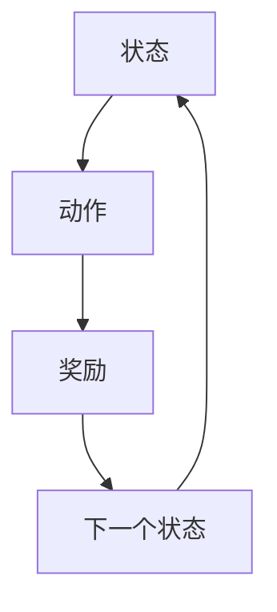

                 

# 离线强化学习：利用历史数据训练AI Agent

---

## 关键词  
离线强化学习、强化学习、AI Agent、历史数据、深度强化学习、算法优化

---

## 摘要  
离线强化学习是一种通过利用历史数据训练AI Agent的新兴方法，其核心在于从现有数据中提取最优策略，避免在线强化学习的高计算成本和实时性要求。本文将从离线强化学习的基本概念、核心算法、系统架构到实际应用案例，全面探讨如何利用历史数据训练出高效的AI Agent。通过深入分析离线强化学习的原理、算法实现和应用场景，本文为读者提供了一条从理论到实践的学习路径。

---

# 第一部分: 离线强化学习概述

## 第1章: 离线强化学习的背景与概念

### 1.1 离线强化学习的定义与特点  
#### 1.1.1 离线强化学习的定义  
离线强化学习（Offline Reinforcement Learning）是一种基于历史数据的强化学习方法，其目标是通过分析过去的数据，推导出最优策略。与在线强化学习不同，离线强化学习不需要实时与环境交互，而是利用已有的数据进行训练。  

#### 1.1.2 离线强化学习与在线强化学习的区别  
| 方面 | 离线强化学习 | 在线强化学习 |  
|------|--------------|---------------|  
| 数据来源 | 历史数据 | 实时与环境交互 |  
| 训练成本 | 低 | 高 |  
| 应用场景 | 数据驱动的AI Agent训练 | 真实环境中的实时决策 |  

#### 1.1.3 离线强化学习的核心优势  
1. 无需实时环境交互，降低计算成本。  
2. 可以利用历史数据中的经验，快速训练出有效的策略。  
3. 适用于无法实时交互的场景，如医疗、金融等领域。  

### 1.2 离线强化学习的应用场景  
#### 1.2.1 数据驱动的AI Agent训练  
离线强化学习的核心目标是通过历史数据训练AI Agent，使其能够在新的环境中做出最优决策。  

#### 1.2.2 离线数据收集的必要性  
在某些场景中，实时数据收集的成本过高，或者环境无法实时交互，此时离线数据的收集就显得尤为重要。例如，在医疗领域，患者数据的收集需要严格遵循伦理规范，离线数据的利用可以避免对患者造成额外风险。  

#### 1.2.3 离线强化学习的边界与外延  
离线强化学习的边界在于其依赖于历史数据，而历史数据的质量和完整性直接影响训练效果。其外延则包括结合在线学习的混合式强化学习方法。  

### 1.3 离线强化学习的核心要素  
#### 1.3.1 状态、动作、奖励的定义  
- **状态（State）**：环境中的当前情况，例如棋盘上的棋子位置。  
- **动作（Action）**：AI Agent的决策，例如移动棋子的方向。  
- **奖励（Reward）**：环境对决策的反馈，例如得分的变化。  

#### 1.3.2 离线数据的特征分析  
- 数据的完整性和一致性。  
- 数据的时间顺序性。  
- 数据的分布是否平衡。  

#### 1.3.3 离线强化学习的数学模型  
离线强化学习的目标是通过历史数据 $\mathcal{D} = \{(s_i, a_i, r_i, s_{i+1})\}_{i=1}^N$，学习最优策略 $\pi$，使得在新环境中可以最大化累积奖励。  

---

## 第2章: 离线强化学习的核心概念与联系  

### 2.1 离线强化学习的原理  
#### 2.1.1 经验重放机制  
经验重放（Experience Replay）是一种通过随机抽取历史数据进行训练的方法，其目的是打破数据的顺序依赖性，提高模型的泛化能力。  

#### 2.1.2 策略评估与优化  
- **策略评估**：通过历史数据评估当前策略的优劣。  
- **策略优化**：基于评估结果，调整策略以提高奖励。  

#### 2.1.3 离线数据的利用方式  
- 基于模型的离线强化学习：通过建模环境，利用历史数据进行策略优化。  
- 基于数据的离线强化学习：直接利用历史数据进行策略训练，无需环境建模。  

### 2.2 离线强化学习的核心算法  
#### 2.2.1 DQN算法原理  
深度Q网络（Deep Q-Network，DQN）是离线强化学习的经典算法，通过神经网络近似Q值函数，实现策略优化。  

#### 2.2.2 离线强化学习的变体算法  
- DQN variants：如Double DQN、 Dueling DQN等。  
- Actor-Critic方法：通过同时学习策略和价值函数，实现更高效的策略优化。  

#### 2.2.3 离线强化学习与价值函数的关系  
离线强化学习的核心在于通过价值函数（Value Function）评估策略的优劣，进而优化策略。  

### 2.3 离线强化学习的实体关系图  

---

# 第二部分: 离线强化学习的算法原理  

## 第3章: 离线强化学习的核心算法  

### 3.1 DQN算法原理  

#### 3.1.1 DQN的基本结构  
DQN通过两个Q网络（主网络和目标网络）交替更新，实现稳定训练。  

#### 3.1.2 经验重放机制的数学模型  
$$ Q(s,a) = \arg\max_{a} Q(s,a) $$  

#### 3.1.3 DQN的损失函数  
$$ \mathcal{L} = \mathbb{E}[(r + \gamma Q(s',a') - Q(s,a))^2] $$  

#### 3.1.4 DQN的训练流程  
1. 从经验回放缓冲区中随机抽取一批数据。  
2. 计算当前Q值和目标Q值。  
3. 更新主网络的参数，以最小化损失函数。  

---

## 第4章: 离线强化学习的变体算法  

### 4.1 Double DQN算法  
Double DQN通过分离动作选择和Q值评估，避免过拟合，提高算法的稳定性。  

### 4.2 Dueling DQN算法  
Dueling DQN通过分解Q值函数为优势函数（Advantage Function）和状态价值函数（State Value Function），实现更精细的策略优化。  

### 4.3 Actor-Critic算法  
Actor-Critic算法通过同时优化策略（Actor）和价值函数（Critic），实现更高效的策略优化。  

---

## 第5章: 离线强化学习的数学模型  

### 5.1 离线强化学习的目标函数  
$$ \max_{\theta} \mathbb{E}_{(s,a,r,s') \sim \mathcal{D}} [r + \gamma Q_\theta(s',a')] $$  

### 5.2 离线强化学习的收敛性分析  
通过数学证明，分析离线强化学习算法的收敛性，确保算法的有效性。  

---

# 第三部分: 离线强化学习的系统分析与架构设计  

## 第6章: 离线强化学习的系统架构  

### 6.1 系统功能设计  
- 数据预处理模块：清洗和转换历史数据。  
- 策略训练模块：基于历史数据训练AI Agent。  
- 策略评估模块：评估策略的性能。  

### 6.2 系统架构设计  

### 6.3 系统接口设计  
- 数据输入接口：接收历史数据。  
- 策略输出接口：输出最优策略。  

---

## 第7章: 离线强化学习的项目实战  

### 7.1 电商推荐系统案例  

#### 7.1.1 环境安装  
安装Python、TensorFlow、Keras等依赖库。  

#### 7.1.2 数据预处理  
对历史数据进行清洗和特征提取。  

#### 7.1.3 模型训练  
基于DQN算法训练推荐策略。  

#### 7.1.4 结果分析  
分析模型的推荐效果，优化策略。  

---

## 第8章: 最佳实践与小结  

### 8.1 最佳实践  
1. 确保历史数据的质量和完整性。  
2. 合理选择算法，根据场景调整超参数。  

### 8.2 小结  
离线强化学习为AI Agent的训练提供了一种高效的方法，通过历史数据的利用，避免了实时环境交互的高成本。  

### 8.3 注意事项  
1. 历史数据的分布可能与实际环境不同，需注意数据偏见。  
2. 离线强化学习的性能依赖于历史数据的质量，需谨慎处理。  

### 8.4 拓展阅读  
推荐阅读相关论文和书籍，深入了解离线强化学习的最新进展。  

---

## 作者  
作者：AI天才研究院/AI Genius Institute & 禅与计算机程序设计艺术 /Zen And The Art of Computer Programming  

---

通过本文的系统讲解，读者可以全面掌握离线强化学习的核心概念、算法原理和实际应用，为后续的研究和实践打下坚实的基础。

