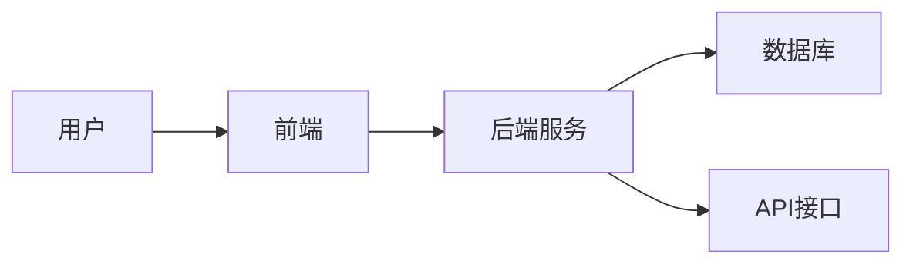
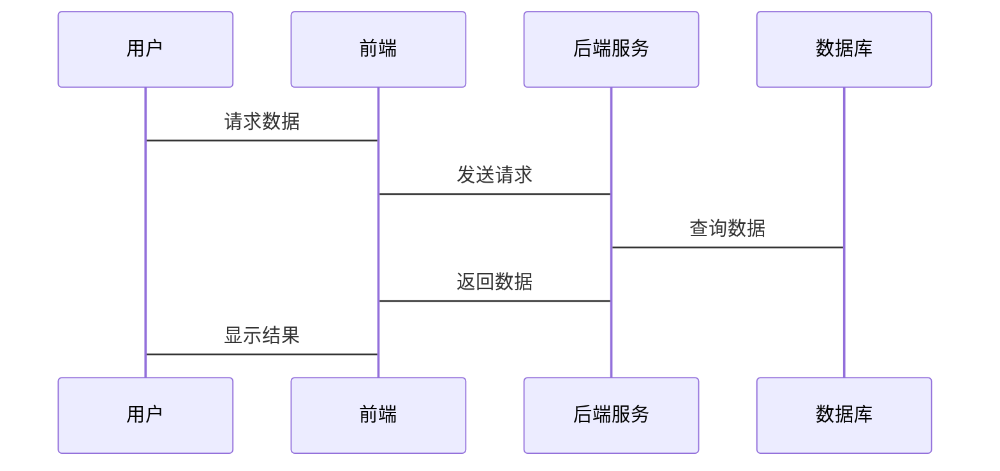

                 


---

# 科技创新对全球股市估值的影响分析

---

## 关键词

- 科技创新
- 股市估值
- 机器学习
- 系统架构
- 股价波动

---

## 摘要

科技创新作为推动现代社会发展的核心动力，对全球股市估值产生了深远影响。本文从背景介绍、核心概念、算法原理、系统设计、项目实战和最佳实践等多个维度，全面分析科技创新如何影响股市估值。通过构建科技创新指数、使用机器学习模型进行预测，以及设计系统架构，本文为投资者和研究者提供了理论和实践指导。

---

# 第一部分：背景介绍

## 第1章：科技创新与全球股市估值的背景

### 1.1 科技创新的背景与发展趋势

#### 1.1.1 科技创新的定义与分类

- 科技创新的定义：指利用新的知识和技术，改进或创造新的产品、服务或生产方式。
- 分类：技术创新、管理创新、商业模式创新。

#### 1.1.2 全球股市估值的基本概念

- 股市估值：对企业未来现金流的折现值进行评估。
- 常用指标：市盈率（P/E）、市净率（P/B）、市值等。

#### 1.1.3 科技创新与股市估值的关系

- 科技创新直接影响企业盈利能力，进而影响股市估值。
- 技术成熟度和市场接受度是关键影响因素。

### 1.2 问题背景与问题描述

#### 1.2.1 科技创新对股市估值的影响

- 技术突破带来企业价值提升，但也可能因技术失败导致估值下降。
- 技术锁定效应和市场竞争加剧影响估值稳定性。

#### 1.2.2 问题的边界与外延

- 研究范围：全球主要股市，重点分析科技行业。
- 时间跨度：近十年的科技发展与股市数据。

#### 1.2.3 核心概念与核心要素

- 核心概念：科技创新与股市估值的相互作用。
- 核心要素：技术创新、市场预期、宏观经济环境。

---

## 第2章：科技创新对股市估值的核心影响机制

### 2.1 科技创新与企业价值的关联

#### 2.1.1 科技创新对企业利润的影响

- 技术创新降低成本，提高效率，增加利润。
- 技术创新可能导致初期投入增加，影响短期利润。

#### 2.1.2 科技创新对市场竞争力的影响

- 技术领先企业占据市场主导地位，提升市占率。
- 技术落后企业面临被淘汰的风险。

#### 2.1.3 科技创新对企业成长性的影响

- 技术创新带来持续增长潜力，吸引投资者。
- 技术创新失败可能导致企业成长性受限。

### 2.2 科技创新对股市估值的关键因素

#### 2.2.1 技术创新周期与估值波动

- 技术成熟期：估值趋于稳定。
- 技术导入期：估值波动较大。

#### 2.2.2 市场预期与投资者情绪

- 市场预期乐观时，估值偏高。
- 投资者情绪波动影响短期估值。

#### 2.2.3 宏观经济环境与政策支持

- 宏观经济繁荣促进技术创新，提升估值。
- 政策支持（如税收优惠）增强技术创新动力，提升估值。

### 2.3 科技创新与股市估值的动态关系

#### 2.3.1 技术成熟度与估值曲线

- 技术成熟度越高，估值越稳定。
- 技术成熟度低时，估值波动较大。

#### 2.3.2 创新失败与估值调整

- 技术失败导致估值下降。
- 市场对失败的预期影响估值。

#### 2.3.3 技术锁定与市场反应

- 技术锁定导致市场缺乏替代品，估值上升。
- 技术锁定风险影响投资者信心，估值可能下降。

---

## 第3章：科技创新对股市估值的定量分析方法

### 3.1 数据采集与处理

#### 3.1.1 数据来源与特征

- 数据来源：全球主要股市的历史数据，科技公司财务报表，专利申请数据。
- 数据特征：时间序列数据，包含股价、市盈率、市净率、研发投入等。

#### 3.1.2 数据清洗与预处理

- 去除缺失值、异常值。
- 标准化处理，确保数据一致性。

#### 3.1.3 数据标准化与特征选择

- 标准化：将数据归一化处理。
- 特征选择：选取关键特征，如研发投入占收入比例、专利数量等。

### 3.2 科技创新影响的指标构建

#### 3.2.1 科技创新指数的构建

- 指数构建：基于专利数量、研发投入、技术壁垒等因素，构建科技创新指数。
- 示例：使用Python构建科技创新指数，权重分别为0.4、0.3、0.3。

#### 3.2.2 估值指标的构建

- 指标选择：市盈率（P/E）、市净率（P/B）、市值（EV）。
- 示例：使用Python计算市盈率和市净率。

#### 3.2.3 相关性分析与验证

- 相关性分析：使用皮尔逊相关系数或斯皮尔曼相关系数，分析科技创新指数与估值指标的相关性。
- 示例：Python代码计算相关系数。

### 3.3 基于机器学习的模型构建

#### 3.3.1 数据集划分

- 训练集、验证集、测试集划分。

#### 3.3.2 模型选择

- 线性回归模型：用于预测估值。
- 支持向量回归模型：适用于非线性关系。

#### 3.3.3 模型训练与优化

- 超参数调优：使用网格搜索或随机搜索。
- 交叉验证：评估模型性能。

#### 3.3.4 模型评估

- 评估指标：均方误差（MSE）、R²值。
- 示例：Python代码实现模型训练与评估。

---

## 第4章：系统分析与架构设计方案

### 4.1 问题场景介绍

- 问题场景：如何实时监测科技创新对股市估值的影响。
- 项目目标：构建一个实时监测系统，提供估值预测服务。

### 4.2 系统功能设计

#### 4.2.1 数据采集模块

- 功能：实时采集科技公司的数据，如股价、研发投入、专利申请等。
- 设计：使用API接口获取数据，存储在数据库中。

#### 4.2.2 数据分析模块

- 功能：构建科技创新指数，进行相关性分析和机器学习预测。
- 设计：使用Python和机器学习库（如scikit-learn）进行分析。

#### 4.2.3 可视化模块

- 功能：生成可视化报告，展示科技创新指数与估值的关系。
- 设计：使用Plotly或Matplotlib进行可视化。

### 4.3 系统架构设计

#### 4.3.1 系统架构图



#### 4.3.2 系统交互设计



---

## 第5章：项目实战

### 5.1 环境安装

- 安装Python、Jupyter Notebook、Pandas、NumPy、Scikit-learn、Plotly。

### 5.2 核心实现

#### 5.2.1 数据处理

```python
import pandas as pd
import numpy as np

# 示例数据
data = {
    '日期': ['2020-01', '2020-02', '2020-03'],
    '股价': [100, 105, 110],
    '研发投入': [10, 15, 20],
    '专利数量': [5, 7, 9]
}
df = pd.DataFrame(data)
```

#### 5.2.2 科技创新指数构建

```python
# 示例计算科技创新指数
df['科技创新指数'] = df['研发投入'] * 0.3 + df['专利数量'] * 0.3 + (df['股价'] - df['股价'].mean()) * 0.4
```

#### 5.2.3 机器学习模型训练

```python
from sklearn.linear_model import LinearRegression

# 示例训练模型
X = df[['研发投入', '专利数量']]
y = df['股价']
model = LinearRegression()
model.fit(X, y)
print(model.coef_)
```

### 5.3 应用解读与分析

- 模型预测结果展示。
- 对比实际股价与预测股价，分析模型准确性。

### 5.4 案例分析

- 分析某科技公司（如苹果）的股价波动，探讨科技创新对其估值的影响。

### 5.5 项目小结

- 总结项目实现过程，提出改进建议。

---

## 第6章：最佳实践

### 6.1 小结

- 科技创新对股市估值的影响复杂，需综合考虑多种因素。

### 6.2 注意事项

- 数据质量影响模型准确性。
- 模型需定期更新，适应市场变化。

### 6.3 未来展望

- 研究更复杂的模型，如深度学习。
- 结合自然语言处理，分析新闻对估值的影响。

### 6.4 拓展阅读

- 推荐相关书籍和论文，如《金融科技：科技如何改变金融服务》。

---

## 作者

作者：AI天才研究院 & 禅与计算机程序设计艺术

---

通过以上结构，文章详细分析了科技创新对全球股市估值的影响，从理论到实践，为读者提供了全面的指导。

