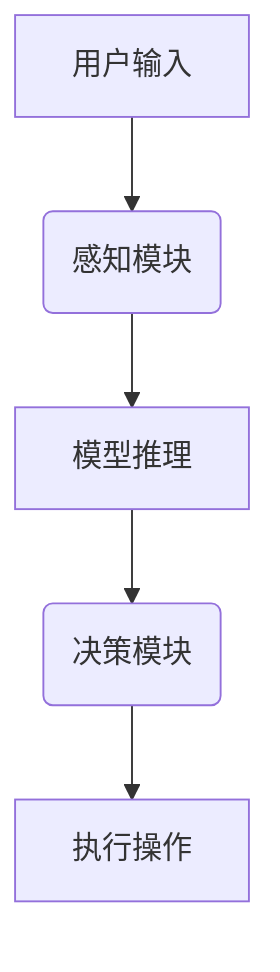
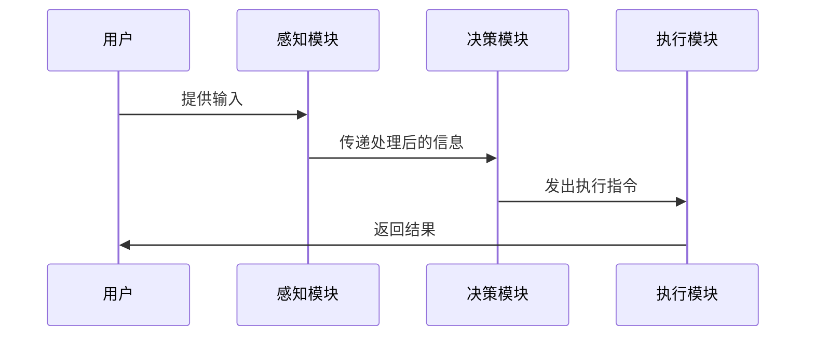

                 


# 移动端AI Agent：轻量化与性能的平衡

> 关键词：移动端AI Agent，轻量化，性能优化，模型压缩，强化学习，图神经网络

> 摘要：随着人工智能技术的快速发展，AI Agent在移动端的应用越来越广泛。然而，移动端设备的资源限制对AI Agent的性能提出了更高的要求。本文将探讨如何在移动端实现高效且轻量化的AI Agent，重点分析轻量化与性能平衡的关键技术，包括模型压缩、知识蒸馏、强化学习和图神经网络等。通过实际案例分析和系统架构设计，本文将为开发者提供实用的指导。

---

## 第一部分: 移动端AI Agent的背景与核心概念

### 第1章: 移动端AI Agent概述

#### 1.1 AI Agent的基本概念
- **1.1.1 什么是AI Agent**
  AI Agent是一种能够感知环境并采取行动以实现特定目标的智能实体。它能够通过与用户交互或环境反馈，自主决策并执行任务。
  
- **1.1.2 AI Agent的核心特征**
  - 感知能力：通过传感器或数据输入感知环境。
  - 决策能力：基于感知信息做出最优决策。
  - 行动能力：执行决策动作并影响环境。

- **1.1.3 移动端AI Agent的独特性**
  移动端AI Agent需要在资源受限的环境中运行，对计算效率和资源占用有更高要求。

#### 1.2 移动端AI Agent的应用场景
- **1.2.1 智能助手**
  例如，智能手机中的语音助手（如Siri、小爱同学）能够执行语音识别、语义理解等任务。
  
- **1.2.2 智慧教育**
  移动端AI Agent可以用于个性化学习推荐、实时答疑等场景。

- **1.2.3 智能客服**
  通过自然语言处理技术，AI Agent能够自动处理客户咨询、解决问题。

#### 1.3 轻量化与性能平衡的重要性
- **1.3.1 轻量化的定义**
  轻量化是指通过技术手段减少AI模型的体积和计算复杂度，使其能够在资源有限的设备上高效运行。

- **1.3.2 性能平衡的必要性**
  在保证模型性能的同时，降低资源消耗，确保AI Agent在移动端的流畅运行。

- **1.3.3 移动端资源限制对AI Agent的影响**
  移动端设备的计算能力、存储空间和网络带宽有限，对AI模型的运行效率提出了更高的要求。

---

### 第2章: 移动端AI Agent的核心技术

#### 2.1 模型压缩技术
- **2.1.1 知识蒸馏**
  知识蒸馏是一种通过教师模型指导学生模型学习的技术。教师模型通常是一个大模型，而学生模型是一个小模型。通过蒸馏过程，学生模型能够继承教师模型的知识，同时保持较小的模型规模。

- **2.1.2 参数剪枝**
  参数剪枝通过去除模型中冗余的参数或神经元，降低模型的复杂度。剪枝通常基于参数的重要性评分，优先保留对模型输出影响较大的参数。

- **2.1.3 量化技术**
  量化技术通过将模型中的浮点数参数转换为低比特位的整数（如8位整数），减少模型的存储空间和计算复杂度。

#### 2.2 模型优化策略
- **2.2.1 轻量化设计原则**
  在模型设计阶段，优先选择计算效率高、参数少的网络结构，例如使用轻量级的网络架构（如MobileNet、EfficientNet）。

- **2.2.2 模型裁剪与替换**
  对于复杂的模型，可以通过裁剪部分层或替换为更高效的层来降低模型复杂度。

- **2.2.3 动态计算优化**
  动态计算优化技术通过在推理过程中动态调整计算量，根据需求灵活分配计算资源。

#### 2.3 移动端AI框架的选择
- **2.3.1 TensorFlow Lite**
  TensorFlow Lite是Google推出的移动和嵌入式设备上的机器学习模型部署框架，支持多种模型压缩技术，适合移动端AI Agent的开发。

- **2.3.2 ONNX Runtime**
  ONNX Runtime是一个开放的模型交换格式，支持多种AI框架，具有良好的跨平台性和可扩展性。

- **2.3.3 其他轻量级框架**
  例如，TNN、NCNN等框架也在移动端AI开发中得到了广泛应用。

---

### 第3章: 移动端AI Agent的算法原理

#### 3.1 基于图神经网络的知识表示
- **3.1.1 图神经网络的基本原理**
  图神经网络通过节点和边的属性进行信息传播和特征聚合，能够有效处理图结构数据。

- **3.1.2 知识图谱的构建与表示**
  知识图谱是通过实体和关系构建的知识网络，图神经网络能够对知识图谱进行高效的表示和推理。

- **3.1.3 图嵌入算法**
  图嵌入算法通过将图中的节点映射到低维向量空间，降低计算复杂度的同时保留节点的语义信息。

#### 3.2 基于强化学习的决策优化
- **3.2.1 强化学习的基本概念**
  强化学习是一种通过试错机制学习最优策略的方法，适用于复杂的决策问题。

- **3.2.2 状态空间与动作空间的定义**
  在AI Agent的决策过程中，状态空间表示环境中的所有可能状态，动作空间表示Agent可执行的所有动作。

- **3.2.3 奖励函数的设计与优化**
  奖励函数用于评估Agent的动作是否符合预期目标，是强化学习算法的核心组件。

#### 3.3 模型压缩与加速算法
- **3.3.1 模型剪枝算法**
  模型剪枝通过去除模型中的冗余参数，降低模型复杂度。常用的剪枝方法包括L2正则化和梯度下降剪枝。

- **3.3.2 参数量化技术**
  参数量化通过将浮点数参数转换为低比特位的整数，减少模型的存储空间和计算复杂度。

- **3.3.3 知识蒸馏的实现细节**
  知识蒸馏的具体实现包括教师模型的构建、蒸馏损失函数的设计以及学生模型的训练策略。

---

### 第4章: 移动端AI Agent的系统架构设计

#### 4.1 系统功能模块划分
- **4.1.1 感知模块**
  感知模块负责接收用户输入或环境反馈，例如语音识别、图像识别等。

- **4.1.2 决策模块**
  决策模块基于感知模块提供的信息，通过模型推理生成决策结果。

- **4.1.3 执行模块**
  执行模块负责根据决策模块的输出执行具体操作，例如调用API、发送指令等。

#### 4.2 系统架构图


#### 4.3 系统接口设计
- **输入接口**
  支持多种输入方式，如语音输入、文本输入、图像输入等。

- **输出接口**
  支持多种输出方式，如文本输出、语音输出、动作执行等。

#### 4.4 系统交互流程图


---

## 第五部分: 项目实战与总结

### 第5章: 项目实战

#### 5.1 环境安装
- 安装Python和相关开发工具（如PyTorch、TensorFlow）。
- 安装移动端AI框架（如TensorFlow Lite、ONNX Runtime）。

#### 5.2 核心代码实现
以下是一个简单的AI Agent实现示例（基于TensorFlow Lite）：
```python
import tensorflow as tf
from tensorflow import keras
from tensorflow.keras import layers

# 定义模型结构
model = keras.Sequential([
    layers.Dense(64, activation='relu', input_shape=(input_dim,)),
    layers.Dense(output_dim, activation='softmax')
])

# 编译模型
model.compile(optimizer='adam', loss='sparse_categorical_crossentropy', metrics=['accuracy'])

# 训练模型
model.fit(x_train, y_train, epochs=10, batch_size=32)

# 导出为TensorFlow Lite模型
converter = tf.lite.TFLiteConverter.from_keras_model(model)
tflite_model = converter.convert()
```

#### 5.3 代码解读与分析
- **模型定义**：使用Keras API定义一个简单的多层感知机模型。
- **模型编译**：选择Adam优化器和交叉熵损失函数，同时监控准确率。
- **模型训练**：使用训练数据进行模型训练， epochs参数控制训练轮数，batch_size控制每批训练的数据量。
- **模型导出**：将训练好的Keras模型导出为TensorFlow Lite格式，适用于移动端部署。

#### 5.4 实际案例分析
以一个简单的智能助手为例，展示如何在移动端实现语音识别和语义理解功能。

#### 5.5 项目小结
通过实际项目，我们可以看到模型压缩和优化技术在移动端AI Agent中的重要性。合理选择模型结构和优化策略，能够在保证性能的同时，显著降低资源消耗。

---

## 第六部分: 总结与展望

### 6.1 总结
本文详细探讨了移动端AI Agent的轻量化与性能平衡的关键技术，包括模型压缩、知识蒸馏、强化学习和图神经网络等。通过理论分析和实际案例，展示了如何在移动端实现高效且轻量化的AI Agent。

### 6.2 注意事项
- 在实际项目中，需要根据具体需求选择合适的模型压缩技术。
- 模型优化是一个迭代过程，需要结合实际性能测试结果不断调整和优化。
- 注意模型压缩可能会影响模型的准确率，需要在性能和资源占用之间找到平衡点。

### 6.3 拓展阅读
- 《深度学习》—— Ian Goodfellow
- 《机器学习实战》—— 周志华
- 《神经网络与深度学习》—— 李航

---

作者：AI天才研究院 & 禅与计算机程序设计艺术

