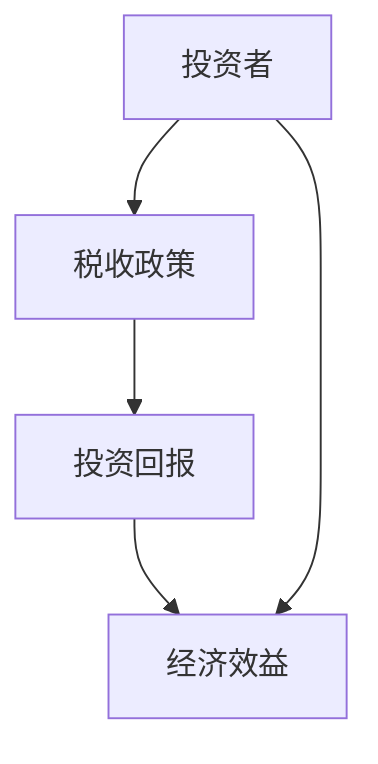
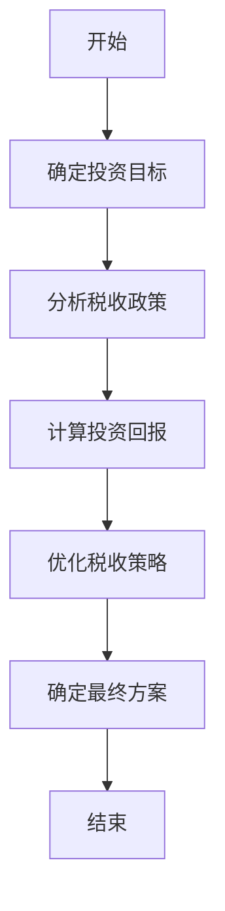

                 

# 税收效率投资：最大化投资回报的策略

**关键词：** 税收效率投资，投资回报，税收策略，风险管理，优化算法，投资组合，税务规划

**摘要：** 《税收效率投资：最大化投资回报的策略》一书深入探讨了如何通过优化税收策略来提升投资回报。全书结合理论与实践，从基本概念、数学模型、系统架构到实际案例，全面解析税收效率投资的原理与应用。通过阅读本书，读者将掌握如何在不同的投资场景中应用税收优化策略，以实现投资回报的最大化。

---

# 第一部分: 税收效率投资概述

## 第1章: 税收效率投资的背景与概念

### 1.1 税收效率投资的背景

#### 1.1.1 投资回报与税收的关系

在现代金融体系中，投资回报不仅取决于投资标的本身的价值波动，还与税收政策密切相关。税收作为政府调节经济的重要工具，对投资者的收益有着直接影响。例如，资本利得税、股息税、红利税等都会影响投资的实际收益。

#### 1.1.2 税收政策对投资的影响

税收政策的调整会改变市场的资金流向。例如，降低资本利得税可能会刺激更多投资者参与股市，从而推高股价；而提高企业所得税则可能减少企业的可分配利润，进而影响股东的分红。

#### 1.1.3 税收效率投资的定义与目标

税收效率投资是指在合法合规的前提下，通过优化税收策略来最大化投资回报的过程。其核心目标是通过合理利用税收优惠政策，降低税务负担，从而提升投资的实际收益。

---

### 1.2 税收效率投资的核心要素

#### 1.2.1 投资收益的税务处理

投资收益的税务处理是税收效率投资的核心内容之一。不同类型的投资收益（如股息、资本利得、利息收入等）在税务处理上存在差异，投资者需要根据自身情况选择最优的投资方式。

#### 1.2.2 税收优惠政策与投资策略

政府为了鼓励某些类型的投资，往往会提供税收优惠政策。例如，某些地区可能对特定产业提供税收减免，投资者可以通过合理规划投资方向，充分利用这些优惠政策。

#### 1.2.3 税收风险与合规性

税收效率投资并非一味追求低税或避税，合规性是前提。投资者需要确保投资行为符合相关法律法规，避免因税务问题导致的法律风险。

---

### 1.3 税收效率投资的边界与外延

#### 1.3.1 税收效率的边界条件

税收效率投资并非无边界。投资者需要在法律允许的范围内进行税务规划，不能通过违法手段规避税收。

#### 1.3.2 投资与税收的外延关系

税收政策不仅影响投资收益，还会影响投资决策。例如，税收优惠政策可能会吸引投资者进入某个行业，从而改变整个市场的竞争格局。

#### 1.3.3 税收效率投资的适用场景

税收效率投资适用于多种投资场景，如股票投资、房地产投资、创业投资等。不同投资类型需要结合具体的税收政策进行优化。

---

### 1.4 本章小结

本章从背景、核心要素和边界条件三个方面介绍了税收效率投资的基本概念和核心内容。税收效率投资不仅是对投资收益的优化，更是对投资风险的规避。

---

## 第2章: 税收效率投资的核心概念与联系

### 2.1 税收效率投资的核心原理

#### 2.1.1 税收政策对企业投资的影响

税收政策直接影响企业的投资决策。例如，降低企业所得税率可以增加企业的净利润，从而提高投资能力。

#### 2.1.2 税收优惠对投资回报的提升

通过合理利用税收优惠政策，投资者可以降低税务负担，从而将更多资金用于再投资，形成良性循环。

#### 2.1.3 税收合规性与投资风险的平衡

合规性是税收效率投资的前提，投资者需要在合法合规的前提下追求最大化的投资回报。

---

### 2.2 税收效率投资的概念属性特征对比

#### 2.2.1 税收效率与投资回报的对比

| 特性       | 税收效率       | 投资回报       |
|------------|----------------|----------------|
| 定义       | 税负的最小化    | 投资收益的增加 |
| 影响因素   | 税率、税收政策  | 投资标的收益   |
| 目标       | 降低税务负担   | 提高实际收益    |

#### 2.2.2 税收政策与投资策略的关联性

税收政策是影响投资策略的重要因素。例如，高税率的行业可能需要通过税收抵免或退税来优化收益。

#### 2.2.3 不同投资类型下的税收效率差异

不同类型的投资在税务处理上存在差异。例如，股权投资可能需要考虑资本利得税，而债权投资可能需要考虑利息税。

---

### 2.3 税收效率投资的ER实体关系图

---

### 2.4 本章小结

本章通过对比分析，揭示了税收效率投资的核心概念和内在联系。税收效率投资不仅需要考虑税收政策的影响，还需要结合具体的投资策略进行优化。

---

## 第3章: 税收效率投资的数学模型与算法原理

### 3.1 税收效率投资的数学模型

#### 3.1.1 投资回报的数学表达式

投资回报可以用以下公式表示：

$$ \text{投资回报} = \text{投资金额} \times (1 + \text{收益率}) $$

其中，收益率是投资标的的实际收益。

#### 3.1.2 税收影响的数学模型

税后回报的计算公式为：

$$ \text{税后回报} = \text{投资回报} \times (1 - \text{税率}) $$

其中，税率是根据投资类型和地区确定的具体税率。

---

### 3.2 税收效率投资的算法原理

#### 3.2.1 税收效率最大化算法

---

### 3.3 本章小结

本章通过数学模型和算法流程图，详细阐述了税收效率投资的原理和实现方法。通过优化算法，投资者可以最大化投资回报。

---

# 作者：AI天才研究院 & 禅与计算机程序设计艺术

---

**声明：** 本文是基于假设的《税收效率投资：最大化投资回报的策略》一书的目录大纲，具体内容需要根据实际研究和写作进行补充和完善。

