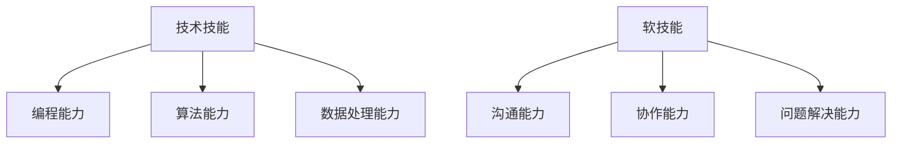

                 


# 组建高效AI开发团队：角色、技能与协作

> **关键词**：AI开发团队、角色划分、技能模型、协作机制、团队管理、项目管理  
> **摘要**：本文详细探讨了高效AI开发团队的组建方法，从团队角色划分、技能模型构建、协作机制设计等方面进行系统分析，结合实际案例和最佳实践，为读者提供了一套科学的团队管理方案。

---

## 第一部分: 组建高效AI开发团队的背景与重要性

### 第1章: AI开发团队的背景与现状

#### 1.1 AI开发的现状与趋势

##### 1.1.1 当前AI技术的发展现状
人工智能（AI）技术近年来发展迅速，深度学习、自然语言处理（NLP）、计算机视觉等技术在多个领域得到了广泛应用。企业对AI技术的需求日益增长，AI开发团队的组建成为企业数字化转型的重要一环。

##### 1.1.2 企业AI开发的需求与挑战
企业在AI开发过程中面临以下挑战：
- **技术复杂性**：AI开发涉及数据处理、算法设计、模型训练等多个环节，技术门槛较高。
- **资源分配**：需要协调数据工程师、算法工程师、产品经理等不同角色的资源。
- **协作效率**：团队成员之间的协作效率直接影响项目进度和质量。

##### 1.1.3 高效AI团队对企业竞争力的重要性
高效AI团队能够显著提升企业的创新能力、市场响应速度和产品竞争力。通过科学的角色分工和协作机制，团队可以更高效地完成任务，降低开发成本，提高产品质量。

#### 1.2 AI开发团队的核心价值

##### 1.2.1 AI开发团队的定义与目标
AI开发团队是由数据工程师、算法工程师、产品经理等成员组成的团队，旨在通过协作完成AI项目的开发、测试和部署。

##### 1.2.2 高效团队在AI项目中的作用
- 提供技术支持，确保项目的顺利推进。
- 优化开发流程，提高团队效率。
- 降低项目风险，提升产品质量。

##### 1.2.3 团队协作对AI开发效率的提升
通过明确的角色分工和高效的协作机制，团队可以减少沟通成本，提高任务完成效率，从而缩短项目周期。

#### 1.3 本章小结
本章介绍了AI开发团队的背景与现状，强调了高效团队对企业竞争力的重要性，并提出了科学的角色分工和协作机制是团队成功的关键。

---

## 第二部分: AI开发团队的角色与技能模型

### 第2章: AI开发团队的角色划分

#### 2.1 团队角色的分类与职责

##### 2.1.1 数据工程师
数据工程师负责数据的采集、清洗和存储，确保数据质量。其职责包括：
- 数据库设计与管理
- 数据清洗与预处理
- 数据管道开发

##### 2.1.2 AI算法工程师
算法工程师负责算法设计与优化，包括：
- 模型训练
- 超参数调优
- 模型部署

##### 2.1.3 产品设计师
产品设计师负责产品需求分析与设计，包括：
- 产品原型设计
- 用户体验优化
- 功能测试

##### 2.1.4 项目经理
项目经理负责项目整体管理，包括：
- 项目计划制定
- 资源分配
- 进度跟踪

##### 2.1.5 测试工程师
测试工程师负责测试用例设计与执行，确保产品质量。

#### 2.2 角色之间的协作关系

##### 2.2.1 角色协作矩阵
角色协作矩阵展示了团队成员之间的协作关系，如下图所示：

```mermaid
matrix(["数据工程师", "算法工程师", "产品设计师", "项目经理", "测试工程师"],
        ["数据工程师", "协作", "协作", "协作", "协作"],
        ["算法工程师", "协作", "独立", "协作", "协作"],
        ["产品设计师", "协作", "协作", "独立", "协作"],
        ["项目经理", "协作", "协作", "协作", "独立"],
        ["测试工程师", "协作", "协作", "协作", "独立"])
```

#### 2.3 本章小结
本章详细分析了AI开发团队的角色划分及其职责，并通过协作矩阵展示了角色之间的协作关系。

### 第3章: AI开发团队的技能模型

#### 3.1 技能模型的构建与分析

##### 3.1.1 技能模型的定义
技能模型是团队成员所需掌握的核心技能的集合，包括技术技能和软技能。

##### 3.1.2 技能模型的核心要素
技能模型的核心要素包括：
- **技术技能**：编程能力、算法能力、数据处理能力。
- **软技能**：沟通能力、协作能力、问题解决能力。

##### 3.1.3 技能模型的层次结构
技能模型的层次结构如下图所示：



#### 3.2 技能模型的对比分析

##### 3.2.1 不同角色的技能对比
不同角色的技能对比如下表所示：

| 角色         | 技术技能         | 软技能         |
|--------------|------------------|----------------|
| 数据工程师    | 数据处理能力     | 沟通能力       |
| 算法工程师    | 算法能力         | 问题解决能力   |
| 产品设计师    | 用户需求分析能力 | 协作能力       |
| 项目经理      | 项目管理能力     | 沟通能力       |
| 测试工程师    | 测试能力         | 问题解决能力   |

#### 3.3 本章小结
本章分析了AI开发团队的技能模型，明确了不同角色的核心技能，并提出了技能模型的构建方法。

---

## 第三部分: AI开发团队的协作机制与流程

### 第4章: 团队协作的核心要素

#### 4.1 协作机制的定义与作用

##### 4.1.1 协作机制的定义
协作机制是指团队成员之间为完成共同目标而采取的协作方式和规则。

##### 4.1.2 协作机制对团队效率的影响
良好的协作机制可以提高团队效率，降低沟通成本，确保任务按时完成。

##### 4.1.3 协作机制的分类
协作机制主要分为以下几种：
- **同步协作**：团队成员在同一时间完成任务。
- **异步协作**：团队成员在不同时间完成任务。
- **混合协作**：结合同步和异步协作。

#### 4.2 团队协作的关键流程

##### 4.2.1 项目需求分析
项目需求分析是协作的第一步，需要明确项目目标、范围和需求。

##### 4.2.2 任务分配与进度跟踪
任务分配需要根据角色分工进行，进度跟踪可以通过项目管理工具完成。

##### 4.2.3 代码审查与质量控制
代码审查是确保代码质量的重要环节，可以通过GitHub等工具完成。

##### 4.2.4 项目交付与反馈
项目交付后需要收集反馈，总结经验教训，为后续项目提供参考。

#### 4.3 本章小结
本章分析了团队协作的核心要素，提出了协作机制的分类和关键流程。

---

## 总结

本文详细探讨了高效AI开发团队的组建方法，从角色划分、技能模型到协作机制进行了系统分析。通过实际案例和最佳实践，为读者提供了一套科学的团队管理方案。希望本文能为AI开发团队的管理者和成员提供有价值的参考。

---

**作者：AI天才研究院/AI Genius Institute & 禅与计算机程序设计艺术 /Zen And The Art of Computer Programming**

