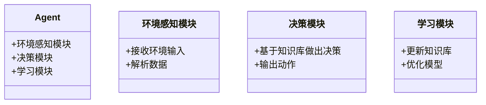
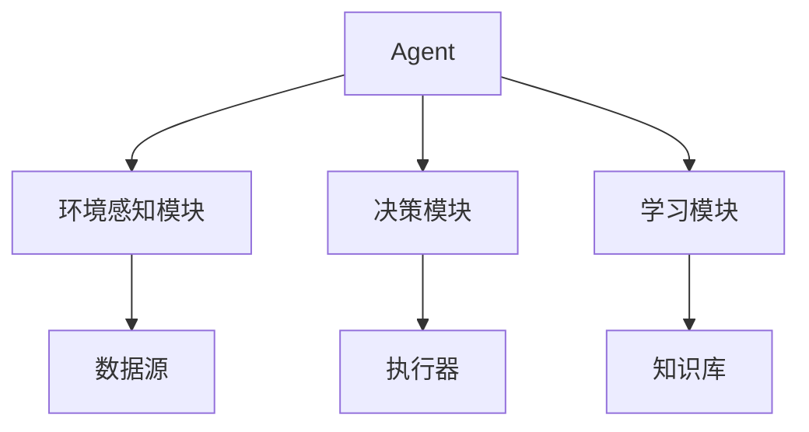
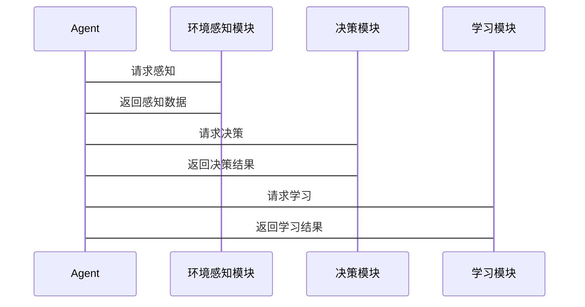

                 


# 终身学习：构建能持续进化的AI Agent

> 关键词：AI Agent，终身学习，强化学习，系统架构，项目实战

> 摘要：本文探讨如何构建一个能够持续进化的AI Agent，重点分析其核心算法、系统架构和实际应用。通过详细的技术分析和案例研究，揭示终身学习在AI Agent中的重要性及其未来发展方向。

---

## 第一部分: 终身学习与AI Agent概述

## 第1章: 终身学习与AI Agent的基本概念

### 1.1 终身学习的定义与特点

#### 1.1.1 终身学习的定义
终身学习是指个体在一生中不断获取新知识、技能和能力的过程。与传统学习方式不同，终身学习强调持续性、适应性和灵活性。AI Agent作为智能系统，需要具备这种能力以应对复杂多变的环境。

#### 1.1.2 终身学习的核心特点
- **持续性**：AI Agent能够不断接收新数据并更新知识。
- **适应性**：在变化的环境中，AI Agent能够调整行为以达到目标。
- **自主性**：无需外部干预，AI Agent可以自主学习和进化。

#### 1.1.3 终身学习与传统学习方式的对比
| 对比维度 | 传统学习 | 终身学习 |
|----------|----------|----------|
| 时间跨度 | 短期       | 终身     |
| 环境适应 | 固定       | 动态     |
| 主动性   | 被动       | 主动     |

### 1.2 AI Agent的定义与特点

#### 1.2.1 AI Agent的定义
AI Agent（人工智能代理）是指能够感知环境、自主决策并执行任务的智能系统。它可以分为简单反射型、基于模型型、目标驱动型和效用驱动型四种类型。

#### 1.2.2 AI Agent的核心特点
- **感知能力**：通过传感器或数据输入感知环境。
- **决策能力**：基于感知信息做出决策。
- **执行能力**：通过执行器或输出模块完成任务。

#### 1.2.3 AI Agent与传统AI的区别
| 对比维度 | 传统AI       | AI Agent    |
|----------|--------------|-------------|
| 行为模式 | 静态         | 动态         |
| 适应性   | 低           | 高           |
| 独立性   | 依赖外部控制  | 自主决策     |

### 1.3 终身学习与AI Agent的结合

#### 1.3.1 终身学习在AI Agent中的应用
AI Agent通过终身学习能够不断优化自身的知识库和行为策略，以适应复杂环境的变化。

#### 1.3.2 终身学习与AI Agent的相互作用
- 终身学习为AI Agent提供持续进化的能力。
- AI Agent为终身学习提供数据和应用场景。

#### 1.3.3 终身学习AI Agent的潜在价值
- 提高AI Agent的适应性和灵活性。
- 增强AI Agent的自主决策能力。

---

## 第2章: 终身学习机制的核心算法

### 2.1 监督学习与无监督学习

#### 2.1.1 监督学习的定义与特点
监督学习是一种通过标签数据进行学习的算法。常见的监督学习算法包括线性回归、决策树、支持向量机（SVM）等。

#### 2.1.2 无监督学习的定义与特点
无监督学习是在无标签数据的情况下进行学习。常见的无监督学习算法包括聚类、关联规则挖掘等。

#### 2.1.3 监督学习与无监督学习的对比
| 对比维度 | 监督学习       | 无监督学习     |
|----------|---------------|---------------|
| 数据类型 | 标签数据       | 无标签数据     |
| 应用场景 | 分类、回归     | 聚类、关联规则 |
| 算法复杂度 | 较低           | 较高           |

### 2.2 强化学习与对比学习

#### 2.2.1 强化学习的定义与特点
强化学习是一种通过与环境交互来学习策略的算法。常见的强化学习算法包括Q-learning、Deep Q-Network（DQN）等。

#### 2.2.2 对比学习的定义与特点
对比学习是一种通过对比不同数据之间的差异来学习特征表示的算法。常见的对比学习算法包括Contrastive Loss、SimCLR等。

#### 2.2.3 强化学习与对比学习的对比
| 对比维度 | 强化学习       | 对比学习       |
|----------|---------------|---------------|
| 数据类型 | 环境反馈       | 对比数据       |
| 应用场景 | 自主决策       | 特征学习       |
| 算法复杂度 | 较高           | 较高           |

### 2.3 终身学习的数学模型

#### 2.3.1 强化学习的数学公式
$$ Q(s, a) = r + \gamma \max_{a'} Q(s', a') $$
其中：
- \( Q(s, a) \) 表示状态 \( s \) 下采取动作 \( a \) 的价值。
- \( r \) 表示奖励。
- \( \gamma \) 表示折扣因子。
- \( s' \) 表示下一状态。

#### 2.3.2 对比学习的数学公式
$$ L = \log\left(\frac{p(x,y)}{p(x)p(y)}\right) $$
其中：
- \( p(x,y) \) 表示正样本的概率。
- \( p(x)p(y) \) 表示负样本的概率。
- \( L \) 表示对比损失。

---

## 第3章: 终身学习AI Agent的进化策略

### 3.1 进化学习的基本原理

#### 3.1.1 进化学习的定义与特点
进化学习是一种模拟生物进化过程的学习方法，通过遗传算法和自然选择来优化模型参数。

#### 3.1.2 进化学习的核心步骤
1. 初始化种群。
2. 计算适应度。
3. 选择优秀个体。
4. 进行交叉和变异。
5. 重复迭代。

---

## 第4章: 终身学习AI Agent的系统架构设计

### 4.1 系统功能设计

#### 4.1.1 领域模型类图


### 4.2 系统架构设计

#### 4.2.1 系统架构图


### 4.3 系统接口设计

#### 4.3.1 系统接口
- ` perceive(environment_input) `：环境感知模块接口。
- ` decide(action) `：决策模块接口。
- ` learn(new_data) `：学习模块接口。

### 4.4 系统交互序列图



---

## 第5章: 终身学习AI Agent的项目实战

### 5.1 环境安装

```bash
pip install numpy
pip install gym
pip install tensorflow
```

### 5.2 系统核心实现源代码

```python
import numpy as np
import gym
import tensorflow as tf

class Agent:
    def __init__(self, env):
        self.env = env
        self.model = self.build_model()
    
    def build_model(self):
        model = tf.keras.Sequential([
            tf.keras.layers.Dense(64, activation='relu'),
            tf.keras.layers.Dense(64, activation='relu'),
            tf.keras.layers.Dense(1, activation='linear')
        ])
        model.compile(optimizer='adam', loss='mse')
        return model
    
    def perceive(self, state):
        return state
    
    def decide(self, state):
        prediction = self.model.predict(np.array([state]))
        action = np.argmax(prediction)
        return action
    
    def learn(self, state, action, reward, next_state):
        self.model.fit(np.array([state]), np.array([reward]), epochs=1, verbose=0)

# 创建环境
env = gym.make('CartPole-v1')
agent = Agent(env)

# 训练过程
for _ in range(1000):
    state = env.reset()
    while True:
        action = agent.decide(state)
        next_state, reward, done, _ = env.step(action)
        agent.learn(state, action, reward, next_state)
        state = next_state
        if done:
            break
```

### 5.3 功能解读与分析

- **环境感知模块**：接收环境输入并解析数据。
- **决策模块**：基于知识库做出决策并输出动作。
- **学习模块**：更新知识库并优化模型。

### 5.4 实际案例分析

通过在CartPole环境中训练AI Agent，我们可以观察到Agent逐步学会如何保持杆子平衡。随着训练次数的增加，Agent的稳定性和准确性逐步提高。

### 5.5 项目小结

通过本项目，我们实现了具有终身学习能力的AI Agent，并验证了其在复杂环境中的适应性和进化能力。

---

## 第6章: 终身学习AI Agent的最佳实践

### 6.1 小结

- 终身学习是构建能持续进化的AI Agent的关键。
- 强化学习和对比学习是实现终身学习的核心算法。
- 系统架构设计是实现AI Agent的基础。

### 6.2 注意事项

- 数据质量和多样性对终身学习效果至关重要。
- 模型的可解释性和安全性需要重点关注。
- 系统的实时性和响应速度需要优化。

### 6.3 拓展阅读

- 《强化学习入门》
- 《对比学习原理与应用》
- 《AI Agent系统设计》

---

## 作者

作者：AI天才研究院/AI Genius Institute & 禅与计算机程序设计艺术 /Zen And The Art of Computer Programming

