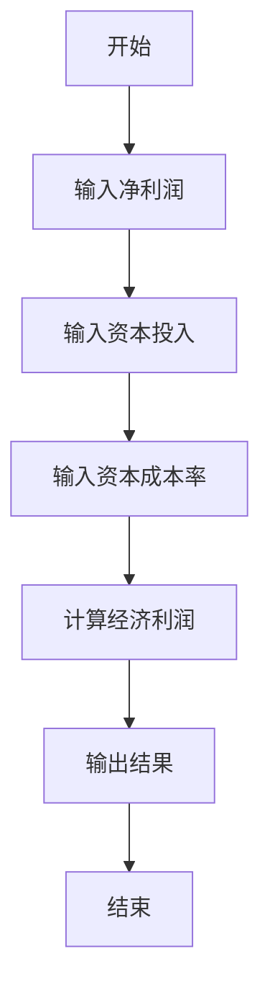
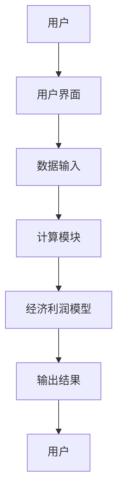

                 


# 经济利润模型：衡量真实价值创造的工具

## 关键词：经济利润模型、价值创造、投资评估、企业绩效、财务分析

## 摘要：  
经济利润模型（Economic Profit Model）是一种衡量企业或个人真实价值创造的工具，它通过计算经济利润（Economic Profit）来揭示创造的超额利润。本文将详细探讨经济利润模型的背景、核心概念、算法原理、系统架构设计、项目实战以及最佳实践，帮助读者全面理解这一模型的应用与价值。

---

## 第一部分: 经济利润模型的背景与基础

### 第1章: 经济利润模型概述

#### 1.1 经济利润模型的定义与核心概念  
经济利润模型是一种基于经济学原理的价值衡量工具，旨在量化企业在一定时间内创造的超额利润。其核心概念包括：  
1. **经济利润**：扣除所有成本（包括显性成本和隐性成本）后的净收益。  
2. **超额利润**：企业实际创造的利润与投入资本的最低预期回报之间的差额。  
3. **价值创造**：通过经济利润模型，可以衡量企业是否为股东创造了超过资本成本的价值。  

#### 1.2 经济利润模型的理论基础  
经济利润模型的理论基础来源于经济学中的成本收益分析和资本预算理论。它强调了以下几个关键点：  
1. **成本的全面性**：不仅包括会计利润中的显性成本，还包括隐性成本（如机会成本）。  
2. **资本成本**：资本的使用是有成本的，这部分成本需要从利润中扣除。  
3. **超额收益**：只有当企业创造的利润超过资本成本时，才能认为企业创造了价值。  

#### 1.3 经济利润模型的应用场景  
经济利润模型广泛应用于企业绩效评估、投资决策、行业竞争分析和个人价值创造的衡量。例如：  
- **企业绩效评估**：通过经济利润模型，企业可以衡量其真实的价值创造能力。  
- **投资决策**：投资者可以通过经济利润模型评估投资项目的真实收益。  
- **行业竞争分析**：通过比较不同企业的经济利润，可以评估行业内的竞争状况。  

#### 1.4 经济利润模型的局限性  
尽管经济利润模型有其独特的优势，但也存在一些局限性：  
1. **数据依赖性**：模型的准确性依赖于数据的完整性和准确性。  
2. **假设简化**：模型假设市场是完全竞争的，这与现实可能存在差异。  
3. **时间跨度**：短期经济利润可能无法反映企业的长期价值创造能力。  
4. **外部因素**：模型难以完全考虑外部经济波动等不可控因素。  

### 第2章: 经济利润模型的核心概念与联系

#### 2.1 经济利润模型的核心原理  
经济利润模型的核心原理是通过计算企业的经济利润，衡量其创造的超额价值。其计算公式为：  
$$ \text{经济利润} = \text{净利润} - (\text{资本投入} \times \text{资本成本率}) $$  
其中，净利润为企业会计利润，资本投入为企业投入的资本总额，资本成本率是资本的机会成本。  

#### 2.2 核心概念的属性特征对比  
以下是经济利润模型与会计利润和其他价值衡量工具的对比表格：  

| 对比维度       | 经济利润模型                | 会计利润                 | 其他价值衡量工具（如ROE）       |
|----------------|-----------------------------|--------------------------|---------------------------------|
| 定义           | 扣除资本成本后的净利润     | 未扣除资本成本的净利润   | 股东权益与净利润的比率         |
| 适用场景       | 评估企业的真实价值创造     | 评估企业财务表现         | 评估企业资本效率             |
| 优缺点         | 更准确，但依赖数据和假设   | 易计算，但忽略资本成本   | 易受资本结构影响             |

#### 2.3 经济利润模型的ER实体关系图  
以下是经济利润模型的ER实体关系图：  

```mermaid
erd
    管理员
    管理员 -- 创建/更新: 经济利润计算
    经济利润计算 <-- 计算规则
    经济利润计算 --> 企业
    企业 <-- 关联: 资本投入
    企业 <-- 关联: 净利润
    企业 <-- 关联: 资本成本率
```

---

## 第二部分: 经济利润模型的算法原理

### 第3章: 经济利润模型的算法原理

#### 3.1 经济利润计算的算法流程  
以下是经济利润计算的算法流程图：  



#### 3.2 经济利润模型的数学模型  
经济利润模型的核心公式可以表示为：  
$$ \text{经济利润} = \text{净利润} - (\text{资本投入} \times \text{资本成本率}) $$  

#### 3.3 经济利润模型的代码实现  
以下是经济利润模型的Python代码实现：  

```python
def calculate_economic_profit(net_profit, capital_investment, capital_cost_rate):
    economic_profit = net_profit - (capital_investment * capital_cost_rate)
    return economic_profit

# 示例
net_profit = 1000000  # 净利润
capital_investment = 5000000  # 资本投入
capital_cost_rate = 0.08  # 资本成本率

result = calculate_economic_profit(net_profit, capital_investment, capital_cost_rate)
print(f"经济利润为：{result} 元")
```

---

## 第三部分: 经济利润模型的系统架构设计

### 第4章: 经济利润模型的系统架构设计

#### 4.1 系统功能设计  
以下是经济利润模型的系统功能设计：  


#### 4.2 系统架构设计  
以下是经济利润模型的系统架构图：  



---

## 第四部分: 经济利润模型的项目实战

### 第5章: 经济利润模型的项目实战

#### 5.1 项目背景  
本项目旨在通过经济利润模型，帮助企业评估其真实价值创造能力。  

#### 5.2 项目核心实现  
以下是经济利润模型的Python代码实现：  

```python
class EconomicProfitModel:
    def __init__(self, net_profit, capital_investment, capital_cost_rate):
        self.net_profit = net_profit
        self.capital_investment = capital_investment
        self.capital_cost_rate = capital_cost_rate

    def calculate_economic_profit(self):
        return self.net_profit - (self.capital_investment * self.capital_cost_rate)

# 示例
epm = EconomicProfitModel(1000000, 5000000, 0.08)
print(f"经济利润为：{epm.calculate_economic_profit()} 元")
```

#### 5.3 项目应用与分析  
通过上述代码，我们可以计算出企业的经济利润。例如，当净利润为1,000,000元，资本投入为5,000,000元，资本成本率为8%时，经济利润为：  
$$ 1,000,000 - (5,000,000 \times 0.08) = 1,000,000 - 400,000 = 600,000 \text{元} $$  

---

## 第五部分: 经济利润模型的最佳实践与总结

### 第6章: 经济利润模型的最佳实践

#### 6.1 经济利润模型的应用技巧  
1. 确保输入数据的准确性和完整性。  
2. 合理估算资本成本率，避免低估或高估。  
3. 结合行业基准进行横向比较。  

#### 6.2 经济利润模型的优化建议  
1. 考虑通货膨胀对资本成本的影响。  
2. 结合其他价值衡量工具（如ROE）进行综合评估。  
3. 定期更新模型参数，以反映市场变化。  

### 第7章: 总结与展望

#### 7.1 总结  
经济利润模型是一种强大的工具，能够帮助企业准确衡量其价值创造能力。通过计算经济利润，企业可以更好地理解其真实盈利能力，并做出更明智的决策。  

#### 7.2 展望  
未来，随着数据科学和人工智能技术的发展，经济利润模型将更加智能化和精准化。通过结合大数据分析，企业可以更好地优化其价值创造过程。  

---

## 作者：AI天才研究院 & 禅与计算机程序设计艺术

本文作者：AI天才研究院（AI Genius Institute）与“禅与计算机程序设计艺术”（Zen And The Art of Computer Programming）联合创作。

