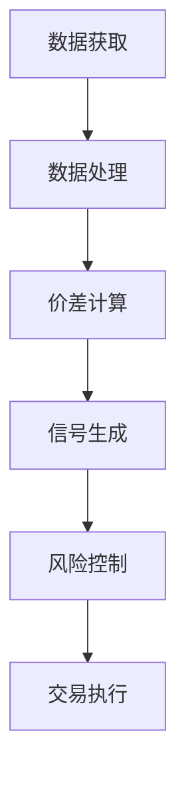

                 


# 统计套利：利用价格偏离进行中性市场投资

> 关键词：统计套利，价格偏离，中性市场投资，配对交易，风险管理

> 摘要：统计套利是一种利用金融资产价格偏离均值的中性投资策略，通过数学建模和算法实现，捕捉市场中的短期定价错误。本文详细探讨统计套利的背景、核心概念、算法实现、系统设计、实战案例以及风险管理，为读者提供全面的指导。

---

## 第一部分: 统计套利的背景与核心概念

### 第1章: 统计套利的定义与背景

#### 1.1 统计套利的定义
统计套利是一种基于统计学和数学模型的投资策略，利用金融资产价格的短期偏离均值来获利。与传统投机不同，统计套利通过量化分析，寻找市场中的定价错误，并在价格回归均值时进行交易。

#### 1.2 统计套利的基本原理
统计套利的核心在于均值回归理论，即价格偏离均值后会回归。通过建立数学模型，投资者可以在价格偏离时建立头寸，等待价格回归时获利。

#### 1.3 统计套利的优势与局限性
优势：中性市场风险，依赖数学模型，适合量化交易。
局限性：依赖历史数据，模型可能失效，交易成本影响收益。

### 第2章: 统计套利的核心概念

#### 2.1 统计套利的核心理论
- **有效市场假说**：市场是否有效影响统计套利的可行性。
- **均值回归理论**：价格偏离均值后回归的统计特性。
- **市场中性策略**：通过做多和做空平衡市场风险。

#### 2.2 统计套利的数学模型
- **CAPM模型**：$$E(R_i) = R_f + \beta_i (E(R_m) - R_f)$$
- **APT模型**：$$E(R_i) = \alpha_i + \beta_i R_p + \epsilon_i$$
- **GARCH模型**：用于估计波动性。

### 第3章: 统计套利的主要策略

#### 3.1 配对交易策略
- **定义**：同时买入低估资产，卖出高估资产。
- **步骤**：
  1. 选择相关资产。
  2. 计算价差。
  3. 建立回归模型。
  4. 生成交易信号。
  5. 执行交易并监控。

#### 3.2 价差回归策略
- **定义**：基于价差的均值回归。
- **步骤**：
  1. 计算资产价差。
  2. 建立回归模型。
  3. 判断偏离程度。
  4. 执行交易。

---

## 第二部分: 统计套利的算法与系统设计

### 第4章: 统计套利的算法实现

#### 4.1 算法流程
1. **数据获取与预处理**：清洗数据，处理缺失值。
2. **价差计算与建模**：计算价差，建立回归模型。
3. **信号生成与交易决策**：判断价差偏离，生成交易信号。

#### 4.2 Python实现示例
```python
import pandas as pd
import numpy as np

# 示例数据
data = pd.DataFrame({'A': [100, 102, 98, 101], 'B': [90, 92, 88, 91]})

# 计算价差
spread = data['A'] - data['B']

# 均值回归模型
mean_spread = spread.mean()
std_spread = spread.std()

# 生成信号
threshold = mean_spread + 2 * std_spread
signal = np.where(spread > threshold, -1, np.where(spread < mean_spread, 1, 0))
```

### 第5章: 统计套利的系统架构设计

#### 5.1 系统组成
- 数据获取模块：获取历史数据。
- 信号生成模块：计算价差，生成交易信号。
- 风险控制模块：管理头寸，控制风险。
- 交易执行模块：根据信号执行交易。

#### 5.2 系统架构图


---

## 第三部分: 统计套利的实战与风险管理

### 第7章: 统计套利的实战案例

#### 7.1 实战案例
- **案例**：构建配对交易系统。
- **环境安装**：安装Python、Pandas、NumPy。
- **数据获取**：从Yahoo Finance获取股票数据。
- **信号生成**：计算价差，判断偏离。
- **回测分析**：评估策略收益与风险。

#### 7.2 风险管理
- **风险来源**：市场风险、模型风险、交易成本。
- **风险管理策略**：
  1. 设置止损点。
  2. 调整头寸规模。
  3. 定期重新评估模型。

### 第8章: 统计套利的风险管理与小结

#### 8.1 风险管理
- **监控与调整**：定期评估策略表现，调整参数。
- **应对策略**：市场变化时，及时调整模型。

#### 8.2 小结
统计套利通过数学模型捕捉价格偏离，实现中性投资。然而，需注意模型的有效性和交易成本。未来，结合机器学习优化统计套利策略。

---

## 结语

统计套利利用价格偏离进行中性投资，通过数学模型和算法实现量化交易。本文详细探讨了统计套利的背景、理论、算法、系统设计和实战案例，为读者提供了全面的指导。

---

作者：AI天才研究院/AI Genius Institute & 禅与计算机程序设计艺术 /Zen And The Art of Computer Programming

