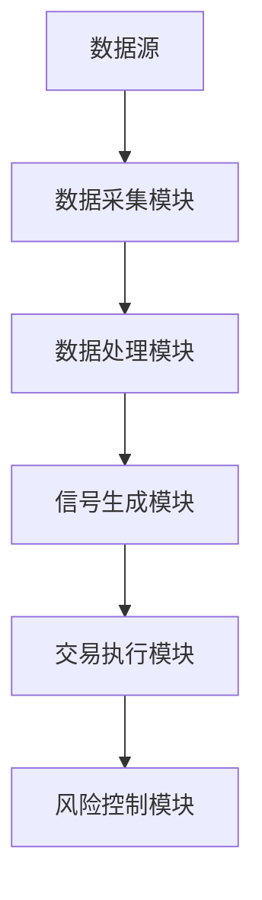

                 


# 统计套利：利用价格偏离进行中性市场投资

> 关键词：统计套利，价格偏离，中性投资，均值回归，配对交易，风险控制，套利机会

> 摘要：统计套利是一种利用市场中价格偏离进行投资的策略，通过对价格差的统计分析，寻找套利机会，并通过中性投资策略来实现风险控制和收益最大化。本文将从统计套利的基本概念出发，结合数学模型和算法原理，详细讲解统计套利的实现过程，并通过实际案例分析，帮助读者理解统计套利的应用与实践。

---

## 第一部分: 统计套利的基本概念

### 第1章: 统计套利的定义与背景

#### 1.1 套利的定义与分类
套利是指利用市场中价格差异进行无风险或低风险投资，以获取利润的交易策略。统计套利是套利的一种形式，通过统计学方法寻找价格偏离的机会。

#### 1.2 统计套利的起源与发展
统计套利起源于20世纪80年代，随着金融市场的发展和计算机技术的进步，统计套利逐渐成为一种重要的投资策略。

#### 1.3 统计套利的核心思想
统计套利的核心思想是通过统计分析发现市场中的价格偏离，利用这些偏离进行套利交易，同时保持投资组合的中性，以降低市场风险。

---

## 第2章: 统计套利的核心概念与联系

### 2.1 统计套利的原理
统计套利的核心原理是基于均值回归理论，认为市场价格会围绕其均值波动，当价格偏离均值时，存在套利机会。

#### 2.1.1 均值回归模型
$$ y_t = \alpha + \beta x_t + \epsilon_t $$

其中，$y_t$ 是目标变量，$x_t$ 是解释变量，$\alpha$ 是截距，$\beta$ 是回归系数，$\epsilon_t$ 是误差项。

#### 2.1.2 配对交易策略
配对交易是统计套利的一种常见策略，通过配对两只相关资产，利用它们的价格差异进行交易。

### 2.2 统计套利的数学模型

#### 2.2.1 价差的计算
$$ \text{价差} = \text{资产A的价格} - \text{资产B的价格} $$

#### 2.2.2 均值回归模型的应用
$$ \text{预测价差} = \mu + \beta (\text{当前价差} - \mu) $$

其中，$\mu$ 是均值，$\beta$ 是回归系数。

#### 2.2.3 风险控制
统计套利中，风险控制是关键。常用的风险控制方法包括头寸限制、止损策略和VaR（Value at Risk）模型。

---

## 第3章: 统计套利的算法原理

### 3.1 均值回归模型的实现

#### 3.1.1 算法步骤
1. 数据采集：收集相关资产的历史价格数据。
2. 计算价差：计算资产对的价差序列。
3. 均值回归分析：计算价差的均值和标准差，判断当前价差是否偏离均值。
4. 交易信号生成：当价差偏离均值时，生成交易信号。
5. 执行交易：根据交易信号进行买卖操作。
6. 风险控制：设置止损和止盈点，控制交易风险。

#### 3.1.2 算法实现代码
```python
import pandas as pd
import numpy as np

# 示例代码：计算价差并判断是否偏离均值
def calculate_spread(prices):
    spread = prices['Asset A'] - prices['Asset B']
    mean_spread = spread.mean()
    std_spread = spread.std()
    z_score = (spread[-1] - mean_spread) / std_spread
    return z_score

# 示例数据
prices = pd.DataFrame({
    'Asset A': [100, 102, 98, 101, 103],
    'Asset B': [90, 92, 88, 91, 93]
})

z_score = calculate_spread(prices)
print("Z-score:", z_score)
```

### 3.2 配对交易策略的实现

#### 3.2.1 算法步骤
1. 数据预处理：标准化资产价格数据。
2. 计算协方差矩阵：分析资产价格的相关性。
3. 构建配对：选择相关性较高的资产对。
4. 计算价差：计算资产对的价差。
5. 均值回归分析：判断当前价差是否偏离均值。
6. 生成交易信号：当价差偏离均值时，进行交易。
7. 执行交易：根据信号进行买卖操作。
8. 风险控制：设置止损和止盈点。

#### 3.2.2 算法实现代码
```python
import pandas as pd
import numpy as np

# 示例代码：配对交易策略
def pairs_trading(prices, window=20):
    # 数据标准化
    normalized_prices = (prices - prices.mean()) / prices.std()
    # 计算协方差矩阵
    cov_matrix = normalized_prices.cov()
    # 选择相关性较高的资产对
    asset_pairs = ['Asset A', 'Asset B']
    # 计算价差
    spread = normalized_prices[asset_pairs[0]] - normalized_prices[asset_pairs[1]]
    # 计算均值回归信号
    mean_spread = spread.rolling(window).mean()
    z_score = (spread - mean_spread) / spread.rolling(window).std()
    # 生成交易信号
    signal = np.where(z_score > 1, -1, np.where(z_score < -1, 1, 0))
    return signal

prices = pd.DataFrame({
    'Asset A': [100, 102, 98, 101, 103],
    'Asset B': [90, 92, 88, 91, 93]
})

signal = pairs_trading(prices)
print("交易信号:", signal)
```

---

## 第4章: 统计套利的系统分析与架构设计

### 4.1 统计套利系统的构建

#### 4.1.1 系统功能设计
- 数据采集模块：采集资产价格数据。
- 信号生成模块：计算价差并生成交易信号。
- 交易执行模块：根据信号执行交易。
- 风险控制模块：实时监控和调整交易策略。

#### 4.1.2 系统架构设计


### 4.2 统计套利系统的实现

#### 4.2.1 数据采集与处理
- 数据源：金融数据API（如Yahoo Finance、Quandl）。
- 数据格式：标准化处理，去除异常值。

#### 4.2.2 信号生成与交易策略
- 信号生成：基于均值回归模型生成交易信号。
- 交易策略：配对交易策略、篮子交易策略。

#### 4.2.3 风险控制与回测
- 风险控制：设置止损和止盈点，控制最大回撤。
- 回测：使用历史数据验证策略的有效性。

---

## 第5章: 统计套利的项目实战

### 5.1 统计套利的案例分析

#### 5.1.1 实际案例的选择
选择两只相关资产（如股票A和股票B），利用历史价格数据进行统计套利。

#### 5.1.2 案例分析的过程
1. 数据采集：获取股票A和股票B的收盘价数据。
2. 计算价差：计算两只股票的收盘价差。
3. 均值回归分析：判断当前价差是否偏离均值。
4. 生成交易信号：当价差偏离均值时，进行交易。
5. 执行交易：根据信号进行买卖操作。
6. 风险控制：设置止损和止盈点。

#### 5.1.3 案例分析的结果
通过实际案例分析，验证统计套利策略的有效性，同时总结经验教训。

### 5.2 统计套利的代码实现

#### 5.2.1 环境的安装与配置
- 安装必要的库：Pandas、NumPy、Matplotlib、Scikit-learn。
- 数据源：使用Yahoo Finance API获取数据。

#### 5.2.2 核心代码的实现
```python
import pandas as pd
import numpy as np
import yfinance as yf

# 数据采集
def get_data(tickers, start_date, end_date):
    data = yf.download(tickers, start=start_date, end=end_date)['Adj Close']
    return data

# 统计套利策略实现
def statistical_arbitrage(data, window=20):
    spread = data.iloc[:, 0] - data.iloc[:, 1]
    mean_spread = spread.rolling(window).mean()
    z_score = (spread - mean_spread) / spread.rolling(window).std()
    signal = np.where(z_score > 1, -1, np.where(z_score < -1, 1, 0))
    return signal

# 示例代码
tickers = ['AAPL', 'MSFT']
start_date = '2020-01-01'
end_date = '2023-01-01'

data = get_data(tickers, start_date, end_date)
signal = statistical_arbitrage(data)
print("交易信号:", signal)
```

#### 5.2.3 代码的解读与分析
- 数据采集：使用Yahoo Finance API获取两只股票的历史数据。
- 价差计算：计算两只股票的收盘价差。
- 均值回归分析：判断当前价差是否偏离均值。
- 生成信号：当价差偏离均值时，生成交易信号。

---

## 第6章: 统计套利的总结与展望

### 6.1 最佳实践 tips
- 数据质量：确保数据的完整性和准确性。
- 模型选择：根据市场情况选择合适的统计套利模型。
- 风险控制：设置止损和止盈点，控制交易风险。

### 6.2 小结
统计套利是一种利用市场中价格偏离进行投资的策略，通过对价差的统计分析，寻找套利机会，并通过中性投资策略实现风险控制和收益最大化。

### 6.3 注意事项
- 市场风险：统计套利依赖于市场价格的波动，存在市场风险。
- 模型风险：统计套利模型可能失效，需要定期更新和优化。
- 操作风险：交易执行中可能面临操作风险，需要严格的交易流程和风险控制。

### 6.4 拓展阅读
- 建议读者进一步阅读相关书籍，如《统计套利实战》、《量化交易入门》等。

---

## 作者

作者：AI天才研究院/AI Genius Institute & 禅与计算机程序设计艺术 /Zen And The Art of Computer Programming

