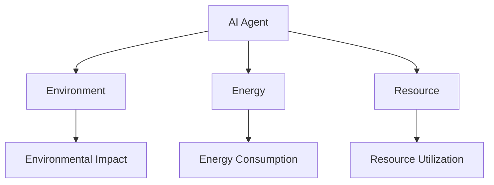
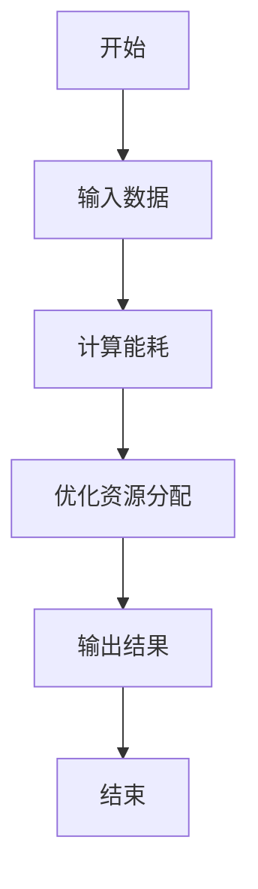

                 

# 绿色AI：开发环保节能的AI Agent

> 关键词：绿色AI，环保节能，AI Agent，可持续发展，能源优化，资源利用率，环境监测

> 摘要：绿色AI是通过优化AI算法和系统设计，减少能源消耗和资源浪费，实现环保和可持续发展的新兴技术。本文将详细探讨绿色AI的核心概念、算法原理、系统架构设计以及实际项目案例，为开发者提供从理论到实践的全面指导。

---

# 第一部分: 绿色AI的背景与核心概念

## 第1章: 绿色AI的背景与问题背景

### 1.1 AI技术的环境影响

#### 1.1.1 AI技术的能耗现状

AI技术，尤其是深度学习模型，近年来发展迅速，但其能耗问题日益凸显。训练一个复杂的深度学习模型可能需要数千个GPU小时，能源消耗巨大。据统计，训练一个大型AI模型的碳足迹可能相当于一个普通家庭两年的用电量。

#### 1.1.2 AI对环境的潜在威胁

随着AI技术的广泛应用，其对环境的影响也在逐渐显现。例如，数据中心的能耗问题、电子设备的废弃处理问题等，都对环境造成了潜在威胁。此外，AI系统的运行依赖大量的电力，而电力的产生往往伴随着碳排放，这加剧了环境问题。

#### 1.1.3 环保与可持续发展的迫切需求

面对全球气候变化和资源枯竭的危机，环保和可持续发展已成为全球关注的焦点。AI作为一项前沿技术，可以在环保领域发挥重要作用，但前提是AI技术本身必须是环保的，即绿色AI。

---

### 1.2 绿色AI的定义与目标

#### 1.2.1 绿色AI的核心概念

绿色AI是指在开发和应用AI技术的过程中，通过优化算法、减少能耗、提高资源利用率等方式，降低对环境的负面影响，同时实现环保目标的一种AI技术。绿色AI注重技术与环境的和谐共存，强调可持续发展。

#### 1.2.2 绿色AI的目标与边界

绿色AI的目标是通过技术创新，减少AI系统的能耗和资源浪费，同时提高系统的环保性能。其边界包括但不限于能源消耗、资源利用、碳排放等方面，但不涉及AI技术的核心算法改进。

#### 1.2.3 绿色AI与传统AI的对比

绿色AI与传统AI的主要区别在于对环境的影响。传统AI注重功能和性能的提升，而绿色AI则在功能和性能的基础上，注重降低能耗和资源消耗，实现环保目标。

---

### 1.3 绿色AI的应用场景

#### 1.3.1 能源管理与优化

绿色AI可以应用于能源管理领域，通过优化能源分配和消耗，减少能源浪费。例如，智能电网可以通过绿色AI技术实现能源的高效分配和管理。

#### 1.3.2 环境监测与保护

绿色AI可以用于环境监测，如空气质量监测、水质监测等，通过实时数据分析，帮助环境保护部门及时发现和处理环境问题。

#### 1.3.3 绿色交通与智慧城市

绿色AI可以应用于智能交通系统，优化交通流量，减少碳排放。同时，在智慧城市中，绿色AI可以帮助城市规划者优化城市资源分配，提高城市的可持续发展能力。

---

## 第2章: 绿色AI的核心概念与联系

### 2.1 绿色AI的核心概念原理

#### 2.1.1 能源效率优化

绿色AI通过优化算法和系统设计，提高能源利用效率，减少能源浪费。例如，通过动态调整AI模型的计算精度，可以在保证性能的同时降低能耗。

#### 2.1.2 资源利用率提升

绿色AI注重资源的高效利用，例如，通过共享计算资源、优化数据存储等方式，减少资源浪费。

#### 2.1.3 环保算法设计

绿色AI的算法设计注重环保，例如，使用低能耗的算法框架、减少数据传输次数等，降低碳排放。

---

### 2.2 核心概念属性特征对比表

表2-1: 绿色AI与传统AI的核心属性对比

| 属性 | 传统AI | 绿色AI |
|------|--------|--------|
| 能耗 | 高 | 低 |
| 资源利用 | 一般 | 高效 |
| 环境影响 | 显著 | 较小 |

---

### 2.3 ER实体关系图

---

## 第3章: 绿色AI的算法原理

### 3.1 绿色AI算法的核心原理

#### 3.1.1 能耗优化算法

能耗优化算法通过动态调整计算资源的分配，减少不必要的计算，降低能耗。例如，可以通过减少模型的计算精度，或者动态调整模型的规模，来实现能耗优化。

#### 3.1.2 资源分配算法

资源分配算法通过优化资源的分配策略，提高资源利用率。例如，可以通过负载均衡算法，将任务分配到不同的计算节点，避免资源浪费。

#### 3.1.3 环保决策算法

环保决策算法通过分析环境数据，制定环保决策。例如，可以通过分析空气质量数据，制定减少污染的策略。

---

### 3.2 算法流程图

---

### 3.3 数学模型与公式

#### 3.3.1 能耗优化模型

$$ \text{目标函数: } \min_{x} \sum_{i=1}^{n} x_i $$
$$ \text{约束条件: } x_i \geq 0, \forall i $$

---

## 总结

绿色AI是实现环保和可持续发展的重要技术手段。通过优化算法和系统设计，绿色AI可以在不影响性能的前提下，显著降低能耗和资源消耗。未来，随着技术的发展，绿色AI将在更多领域发挥重要作用，为环境保护和可持续发展做出贡献。

---

作者：AI天才研究院 & 禅与计算机程序设计艺术

