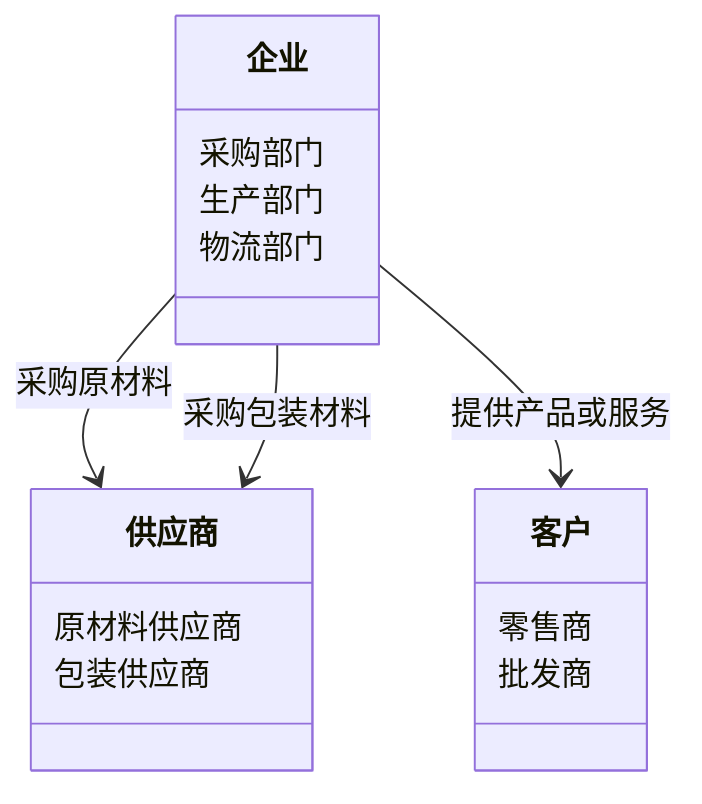
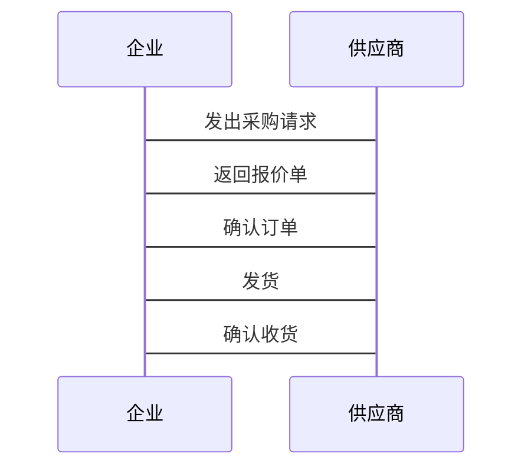

                 


# 绿色供应链管理对公司竞争力的影响

## 关键词：绿色供应链管理、企业竞争力、可持续发展、供应链优化、环境影响

## 摘要：绿色供应链管理（Green Supply Chain Management, GSCM）作为一种新兴的管理策略，正在成为企业提升竞争力的重要手段。本文将从绿色供应链管理的背景与概念出发，探讨其核心理论、驱动因素及其对成本优化、风险管理、品牌价值和创新机会的具体影响。通过系统架构设计和实际案例分析，本文旨在为读者提供一个全面了解绿色供应链管理如何提升企业竞争力的框架，并总结最佳实践策略。

---

## 第一部分：绿色供应链管理概述

### 第1章：绿色供应链管理的背景与概念

#### 1.1 绿色供应链管理的背景

全球范围内，可持续发展已成为企业和政府的重要议题。随着环境问题的日益严重，企业面临的环境压力也在不断增加。绿色供应链管理（GSCM）作为一种将环境保护融入供应链管理的策略，正逐渐成为企业应对环境挑战的重要工具。

- **1.1.1 全球可持续发展的趋势**  
  全球气候变化、资源枯竭和环境污染等问题促使企业重新审视其供应链管理方式。消费者对环保产品的偏好也在推动企业向绿色供应链转型。

- **1.1.2 环境问题对企业的影响**  
  环境法规的日益严格可能导致企业面临罚款或市场准入限制。同时，环境问题也可能导致企业声誉受损，进而影响其市场地位。

- **1.1.3 绿色供应链管理的兴起**  
  绿色供应链管理的兴起源于企业对环境责任的承担和对成本优化的需求。通过绿色供应链管理，企业可以减少资源浪费，提高效率，同时增强其市场竞争力。

#### 1.2 绿色供应链管理的定义与核心要素

- **1.2.1 核心概念的界定**  
  绿色供应链管理是指在供应链的每个环节中，从原材料采购到产品交付，都考虑环境因素，以减少对环境的负面影响。

- **1.2.2 绿色供应链管理的特征**  
  绿色供应链管理具有系统性、协同性和持续性等特点。它要求企业与供应商、客户等利益相关者紧密合作，共同实现绿色目标。

- **1.2.3 核心要素的组成**  
  绿色供应链管理的核心要素包括绿色采购、绿色生产、绿色物流和绿色逆向物流等。这些要素共同构成了绿色供应链管理的完整体系。

---

### 第2章：绿色供应链管理的理论基础

#### 2.1 生命周期评估（LCA）

- **2.1.1 生命周期评估的概念**  
  生命周期评估（Life Cycle Assessment, LCA）是一种用于评估产品或服务在整个生命周期中的环境影响的方法。它包括原材料获取、生产、使用和废弃等阶段。

- **2.1.2 生命周期评估的方法**  
  生命周期评估通常采用定量分析方法，通过数据收集和模型模拟，评估每个阶段的环境影响。

- **2.1.3 生命周期评估在供应链管理中的应用**  
  通过生命周期评估，企业可以识别供应链中的环境 hotspot，并采取相应的优化措施，从而减少环境影响。

#### 2.2 碳足迹分析

- **2.2.1 碳足迹的定义与计算方法**  
  碳足迹是指一个产品或服务在整个生命周期中所排放的温室气体的总和。碳足迹的计算通常包括直接排放和间接排放。

- **2.2.2 碳足迹在供应链中的应用**  
  碳足迹分析可以帮助企业识别供应链中的高碳排放环节，并采取措施进行优化，例如选择低碳运输方式或使用可再生能源。

- **2.2.3 碳足迹与企业竞争力的关系**  
  降低碳足迹不仅可以减少企业的环境风险，还能提升其在绿色市场中的竞争力。消费者和企业越来越倾向于选择低碳排放的产品和服务。

---

### 第3章：绿色供应链管理的驱动因素

#### 3.1 法律法规的驱动

- **3.1.1 全球及地区的环保法规**  
  各国和地区都在制定和实施越来越严格的环保法规，例如欧盟的《可持续金融披露规则》和《碳边境调节机制》。

- **3.1.2 法规对企业供应链的影响**  
  企业必须确保其供应链符合相关法规要求，否则可能面临罚款或市场准入限制。

- **3.1.3 如何合规化管理供应链**  
  企业可以通过与供应商签订环保协议、采用绿色采购等方式，确保其供应链符合环保法规。

#### 3.2 消费者需求的驱动

- **3.2.1 消费者环保意识的提升**  
  消费者越来越关注产品和服务的环保性能，倾向于选择绿色产品。

- **3.2.2 绿色产品的需求增长**  
  市场上对绿色产品的 demand 正在快速增长，企业必须适应这一趋势。

- **3.2.3 消费者对企业供应链的要求**  
  消费者希望企业能够公开其供应链的环境信息，并采取环保措施。

#### 3.3 企业社会责任的驱动

- **3.3.1 企业社会责任的内涵**  
  企业社会责任（Corporate Social Responsibility, CSR）是指企业在追求经济效益的同时，还要承担起对社会和环境的责任。

- **3.3.2 绿色供应链与企业社会责任的关系**  
  绿色供应链管理是企业履行社会责任的重要途径，通过减少环境影响，企业可以提升其社会形象。

- **3.3.3 如何通过绿色供应链提升企业形象**  
  通过实施绿色供应链管理，企业可以增强其品牌形象，吸引更多的消费者和投资者。

---

## 第二部分：绿色供应链管理对竞争力的影响

### 第4章：绿色供应链管理的成本优化

#### 4.1 绿色采购与成本控制

- **4.1.1 绿色采购的策略**  
  绿色采购策略包括选择环保供应商、采用绿色采购认证等。

- **4.1.2 绿色采购的成本优化方法**  
  通过优化采购流程、减少浪费等，企业可以降低采购成本。

- **4.1.3 绿色采购的实际案例分析**  
  例如，某企业通过选择环保供应商，不仅降低了采购成本，还提升了产品品质。

#### 4.2 绿色物流与成本节约

- **4.2.1 绿色物流的定义与特点**  
  绿色物流是指在物流过程中采用环保措施，减少资源消耗和环境污染。

- **4.2.2 绿色物流的成本节约措施**  
  例如，采用绿色运输方式（如铁路或水路运输）可以降低物流成本。

- **4.2.3 绿色物流与传统物流的对比**  
  绿色物流虽然初期投资较大，但长期来看可以带来更大的成本节约和环境效益。

---

### 第5章：绿色供应链管理的风险管理

#### 5.1 环境风险的识别与评估

- **5.1.1 环境风险的来源**  
  环境风险可能来自供应链中的原材料采购、生产过程或运输环节。

- **5.1.2 环境风险的评估方法**  
  企业可以通过环境影响评估（EIA）等方法，识别和评估环境风险。

- **5.1.3 如何通过绿色供应链降低环境风险**  
  例如，通过选择环保供应商、采用清洁生产技术等，企业可以降低环境风险。

#### 5.2 供应链弹性与风险管理

- **5.2.1 供应链弹性的定义**  
  供应链弹性是指供应链在面对突发事件或不确定性时的适应能力和恢复能力。

- **5.2.2 绿色供应链在风险管理中的作用**  
  绿色供应链管理可以帮助企业更好地应对环境风险，提高供应链的弹性。

- **5.2.3 如何构建弹性的绿色供应链**  
  例如，通过多元化供应商策略、建立应急储备等，企业可以提高供应链的弹性。

---

### 第6章：绿色供应链管理的品牌价值提升

#### 6.1 绿色品牌的核心竞争力

- **6.1.1 绿色品牌的概念**  
  绿色品牌是指以环保理念为核心，注重产品和服务的可持续性。

- **6.1.2 绿色品牌的核心竞争力**  
  绿色品牌的核心竞争力在于其对环境的承诺和对社会责任的履行。

- **6.1.3 如何通过绿色供应链提升品牌价值**  
  通过实施绿色供应链管理，企业可以增强其品牌的核心竞争力，吸引更多的消费者和投资者。

---

## 第三部分：系统分析与架构设计方案

### 第7章：绿色供应链管理的系统架构设计

#### 7.1 问题场景介绍

- **7.1.1 问题背景**  
  企业现有的供应链存在资源浪费和环境影响较大的问题，需要通过绿色供应链管理进行优化。

- **7.1.2 项目介绍**  
  本项目旨在设计一个绿色供应链管理系统，帮助企业在采购、生产、物流等环节实现绿色管理。

#### 7.2 系统功能设计

- **7.2.1 领域模型（Mermaid类图）**  
  下图展示了绿色供应链管理系统的领域模型，包括供应商、生产过程、物流等关键环节。



- **7.2.2 系统架构设计（Mermaid架构图）**  
  下图展示了绿色供应链管理系统的整体架构，包括前端、后端和数据层。


- **7.2.3 系统接口设计**  
  系统需要与供应商、客户等外部系统进行接口对接，例如通过API实现数据交换。

- **7.2.4 系统交互设计（Mermaid序列图）**  
  下图展示了企业与供应商之间的交互流程。



---

## 第四部分：项目实战

### 第8章：绿色供应链管理的实施与案例分析

#### 8.1 环境安装

- **8.1.1 系统需求**  
  企业需要具备一定的信息化基础，例如ERP系统或其他供应链管理工具。

- **8.1.2 环境配置**  
  企业需要与供应商、客户等建立数据接口，确保数据的实时交换。

#### 8.2 系统核心实现源代码

- **8.2.1 绿色采购模块**  
  下面是一个绿色采购模块的示例代码：

```python
def green_procurement(enterprise, suppliers):
    # 选择符合环保标准的供应商
    qualified_suppliers = [s for s in suppliers if s['environmental_rating'] >= 80]
    # 确定最佳供应商
    best_supplier = min(qualified_suppliers, key=lambda x: x['cost'])
    return best_supplier

# 示例使用
enterprise = {
    'name': 'GreenTech',
    'location': 'Shanghai'
}
suppliers = [
    {'name': 'Eco-Friendly Materials', 'environmental_rating': 90, 'cost': 100},
    {'name': 'Sustainable Packaging', 'environmental_rating': 85, 'cost': 105},
    {'name': 'Traditional Materials', 'environmental_rating': 70, 'cost': 95}
]
selected_supplier = green_procurement(enterprise, suppliers)
print(f"Selected Supplier: {selected_supplier['name']}")
```

---

## 第五部分：最佳实践与总结

### 第9章：绿色供应链管理的最佳实践

#### 9.1 小结

- 绿色供应链管理不仅是企业应对环境挑战的重要策略，也是提升企业竞争力的有效途径。
- 通过实施绿色供应链管理，企业可以降低成本、降低环境风险、提升品牌价值，并抓住创新机会。

#### 9.2 注意事项

- 企业在实施绿色供应链管理时，需要与供应商、客户等利益相关者进行充分沟通，确保各方的协同合作。
- 绿色供应链管理需要长期投入，企业需要制定长期的规划，并持续优化其管理流程。

#### 9.3 拓展阅读

- 推荐阅读《绿色供应链管理：理论与实践》（作者：某某）。
- 参考国际绿色供应链管理的相关标准和最佳实践，例如GRI（全球报告倡议）的供应链准则。

---

## 作者

作者：AI天才研究院/AI Genius Institute & 禅与计算机程序设计艺术/Zen And The Art of Computer Programming

---

以上是关于《绿色供应链管理对公司竞争力的影响》的完整目录和文章内容。

