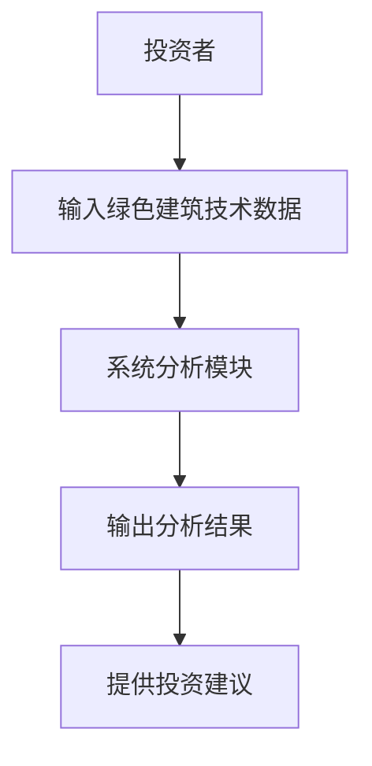
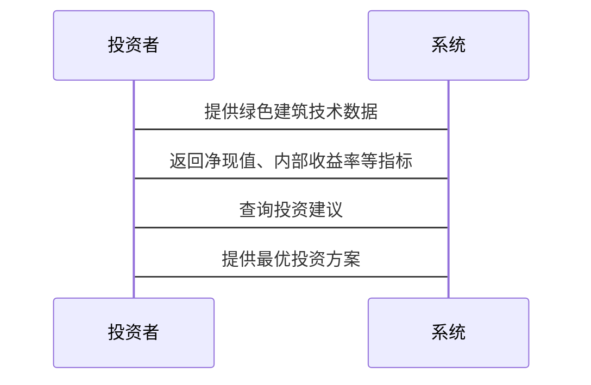

                 


# 绿色建筑技术的成本效益分析与投资决策

## 关键词：
绿色建筑技术、成本效益分析、投资决策、净现值、内部收益率、生命周期成本

## 摘要：
绿色建筑技术的兴起为建筑行业带来了可持续发展的新机遇，然而其应用也面临着成本高昂和投资回报不确定的挑战。本文系统地分析了绿色建筑技术的成本构成、效益评估方法以及投资决策模型，结合实际案例，探讨了如何通过成本效益分析优化投资决策，实现经济效益与环境效益的双赢。文章从理论到实践，详细阐述了绿色建筑技术的成本效益分析方法，为建筑行业提供了可操作的决策支持。

---

## 第1章：绿色建筑技术的成本效益分析概述

### 1.1 绿色建筑技术的背景与概念

#### 1.1.1 绿色建筑技术的定义
绿色建筑技术是指在建筑全生命周期中，通过优化设计、施工和运营，减少能源消耗、资源浪费和环境污染的技术。其核心在于实现建筑与自然环境的和谐共生，降低碳排放，提高能源使用效率。

#### 1.1.2 绿色建筑技术的核心要素
绿色建筑技术涉及多个方面，包括：
1. **建筑设计优化**：采用被动式设计（如自然采光、通风）和主动式技术（如地源热泵）。
2. **能源效率提升**：使用太阳能、风能等可再生能源。
3. **材料环保性**：选择低碳、可循环的建筑材料。
4. **水资源管理**：雨水收集、废水回收利用。

#### 1.1.3 绿色建筑技术的分类与特点
绿色建筑技术可以分为三类：
1. **节能技术**：如高效隔热材料、LED照明。
2. **节水技术**：如雨水收集系统、智能灌溉。
3. **环保技术**：如屋顶绿化、空气质量控制系统。

### 1.2 成本效益分析的重要性

#### 1.2.1 成本效益分析的基本概念
成本效益分析（Cost-Benefit Analysis，CBA）是一种评估项目可行性的方法，通过比较项目成本和收益，判断其是否具有经济价值。

#### 1.2.2 绿色建筑技术的成本效益分析的目的
绿色建筑技术的成本效益分析旨在：
1. 评估绿色技术的经济可行性。
2. 比较绿色技术与传统技术的成本差异。
3. 量化绿色技术的环境效益，为政策制定和投资决策提供依据。

#### 1.2.3 投资决策与成本效益分析的关系
投资决策是基于成本效益分析的结果，选择最优的技术方案。通过分析净现值（NPV）、内部收益率（IRR）等指标，投资者可以判断绿色技术的投资回报率是否可行。

---

## 第2章：绿色建筑技术的成本构成与估算

### 2.1 绿色建筑技术的成本构成

#### 2.1.1 设计阶段的成本
绿色建筑的设计阶段需要投入更多的资源，包括：
1. **设计费用**：绿色建筑的设计通常需要更多的时间和专业人员。
2. **技术咨询费用**：如能源评估、环保评估等。

#### 2.1.2 施工阶段的成本
绿色建筑的施工阶段成本包括：
1. **材料成本**：使用环保材料通常比传统材料昂贵。
2. **施工技术成本**：如地源热泵安装、雨水收集系统建设等。

#### 2.1.3 运营阶段的成本
绿色建筑的运营成本包括：
1. **能源消耗**：由于使用可再生能源，初期投资高，但长期运营成本可能降低。
2. **维护成本**：绿色建筑的维护成本可能高于传统建筑。

### 2.2 成本估算的方法

#### 2.2.1 项目成本估算的基本方法
成本估算方法包括：
1. **自上而下法**：从整体到局部，估算总成本。
2. **自下而上法**：从局部到整体，详细估算每个部分的成本。
3. **类比法**：参考类似项目的成本数据。

#### 2.2.2 绿色建筑技术的成本估算模型
绿色建筑技术的成本估算模型通常包括：
1. 初期投资成本。
2. 运营成本。
3. 维护成本。
4. 拆除成本。

#### 2.2.3 成本估算的注意事项
1. 考虑通货膨胀对成本的影响。
2. 评估绿色技术的生命周期成本，而不仅仅是初期投资。

---

## 第3章：绿色建筑技术的成本效益分析方法

### 3.1 净现值分析

#### 3.1.1 净现值的定义
净现值（Net Present Value，NPV）是指未来现金流量按折现率折算到现在的价值，减去初始投资的现值。

#### 3.1.2 净现值的计算公式
$$ NPV = \sum_{t=0}^{n} \frac{CF_t}{(1+r)^t} $$
其中，$CF_t$是第t年的现金流量，$r$是折现率。

#### 3.1.3 净现值在绿色建筑中的应用
通过计算绿色建筑技术的净现值，可以判断其经济可行性。如果NPV > 0，则项目值得投资。

### 3.2 内部收益率分析

#### 3.2.1 内部收益率的定义
内部收益率（Internal Rate of Return，IRR）是指项目生命周期内，使净现值为零的折现率。

#### 3.2.2 内部收益率的计算方法
IRR的计算通常需要通过试算法或使用财务计算器。

#### 3.2.3 内部收益率在绿色建筑中的应用
IRR可以帮助投资者判断项目的回报率是否达到预期。

### 3.3 投资回收期分析

#### 3.3.1 投资回收期的定义
投资回收期（Payback Period）是指项目投资在多少年内能够收回初始投资。

#### 3.3.2 投资回收期的计算方法
$$ 回收期 = \frac{\text{初始投资}}{\text{年均净现金流}} $$

#### 3.3.3 投资回收期在绿色建筑中的应用
投资回收期可以帮助投资者评估绿色技术的初期投资风险。

---

## 第4章：绿色建筑技术的投资决策系统架构

### 4.1 系统功能设计

#### 4.1.1 系统功能模块
1. **数据输入模块**：收集绿色建筑技术的成本、收益数据。
2. **分析模块**：计算净现值、内部收益率等指标。
3. **决策模块**：基于分析结果，提供投资建议。

#### 4.1.2 系统架构设计
- 数据层：存储绿色建筑技术的成本、收益数据。
- 业务逻辑层：处理数据，计算各项指标。
- 用户界面层：展示分析结果和决策建议。

### 4.2 系统接口设计

#### 4.2.1 数据接口
1. 数据输入接口：接收绿色建筑技术的成本、收益数据。
2. 数据输出接口：返回分析结果和决策建议。

#### 4.2.2 用户接口
1. 管理界面：供管理员维护数据和系统配置。
2. 用户界面：供投资者查询分析结果和决策建议。

### 4.3 系统交互流程

#### 4.3.1 交互流程图


#### 4.3.2 序列图


---

## 第5章：绿色建筑技术的成本效益分析项目实战

### 5.1 项目背景
某绿色建筑项目，旨在通过采用太阳能发电系统、雨水收集系统等技术，降低建筑能耗和运营成本。

### 5.2 项目实施步骤

#### 5.2.1 数据收集
收集绿色建筑技术的成本、收益数据，包括：
1. 初期投资成本。
2. 年度运营成本。
3. 年度收益。

#### 5.2.2 数据分析
使用净现值、内部收益率等方法，评估项目的经济可行性。

#### 5.2.3 决策建议
基于分析结果，提供最优投资方案。

### 5.3 代码实现

#### 5.3.1 绿色建筑技术的成本计算
```python
def calculate_cost(years, initial_cost, annual_cost):
    return initial_cost + annual_cost * years
```

#### 5.3.2 净现值计算
```python
def calculate_npv(years, initial_cost, annual_cash_flow, discount_rate):
    npv = 0
    for t in range(years):
        cash_flow = annual_cash_flow / (1 + discount_rate) ** t
        npv += cash_flow
    npv -= initial_cost
    return npv
```

### 5.4 实际案例分析
通过实际案例分析，验证绿色建筑技术的成本效益分析方法的有效性，并提出改进建议。

### 5.5 项目小结
总结项目实施的经验和教训，提出优化建议。

---

## 第6章：结论与展望

### 6.1 研究总结
绿色建筑技术的成本效益分析是实现可持续发展的重要工具，通过科学的分析方法，可以帮助投资者做出明智的投资决策。

### 6.2 未来展望
未来，随着技术的进步，绿色建筑技术的成本将进一步降低，效益也将更加显著。同时，人工智能和大数据技术的应用将为成本效益分析提供更强大的支持。

---

## 参考文献
[此处列出相关文献和参考资料]

---

## 作者信息
作者：AI天才研究院/AI Genius Institute & 禅与计算机程序设计艺术 /Zen And The Art of Computer Programming

