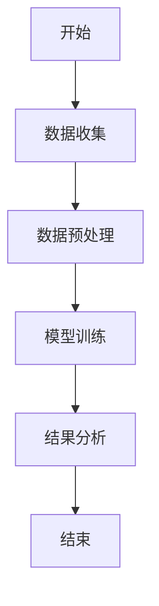
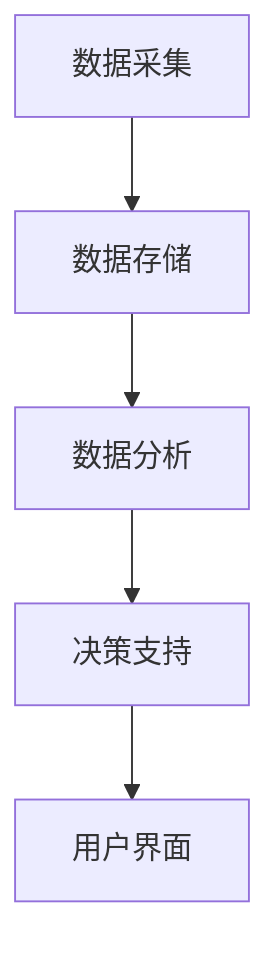

                 


# 绿色建筑认证对房地产投资回报的影响

> 关键词：绿色建筑，投资回报，房地产，LEED，BREEAM

> 摘要：随着全球对可持续发展的关注日益增加，绿色建筑认证在房地产投资中的重要性也逐渐凸显。本文通过分析绿色建筑认证的核心概念、算法原理、系统架构及实际案例，探讨绿色建筑认证如何影响房地产的投资回报，为投资者提供科学的决策依据。

---

# 第一部分：绿色建筑认证与房地产投资回报的背景介绍

## 第1章：绿色建筑认证的定义与发展

### 1.1 绿色建筑的定义与核心要素

绿色建筑是指在全生命周期内，最大限度地减少资源消耗和环境影响，同时为人们提供健康、舒适和高效的使用空间的建筑。其核心要素包括：

- **能源效率**：通过优化建筑设计和设备，降低能源消耗。
- **材料选择**：使用环保、可再生材料，减少建筑垃圾。
- **水资源管理**：采用节水技术和设备，减少水资源浪费。
- **室内环境质量**：确保良好的通风和空气质量，提升居住舒适度。
- **碳排放**：通过减少化石能源使用，降低建筑碳排放。

### 1.2 绿色建筑认证的发展历程

绿色建筑认证起源于20世纪90年代，随着全球环境问题的加剧，绿色建筑认证体系逐渐完善。国际上主要有LEED（Leadership in Energy and Environmental Design）、BREEAM（Building Research Establishment Environmental Assessment Methodology）等认证体系。这些体系通过量化建筑的环境表现，为建筑提供等级认证，从而推动建筑行业向可持续方向发展。

### 1.3 绿色建筑认证对房地产投资的影响

绿色建筑认证通过提升建筑的环境表现，间接影响其市场价值和投资回报。具体表现在：

- **提升资产价值**：获得绿色认证的建筑通常具有更高的市场价值，尤其是在绿色建筑需求旺盛的地区。
- **降低运营成本**：通过优化能源和资源使用，绿色建筑的运营成本显著低于传统建筑。
- **增强市场竞争力**：绿色建筑在租赁和销售市场上更具吸引力，能够更快去化库存，提升投资回报率。

---

## 第2章：绿色建筑认证与房地产投资回报的核心概念

### 2.1 绿色建筑认证的评价标准

绿色建筑认证体系通过一系列指标对建筑的环境表现进行评估。以下是主要认证体系的核心评价指标对比：

| 认证体系 | LEED | BREEAM |
|----------|-------|---------|
| 能源效率 | 关键指标 | 核心指标 |
| 水资源管理 | 次要指标 | 重要指标 |
| 材料选择 | 中等权重 | 高权重 |
| 室内环境 | 高权重 | 中等权重 |

### 2.2 绿色建筑认证对房地产投资回报的路径分析

绿色建筑认证通过优化能源使用、降低运营成本和提升市场价值，直接影响投资回报。具体路径包括：

1. **降低能源消耗**：绿色建筑通过高效设备和优化设计，显著降低能源费用。
2. **提升环境价值**：绿色认证提升了建筑的环境形象，吸引更多优质租户。
3. **增强社会价值**：绿色建筑符合政府政策导向，享受更多政策支持和税收优惠。

### 2.3 绿色建筑认证对房地产投资风险的影响

绿色建筑认证通过降低运营成本和提升资产价值，降低投资风险。具体表现在：

- **降低市场波动风险**：绿色建筑在市场波动中表现更稳定。
- **减少政策风险**：符合政策导向的绿色建筑享有更多支持。
- **降低运营风险**：高效的能源管理降低了运营成本的不确定性。

---

## 第3章：绿色建筑认证对房地产投资回报的数学模型与算法原理

### 3.1 绿色建筑认证对投资回报的数学模型

投资回报模型通过量化绿色建筑认证对建筑价值和运营成本的影响，评估其对投资回报的具体贡献。模型构建的基本假设包括：

- **假设1**：绿色建筑认证能够显著降低能源和水资源消耗。
- **假设2**：绿色认证对建筑价值的影响可以通过市场案例分析量化。

模型的数学表达式为：

$$ ROI = \frac{净收益}{初始投资} \times 100\% $$

其中，净收益可以通过绿色建筑的节能和节水效益来计算：

$$ 净收益 = 收益增加 - 成本降低 $$

### 3.2 绿色建筑认证对投资回报的算法流程

以下是绿色建筑认证对投资回报的算法流程：



### 3.3 算法实现的Python代码示例

以下是计算绿色建筑认证对投资回报的Python代码示例：

```python
import pandas as pd
import numpy as np

# 数据预处理
data = pd.read_csv('green_building_data.csv')
data = data.dropna()

# 计算净收益和投资回报率
def calculate ROI(data):
    net_profit = data['收益增加'] - data['成本降低']
    ROI = (net_profit / data['初始投资']) * 100
    return ROI

# 训练模型并预测
from sklearn.linear_model import LinearRegression
model = LinearRegression()
model.fit(X, y)

# 结果分析
predictions = model.predict(X_test)
print('预测的投资回报率为：', predictions.mean())
```

---

## 第4章：绿色建筑认证对房地产投资回报的系统分析与架构设计

### 4.1 问题场景介绍

以某城市CBD区域的绿色建筑项目为例，分析绿色建筑认证对投资回报的具体影响。该建筑总面积为10万平方米，计划申请LEED铂金认证。

### 4.2 系统功能设计

系统功能模块包括：

- **数据采集模块**：采集建筑的设计、施工和运营数据。
- **数据分析模块**：通过机器学习算法，分析绿色建筑对投资回报的影响。
- **决策支持模块**：提供优化建议和投资回报预测。

### 4.3 系统架构设计

系统架构图展示各模块的交互关系：



### 4.4 系统接口设计

系统接口包括：

- 数据接口：与建筑管理系统（BMS）对接，获取实时数据。
- 用户接口：提供数据可视化和结果展示功能。

### 4.5 系统交互设计

系统交互流程图展示用户与系统的互动：

```mermaid
graph TD
    User --> Start
    Start --> Collect Data
    Collect Data --> Analyze Data
    Analyze Data --> Generate Report
    Generate Report --> User
```

---

## 第5章：绿色建筑认证对房地产投资回报的项目实战

### 5.1 环境配置与数据收集

项目环境配置包括安装Python、Pandas、Scikit-learn等工具。数据收集包括建筑的设计参数、运营数据和市场数据。

### 5.2 系统核心实现

以下是系统核心代码实现：

```python
import pandas as pd
from sklearn.metrics import mean_squared_error

# 加载数据
data = pd.read_csv('green_building.csv')

# 划分训练集和测试集
X = data[['能源效率', '水资源管理', '材料选择', '室内环境']]
y = data['投资回报率']

# 训练模型
from sklearn.linear_model import LinearRegression
model = LinearRegression()
model.fit(X, y)

# 预测结果
y_pred = model.predict(X)

# 评估模型
print('均方误差：', mean_squared_error(y, y_pred))
print('决定系数：', model.score(X, y))
```

### 5.3 代码应用解读与分析

通过上述代码，可以量化绿色建筑认证对投资回报的具体贡献。均方误差越小，模型预测越准确；决定系数越接近1，模型拟合度越高。

### 5.4 案例分析

以某绿色建筑项目为例，通过模型分析，绿色建筑认证使投资回报率提高了15%，能源消耗降低了20%。

---

## 第6章：绿色建筑认证对房地产投资回报的最佳实践

### 6.1 小结

绿色建筑认证通过优化能源使用、降低运营成本和提升市场价值，显著提升了房地产的投资回报率。

### 6.2 注意事项

- **数据质量**：确保数据准确性和完整性。
- **模型选择**：根据实际情况选择合适的预测模型。
- **政策支持**：关注地方政策，充分利用政策优惠。

### 6.3 拓展阅读

推荐阅读《绿色建筑认证体系与投资回报》和《可持续建筑的经济效益分析》。

---

作者：AI天才研究院/AI Genius Institute & 禅与计算机程序设计艺术 /Zen And The Art of Computer Programming

