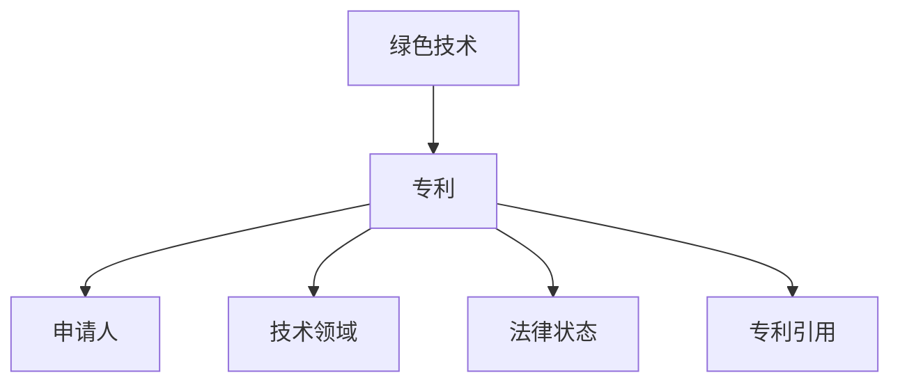
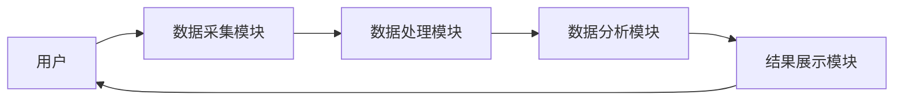

                 


# 绿色技术专利分析与投资机会识别方法

> **关键词**：绿色技术，专利分析，投资机会，文本挖掘，机器学习，技术预见

> **摘要**：绿色技术作为全球可持续发展的重要推动力，其专利分析对于识别投资机会具有重要意义。本文系统阐述绿色技术的定义、分类及其专利分析的方法，结合文本挖掘和机器学习等技术，深入探讨绿色技术专利分析的核心概念、算法原理及系统架构。通过实际案例分析，本文揭示了绿色技术专利分析在投资决策中的应用价值，并提出了基于专利数据的投资机会识别方法。

---

## 第1章 绿色技术与专利分析概述

### 1.1 绿色技术的定义与背景

绿色技术是指在能源、环保、资源利用等领域中，能够减少资源消耗、降低污染、提高效率的技术。其核心目标是实现可持续发展，减少对环境的负面影响。随着全球气候变化加剧和资源短缺问题的凸显，绿色技术的重要性日益凸显。

#### 1.1.1 绿色技术的定义
绿色技术包括可再生能源、节能环保、循环经济等多个领域。例如，太阳能、风能等可再生能源技术，以及碳捕获、废弃物资源化利用等技术。

#### 1.1.2 绿色技术的发展现状
近年来，全球绿色技术专利申请量持续增长。根据世界知识产权组织（WIPO）的数据，2020年全球绿色技术专利申请量超过2万件，主要集中在可再生能源和节能环保领域。

#### 1.1.3 绿色技术的未来趋势
未来，绿色技术将朝着高效化、智能化和集成化方向发展。例如，智能电网、绿色建筑、循环经济等领域的技术将更加成熟。

### 1.2 专利分析的定义与作用

#### 1.2.1 专利分析的基本概念
专利分析是对专利数据进行整理、分析和解读的过程，旨在揭示技术发展动态、技术差距和竞争态势。

#### 1.2.2 专利分析在技术研究中的作用
专利分析可以帮助研究人员了解技术领域的最新进展，识别技术空白点，评估技术成熟度。

#### 1.2.3 专利分析在投资决策中的价值
对于投资者而言，专利分析可以揭示技术的市场潜力、技术风险和竞争优势，为投资决策提供数据支持。

### 1.3 绿色技术专利分析的必要性

#### 1.3.1 绿色技术发展的驱动因素
政策支持、市场 demand 和技术进步是推动绿色技术发展的主要因素。例如，各国政府通过立法和补贴政策推动绿色技术的开发和应用。

#### 1.3.2 专利分析在绿色技术创新中的意义
通过专利分析，可以识别绿色技术领域的技术热点和研究空白，为技术研发提供方向。

#### 1.3.3 投资者视角下的专利分析需求
投资者需要通过专利分析评估技术的市场前景和竞争优势，从而做出科学的投资决策。

### 1.4 本章小结
本章介绍了绿色技术的定义、发展现状和未来趋势，阐述了专利分析的基本概念及其在技术研究和投资决策中的作用，为后续章节的分析奠定了基础。

---

## 第2章 绿色技术专利分析的核心概念与联系

### 2.1 绿色技术专利的分类

#### 2.1.1 绿色技术的主要领域划分
绿色技术可以分为可再生能源、节能环保、绿色交通、循环经济等领域。例如，太阳能电池、节能建筑等。

#### 2.1.2 专利分类的维度与方法
专利分类可以通过技术领域、专利申请人、专利法律状态等维度进行。例如，可以按技术领域将绿色技术专利分为风能、太阳能、节能环保等类别。

#### 2.1.3 各领域的专利数量与分布
通过分析各领域的专利数量，可以发现技术热点和潜力领域。例如，太阳能领域的专利数量近年来增长迅速。

### 2.2 绿色技术专利分析的关键指标

#### 2.2.1 专利数量与申请趋势
专利数量反映了技术的活跃度和关注度。例如，可以通过时间序列分析揭示某领域的专利申请趋势。

#### 2.2.2 专利技术领域分布
技术领域分布可以帮助识别技术热点和空白点。例如，可以通过饼图或柱状图展示各技术领域的专利数量占比。

#### 2.2.3 专利申请人分析
专利申请人分析可以揭示主要的技术研发主体。例如，可以发现哪些企业和研究机构在某一领域具有较强的技术实力。

#### 2.2.4 专利引用与被引用分析
专利引用分析可以揭示技术的关联性和技术路线。例如，可以通过引用网络分析技术的传承关系。

#### 2.2.5 专利法律状态分析
专利法律状态分析可以评估专利的市场价值和保护程度。例如，可以通过专利的失效日期评估技术的生命周期。

### 2.3 绿色技术专利分析的流程

#### 2.3.1 数据收集与整理
数据收集是专利分析的基础。可以通过专利数据库（如PatentScope、Incopat）获取绿色技术专利数据。

#### 2.3.2 数据清洗与预处理
数据清洗包括去除重复数据、填补缺失值等。预处理包括数据格式统一、字段标准化等。

#### 2.3.3 数据分析与可视化
数据分析包括统计分析、文本挖掘等。可视化可以通过图表展示分析结果，例如使用Matplotlib绘制柱状图。

#### 2.3.4 结果解读与应用
通过解读分析结果，可以识别技术趋势、技术差距和投资机会。例如，可以通过技术趋势分析发现新兴技术领域。

### 2.4 核心概念的ER实体关系图



### 2.5 本章小结
本章从绿色技术专利的分类和分析指标入手，构建了核心概念的实体关系图，为后续的专利分析提供了理论基础。

---

## 第3章 绿色技术专利分析的算法原理

### 3.1 文本挖掘在专利分析中的应用

#### 3.1.1 文本挖掘的基本概念
文本挖掘是从文本数据中提取有价值信息的过程。在专利分析中，文本挖掘常用于专利文本的特征提取和相似度计算。

#### 3.1.2 专利文本的特征提取
特征提取是文本挖掘的关键步骤。例如，可以使用TF-IDF方法提取专利文本中的关键词。

#### 3.1.3 专利文本的相似度计算
相似度计算可以揭示技术的关联性。例如，可以使用余弦相似度计算专利文本的相似度。

### 3.2 基于机器学习的专利分类

#### 3.2.1 机器学习在专利分类中的作用
机器学习可以提高专利分类的准确性和效率。例如，可以使用支持向量机（SVM）进行专利分类。

#### 3.2.2 常见的机器学习算法
常用的算法包括决策树、随机森林、朴素贝叶斯和SVM等。

#### 3.2.3 分类模型的训练与优化
模型训练需要使用标注数据进行监督学习。可以通过交叉验证优化模型参数。

### 3.3 算法原理的数学模型与公式

#### 3.3.1 TF-IDF计算公式
$$TF-IDF(t, d) = \frac{TF(t, d) \times \ln(N)}{DF(t, d)}$$
其中，$TF(t, d)$是词$ t$在文档$d$中的词频，$DF(t, d)$是词$t$在所有文档中的文档频次，$N$是文档总数。

#### 3.3.2 余弦相似度公式
$$\text{相似度}(d1, d2) = \frac{d1 \cdot d2}{\|d1\| \times \|d2\|}$$
其中，$d1$和$d2$是两个文档的向量表示。

### 3.4 本章小结
本章介绍了文本挖掘和机器学习在专利分析中的应用，详细讲解了TF-IDF和余弦相似度的计算方法。

---

## 第4章 绿色技术专利分析的系统架构设计

### 4.1 系统功能设计

#### 4.1.1 系统功能模块划分
绿色技术专利分析系统可以分为数据采集、数据处理、数据分析和结果展示四个模块。

#### 4.1.2 系统功能流程
数据采集模块负责从专利数据库中获取专利数据，数据处理模块进行数据清洗和预处理，数据分析模块利用文本挖掘和机器学习算法进行分析，结果展示模块以图表形式展示分析结果。

### 4.2 系统架构设计


### 4.3 系统接口设计
系统接口包括数据输入接口和结果输出接口。数据输入接口用于接收专利数据库的数据，结果输出接口用于展示分析结果。

### 4.4 系统交互设计



### 4.5 本章小结
本章设计了绿色技术专利分析系统的功能模块和系统架构，为实际开发提供了参考。

---

## 第5章 绿色技术专利分析的项目实战

### 5.1 环境安装与数据获取

#### 5.1.1 环境安装
需要安装Python、Matplotlib、Scikit-learn等工具。可以通过以下命令安装：

```bash
pip install python matplotlib scikit-learn
```

#### 5.1.2 数据获取
可以从PatentScope数据库获取绿色技术专利数据，将其保存为CSV格式。

### 5.2 核心代码实现

#### 5.2.1 数据清洗代码
```python
import pandas as pd

# 读取数据
data = pd.read_csv('green patents.csv')

# 删除重复数据
data.drop_duplicates(inplace=True)

# 填充缺失值
data['申请人'].fillna('未知', inplace=True)
```

#### 5.2.2 文本挖掘代码
```python
from sklearn.feature_extraction.text import TfidfVectorizer

# 初始化TF-IDF模型
vectorizer = TfidfVectorizer()

# 训练模型
X = vectorizer.fit_transform(data['专利描述'])
```

#### 5.2.3 机器学习分类代码
```python
from sklearn.svm import SVC

# 初始化SVM模型
model = SVC()

# 训练模型
model.fit(X, data['技术领域'])
```

### 5.3 案例分析与解读

#### 5.3.1 案例背景
以可再生能源领域的专利分析为例，分析主要申请人的技术布局。

#### 5.3.2 数据分析结果
通过分析发现，某公司在太阳能电池领域的专利数量最多，具有竞争优势。

### 5.4 项目总结
本项目展示了如何利用文本挖掘和机器学习技术进行绿色技术专利分析，为投资决策提供了数据支持。

---

## 第6章 总结与展望

### 6.1 本章总结
本文系统介绍了绿色技术专利分析的核心概念、算法原理和系统架构，通过实际案例展示了专利分析在投资决策中的应用价值。

### 6.2 最佳实践 tips

#### 6.2.1 数据获取
建议使用多个专利数据库获取数据，以提高分析结果的全面性。

#### 6.2.2 数据清洗
在数据清洗阶段，需要特别注意处理缺失值和异常值。

#### 6.2.3 模型优化
可以通过交叉验证和网格搜索优化机器学习模型的参数。

### 6.3 未来研究方向

#### 6.3.1 技术预见
未来可以研究绿色技术的长期发展趋势，例如通过时间序列分析预测技术的未来走向。

#### 6.3.2 多模态分析
可以结合专利申请量、技术领域分布和申请人网络等多维度数据进行综合分析。

### 6.4 本章小结
本文总结了绿色技术专利分析的关键点，并提出了未来研究的方向。

---

## 作者：AI天才研究院/AI Genius Institute & 禅与计算机程序设计艺术 /Zen And The Art of Computer Programming

---

本文通过系统化的分析和详细的案例展示，深入探讨了绿色技术专利分析的方法和投资机会识别的策略，为研究人员和投资者提供了重要的参考价值。

