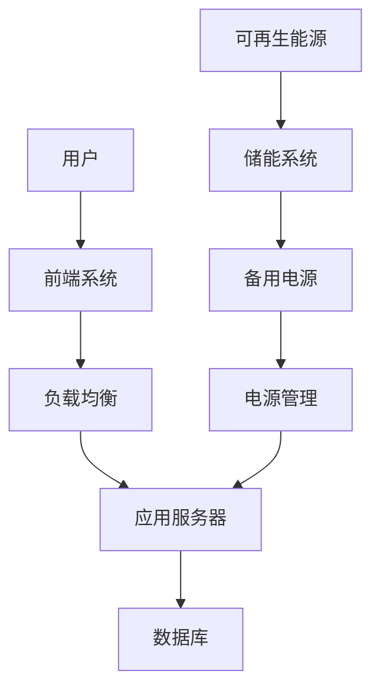

                 

# 绿色数据中心技术的市场增长与投资前景

> 关键词：绿色数据中心、能效优化、可再生能源、投资回报、市场规模、技术趋势

> 摘要：本文探讨绿色数据中心的技术发展、市场增长和投资前景，分析能效优化、可再生能源和智能化技术的应用，评估市场驱动因素和竞争格局，提供投资建议和未来展望。

---

# 绿色数据中心技术的市场增长与投资前景

## 第1章: 绿色数据中心技术的背景与概念

### 1.1 绿色数据中心的基本概念

#### 1.1.1 数据中心的基本定义
数据中心是存储和处理数据的基础设施，支持互联网服务、企业应用和云计算等。传统数据中心能耗高，需优化。

#### 1.1.2 绿色数据中心的核心内涵
绿色数据中心强调能效、可持续性和环保，通过技术优化降低能耗，减少碳排放。

#### 1.1.3 绿色数据中心的背景与意义
随着数据需求增长，传统数据中心能耗问题突出，绿色数据中心成为必要，符合环保和可持续发展需求。

### 1.2 绿色数据中心的市场背景

#### 1.2.1 全球数据中心市场的现状
全球市场规模庞大，年增长率约5-7%，但能耗问题严重，推动绿色数据中心发展。

#### 1.2.2 绿色数据中心的市场需求
企业对能效和环保的关注增加，政府政策支持，推动绿色数据中心需求增长。

#### 1.2.3 政策与法规对绿色数据中心的影响
各国出台政策，推动绿色技术应用，如欧盟的GDPR和中国的双碳目标，促进绿色数据中心发展。

---

## 第2章: 绿色数据中心的核心技术与实现

### 2.1 能效优化技术

#### 2.1.1 能效优化的基本原理
通过优化冷却、设备效率和负载管理，提升能源使用效率（PUE）。

#### 2.1.2 热管理技术在绿色数据中心中的应用
液冷技术、自然冷却和热管技术，有效降低散热能耗。

#### 2.1.3 能效优化的数学模型
使用PUE公式：
$$ PUE = \frac{\text{总能耗}}{\text{IT设备能耗}} $$
优化目标是降低PUE，使其接近1。

### 2.2 可再生能源的利用

#### 2.2.1 太阳能、风能等可再生能源的利用方式
通过光伏板和风力发电，减少化石能源依赖。

#### 2.2.2 绿色能源在数据中心供电中的应用
可再生能源与传统电源结合，保障供电稳定性。

#### 2.2.3 可再生能源的稳定性与经济性分析
波动性问题可通过储能系统解决，经济性取决于地区能源价格和政策支持。

### 2.3 虚拟化与云计算技术

#### 2.3.1 虚拟化技术在绿色数据中心中的作用
虚拟化整合资源，提高设备利用率，降低能耗。

#### 2.3.2 云计算对数据中心能效的影响
云计算通过资源共享和动态分配，降低整体能耗。

#### 2.3.3 虚拟化与云计算的结合优化
通过智能调度和资源优化，进一步提升能效。

---

## 第3章: 绿色数据中心的市场增长分析

### 3.1 全球绿色数据中心市场的现状

#### 3.1.1 市场规模与增长趋势
全球绿色数据中心市场规模预计年增长15%，主要驱动力是环保政策和技术进步。

#### 3.1.2 主要区域市场的特点
亚太地区增长最快，欧洲政策推动，北美市场成熟。

#### 3.1.3 市场驱动因素分析
环保法规、企业社会责任、技术进步和能源成本上升推动市场增长。

### 3.2 绿色数据中心的主要技术趋势

#### 3.2.1 能效技术的创新
AI优化能效管理，智能冷却技术提升效率。

#### 3.2.2 可再生能源技术的进步
储能技术提升可再生能源稳定性，氢能源逐步应用。

#### 3.2.3 智能化与自动化技术的应用
AI和自动化技术优化运维，降低能耗。

### 3.3 市场竞争格局与主要参与者

#### 3.3.1 主要厂商的市场份额
如谷歌、亚马逊和微软在绿色数据中心领域领先，新兴企业专注技术创新。

#### 3.3.2 创新企业的崛起
 startups 在特定技术如液冷和AI优化方面创新，提供新解决方案。

#### 3.3.3 合作与并购对市场的影响
技术合作和并购整合资源，推动行业技术进步。

---

## 第4章: 绿色数据中心的投资前景分析

### 4.1 投资绿色数据中心的驱动因素

#### 4.1.1 环保政策的推动
政府政策鼓励绿色技术，提供税收优惠和补贴。

#### 4.1.2 企业社会责任的增强
企业采用绿色数据中心提升品牌形象，符合ESG投资标准。

#### 4.1.3 投资者对可持续发展的关注
投资者偏好可持续项目，绿色数据中心符合长期收益。

### 4.2 绿色数据中心的投资回报分析

#### 4.2.1 投资成本与回收周期
初期投资高，但通过节能降低成本，回收周期缩短。

#### 4.2.2 运营成本的降低
能效优化和可再生能源降低长期运营成本，提升收益。

#### 4.2.3 市场价值的提升
绿色数据中心提升企业形象，吸引环保投资者。

### 4.3 投资风险与应对策略

#### 4.3.1 技术风险与应对措施
技术更新快，需持续创新和研发投入，与领先企业合作分担风险。

#### 4.3.2 市场风险与应对策略
市场需求波动需关注政策变化，多元化投资降低风险。

#### 4.3.3 财务风险与应对策略
控制成本，优化资金使用，利用金融工具分散风险。

---

## 第5章: 绿色数据中心的未来展望与投资建议

### 5.1 绿色数据中心的未来技术趋势

#### 5.1.1 AI与自动化技术的深度应用
AI优化能效管理，自动化运维降低人力成本。

#### 5.1.2 可再生能源技术的突破
高效储能和新型能源技术提升可再生能源稳定性。

#### 5.1.3 液冷技术的普及
液冷技术在高密度数据中心的应用将增加。

### 5.2 投资建议与策略

#### 5.2.1 短期投资建议
关注能效优化和可再生能源项目，技术成熟，回报稳定。

#### 5.2.2 中长期投资建议
布局AI和智能化技术，抢占技术高地，获取长期收益。

#### 5.2.3 风险控制建议
分散投资领域，关注政策变化，保持灵活性。

### 5.3 未来市场与技术的不确定性

#### 5.3.1 技术不确定性
新兴技术可能改变市场格局，需持续关注。

#### 5.3.2 市场不确定性
政策变化和经济波动影响市场需求。

#### 5.3.3 竞争不确定性
行业整合和新进入者影响市场格局。

---

## 附录: 绿色数据中心技术相关资源

### 附录A: 绿色数据中心技术的数学模型

#### A.1 能效优化模型
$$ PUE = \frac{\text{总能耗}}{\text{IT设备能耗}} $$
目标：最小化PUE，接近1。

#### A.2 可再生能源预测模型
使用ARIMA模型预测可再生能源供应，优化能源分配。

### 附录B: 系统架构图

#### B.1 绿色数据中心系统架构

---

## 结语

绿色数据中心技术正快速发展，市场潜力巨大。通过技术创新和政策支持，投资绿色数据中心可实现经济效益和环境效益的双赢。

---

## 作者：AI天才研究院/AI Genius Institute  
地址：禅与计算机程序设计艺术 /Zen And The Art of Computer Programming  
邮箱：contact@aitalentinstitute.com  

---

这篇博客文章详细分析了绿色数据中心的技术、市场和投资前景，结合实际案例和技术细节，为读者提供了全面的见解和实用的投资建议。

