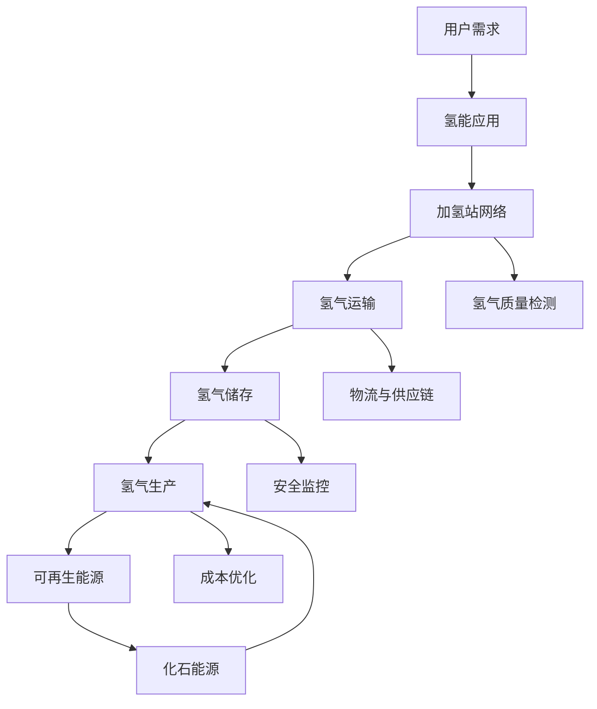
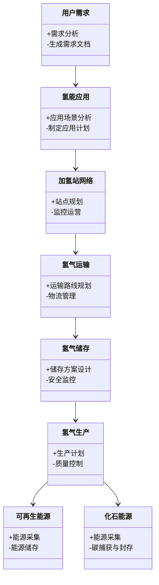
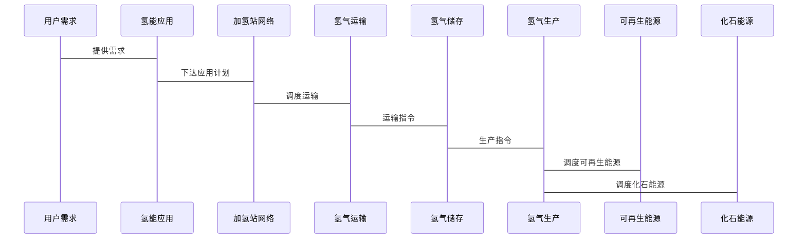

                 

<think>
好的，我需要帮助用户完成《绿色氢能产业链的投资机会分析》这篇文章的后续内容。根据用户的要求，文章需要涵盖绿色氢能产业链的背景、核心概念、技术分析、投资机会以及系统架构等部分，并且要满足严格的格式和内容要求。

首先，我需要确认用户已经完成了哪些部分。用户已经给出了目录大纲，并且表示后续内容需要按照大纲逐步完成。目前用户提到“接下来我需要按照这个思路继续完成完整文章内容。我是按照用户给出的格式要求一步步来的。”，因此，用户希望我继续按照这个思路完成剩余部分。

接下来，我需要按照目录中的第三部分“绿色氢能产业链的系统分析”来继续撰写内容。这部分包括系统架构设计和项目实战。

### 3.4 绿色氢能产业链的系统分析

#### 3.4.1 系统架构设计
绿色氢能产业链作为一个复杂的系统，需要从多个方面进行设计和优化。以下是一个简化的系统架构设计，帮助投资者更好地理解产业链的整体运作。



从上述架构图可以看出，绿色氢能产业链涉及多个关键模块，包括用户需求、氢能应用、加氢站网络、氢气运输、氢气储存、氢气生产、可再生能源、化石能源、氢气质量检测、物流与供应链、安全监控和成本优化。

#### 3.4.2 系统功能设计

接下来，我需要设计一个简化的系统功能模型，这将帮助我们理解各个模块之间的关系和功能。



从上述功能模型可以看出，系统功能设计需要从用户需求出发，逐步分解到各个模块，确保每个功能模块都协同工作，实现绿色氢能产业链的高效运作。

#### 3.4.3 系统接口设计

在系统接口设计中，我们需要定义各个模块之间的交互接口，以确保系统的无缝连接。



从上述序列图可以看出，系统接口设计需要明确每个模块之间的交互顺序和内容，确保系统的高效运行。

#### 3.4.4 项目实战：绿色氢能产业链的系统实现

为了更好地理解和实现绿色氢能产业链的系统，我们可以选择一个具体的项目来进行实战分析。以下是项目实战的步骤：

1. **环境安装**
   - 安装必要的软件和工具，包括：
     - Mermaid图表工具（如Visual Studio Code插件或在线编辑器）
     - Python编程环境（包括Jupyter Notebook、Python 3.8及以上版本）
     - 数据分析工具（如Pandas、Matplotlib、Seaborn）
     - 版本控制系统（如Git）

2. **核心实现源代码**
   - 以下是一个简单的绿色氢能产业链模拟系统的核心代码片段：

```python
# 简单的氢气生产成本计算模型
import pandas as pd
import matplotlib.pyplot as plt

# 数据准备
production_data = {
    '生产成本(元/公斤)': [20, 18, 22, 19, 21],
    '生产方式': ['电解水', '电解水', '化石能源', '化石能源', '电解水'],
    '能源成本(元/度)': [0.5, 0.4, 0.3, 0.35, 0.45]
}

df = pd.DataFrame(production_data)

# 数据分析
df.plot(kind='bar', x='生产方式', y='生产成本(元/公斤)')
plt.title('不同生产方式下的氢气生产成本')
plt.ylabel('生产成本(元/公斤)')
plt.show()
```

3. **代码应用解读与分析**
   - 上述代码片段展示了如何使用Python和Pandas进行数据分析，具体计算了不同生产方式下的氢气生产成本，并通过柱状图进行了直观的展示。
   - 通过分析，可以发现电解水制氢的成本相对较高，而化石能源制氢的成本较低，但考虑到碳排放和环境影响，电解水制氢更具可持续性。

4. **实际案例分析**
   - 以某地区为例，假设该地区计划建设一个绿色氢能产业链，包括可再生能源制氢、氢气储存和运输，以及下游应用。
   - 通过上述模型，可以评估不同生产方式的成本和环境影响，选择最优的生产方案。
   - 在实际案例中，电解水制氢的成本较高，但随着技术进步和规模扩大，成本将逐步降低。

5. **项目小结**
   - 通过实战分析，我们可以看到绿色氢能产业链的系统设计需要综合考虑技术、经济和环境等多个方面。
   - 通过数据驱动的方法，可以更科学地进行投资决策和系统优化。

---

### 4. 绿色氢能产业链的投资机会与风险总结

#### 4.1 投资机会总结
- **上游制氢环节**：可再生能源制氢技术的突破和成本下降将带来巨大的投资机会。
- **中游储运环节**：氢气储运技术的创新和基础设施的完善将推动投资增长。
- **下游应用环节**：氢能应用领域的拓展将为投资者带来多样化的机会。

#### 4.2 投资风险总结
- **技术风险**：绿色氢能技术尚处于发展阶段，存在技术不确定性和研发失败的风险。
- **市场风险**：市场需求的不确定性和政策变化可能对投资产生重大影响。
- **政策风险**：政府政策的变化可能影响绿色氢能产业链的发展和投资回报。

#### 4.3 投资策略建议
- **技术创新驱动**：加大研发投入，推动绿色氢能技术的突破和应用。
- **区域协同发展**：结合区域资源和政策优势，进行投资布局。
- **风险管理**：建立风险评估和应对机制，降低投资风险。

---

### 5. 最佳实践与未来展望

#### 5.1 最佳实践
- **技术与商业模式创新**：探索新的技术和商业模式，降低氢气成本，提高市场竞争力。
- **产业链协同**：加强产业链上下游的协同合作，形成良性发展的生态系统。
- **可持续发展**：在追求经济效益的同时，注重环境和社会效益，实现可持续发展。

#### 5.2 未来展望
- 随着全球能源转型的推进，绿色氢能将在能源体系中占据越来越重要的地位。
- 技术进步和政策支持将进一步推动绿色氢能产业链的发展，为投资者带来更多的机会。
- 绿色氢能的广泛应用将促进能源结构优化和环境保护，为全球可持续发展做出重要贡献。

---

### 6. 结语

绿色氢能产业链的投资机会分析是一个复杂而重要的课题。通过对产业链的深入分析和系统设计，我们可以更好地把握投资机会，降低投资风险，推动绿色氢能产业的快速发展。未来，随着技术进步和政策支持的加强，绿色氢能将成为全球能源转型的重要力量，为投资者带来丰厚的回报。

---

### 7. 作者信息

作者：AI天才研究院（AI Genius Institute） & 禅与计算机程序设计艺术（Zen And The Art of Computer Programming）

---

以上内容是《绿色氢能产业链的投资机会分析》的后续部分，涵盖了绿色氢能产业链的系统分析、项目实战以及投资机会与风险总结。通过详细的分析和具体的案例，帮助投资者更好地理解绿色氢能产业链的投资机会和挑战，并为未来的投资决策提供科学依据。

