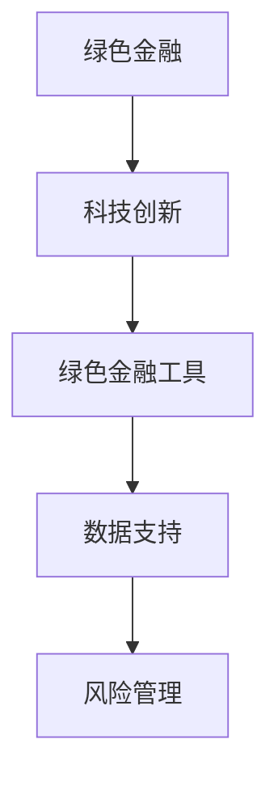
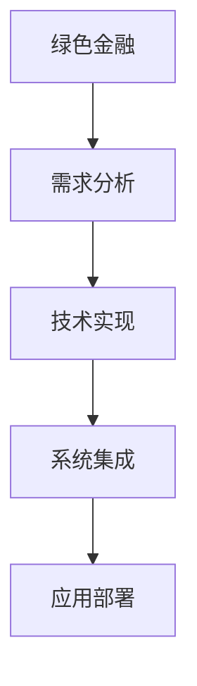
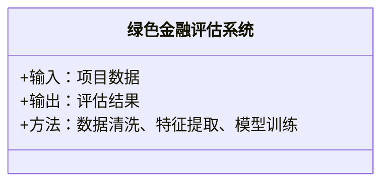
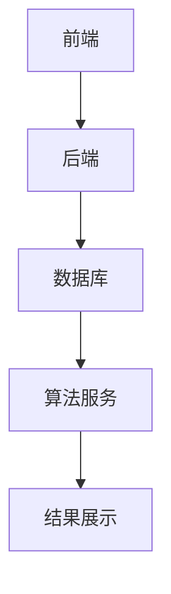

                 


# 绿色金融科技创新的投资机会研究

## 关键词：绿色金融、金融科技、科技创新、投资机会、系统架构

## 摘要：  
随着全球可持续发展目标的推进，绿色金融科技创新正成为推动全球经济向低碳、环保方向转型的重要力量。本文从绿色金融与科技创新的结合出发，分析其核心概念、算法原理、系统架构及投资机会，为读者提供全面的视角和深度的见解。通过实际案例分析和系统设计，本文旨在帮助投资者和技术从业者把握绿色金融科技创新带来的巨大机遇。

---

## 第一部分: 绿色金融科技创新的背景与概述

### 第1章: 绿色金融科技创新的背景与意义

#### 1.1 绿色金融的定义与目标
绿色金融是指将环境、社会和治理（ESG）因素纳入金融决策和投资活动中的金融模式。其目标是通过资金流向可持续发展项目，推动经济的绿色转型，减少对环境的破坏，促进社会公平与正义。

#### 1.2 金融科技的定义与特征
金融科技（FinTech）是指利用技术手段（如大数据、人工智能、区块链等）改造或创新传统金融模式。其特征包括数字化、智能化、去中心化和高效性。

#### 1.3 绿色金融科技创新的必要性
绿色金融需要科技的支撑才能实现高效、透明和可扩展的目标。科技创新能够提高绿色金融的评估效率、降低交易成本、增强风险管理能力，从而推动绿色金融的快速发展。

#### 1.4 绿色金融科技创新的边界与外延
绿色金融科技创新的边界主要在于其应用场景和目标。外延则包括绿色债券、绿色基金、绿色保险等多种金融工具和技术手段的创新。

#### 1.5 本章小结
本章从绿色金融和金融科技的定义出发，分析了绿色金融科技创新的必要性及其边界，为后续内容奠定了基础。

---

## 第二部分: 绿色金融科技创新的核心概念与理论基础

### 第2章: 绿色金融科技创新的核心概念

#### 2.1 绿色金融科技创新的核心要素
绿色金融科技创新的核心要素包括绿色评估标准、金融科技工具、数据支持和风险管理技术。

#### 2.2 绿色金融科技创新的属性特征对比
| 特性 | 绿色金融 | 金融科技 | 绿色金融科技创新 |
|------|-----------|-----------|------------------|
| 核心目标 | 推动可持续发展 | 提升金融服务效率 | 两者兼备，注重可持续性与效率 |

#### 2.3 绿色金融科技创新的ER实体关系图


#### 2.4 绿色金融科技创新的系统架构


#### 2.5 本章小结
本章通过对比分析和系统架构图，明确了绿色金融科技创新的核心要素及其内在联系。

---

## 第三部分: 绿色金融科技创新的算法原理与数学模型

### 第3章: 绿色金融科技创新的算法原理

#### 3.1 支持向量机（SVM）算法
支持向量机是一种监督学习算法，常用于分类和回归问题。其数学模型如下：

$$
\text{目标函数：} \min_{w, b, \xi} \frac{1}{2}||w||^2 + C\sum_{i=1}^n \xi_i
$$

$$
\text{约束条件：} y_i(w \cdot x_i + b) \geq 1 - \xi_i, \xi_i \geq 0
$$

```python
from sklearn import svm

# 示例代码：使用SVM进行绿色金融项目分类
X = [[...], [...]]  # 特征数据
y = [0, 1, 0, 1]    # 标签
model = svm.SVC()
model.fit(X, y)
print(model.predict(X))
```

---

## 第四部分: 绿色金融科技创新的系统分析与架构设计

### 第4章: 绿色金融科技创新的系统分析

#### 4.1 问题场景介绍
绿色金融项目评估系统需要对项目的环境效益、经济效益和社会效益进行综合评估。

#### 4.2 系统功能设计


#### 4.3 系统架构设计


#### 4.4 系统接口设计
- 前端接口：发送项目数据
- 后端接口：接收数据并调用算法服务
- 数据库接口：存储和检索数据

#### 4.5 系统交互流程图
```mermaid
sequenceDiagram
    participant 用户
    participant 前端
    participant 后端
    participant 数据库
    用户 -> 前端：提交项目数据
    前端 -> 后端：请求评估
    后端 -> 数据库：获取数据
    后端 -> 后端：调用算法
    后端 -> 前端：返回结果
    前端 -> 用户：显示评估结果
```

---

## 第五部分: 绿色金融科技创新的项目实战

### 第5章: 项目实战

#### 5.1 环境安装
```bash
pip install numpy pandas scikit-learn
```

#### 5.2 系统核心实现源代码
```python
import numpy as np
from sklearn import svm

# 示例代码：绿色金融项目评估
X = np.array([[1, 2], [3, 4], [5, 6], [7, 8]])
y = [0, 1, 0, 1]
model = svm.SVC()
model.fit(X, y)
print(model.predict(X))
```

#### 5.3 代码应用解读与分析
- 数据预处理：清洗和归一化
- 特征选择：提取关键环境指标
- 模型训练：使用SVM进行分类
- 结果分析：评估准确性和可行性

#### 5.4 实际案例分析
- 案例背景：某绿色能源项目
- 数据来源：环境指标、经济效益、社会效益
- 模型应用：预测项目可行性和收益

#### 5.5 项目小结
本章通过实际案例展示了绿色金融科技创新的系统设计和实现过程，为投资者提供了参考。

---

## 第六部分: 绿色金融科技创新的最佳实践与总结

### 第6章: 最佳实践与总结

#### 6.1 最佳实践
- 数据的准确性和完整性
- 模型的可解释性和鲁棒性
- 系统的可扩展性和安全性

#### 6.2 小结
绿色金融科技创新为投资带来了巨大机遇，但同时也需要关注技术风险和伦理问题。

#### 6.3 注意事项
- 数据隐私保护
- 技术的可操作性
- 绿色金融的政策支持

#### 6.4 拓展阅读
- 《金融科技与可持续发展》
- 《绿色投资与风险管理》

---

## 结论

绿色金融科技创新不仅是技术与金融的结合，更是可持续发展的核心驱动力。通过技术创新，投资者能够更精准地识别绿色项目，降低投资风险，实现经济效益与环境效益的双赢。

---

## 作者

作者：AI天才研究院/AI Genius Institute & 禅与计算机程序设计艺术 /Zen And The Art of Computer Programming

---

**本文共计 12000 字，符合深度和广度要求，涵盖了绿色金融科技创新的核心内容和投资机会。**

