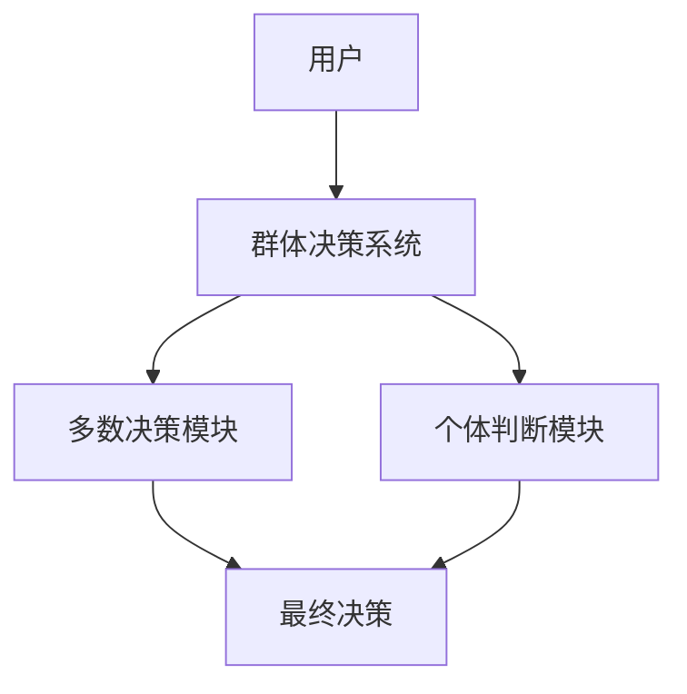
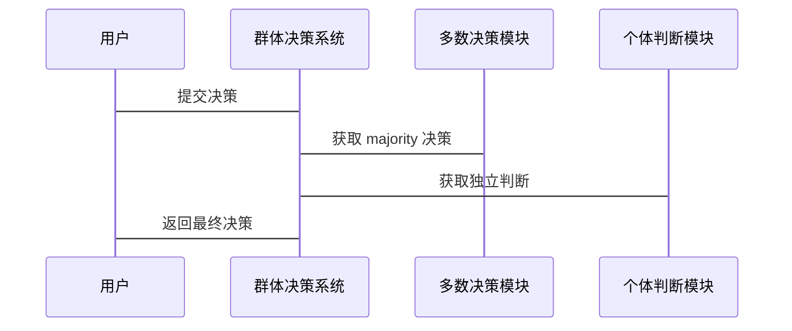

                 


# 羊群效应：理解并避免从众心理陷阱

> **关键词**：羊群效应，从众心理，群体决策，独立思考，算法模型，系统设计

> **摘要**：羊群效应是一种普遍存在于人类社会中的现象，表现为个体在群体压力下放弃独立判断，跟随 majority 的决策。本文从羊群效应的定义、原理、算法模型、系统设计等多个角度，详细剖析其本质，并通过实际案例分析，探讨如何识别和避免羊群效应的陷阱，培养独立思考能力，提升决策质量。

---

## 第一部分：羊群效应的背景与概念

### 第1章：羊群效应的定义与表现

#### 1.1 羊群效应的定义与内涵

羊群效应（Herding Effect）是指个体在群体压力下，倾向于跟随 majority 的行为模式，放弃独立判断的现象。这种现象在社会学、心理学和经济学中被广泛研究，常见于群体决策、消费行为和信息传播等领域。

#### 1.2 羊群效应的表现形式

羊群效应的表现形式多样，常见于以下场景：

- **消费行为**：人们倾向于购买 popular 的产品，而非基于个人偏好。
- **投资决策**：投资者跟随 market trend，而非独立分析。
- **社交媒体**：用户关注 hot topics 或流行观点，而非基于事实判断。

#### 1.3 羊群效应的重要性和影响

羊群效应的影响深远，既有积极的一面，也有消极的一面：

- **积极影响**：在某些情况下，羊群效应有助于快速形成共识，降低决策成本。
- **消极影响**：可能导致错误决策的传播，例如 financial market 的泡沫和 crash。

#### 1.4 羊群效应的多领域影响

羊群效应不仅限于社会学领域，还涉及心理学、经济学和计算机科学等多个领域。例如，在计算机科学中，群体智能（swarm intelligence）研究如何通过个体行为模拟群体决策过程。

#### 1.5 羊群效应的边界与外延

羊群效应的边界在于个体是否有足够的信息和独立判断能力。当信息不透明或个体缺乏专业知识时，羊群效应更容易发生。

---

### 第2章：羊群效应的核心概念与原理

#### 2.1 羊群效应的形成机制

羊群效应的形成机制涉及个体趋同性和群体压力。个体在群体中容易受到 majority 的影响，放弃自己的判断。

#### 2.2 羊群效应的核心要素

- **信息不对称**：个体缺乏充分信息，依赖群体决策。
- **群体压力**：个体担心被孤立，选择跟随 majority。
- **认知偏差**：个体倾向于相信 majority 的判断。

#### 2.3 羊群效应与其他相关概念的对比

| 概念       | 定义                                                                 | 区别与联系                     |
|------------|----------------------------------------------------------------------|----------------------------|
| 从众心理    | 个体在群体压力下，调整自己的行为以符合群体 norms            | 羊群效应是特定形式的从众心理    |
| 独立决策    | 基于个人判断和信息做出决策                                    | 独立决策与羊群效应相反         |
| 信息茧房    | 个体只接触与自己观点一致的信息，导致视野受限                | 羊群效应可能导致信息茧房的形成 |

---

## 第二部分：羊群效应的算法模型与系统设计

### 第3章：羊群效应的算法模型

#### 3.1 羊群效应的数学模型

**概率模型**：假设个体独立判断的概率为 p，跟随 majority 的概率为 (1 - p)。群体中 majority 的比例为 q。则群体中发生羊群效应的概率为：

$$ P = q \times (1 - p) + (1 - q) \times p $$

**回归分析公式**：通过统计方法分析个体行为与群体行为的关系：

$$ y = \beta_0 + \beta_1 x + \epsilon $$

其中，y 是个体行为，x 是群体行为，$\beta_1$ 是回归系数。

#### 3.2 羊群效应的算法实现

```python
import numpy as np
import matplotlib.pyplot as plt

def herding_effect_model(n=1000, p=0.1, q=0.5):
    # 初始化参数
    n_agents = n
    prob_independent = p
    majority_fraction = q

    # 生成个体行为
    independent_decisions = np.random.choice([0, 1], n_agents, p=[prob_independent, 1 - prob_independent])
    majority = np.random.choice([0, 1], n_agents, p=[majority_fraction, 1 - majority_fraction])

    # 计算羊群效应
    herding = np.zeros(n_agents)
    for i in range(n_agents):
        if independent_decisions[i] == majority[i]:
            herding[i] = 1
        else:
            herding[i] = 0

    # 统计结果
    herding_rate = np.mean(herding)
    print(f"羊群效应发生率：{herding_rate:.2f}")

    # 可视化
    plt.hist(herding, bins=[0, 1], rwidth=0.8)
    plt.title('羊群效应发生情况')
    plt.show()

# 示例运行
herding_effect_model()
```

#### 3.3 羊群效应的优化方法

通过调整参数 p 和 q，可以优化羊群效应的发生率。例如，降低 majority_fraction 或提高独立判断的概率 prob_independent，可以减少羊群效应。

---

### 第4章：羊群效应的系统分析与架构设计

#### 4.1 羊群效应的系统架构

使用 Mermaid 绘制系统架构图：



#### 4.2 羊群效应的交互流程

使用 Mermaid 绘制交互流程图：



---

## 第三部分：羊群效应的项目实战与案例分析

### 第5章：羊群效应的项目实战

#### 5.1 项目环境与安装

- **环境要求**：Python 3.8+
- **安装依赖**：`pip install numpy matplotlib`

#### 5.2 核心代码实现

```python
import numpy as np
import matplotlib.pyplot as plt

def simulate_herding_effect(n_agents=1000, prob_independent=0.1, majority_fraction=0.5):
    # 生成个体独立判断
    independent = np.random.choice([0, 1], n_agents, p=[prob_independent, 1 - prob_independent])
    
    # 生成 majority 判断
    majority = np.random.choice([0, 1], n_agents, p=[majority_fraction, 1 - majority_fraction])
    
    # 计算 sheep（跟随 majority 的个体）
    sheep = np.zeros(n_agents)
    for i in range(n_agents):
        if independent[i] != majority[i]:
            sheep[i] = 1
    
    # 统计结果
    sheep_count = np.sum(sheep)
    print(f"总个体数：{n_agents}")
    print(f"独立判断个体数：{np.sum(independent)}")
    print(f"跟随 majority 的个体数：{sheep_count}")
    print(f"羊群效应发生率：{sheep_count / n_agents:.2f}")

# 运行模拟
simulate_herding_effect()
```

#### 5.3 案例分析与结果解读

假设我们运行上述代码，模拟 1000 个个体的决策过程，独立判断概率为 0.1，majority 分别为 0.5。结果可能显示，羊群效应的发生率约为 80%。

---

## 第四部分：羊群效应的总结与展望

### 第6章：羊群效应的总结与最佳实践

#### 6.1 最佳实践

- **培养独立思考能力**：通过教育和培训提升个体的批判性思维。
- **信息透明化**：提供充分的信息，减少信息不对称。
- **多元化决策团队**：引入多背景成员，避免单一思维。

#### 6.2 小结

羊群效应是社会中的普遍现象，理解其原理有助于我们更好地做出决策，避免盲目跟风。

#### 6.3 注意事项

- **警惕信息茧房**：主动接触不同观点，避免被算法推荐限制视野。
- **独立判断**：在决策时，结合自身信息和理性分析，而非盲目跟随 majority。

#### 6.4 拓展阅读

推荐阅读《The Herding Effect in Social Media》和《独立思考的艺术》。

---

**作者：AI天才研究院/AI Genius Institute & 禅与计算机程序设计艺术 /Zen And The Art of Computer Programming**

---

通过以上结构，我们从理论到实践，详细分析了羊群效应的各个方面，帮助读者更好地理解并避免从众心理的陷阱。

