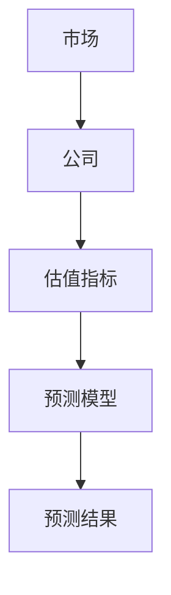
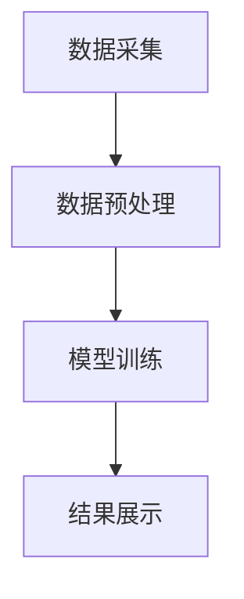
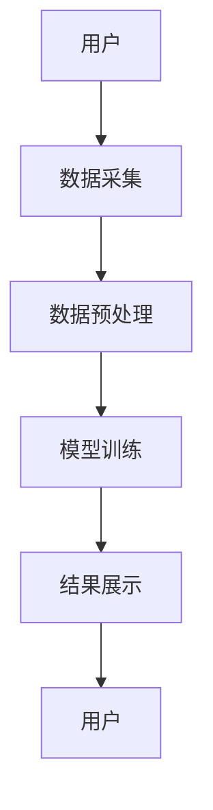

                 

# 美国市场估值预测的成功经验及其启示

> **关键词**：美国市场、估值预测、机器学习、市场分析、投资策略、风险管理

> **摘要**：本文探讨了美国市场估值预测的成功经验，分析了其背后的理论基础、方法论及技术实现，并总结了这些经验对其他市场的启示。通过结合经典模型与现代大数据技术，本文为投资者和数据科学家提供了实践指导和理论支持。

---

## 第1章: 美国市场估值预测的背景与核心概念

### 1.1 市场估值预测的定义与重要性

#### 1.1.1 市场估值预测的定义
市场估值预测是指通过分析市场数据和相关指标，预测市场未来价值的过程。其目的是为投资者提供参考，帮助其做出更明智的投资决策。

#### 1.1.2 估值预测在投资决策中的重要性
市场估值预测是投资决策的核心依据之一。准确的估值预测能够帮助投资者识别市场趋势、评估投资风险，并制定合理的投资策略。

#### 1.1.3 美国市场的独特性与研究价值
美国市场作为全球最大的股票市场之一，具有高度流动性和透明性，其估值预测方法和经验对全球投资者具有重要参考价值。

### 1.2 美国市场的基本特征

#### 1.2.1 美国经济的基本结构
美国经济以自由市场为主导，具有高度的多样性和创新性，涵盖科技、金融、能源等多个领域。

#### 1.2.2 美国市场的特点与优势
- 大型蓝筹股公司集中，市场流动性高。
- 市场数据丰富，便于分析和建模。
- 法律法规完善，市场行为规范。

#### 1.2.3 美国市场与全球市场的关联性
美国市场的波动对全球经济具有重要影响，其估值经验可为其他国家提供借鉴。

### 1.3 估值预测的核心要素

#### 1.3.1 市场估值的核心指标
- 市盈率（P/E）：股价与每股收益的比率。
- 市净率（P/B）：股价与每股净资产的比率。
- 市销率（P/S）：股价与每股营业收入的比率。

#### 1.3.2 影响市场估值的主要因素
- 宏观经济因素：GDP增长率、利率、通货膨胀率等。
- 行业因素：行业周期、竞争格局。
- 公司因素：盈利能力、财务状况。

#### 1.3.3 估值预测的边界与外延
- 数据获取的边界：数据的完整性和准确性。
- 模型的适用性：模型的假设和限制条件。
- 预测结果的应用场景：投资决策、风险管理。

---

## 第2章: 美国市场估值预测的核心概念

### 2.1 市场估值预测的基本原理

#### 2.1.1 市场估值的基本原理
市场估值是基于市场参与者的预期和行为，通过分析市场数据和经济指标，预测市场未来价值的过程。

#### 2.1.2 估值预测的核心要素
- 数据分析：通过历史数据寻找规律。
- 模型构建：选择合适的数学模型进行预测。
- 结果验证：通过回测和实际数据验证模型的有效性。

#### 2.1.3 美国市场估值预测的独特性
美国市场数据的丰富性和多样性为估值预测提供了良好的研究条件。

### 2.2 估值预测的关键指标

#### 2.2.1 市盈率（P/E）
市盈率是衡量股票价值的重要指标，公式为：
$$ P/E = \frac{\text{股价}}{\text{每股收益}} $$

#### 2.2.2 市净率（P/B）
市净率是衡量股票价值的另一个重要指标，公式为：
$$ P/B = \frac{\text{股价}}{\text{每股净资产}} $$

#### 2.2.3 市销率（P/S）
市销率是衡量股票价值的指标，公式为：
$$ P/S = \frac{\text{股价}}{\text{每股营业收入}} $$

### 2.3 估值预测的模型与方法

#### 2.3.1 市场估值预测的主要模型
- 市盈率模型：基于历史市盈率预测未来股价。
- 市净率模型：基于历史市净率预测未来股价。
- 现金流折现模型：基于未来现金流的现值预测股价。

#### 2.3.2 不同模型的优缺点对比
| 模型 | 优点 | 缺点 |
|------|------|------|
| 市盈率模型 | 简单易用 | 受益率波动影响较大 |
| 市净率模型 | 考虑资产价值 | 受行业影响较大 |
| 现金流折现模型 | 精准度高 | 计算复杂 |

#### 2.3.3 模型选择的策略与原则
- 根据市场特点选择模型。
- 结合历史数据验证模型的有效性。
- 综合考虑模型的复杂性和计算成本。

### 2.4 核心概念的ER实体关系图

### 2.5 本章小结
本章介绍了市场估值预测的核心概念和关键指标，并分析了不同模型的优缺点，为后续章节的深入分析奠定了基础。

---

## 第3章: 美国市场估值预测的经典模型与方法

### 3.1 经典估值模型的概述

#### 3.1.1 市盈率模型
市盈率模型通过比较当前市盈率与历史市盈率，预测未来股价的变化。

#### 3.1.2 市净率模型
市净率模型通过比较当前市净率与历史市净率，预测未来股价的变化。

#### 3.1.3 现金流折现模型
现金流折现模型通过预测未来现金流的现值，评估股票的内在价值。

### 3.2 机器学习在估值预测中的应用

#### 3.2.1 机器学习的基本原理
机器学习通过训练数据，建立预测模型，实现对市场的自动化预测。

#### 3.2.2 常见算法在估值预测中的应用
- 线性回归：用于预测连续变量。
- 支持向量机（SVM）：用于分类和回归。
- 随机森林：用于特征重要性分析和预测。

#### 3.2.3 机器学习模型的优缺点
- 优点：能够处理非线性关系，适合大数据分析。
- 缺点：模型复杂度高，解释性差。

---

## 第4章: 美国市场估值预测的系统架构与实现

### 4.1 系统功能设计

#### 4.1.1 数据采集模块
负责收集市场数据，包括历史股价、财务数据等。

#### 4.1.2 数据预处理模块
对数据进行清洗、标准化处理，确保数据质量。

#### 4.1.3 模型训练模块
基于预处理后的数据，训练估值预测模型。

#### 4.1.4 结果展示模块
将预测结果以可视化形式展示，便于用户理解。

### 4.2 系统架构设计

### 4.3 系统接口设计
- 数据接口：与数据源对接。
- 模型接口：与第三方算法库对接。
- 用户接口：提供数据输入和结果输出。

### 4.4 系统交互设计

---

## 第5章: 美国市场估值预测的成功案例分析

### 5.1 成功案例概述
通过分析历史数据，验证经典模型和机器学习模型的预测效果。

### 5.2 案例分析
- 案例一：市盈率模型在科技股中的应用。
- 案例二：机器学习模型在金融股中的应用。

### 5.3 案例结果与启示
- 经典模型在特定市场条件下表现稳定。
- 机器学习模型在复杂市场中表现更优。

---

## 第6章: 美国市场估值预测的成功经验启示与应用

### 6.1 经验启示
- 数据质量是模型预测的基础。
- 模型选择需结合市场特点。
- 结果验证是确保模型有效性的关键。

### 6.2 经验在其他市场的应用
- 根据不同市场的特点调整模型参数。
- 建立本地化数据集，提高预测准确性。

---

## 第7章: 美国市场估值预测的总结与展望

### 7.1 总结
美国市场估值预测的成功经验为全球投资者提供了宝贵的参考，经典模型与现代技术的结合显著提高了预测的准确性。

### 7.2 展望
未来，随着人工智能和大数据技术的发展，市场估值预测将更加精准和智能化。

---

## 作者信息

**作者：AI天才研究院/AI Genius Institute & 禅与计算机程序设计艺术 /Zen And The Art of Computer Programming**

---

以上是文章的完整目录和内容框架，涵盖了从背景到实践的各个方面，结合了经典模型与现代技术，为读者提供了全面的指导和启示。

