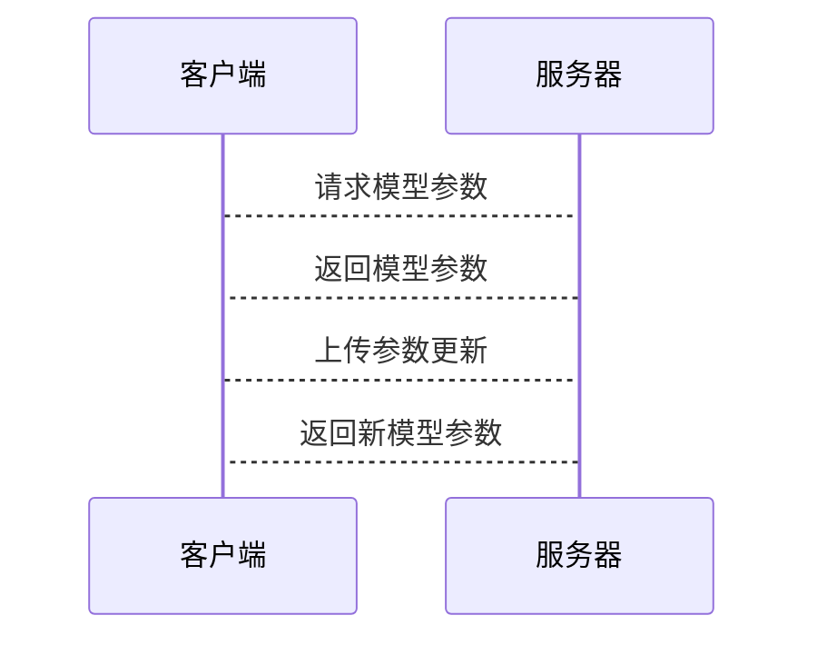

                 


# 联邦学习在AI Agent隐私保护中的应用

## 关键词：联邦学习，AI Agent，隐私保护，分布式学习，数据安全

## 摘要：  
随着人工智能技术的快速发展，AI Agent（智能体）在各个领域的应用越来越广泛。然而，AI Agent在实现复杂任务时，往往需要处理大量敏感数据，这带来了严重的隐私安全问题。联邦学习作为一种新兴的分布式机器学习技术，能够在保护数据隐私的前提下，实现模型的联合训练。本文将深入探讨联邦学习在AI Agent隐私保护中的应用，分析其核心原理、系统架构以及实际应用案例，为读者提供全面的技术解读。

---

# 第1章：联邦学习与AI Agent的基本概念

## 1.1 联邦学习的定义与特点  
联邦学习（Federated Learning）是一种分布式机器学习技术，旨在在不将数据集中到一个中心服务器的情况下，实现多个设备或机构之间的模型联合训练。其核心特点包括：  
- **数据隐私性**：数据无需离开本地设备，仅上传模型更新参数。  
- **分布式协作**：多个参与者（设备或机构）协作训练，避免数据集中存储。  
- **灵活性**：适用于多种模型架构和任务类型。  

## 1.2 AI Agent的基本概念  
AI Agent是一种具备自主决策能力的智能体，能够感知环境、执行任务并与其他实体交互。其核心功能包括：  
- **感知环境**：通过传感器或数据输入获取信息。  
- **决策与推理**：基于感知信息进行推理和决策。  
- **执行操作**：根据决策结果执行具体操作。  

## 1.3 联邦学习在AI Agent中的应用意义  
AI Agent在处理复杂任务时，通常需要收集和分析大量数据，但这些数据可能包含敏感信息。联邦学习通过分布式训练的方式，能够在保护数据隐私的前提下，提升AI Agent的学习能力和任务执行效率。  

---

# 第2章：联邦学习与AI Agent的核心概念对比  

## 2.1 联邦学习的核心原理  
- **通信机制**：通过安全通道交换模型参数，而不是实际数据。  
- **隐私保护**：通过加密和差分隐私等技术，确保数据的安全性。  

## 2.2 AI Agent的核心原理  
- **决策机制**：基于当前状态和环境信息，选择最优动作。  
- **学习机制**：通过强化学习或监督学习等方法，优化决策策略。  

## 2.3 对比分析表格  

| 比较维度 | 联邦学习 | AI Agent |  
|----------|----------|----------|  
| 核心目标 | 分布式模型训练 | 自主决策与任务执行 |  
| 数据需求 | 分散在多个设备或机构 | 需要感知环境数据 |  
| 隐私保护 | 是 | 是（依赖联邦学习技术） |  

## 2.4 ER实体关系图  
```mermaid
erDiagram
    participant 设备1 {
        id
        数据1
    }
    participant 设备2 {
        id
        数据2
    }
    participant 服务器 {
        id
        模型参数
    }
    设备1 --> 服务器: 上传更新参数
    设备2 --> 服务器: 上传更新参数
```

---

# 第3章：联邦学习的算法原理  

## 3.1 联邦学习的算法概述  
- **主要算法类型**：包括联邦平均（FedAvg）、联邦直推（FedProx）等。  
- **优缺点分析**：通信开销大，但隐私保护能力强。  

## 3.2 联邦平均算法（FedAvg）  
### 算法步骤  
```mermaid
graph TD
    A[客户端1] --> B[服务器]: 上传参数更新
    C[客户端2] --> B: 上传参数更新
    B --> D[全局模型更新]
    D --> E[客户端1]: 下载新参数
    D --> F[客户端2]: 下载新参数
```

### 数学公式  
$$ \text{全局模型更新} = \frac{1}{N} \sum_{i=1}^{N} \theta_i $$  
其中，$\theta_i$ 是客户端i的模型参数，$N$ 是客户端总数。  

## 3.3 联邦直推算法（FedProx）  
### 算法步骤  
```mermaid
graph TD
    A[客户端1] --> B[服务器]: 上传参数更新
    C[客户端2] --> B: 上传参数更新
    B --> D[全局模型更新]
    D --> E[客户端1]: 下载新参数
    D --> F[客户端2]: 下载新参数
```

### 数学公式  
$$ \text{损失函数} = \text{CE}(y, f(x)) + \lambda \| \theta - \theta_{\text{prev}} \|^2 $$  
其中，$\theta$ 是当前模型参数，$\theta_{\text{prev}}$ 是上一次更新的模型参数。  

## 3.4 联邦学习算法的实现代码  
### 代码实现  
```python
import numpy as np

class FederatedLearning:
    def __init__(self, clients, server):
        self.clients = clients
        self.server = server

    def train(self, num_epochs):
        for epoch in range(num_epochs):
            for client in self.clients:
                # 客户端上传参数更新
                self.server.receive_update(client.send_update())
            # 服务器更新全局模型
            self.server.update_global_model()

        return self.server.global_model
```

---

# 第4章：AI Agent的系统架构设计  

## 4.1 AI Agent的系统功能设计  
### 功能模块划分  
- **感知模块**：负责数据采集和环境感知。  
- **决策模块**：负责模型训练和决策推理。  
- **执行模块**：负责任务执行和反馈收集。  

### 交互流程设计  


---

# 第5章：联邦学习在AI Agent中的应用  

## 5.1 数据隐私保护的实现  
- **数据加密**：通过同态加密或差分隐私技术保护数据。  
- **模型更新**：仅上传模型参数，避免数据泄露。  

## 5.2 模型协作与优化  
- **分布式训练**：多个AI Agent协作训练，提升模型性能。  
- **隐私保护机制**：确保模型更新过程中数据的安全性。  

---

# 第6章：项目实战  

## 6.1 环境搭建  
- **安装依赖**：安装PyTorch、Flask等库。  

## 6.2 核心代码实现  
```python
import torch
import torch.nn as nn
from torch.utils.data import DataLoader

class Client:
    def __init__(self, model):
        self.model = model

    def send_update(self):
        return self.model.state_dict()

    def receive_update(self, global_model):
        self.model.load_state_dict(global_model)
```

## 6.3 实际案例分析  
- **案例背景**：多个AI Agent协作训练图像分类模型。  
- **实现步骤**：客户端上传模型参数，服务器更新全局模型。  

---

# 第7章：系统优化与未来展望  

## 7.1 系统优化方案  
- **通信优化**：减少模型更新的通信开销。  
- **隐私增强**：引入更强大的加密技术，如零知识证明。  

## 7.2 未来展望  
- **跨领域应用**：联邦学习在医疗、金融等领域的进一步拓展。  
- **技术融合**：与区块链、边缘计算等技术的结合，提升隐私保护能力。  

---

# 作者  
作者：AI天才研究院 & 禅与计算机程序设计艺术

