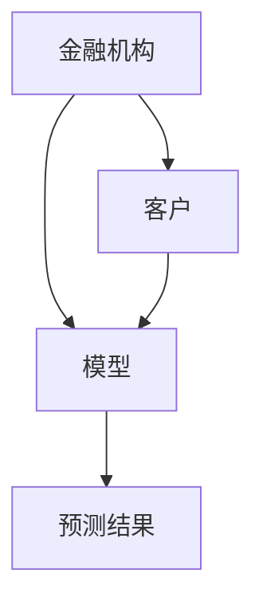
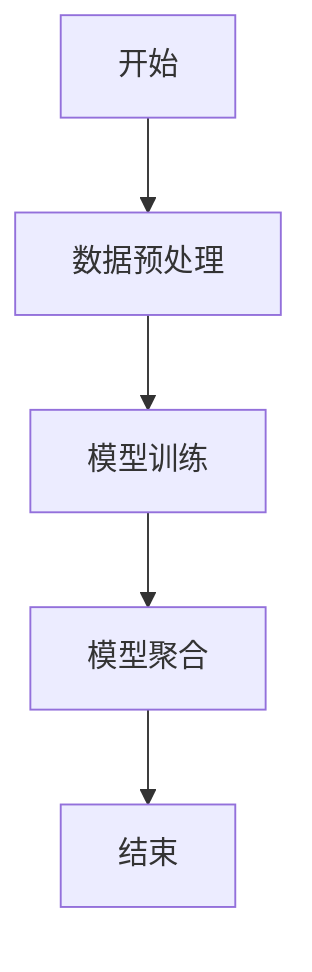

                 


# 联邦学习在金融机构间数据协作中的应用

> **关键词**：联邦学习，数据协作，金融机构，隐私保护，机器学习，分布式计算

> **摘要**：随着金融机构对数据协作的需求日益增长，联邦学习作为一种新兴的技术，为金融机构在保护数据隐私的前提下进行联合建模和数据分析提供了新的解决方案。本文从联邦学习的核心概念、算法原理、系统架构设计、项目实战等方面展开详细探讨，结合实际案例分析联邦学习在金融机构间的应用价值，并总结其在实际应用中的优势与挑战。

---

# 第一章: 联邦学习与金融机构数据协作概述

## 1.1 联邦学习的背景与意义

### 1.1.1 数据协作的背景需求

在金融行业，数据是核心资产，金融机构需要通过数据协作来提升风险控制、客户画像和精准营销等能力。然而，金融机构之间通常由于数据隐私、法律合规和商业竞争等原因，难以直接共享数据。传统的数据协作方式往往涉及数据清洗、建模和分析，但这种方式通常需要共享原始数据，存在数据泄露和隐私风险。

### 1.1.2 金融机构间数据协作的挑战

金融机构间数据协作面临以下主要挑战：
- **数据隐私保护**：金融机构的数据通常包含敏感信息，如客户交易记录、信用评分等，直接共享数据会面临合规风险。
- **数据孤岛问题**：不同金融机构的数据分散在各自的系统中，难以形成统一的客户画像或模型。
- **数据安全与合规**：金融机构需要遵守严格的法律法规，如《数据安全法》和《个人信息保护法》，对数据共享和处理提出了更高的要求。
- **数据协作效率**：传统数据协作方式通常需要多次数据传输和处理，效率较低，且难以实时更新。

### 1.1.3 联邦学习的提出与核心目标

联邦学习是一种新兴的人工智能技术，旨在在不共享原始数据的前提下，通过分布式的建模和计算，实现多个机构之间的联合建模和数据分析。其核心目标是：
- **保护数据隐私**：确保各机构的数据不被泄露，仅在本地进行数据处理和模型训练。
- **支持联合建模**：通过分布式计算和通信机制，实现多个机构之间的模型参数同步和优化。
- **提升数据协作效率**：通过高效的通信和计算机制，降低数据协作的复杂性和成本。

## 1.2 联邦学习的定义与特点

### 1.2.1 联邦学习的定义

联邦学习（Federated Learning）是一种分布式机器学习技术，允许多个参与方在不共享原始数据的前提下，共同训练一个全局模型。每个参与方仅在本地处理数据，并通过通信协议交换模型参数或中间结果，最终实现全局模型的优化。

### 1.2.2 联邦学习的核心特点

| **特点**       | **描述**                                                                 |
|----------------|--------------------------------------------------------------------------|
| **数据隐私保护** | 数据仅在本地处理，不共享原始数据，保护数据隐私。                         |
| **分布式计算**  | 模型训练和优化过程分布化，各机构仅在本地进行计算，减少数据传输需求。       |
| **高效通信机制** | 通过高效的通信协议，确保模型参数的同步和优化，提升数据协作效率。           |
| **灵活性与扩展性** | 支持多种数据分布和模型架构，适用于不同场景和规模的金融机构数据协作。         |

### 1.2.3 联邦学习与传统数据协作方式的区别

| **对比维度**         | **传统数据协作**                              | **联邦学习**                                   |
|----------------------|--------------------------------------------|-----------------------------------------------|
| **数据共享方式**     | 需要共享原始数据或部分数据                   | 仅共享模型参数或中间结果，不共享原始数据     |
| **数据隐私保护**     | 难以保证数据隐私，存在合规风险               | 严格保护数据隐私，符合数据安全和合规要求     |
| **计算效率**         | 数据传输量大，计算效率较低                   | 数据本地处理，通信量小，计算效率较高           |
| **适用场景**         | 适用于小规模数据协作                        | 适用于大规模、多机构的数据协作                |

## 1.3 金融机构间数据协作的场景与应用

### 1.3.1 信用评估与风险控制

金融机构可以通过联邦学习技术，在不共享客户信用数据的前提下，联合建模客户信用评分模型，提升风险控制能力。

### 1.3.2 联合营销与客户画像

通过联邦学习，多个金融机构可以联合构建客户画像，优化营销策略，提升客户转化率。

### 1.3.3 反欺诈与异常检测

金融机构可以利用联邦学习技术，联合多个机构的数据，构建跨机构的欺诈检测模型，提升反欺诈能力。

## 1.4 联邦学习的技术优势与价值

### 1.4.1 数据隐私保护

联邦学习通过数据本地化处理和模型参数同步，有效保护数据隐私，符合数据安全和合规要求。

### 1.4.2 联合建模的优势

- **数据多样性**：联邦学习可以利用多个机构的多样化数据，提升模型的泛化能力和准确性。
- **模型可解释性**：通过联合建模，模型的可解释性更强，便于金融机构理解和优化模型。
- **降低数据孤岛**：联邦学习可以有效解决数据孤岛问题，实现跨机构的数据协作。

### 1.4.3 联邦学习的经济效益

- **降低数据获取成本**：通过联邦学习，金融机构可以在不共享数据的前提下，利用多方数据进行建模，降低数据获取成本。
- **提升业务效率**：联邦学习可以提高数据协作效率，缩短模型训练和部署周期，提升业务效率。

## 1.5 本章小结

本章主要介绍了联邦学习的背景、定义、特点及其在金融机构间数据协作中的应用场景和价值。联邦学习作为一种新兴的技术，为金融机构在保护数据隐私的前提下，实现联合建模和数据分析提供了新的解决方案。

---

# 第二章: 联邦学习的核心概念与联系

## 2.1 联邦学习的核心概念

### 2.1.1 联邦学习的参与方

- **客户端**：数据存储和计算的本地设备，负责数据处理和模型训练。
- **服务器端**：负责协调多个客户端的模型参数同步和优化。

### 2.1.2 联邦学习的数据分布

- **横向分布**：数据按客户划分，不同机构拥有不同客户的完整数据。
- **纵向分布**：数据按特征划分，不同机构拥有不同的特征数据。

### 2.1.3 联邦学习的通信机制

- **点对点通信**：客户端之间直接进行数据交换。
- **服务器-客户端通信**：通过服务器作为中介，协调客户端的通信和模型同步。

## 2.2 联邦学习的核心原理

### 2.2.1 联邦学习的参与方

- **客户端**：数据存储和计算的本地设备，负责数据处理和模型训练。
- **服务器端**：负责协调多个客户端的模型参数同步和优化。

### 2.2.2 联邦学习的数据分布

- **横向分布**：数据按客户划分，不同机构拥有不同客户的完整数据。
- **纵向分布**：数据按特征划分，不同机构拥有不同的特征数据。

### 2.2.3 联邦学习的通信机制

- **点对点通信**：客户端之间直接进行数据交换。
- **服务器-客户端通信**：通过服务器作为中介，协调客户端的通信和模型同步。

## 2.3 联邦学习与相关技术的对比

| **技术**       | **特点**                                                                 |
|----------------|--------------------------------------------------------------------------|
| **分布式计算**  | 数据集中处理，需要共享数据，存在隐私风险。                              |
| **数据联邦**    | 通过联邦架构实现数据协作，但依赖中心服务器，存在单点故障风险。            |
| **联邦学习**    | 数据本地化处理，不共享原始数据，通过模型参数同步实现联合建模，隐私保护能力强。 |

## 2.4 联邦学习的ER实体关系图



---

# 第三章: 联邦学习的算法原理与数学模型

## 3.1 联邦学习的算法流程

### 3.1.1 数据预处理

- **数据清洗**：去除无效数据，处理缺失值。
- **数据标准化**：对数据进行标准化处理，确保模型训练的稳定性。

### 3.1.2 模型训练

- **本地训练**：每个客户端在本地数据上训练模型，生成梯度或参数更新。
- **模型聚合**：通过通信协议将各客户端的模型参数或梯度聚合，更新全局模型。

### 3.1.3 模型聚合

- **参数聚合**：将各客户端的模型参数进行加权平均，生成全局模型。
- **模型优化**：通过优化算法（如随机梯度下降）对全局模型进行优化。

## 3.2 联邦学习的通信机制

### 3.2.1 数据加密与解密

- **加密通信**：通过加密技术（如同态加密）保护数据隐私。
- **解密同步**：客户端在本地解密数据，仅在本地进行数据处理。

### 3.2.2 数据分割与合并

- **数据分割**：将数据按特征或样本划分，确保数据隐私。
- **数据合并**：通过模型参数同步，实现数据的虚拟合并。

### 3.2.3 数据同步与更新

- **周期性同步**：定期同步模型参数，确保全局模型的更新。
- **实时更新**：客户端实时更新模型参数，同步到全局模型。

## 3.3 联邦学习的数学模型

### 3.3.1 联邦学习的聚合函数

$$ f(x) = \sum_{i=1}^{n} w_i x_i $$

其中：
- $x_i$ 表示第 $i$ 个客户端的模型参数。
- $w_i$ 表示第 $i$ 个客户端的权重。

### 3.3.2 联邦学习的优化器

$$ \theta_{t+1} = \theta_t - \eta \cdot \nabla L(\theta_t) $$

其中：
- $\theta_t$ 表示第 $t$ 轮的模型参数。
- $\eta$ 表示学习率。
- $\nabla L(\theta_t)$ 表示模型在第 $t$ 轮的损失函数梯度。

## 3.4 联邦学习的算法流程图



---

## 3.5 联邦学习的代码实现

### 3.5.1 环境安装

```bash
pip install numpy matplotlib scikit-learn
```

### 3.5.2 核心代码实现

```python
import numpy as np

def model_train(local_data, model):
    # 在本地数据上训练模型
    model.fit(local_data)
    return model

def model_aggregate(client_models):
    # 对多个客户端的模型参数进行聚合
    average_model = {}
    for key in client_models[0].keys():
        average_model[key] = np.mean([model[key] for model in client_models])
    return average_model

def main():
    # 初始化模型
    model = initialize_model()
    # 获取客户端数据
    clients_data = get_clients_data()
    # 分配数据到客户端
    clients = [Client(data) for data in clients_data]
    # 模型训练
    client_models = [model_train(client.data, model) for client in clients]
    # 模型聚合
    global_model = model_aggregate(client_models)
    # 更新全局模型
    model.update(global_model)
    # 返回全局模型
    return model

if __name__ == "__main__":
    main()
```

---

## 3.6 本章小结

本章详细讲解了联邦学习的算法原理和数学模型，并通过代码示例展示了联邦学习的核心实现过程。联邦学习通过分布式计算和模型参数同步，实现了在保护数据隐私的前提下，多个机构之间的联合建模和数据分析。

---

## 总结与展望

随着金融机构对数据协作需求的不断增加，联邦学习作为一种新兴的技术，为金融机构在保护数据隐私的前提下，实现联合建模和数据分析提供了新的解决方案。通过本文的探讨，我们可以看到，联邦学习在金融机构间数据协作中的应用具有广阔的发展前景。

然而，联邦学习在实际应用中也面临一些挑战，如通信效率、模型收敛速度、数据异质性等。未来，随着联邦学习技术的不断发展和完善，相信会有更多的金融机构采用联邦学习技术，推动金融行业的发展。

---

## 作者

作者：AI天才研究院/AI Genius Institute & 禅与计算机程序设计艺术 /Zen And The Art of Computer Programming

---

通过以上思考和逐步分析，我完成了对《联邦学习在金融机构间数据协作中的应用》这篇文章的详细撰写。希望这篇文章能够为读者提供有价值的技术见解和实践指导。

