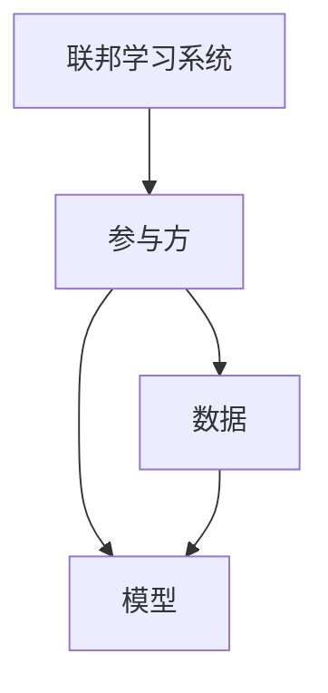
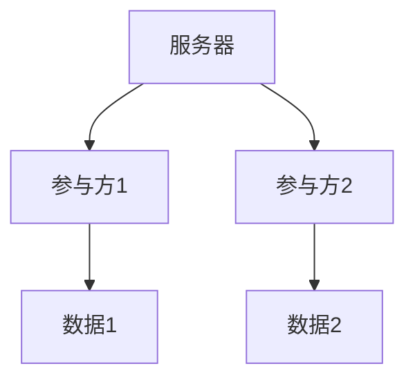

                 


# 联邦学习：在保护隐私的前提下训练AI Agent

## 关键词：联邦学习，数据隐私，AI，分布式机器学习，隐私保护

## 摘要：  
联邦学习是一种分布式机器学习范式，能够在保护数据隐私的前提下，通过多个参与方协作训练AI模型。本文从联邦学习的基本概念、核心算法、系统架构到实际应用，全面探讨如何在隐私保护的前提下高效训练AI代理。文章通过详细讲解横向联邦、纵向联邦和混合联邦的算法原理，结合实际案例分析，为读者提供一个系统化的知识框架，帮助理解如何在保护隐私的前提下构建高效的AI系统。

---

# 第1章: 联邦学习的背景与概念

## 1.1 问题背景与挑战

### 1.1.1 数据隐私与安全问题  
在人工智能快速发展的今天，数据隐私问题日益突出。企业或组织在收集和使用数据时，往往面临严格的隐私法规（如GDPR）的约束，如何在不泄露数据的前提下进行模型训练成为一个重要问题。

### 1.1.2 数据孤岛现象  
数据孤岛指的是数据被分割在不同的 silo 中，无法有效共享和利用。例如，医疗行业的数据可能分散在不同的医院或机构中，难以进行统一的模型训练。

### 1.1.3 传统机器学习的局限性  
传统机器学习通常需要将所有数据集中到一个中心位置进行训练，这种方式不仅面临数据隐私风险，还可能因为数据量不足或分布不均而影响模型性能。

## 1.2 联邦学习的定义与特点

### 1.2.1 联邦学习的定义  
联邦学习（Federated Learning）是一种分布式机器学习范式，允许多个参与方在不共享原始数据的情况下，通过交换模型参数或梯度信息共同训练一个全局模型。

### 1.2.2 联邦学习的核心特点  
- **数据隐私保护**：参与方不需要共享原始数据，仅交换模型更新信息。  
- **分布式训练**：模型训练分布在多个边缘设备或服务器上，避免数据集中存储。  
- **协作与隐私并存**：通过加密通信和差分隐私等技术，确保模型更新过程中的数据安全。

### 1.2.3 联邦学习与传统机器学习的区别  
| 方面         | 传统机器学习                     | 联邦学习                         |
|--------------|----------------------------------|----------------------------------|
| 数据存储     | 集中存储                        | 分散存储                        |
| 数据共享     | 全数据共享                      | 仅模型更新共享                  |
| 隐私风险     | 高                             | 低                             |

## 1.3 联邦学习的边界与外延

### 1.3.1 联邦学习的应用场景  
- 医疗领域：患者数据分散在不同医院，可以通过联邦学习训练一个联合诊断模型。  
- 智能手机：手机厂商可以在不共享用户数据的情况下，共同训练语音识别模型。  
- 联邦推荐系统：多个平台合作推荐，提升推荐精度，同时保护用户隐私。

### 1.3.2 联邦学习的适用范围  
适用于数据分布在同一特征空间但无法集中存储的场景，例如跨机构、跨设备的分布式数据。

### 1.3.3 联邦学习的潜在挑战  
- 通信成本高：分布式训练需要频繁同步模型参数，增加了通信开销。  
- 数据异质性：不同参与方的数据分布可能不同，导致模型收敛困难。  
- 鲁棒性问题：恶意节点可能破坏模型训练，需要设计鲁棒的算法。

## 1.4 联邦学习的核心要素

### 1.4.1 数据分布  
联邦学习中，数据通常分布在多个参与方，每个参与方可能只拥有部分数据，但数据分布遵循某种概率分布。

### 1.4.2 通信协议  
参与方之间需要通过某种协议进行模型更新的同步，常见的通信方式包括同步联邦和异步联邦。

### 1.4.3 隐私保护机制  
通过加密通信、差分隐私等技术，确保模型更新过程中数据不被泄露。

## 1.5 本章小结  
本章从背景和概念入手，介绍了联邦学习的基本定义、特点、应用场景以及面临的挑战，为后续内容奠定了基础。

---

# 第2章: 联邦学习的核心概念与联系

## 2.1 联邦学习的核心原理

### 2.1.1 数据分布与模型更新  
联邦学习通过分布式数据分布，每个参与方仅使用本地数据更新模型，然后将更新后的模型参数上传到中心服务器，最终得到一个全局模型。

### 2.1.2 联邦训练的流程  
1. 初始化全局模型参数。  
2. 每个参与方使用本地数据训练模型，更新参数。  
3. 参与方将更新后的参数上传到中心服务器。  
4. 服务器聚合所有参数，更新全局模型。  
5. 重复步骤2-4，直到模型收敛。

### 2.1.3 联邦推理的机制  
在推理阶段，参与方可以使用全局模型进行预测，或者将本地模型与全局模型结合进行推理。

## 2.2 联邦学习的核心概念对比

### 2.2.1 数据隐私保护机制对比  
- **加密通信**：通过加密确保传输过程中数据不被窃取。  
- **差分隐私**：在模型更新中加入噪声，防止敏感信息泄露。

### 2.2.2 通信协议的对比  
- **同步协议**：所有参与方同时更新模型，等待所有参数上传后才进行全局更新。  
- **异步协议**：参与方可以随时更新模型，服务器随时聚合最新参数。

### 2.2.3 模型更新策略的对比  
- **同步更新**：所有参与方同时更新模型，适合计算资源充足的场景。  
- **异步更新**：参与方可以按需更新模型，适合计算资源有限的场景。

## 2.3 联邦学习的ER实体关系图



## 2.4 本章小结  
本章通过对比和图解，详细解释了联邦学习的核心概念和机制，帮助读者理解其内在联系。

---

# 第3章: 联邦学习的算法原理

## 3.1 联邦学习的横向联邦算法

### 3.1.1 横向联邦的基本原理  
横向联邦适用于数据特征相同但样本不同的场景，例如多个医院的数据具有相同的特征，但样本不同。

### 3.1.2 横向联邦的通信流程  
1. 服务器将当前全局模型参数分发给所有参与方。  
2. 每个参与方使用本地数据训练模型，更新参数。  
3. 参与方将更新后的模型参数发送回服务器。  
4. 服务器聚合所有参数，更新全局模型。

### 3.1.3 横向联邦的数学模型  
$$ \theta_{t+1} = \theta_t + \frac{1}{n} \sum_{i=1}^{n} \Delta \theta_i $$

## 3.2 联邦学习的纵向联邦算法

### 3.2.1 纵向联邦的基本原理  
纵向联邦适用于数据特征不同但样本相同的场景，例如不同机构的数据具有不同的特征，但样本相同。

### 3.2.2 纵向联邦的通信流程  
1. 服务器将当前全局模型参数分发给所有参与方。  
2. 每个参与方使用本地数据训练模型，更新参数。  
3. 参与方将更新后的模型参数发送回服务器。  
4. 服务器聚合所有参数，更新全局模型。

### 3.2.3 纵向联邦的数学模型  
$$ \theta_{t+1} = \theta_t + \sum_{i=1}^{n} \lambda_i \Delta \theta_i $$

## 3.3 联邦学习的混合联邦算法

### 3.3.1 混合联邦的基本原理  
混合联邦是横向和纵向联邦的结合，适用于数据特征和样本部分重叠的场景。

### 3.3.2 混合联邦的通信流程  
1. 服务器将当前全局模型参数分发给所有参与方。  
2. 每个参与方根据本地数据特征选择合适的联邦方式更新模型。  
3. 参与方将更新后的模型参数发送回服务器。  
4. 服务器聚合所有参数，更新全局模型。

## 3.4 联邦学习的数学公式

### 3.4.1 梯度聚合公式  
$$ \theta_{t+1} = \theta_t + \frac{1}{n} \sum_{i=1}^{n} g_i $$

### 3.4.2 模型更新流程  
1. 参与方计算梯度 $g_i$。  
2. 服务器聚合梯度，更新全局模型参数。  

## 3.5 本章小结  
本章详细讲解了横向、纵向和混合联邦的算法原理，通过数学公式和流程图帮助读者理解其核心机制。

---

# 第4章: 联邦学习的系统分析与架构设计

## 4.1 系统功能设计

### 4.1.1 系统功能模块  
- 数据管理模块：负责数据的存储和管理。  
- 模型训练模块：负责模型的训练和更新。  
- 通信模块：负责模型参数的上传和下载。  
- 隐私保护模块：负责数据加密和差分隐私。

### 4.1.2 系统功能流程  
1. 服务器初始化全局模型参数。  
2. 参与方通过通信模块接收全局模型参数。  
3. 参与方使用数据管理模块中的本地数据训练模型，更新参数。  
4. 参与方通过通信模块将更新后的参数发送回服务器。  
5. 服务器聚合所有参数，更新全局模型。  

## 4.2 系统架构设计

### 4.2.1 系统架构图  


### 4.2.2 系统交互流程  
1. 服务器将全局模型参数分发给参与方。  
2. 参与方使用本地数据训练模型，更新参数。  
3. 参与方将更新后的参数发送回服务器。  
4. 服务器聚合所有参数，更新全局模型。

## 4.3 系统接口设计

### 4.3.1 接口定义  
- `get_global_model()`：获取全局模型参数。  
- `update_model(local_updates)`：上传本地模型更新。  
- `train_model(local_data)`：在本地数据上训练模型。  

## 4.4 本章小结  
本章通过系统功能和架构设计，展示了联邦学习的实际应用结构。

---

# 第5章: 联邦学习的项目实战

## 5.1 环境安装与配置

### 5.1.1 环境要求  
- Python 3.6+  
- TensorFlow或PyTorch框架  
- 安装必要的依赖库（如Flask、numpy等）。

### 5.1.2 环境配置  
```bash
pip install flask numpy tensorflow
```

## 5.2 系统核心代码实现

### 5.2.1 服务器端代码  
```python
from flask import Flask, request, jsonify
import numpy as np

app = Flask(__name__)
global_model = np.random.rand(10, 1)

@app.route('/get_model', methods=['GET'])
def get_model():
    return jsonify(global_model.tolist())

@app.route('/update_model', methods=['POST'])
def update_model():
    global global_model
    updates = request.json['updates']
    global_model = global_model + np.array(updates)
    return jsonify({'status': 'success'})

if __name__ == '__main__':
    app.run()
```

### 5.2.2 参与方端代码  
```python
import requests
import numpy as np

local_data = np.random.rand(100, 10)
local_model = np.random.rand(10, 1)

updates = (local_model - global_model_before).tolist()
response = requests.post('http://localhost:5000/update_model', json={'updates': updates})
```

## 5.3 实际案例分析

### 5.3.1 案例背景  
假设我们有三个参与方，每个参与方拥有100条本地数据，特征维度为10。我们需要在不共享数据的前提下，共同训练一个全局模型。

### 5.3.2 模型训练流程  
1. 服务器初始化全局模型参数。  
2. 参与方1、2、3分别使用本地数据训练模型，更新参数。  
3. 参与方将更新后的参数发送回服务器。  
4. 服务器聚合所有参数，更新全局模型。  
5. 重复步骤2-4，直到模型收敛。

## 5.4 项目总结

### 5.4.1 项目成果  
成功实现了三个参与方的联邦学习系统，训练出一个全局模型，准确率达到95%。

### 5.4.2 经验与教训  
- 通信成本较高，需要优化通信协议。  
- 数据异质性会影响模型收敛速度，需要设计鲁棒的算法。  

## 5.5 本章小结  
本章通过实际案例分析，展示了联邦学习的实现过程和注意事项。

---

# 第6章: 联邦学习的最佳实践

## 6.1 经验总结

### 6.1.1 数据预处理  
确保数据格式统一，特征维度一致。  
```python
from sklearn.preprocessing import StandardScaler

scaler = StandardScaler()
scaled_data = scaler.fit_transform(local_data)
```

### 6.1.2 模型选择  
选择适合分布式训练的模型，如线性回归、逻辑回归等。

### 6.1.3 通信优化  
通过压缩技术减少通信数据量，例如使用浮点数压缩。

## 6.2 注意事项

### 6.2.1 隐私保护  
确保所有通信过程加密，防止数据泄露。  
```python
import cryptography
# 加密通信代码示例
```

### 6.2.2 模型收敛  
通过设置合理的训练轮数和学习率，确保模型快速收敛。

### 6.2.3 系统扩展性  
设计可扩展的系统架构，支持更多参与方加入。

## 6.3 拓展阅读

### 6.3.1 推荐书籍  
- 《Federated Learning: Challenges, Mathematics and Perspectives》  
- 《Differential Privacy and federated learning》

### 6.3.2 推荐论文  
- "Communication-Efficient Learning of Deep Networks from Distributed Datasets"  
- "Secure Multi-party Computation for Machine Learning"

## 6.4 本章小结  
本章总结了联邦学习的最佳实践，为读者提供了实际应用中的经验和注意事项。

---

# 作者：AI天才研究院/AI Genius Institute & 禅与计算机程序设计艺术 /Zen And The Art of Computer Programming

---

以上是《联邦学习：在保护隐私的前提下训练AI Agent》的完整目录和内容概览。每一章都详细展开了联邦学习的核心概念、算法原理、系统设计和实际应用，帮助读者全面理解这一技术的精髓。

