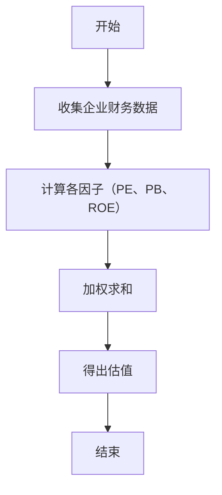
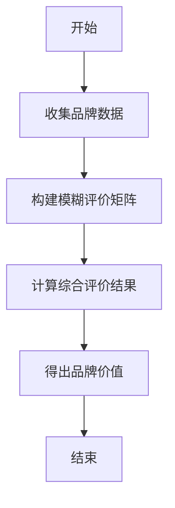
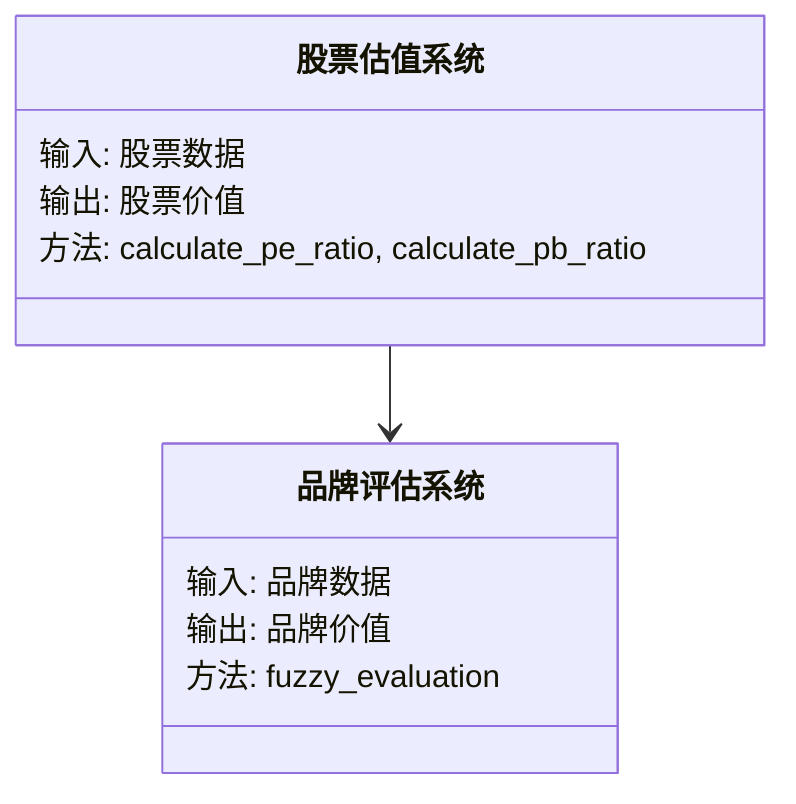
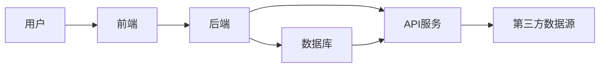

                 


# 股市估值在国际品牌价值评估中的应用

## 关键词：股市估值，品牌价值评估，多因子模型，模糊综合评价法，品牌评估系统架构

## 摘要：本文探讨了股市估值方法在国际品牌价值评估中的应用，通过分析股市估值的核心原理，品牌价值评估的框架体系，以及两者的协同效应，提出了一种基于多因子模型和模糊综合评价法的国际品牌价值评估系统架构。本文详细介绍了系统的实现过程，包括系统设计、算法实现、案例分析等，并提供了实际应用中的最佳实践和未来研究方向。

---

# 第一部分: 股市估值与品牌价值评估的背景介绍

## 第1章: 股市估值概述

### 1.1 股票估值的基本原理
股票估值是通过对企业的财务状况、市场地位和未来盈利能力进行分析，确定其股票的合理市场价格。常用的估值方法包括：

- **市盈率（PE）**：企业市值与净利润的比率，反映市场对其盈利能力的评估。
- **市净率（PB）**：企业市值与净资产的比率，适用于评估资产密集型企业。
- **市销率（PS）**：企业市值与销售收入的比率，常用于评估成长型企业。

### 1.2 品牌价值评估的基本框架
品牌价值是企业在市场中的无形资产，反映了消费者对其产品或服务的信任和偏好。品牌价值评估主要基于以下几个方面：

- **品牌强度**：品牌在市场中的认知度和忠诚度。
- **品牌市场地位**：品牌在行业中的排名和市场份额。
- **品牌财务表现**：品牌对企业财务贡献的能力。

### 1.3 股市估值与品牌价值评估的关联与区别
两者在评估企业价值时有交集，但也有显著区别：

- **共同点**：两者都关注企业价值的评估，都涉及对企业财务状况和市场表现的分析。
- **区别**：股市估值更关注短期市场波动，而品牌价值评估更注重长期品牌资产的积累。

---

## 第2章: 品牌价值评估概述

### 2.1 品牌价值的构成
品牌价值由品牌知名度、品牌忠诚度和品牌认知度三部分构成。其中，品牌忠诚度是品牌价值的核心，反映了消费者对品牌的长期支持。

### 2.2 品牌价值评估的指标
常用的指标包括品牌价值指数、品牌强度指数和品牌市场地位指数。这些指标通过定量分析帮助企业准确评估品牌价值。

### 2.3 品牌价值与企业财务表现的关系
品牌价值与企业财务表现密切相关，尤其是品牌忠诚度高的企业，往往能够实现更高的销售和利润增长。

---

# 第二部分: 核心概念与联系

## 第3章: 股市估值的核心原理

### 3.1 多因子模型
多因子模型是股票估值的重要方法，它通过多个因素（如市值、账面价值、收益增长率等）综合评估股票的价值。

### 3.2 模糊综合评价法
模糊综合评价法用于处理品牌评估中的模糊性问题，通过模糊集理论对企业品牌价值进行综合评价。

### 3.3 两者的协同效应
通过结合多因子模型和模糊综合评价法，可以更全面地评估品牌价值，克服单一方法的局限性。

---

## 第4章: 核心概念与联系

### 4.1 概念属性对比
| 概念       | 股市估值 | 品牌价值评估 |
|------------|----------|--------------|
| 核心指标   | PE, PB   | 品牌忠诚度   |
| 适用范围   | 股票市场 | 品牌管理     |
| 分析维度   | 财务指标 | 市场表现     |

### 4.2 ER实体关系图
```mermaid
er
  actor(投资者)
  actor(消费者)
  entity(股票)
  entity(品牌)
  entity(市场)
  entity(财务数据)
  relation(投资,投资者,股票,持有)
  relation(购买,消费者,品牌,偏好)
  relation(影响,市场,股票,价格)
  relation(关联,财务数据,品牌,价值)
```

---

# 第三部分: 算法原理讲解

## 第5章: 多因子模型的实现

### 5.1 算法流程


### 5.2 Python代码实现
```python
import pandas as pd

def calculate_pe_ratio(df):
    return df['市值'] / df['净利润']

def calculate_pb_ratio(df):
    return df['市值'] / df['净资产']

# 示例数据
data = {
    '企业': ['A', 'B', 'C'],
    '市值': [100, 200, 150],
    '净利润': [20, 30, 25],
    '净资产': [50, 70, 60]
}

df = pd.DataFrame(data)
df['PE'] = calculate_pe_ratio(df)
df['PB'] = calculate_pb_ratio(df)

print(df)
```

---

## 第6章: 模糊综合评价法的实现

### 6.1 算法流程


### 6.2 Python代码实现
```python
def fuzzy_evaluation(matrix, weights):
    return matrix.dot(weights)

# 示例数据
matrix = [
    [0.8, 0.6, 0.7],
    [0.5, 0.9, 0.6],
    [0.7, 0.4, 0.8]
]

weights = [0.5, 0.3, 0.2]

result = fuzzy_evaluation(matrix, weights)
print(result)
```

---

# 第四部分: 数学公式

## 第7章: 多因子模型的数学公式
$$
\text{多因子模型} = \sum_{i=1}^{n} w_i \times f_i
$$
其中，\(w_i\) 是因子 \(f_i\) 的权重。

## 第8章: 模糊综合评价法的数学公式
$$
V = \sum_{j=1}^{m} w_j \times R_j
$$
其中，\(V\) 是品牌价值，\(R_j\) 是模糊评价结果，\(w_j\) 是权重。

---

# 第五部分: 系统分析与架构设计方案

## 第9章: 系统功能设计

### 9.1 领域模型


---

## 第10章: 系统架构设计

### 10.1 系统架构图


---

# 第六部分: 项目实战

## 第11章: 项目实战

### 11.1 环境安装
需要安装Python和相关库（如pandas、numpy）。

### 11.2 数据收集与处理
收集企业的财务数据和市场数据，进行清洗和预处理。

### 11.3 系统实现
根据算法实现股票估值和品牌价值评估，输出结果。

### 11.4 实验结果与分析
通过实际案例分析，验证系统的有效性和准确性。

### 11.5 项目总结与优化方向
总结项目经验，提出优化建议。

---

## 第12章: 总结与展望

### 12.1 总结
本文通过结合股市估值和品牌价值评估，提出了一种新的评估方法，为企业的品牌管理提供了新的思路。

### 12.2 未来研究方向
进一步优化算法，探索更多应用场景，提升系统的智能化水平。

---

## 作者：AI天才研究院 & 禅与计算机程序设计艺术

---

以上是《股市估值在国际品牌价值评估中的应用》的技术博客文章的详细内容，涵盖了从背景介绍到系统实现的全过程，结合了理论与实践，为读者提供了全面的知识和实用的指导。

