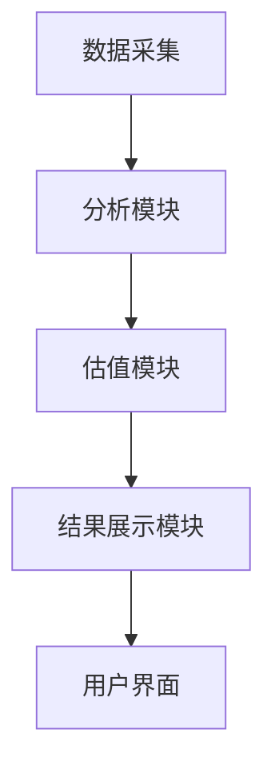

                 


# 股市估值在国际品牌价值链分析中的应用

> 关键词：股市估值、国际品牌、价值链分析、企业价值、金融市场

> 摘要：本文探讨了如何将股市估值方法应用于国际品牌价值链分析，以帮助企业更好地评估品牌价值和制定战略决策。通过分析股市估值的核心理论和国际品牌价值链的关键环节，本文提出了结合两者的方法，并通过实际案例展示了其应用和效果。

---

## 目录

1. **概述**
   1.1 股市估值的基本概念
   1.2 国际品牌价值链的基本概念
   1.3 股市估值与国际品牌价值链的结合

2. **股市估值的理论基础**
   2.1 股市估值的基本原理
   2.2 股市估值的主要方法
   2.3 股市估值的数学模型

3. **国际品牌价值链的分析框架**
   3.1 价值链的构成要素
   3.2 国际品牌价值链的分析模型
   3.3 价值链分析的核心要素

4. **股市估值与国际品牌价值链的结合**
   4.1 股市估值方法在品牌价值链分析中的应用
   4.2 品牌价值链对股市估值的影响
   4.3 结合应用的实际案例分析

5. **系统架构设计**
   5.1 系统功能模块设计
   5.2 系统架构设计图
   5.3 系统接口设计

6. **项目实战**
   6.1 项目环境安装与配置
   6.2 核心代码实现
   6.3 案例分析与结果展示

7. **总结与展望**
   7.1 内容总结
   7.2 未来发展方向
   7.3 注意事项与建议

---

## 1. 概述

### 1.1 股市估值的基本概念

股市估值是通过对企业的财务数据、市场表现和行业地位等多方面因素的分析，来评估企业股票的内在价值。其核心在于帮助企业确定股票的合理价格区间，以便做出投资决策。

- **核心概念**：
  - 股票的内在价值：基于企业未来现金流的现值。
  - 市场价值：股票在市场上的实际交易价格。
  - 影响因素：盈利能力、成长潜力、行业地位、宏观经济环境等。

- **关键指标**：
  - 市盈率（P/E）：市价与每股收益的比率。
  - 市净率（P/B）：市价与每股净资产的比率。
  - 股息率：每股股息与股票价格的比率。

### 1.2 国际品牌价值链的基本概念

国际品牌价值链分析是将品牌的整个价值创造过程分解为多个环节，分析每个环节对品牌价值的贡献。其核心在于通过优化价值链的各个环节来提升品牌竞争力。

- **价值链构成**：
  - 采购与供应链管理：确保原材料的高效采购和管理。
  - 生产与制造：产品的生产过程。
  - 市场与销售：品牌推广和产品销售。
  - 客户服务：客户支持和售后服务。

- **分析模型**：
  - 价值流分析：识别价值链中的关键环节。
  - 成本收益分析：评估每个环节的成本与收益。
  - 竞争力分析：比较品牌在价值链各环节的竞争力。

### 1.3 股市估值与国际品牌价值链的结合

将股市估值方法应用于国际品牌价值链分析，可以帮助企业更好地评估品牌价值和制定战略决策。其主要结合方式包括：

- **结合方式**：
  - 基于价值链的估值模型：将品牌价值链中的各个环节与股市估值指标相结合，建立综合评估体系。
  - 价值链优化与估值提升：通过优化价值链的各个环节，提升品牌价值和股票估值。

- **结合价值**：
  - 提高估值准确性：通过分析价值链各环节的贡献，更准确地评估品牌价值。
  - 优化战略决策：基于估值分析，制定更具针对性的营销、生产和投资策略。

---

## 2. 股市估值的理论基础

### 2.1 股市估值的基本原理

股市估值的核心在于通过分析企业的财务数据和市场表现，评估其股票的内在价值。以下是其基本原理：

- **内在价值与市场价值**：
  - 内在价值是基于企业未来现金流的现值。
  - 市场价值是股票在市场上的实际交易价格，受市场情绪和投资者预期的影响。

- **现金流折现法**：
  - 将未来现金流折现，计算其现值，作为股票的内在价值。
  - 公式：$$ V = \sum_{t=1}^{n} \frac{CF_t}{(1+r)^t} $$
  - 其中，\( V \) 为内在价值，\( CF_t \) 为第 \( t \) 年的现金流，\( r \) 为折现率。

- **相对估值法**：
  - 通过比较同类公司的估值指标，如市盈率、市净率等，估算目标公司的合理估值。
  - 市盈率公式：$$ P/E = \frac{P}{E} $$
  - 市净率公式：$$ P/B = \frac{P}{B} $$

### 2.2 股市估值的主要方法

- **基本分析**：
  - 通过分析企业的财务报表，评估其盈利能力、成长潜力和财务健康状况。
  - 关键指标：净利润率、资产负债率、ROE（净资产收益率）。

- **技术分析**：
  - 通过分析股票价格和成交量的历史走势，预测未来的价格趋势。
  - 常用工具：K线图、均线、成交量分析。

- **行业比较法**：
  - 将目标公司的估值指标与同行业公司进行比较，确定其合理估值范围。

### 2.3 股市估值的数学模型

- **市盈率模型**：
  $$ P = \frac{P/E}{E} $$
  - 其中，\( P \) 为目标公司的合理估值，\( E \) 为每股收益，\( P/E \) 为行业平均市盈率。

- **现金流折现模型**：
  $$ V = \sum_{t=1}^{n} \frac{CF_t}{(1+r)^t} $$
  - 其中，\( CF_t \) 为第 \( t \) 年的现金流，\( r \) 为折现率，\( n \) 为预测年数。

---

## 3. 国际品牌价值链的分析框架

### 3.1 价值链的构成要素

- **采购与供应链管理**：
  - 确保原材料的高效采购和库存管理。
  - 关键指标：采购成本、库存周转率。

- **生产与制造**：
  - 产品的生产过程，包括生产效率和质量控制。
  - 关键指标：单位生产成本、生产周期。

- **市场与销售**：
  - 品牌推广、产品定价和渠道管理。
  - 关键指标：市场份额、销售增长率、营销成本。

- **客户服务**：
  - 客户支持和售后服务。
  - 关键指标：客户满意度、投诉处理效率。

### 3.2 国际品牌价值链的分析模型

- **价值流分析**：
  - 识别价值链中的关键环节，分析其对品牌价值的贡献。
  - 例如，使用鱼骨图分析法，将价值链各环节与品牌价值的关系可视化。

- **成本收益分析**：
  - 评估每个环节的成本与收益，找出成本浪费和收益提升的机会。

- **竞争力分析**：
  - 将品牌在价值链各环节的表现与竞争对手进行比较，找出优势和劣势。

### 3.3 价值链分析的核心要素

- **关键成功因素**：
  - 在价值链各环节中，哪些因素对品牌价值的提升最为重要。
  - 例如，生产效率的提升可能比营销成本的降低对品牌价值的贡献更大。

- **瓶颈环节**：
  - 价值链中制约品牌价值提升的关键环节。
  - 例如，供应链的延迟可能导致生产中断，影响品牌声誉。

---

## 4. 股市估值与国际品牌价值链的结合

### 4.1 股市估值方法在品牌价值链分析中的应用

- **应用步骤**：
  1. 确定品牌价值链的关键环节。
  2. 使用股市估值方法评估每个环节的贡献。
  3. 综合各环节的估值，得出整体品牌价值。

- **案例分析**：
  假设某品牌在生产环节具有较高的效率，但市场推广效果不佳。通过股市估值方法，可以发现市场推广环节的改进对品牌价值的提升具有更大的潜力。

### 4.2 品牌价值链对股市估值的影响

- **影响路径**：
  1. 价值链各环节的效率和质量直接影响企业的盈利能力。
  2. 盈利能力是股市估值的重要指标，如市盈率和ROE。

- **具体影响**：
  - 高效的生产环节降低生产成本，提高利润率，从而提高市净率。
  - 有效的市场推广提升品牌知名度和市场份额，增加净利润，从而提高市盈率。

### 4.3 结合应用的实际案例分析

- **案例背景**：
  某国际品牌在供应链管理方面存在瓶颈，导致库存积压和生产延迟。通过价值链分析，发现供应链环节是制约品牌价值提升的关键环节。

- **应用步骤**：
  1. 使用现金流折现法评估供应链优化对品牌价值的潜在影响。
  2. 通过技术分析预测供应链优化后的股价走势。
  3. 综合评估供应链优化的经济效益和市场价值。

---

## 5. 系统架构设计

### 5.1 系统功能模块设计

- **数据采集模块**：
  - 采集企业的财务数据和市场数据。
  - 数据来源：财务报表、行业报告、股票价格数据。

- **分析模块**：
  - 对品牌价值链各环节进行分析。
  - 使用鱼骨图和成本收益分析工具。

- **估值模块**：
  - 使用市盈率、市净率等方法进行估值。
  - 结合现金流折现法进行综合评估。

- **结果展示模块**：
  - 可视化展示分析结果和估值结论。
  - 提供图表和报告形式。

### 5.2 系统架构设计图



### 5.3 系统接口设计

- **数据接口**：
  - 输入：企业的财务数据和市场数据。
  - 输出：分析结果和估值报告。

- **用户接口**：
  - 输入：用户的选择和指令。
  - 输出：可视化结果和操作提示。

---

## 6. 项目实战

### 6.1 项目环境安装与配置

- **工具安装**：
  - 安装Python和相关数据分析库（如Pandas、NumPy）。
  - 安装可视化工具（如Matplotlib、Seaborn）。

- **数据获取**：
  - 从公开数据源获取企业的财务数据和市场数据。
  - 使用API接口获取实时股票价格。

### 6.2 核心代码实现

```python
import pandas as pd
import numpy as np
import matplotlib.pyplot as plt

# 示例数据：假设我们有一个包含财务数据和市场数据的数据框
data = {
    '公司': ['公司A', '公司B', '公司C'],
    '收入': [100, 200, 150],
    '净利润': [20, 30, 25],
    '市盈率': [15, 20, 18]
}

df = pd.DataFrame(data)

# 计算市盈率
df['市盈率'] = df['收入'] / df['净利润']

print(df)
```

### 6.3 案例分析与结果展示

- **案例分析**：
  - 选择一个具体品牌，分析其价值链各环节的表现。
  - 使用上述代码计算其市盈率和市净率，评估其股票的合理估值。

- **结果展示**：
  - 使用图表展示分析结果，如市盈率趋势图、价值链各环节的贡献分析图。

---

## 7. 总结与展望

### 7.1 内容总结

本文探讨了如何将股市估值方法应用于国际品牌价值链分析，提出了结合两者的方法，并通过实际案例展示了其应用和效果。通过分析股市估值的核心理论和国际品牌价值链的关键环节，本文建立了综合评估体系，为企业制定战略决策提供了新的思路。

### 7.2 未来发展方向

- **智能化分析**：
  - 利用人工智能技术，如机器学习和自然语言处理，提高分析的准确性和效率。
  - 开发自动化分析工具，实现对品牌价值链的实时监控和动态评估。

- **全球化视角**：
  - 在跨国品牌中，考虑不同国家和地区的市场环境和文化差异，优化价值链的布局和管理。
  - 通过跨国比较，寻找最佳实践和竞争优势。

### 7.3 注意事项与建议

- **数据质量**：
  - 确保数据的准确性和完整性，避免因数据问题导致分析结果偏差。
  - 使用多来源数据进行交叉验证，提高分析的可靠性。

- **模型选择**：
  - 根据具体品牌的特点和行业特点，选择合适的估值模型和分析方法。
  - 定期更新模型和方法，适应市场变化和企业需求。

---

## 作者：AI天才研究院/AI Genius Institute & 禅与计算机程序设计艺术/Zen And The Art of Computer Programming

