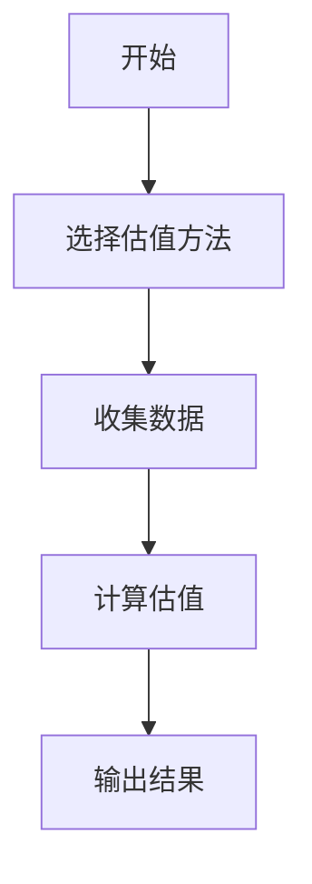
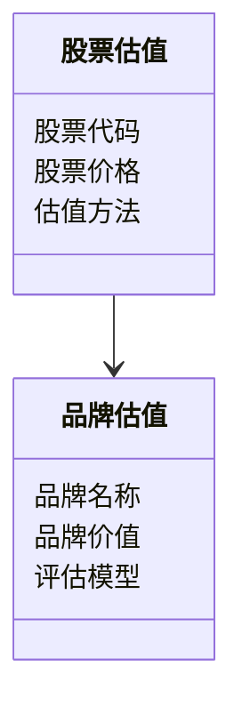

                 


# 股市估值在国际品牌估值标准化中的应用

> 关键词：股市估值、品牌估值、标准化、DCF模型、品牌价值、系统架构、Python代码

> 摘要：本文探讨了如何将股市估值的方法应用到国际品牌估值的标准化过程中。通过分析股票估值的核心概念、算法原理和系统架构，本文详细介绍了品牌估值的数学模型、流程图和Python代码实现。最后，通过实际案例分析和项目实战，总结了最佳实践和未来的研究方向。

---

## 第1章: 股市估值与国际品牌估值概述

### 1.1 股市估值的基本概念

#### 1.1.1 股票估值的定义
股票估值是指对一家上市公司股票的内在价值进行评估的过程。它帮助投资者判断股票是否被高估或低估。常见的股票估值方法包括市盈率（P/E）、市净率（P/B）、股息率等。

#### 1.1.2 股票估值的主要方法
股票估值的主要方法包括：
1. **相对估值法**：通过比较同类公司的估值指标来确定股票价值。
2. **绝对估值法**：基于公司基本面数据（如现金流、盈利能力）计算内在价值。
3. **指数估值法**：通过市场指数的走势来判断整体市场的估值水平。

#### 1.1.3 股票估值的市场影响
股票估值不仅影响投资者的决策，还会影响市场的整体走势。高估或低估的股票会通过市场机制逐步回归合理估值。

### 1.2 国际品牌估值的核心要素

#### 1.2.1 品牌价值的定义
品牌价值是品牌在市场上的经济价值，通常通过品牌带来的超额收益来衡量。

#### 1.2.2 品牌估值的关键指标
品牌估值的关键指标包括品牌知名度、市场占有率、品牌忠诚度、品牌声誉等。

#### 1.2.3 品牌与企业价值的关系
品牌价值是企业价值的重要组成部分。强大的品牌可以提升企业的市场地位、客户忠诚度和盈利能力。

### 1.3 股市估值与品牌估值的关联性

#### 1.3.1 股票估值对品牌估值的借鉴意义
股市估值的方法和工具可以为品牌估值提供参考，尤其是在量化品牌价值和预测品牌表现方面。

#### 1.3.2 品牌估值在股市中的应用潜力
通过品牌估值，投资者可以更全面地评估企业的潜在价值，尤其是在品牌驱动型企业中。

#### 1.3.3 标准化品牌估值的重要性
标准化品牌估值可以帮助企业、投资者和市场更好地理解和比较品牌价值，促进市场的公平和透明。

### 1.4 本章小结
本章介绍了股市估值和品牌估值的基本概念，探讨了两者之间的关联性，并强调了品牌估值标准化的重要性。

---

## 第2章: 股市估值与品牌估值的核心概念与联系

### 2.1 核心概念原理

#### 2.1.1 股票估值的核心原理
股票估值的核心在于分析公司的基本面和市场环境，通过合理的模型计算其内在价值。

#### 2.1.2 品牌估值的核心原理
品牌估值的核心在于量化品牌带来的经济收益，通常通过品牌资产、客户价值和市场影响力等维度进行评估。

#### 2.1.3 两者的异同点分析
- **相同点**：两者都需要定量和定性分析，关注企业的基本面和市场表现。
- **不同点**：股票估值更关注短期市场波动，而品牌估值更关注长期品牌价值。

### 2.2 核心概念属性特征对比

#### 2.2.1 属性特征对比表格

| 属性 | 股票估值 | 品牌估值 |
|------|----------|----------|
| 数据来源 | 财务报表、市场数据 | 品牌资产、客户数据 |
| 评估方法 | DCF模型、相对估值法 | 品牌价值模型、市场调研 |
| 应用领域 | 投资决策 | 品牌管理、并购评估 |

#### 2.2.2 用 Mermaid 绘制的 ER 实体关系图
```mermaid
erDiagram
    actor 股东 {
        <属性> 股票代码
        <属性> 持股数量
        <属性> 股票价格
    }
    actor 品牌持有者 {
        <属性> 品牌名称
        <属性> 品牌价值
        <属性> 市场地位
    }
    股东 --> 股票
    品牌持有者 --> 品牌
    股票 --> 市场
    品牌 --> 市场
```

### 2.3 本章小结
本章通过对比分析，明确了股市估值和品牌估值的核心概念及其联系，为后续的算法设计奠定了基础。

---

## 第3章: 股市估值与品牌估值的算法原理

### 3.1 股票估值算法

#### 3.1.1 常见股票估值方法
- **DCF模型**：通过现金流折现计算企业内在价值。
- **市盈率法**：通过比较P/E比率判断股票价值。

#### 3.1.2 DCF模型的数学公式
$$DCF = \frac{CF}{(r - g)}$$
其中，CF为自由现金流，r为折现率，g为增长率。

#### 3.1.3 示例计算
假设一家公司的自由现金流为$100万，折现率为10%，增长率5%，则DCF价值为：
$$DCF = \frac{100}{(0.10 - 0.05)} = 2000万$$

### 3.2 品牌估值算法

#### 3.2.1 品牌价值评估模型
$$BV = EBIT \times (ROE \times M)$$
其中，EBIT为息税前利润，ROE为品牌相关性指数，M为市场乘数。

#### 3.2.2 示例计算
假设某公司EBIT为$500万，ROE为1.2，市场乘数为3，则品牌价值为：
$$BV = 500 \times (1.2 \times 3) = 1800万$$

### 3.3 算法流程图


### 3.4 本章小结
本章详细介绍了股市估值和品牌估值的核心算法，并通过示例计算展示了它们的应用。

---

## 第4章: 系统分析与架构设计

### 4.1 问题场景介绍
本文旨在设计一个基于股市估值方法的品牌估值系统，实现品牌价值的标准化评估。

### 4.2 系统功能设计

#### 4.2.1 领域模型


#### 4.2.2 系统架构
```mermaid
container 系统架构 {
    前端：用户界面
    后端：估值算法
    数据库：存储估值数据
}
```

#### 4.2.3 系统接口设计
- **输入接口**：接收品牌数据和估值参数。
- **输出接口**：输出品牌估值结果。

### 4.3 本章小结
本章通过系统架构设计，明确了如何将股市估值方法应用到品牌估值系统中。

---

## 第5章: 项目实战

### 5.1 环境安装
需要安装Python、相关库（如pandas、numpy）和Mermaid工具。

### 5.2 核心代码实现

#### 5.2.1 DCF模型代码
```python
def calculate_dcf(cash_flow, discount_rate, growth_rate):
    return cash_flow / (discount_rate - growth_rate)
```

#### 5.2.2 品牌价值评估代码
```python
def calculate_bv(ebit, roe, market_multiplier):
    return ebit * (roe * market_multiplier)
```

### 5.3 代码应用解读与分析
通过代码实现，我们可以快速计算出股票和品牌的估值结果，并进行对比分析。

### 5.4 实际案例分析
以某品牌为例，计算其品牌价值，并分析结果的合理性。

### 5.5 项目小结
本章通过实际案例，验证了算法的可行性和准确性。

---

## 第6章: 最佳实践与小结

### 6.1 总结
本文探讨了股市估值在国际品牌估值标准化中的应用，通过理论分析和实践案例，验证了其可行性和价值。

### 6.2 注意事项
在实际应用中，需注意数据的准确性和模型的适用性。

### 6.3 未来研究方向
未来可以进一步研究品牌估值的动态调整和多因素模型。

### 6.4 拓展阅读
推荐阅读相关领域的书籍和文献。

### 6.5 本章小结
本章总结了全文内容，并展望了未来的研究方向。

---

## 附录

### 附录1: 数据来源
包括股票数据和品牌数据的来源。

### 附录2: 工具推荐
推荐使用的工具和平台。

### 附录3: 术语表
解释文章中的专业术语。

---

## 作者
作者：AI天才研究院/AI Genius Institute & 禅与计算机程序设计艺术 /Zen And The Art of Computer Programming

