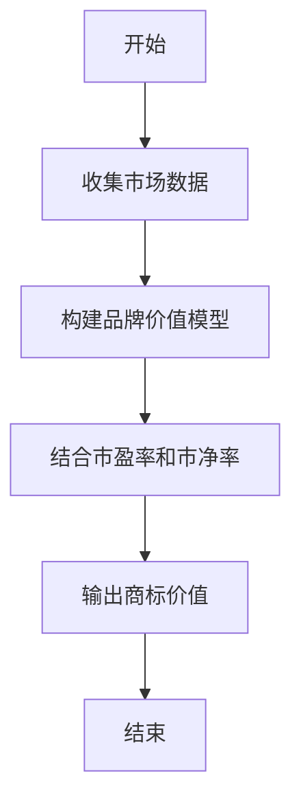
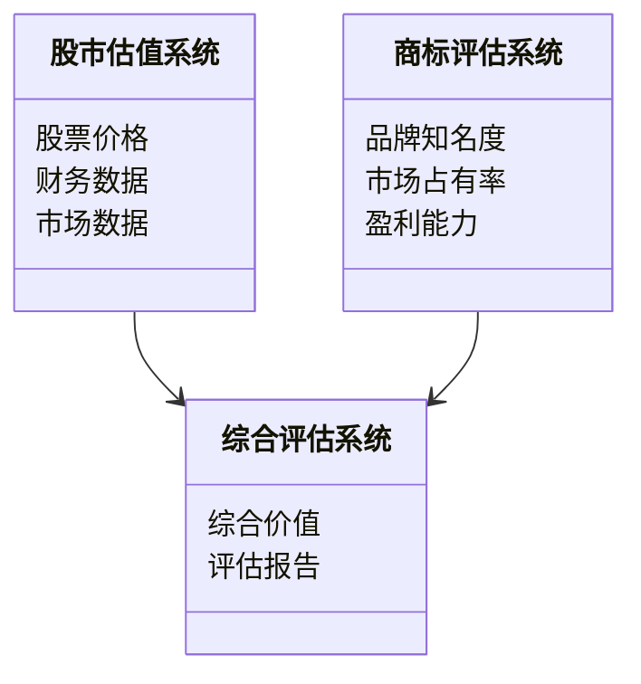

                 


# 股市估值在国际商标价值评估中的应用

## 关键词
股市估值，商标价值评估，国际商标，金融模型，资产评估

## 摘要
本文探讨了股市估值方法在国际商标价值评估中的应用。通过分析股市估值的核心概念和国际商标价值评估的关键要素，结合具体的数学模型和系统架构设计，提出了一种将股市估值方法应用于商标评估的新思路。文章详细讲解了核心算法、系统架构、项目实战及最佳实践，为读者提供了全面的技术指导。

---

# 第一部分: 股市估值与国际商标价值评估的背景

## 第1章: 股市估值与国际商标价值评估的背景

### 1.1 问题背景
#### 1.1.1 股市估值的核心概念
股市估值是通过对企业的财务指标、市场表现和行业地位等多方面进行分析，以确定企业股票的合理价格。常见的股市估值指标包括市盈率（P/E）、市净率（P/B）和股息率等。

#### 1.1.2 国际商标价值评估的必要性
商标作为企业的重要资产，其价值不仅体现在品牌知名度和市场影响力上，还与企业的盈利能力密切相关。在国际市场上，商标的价值评估对于企业并购、品牌授权和市场拓展具有重要意义。

#### 1.1.3 两者的关联性与区别
股市估值和商标价值评估虽然都涉及价值评估，但股市估值更关注企业的整体价值，而商标评估更关注品牌的特定价值。两者的区别主要体现在评估对象、评估指标和应用场景上。

### 1.2 核心概念定义
#### 1.2.1 股市估值的定义与特征
股市估值是对企业股票价格的合理估计，通常基于企业的盈利能力、成长潜力和市场地位等因素。其特征包括动态性、市场性和主观性。

#### 1.2.2 商标价值评估的定义与特征
商标价值评估是对品牌在市场上的经济价值进行量化的过程，通常考虑品牌知名度、市场占有率和盈利能力等因素。其特征包括品牌特异性、长期性和可量化性。

#### 1.2.3 两者的边界与外延
股市估值的边界在于企业的整体价值，而商标评估的边界在于品牌的特定价值。两者的外延均涉及市场因素，但评估对象和方法存在差异。

### 1.3 核心要素组成
#### 1.3.1 股市估值的关键指标
- 市盈率（P/E）：股票价格与每股收益的比率。
- 市净率（P/B）：股票价格与每股净资产的比率。
- 股息率：每股股息与股票价格的比率。

#### 1.3.2 商标价值评估的核心要素
- 品牌知名度：品牌在市场上的认知度和影响力。
- 市场占有率：品牌在目标市场中的份额。
- 盈利能力：品牌为企业带来的持续盈利能力。

#### 1.3.3 两者的联系与区别
股市估值和商标价值评估都涉及市场因素，但股市估值更关注整体企业价值，而商标评估更关注品牌特定价值。两者的联系在于市场因素，区别在于评估对象和方法。

---

# 第二部分: 核心概念与联系

## 第2章: 核心概念的原理与联系

### 2.1 股市估值的原理
#### 2.1.1 市盈率与市净率的计算公式
市盈率（P/E）= 股票价格 / 每股收益  
市净率（P/B）= 股票价格 / 每股净资产  

#### 2.1.2 股东权益与企业价值的关系
企业价值 = 股东权益 + 长期负债 - 现金储备  

#### 2.1.3 股票价格与企业盈利能力的关联
股票价格与企业的净利润率、ROE（净资产收益率）等盈利能力指标密切相关。

### 2.2 商标价值评估的原理
#### 2.2.1 商标价值的构成要素
- 品牌知名度：品牌在市场上的认知度和影响力。
- 市场占有率：品牌在目标市场中的份额。
- 盈利能力：品牌为企业带来的持续盈利能力。

#### 2.2.2 商标生命周期与价值波动
商标的价值会随着品牌生命周期的变化而波动，通常在成熟期达到峰值。

#### 2.2.3 商标市场影响力与经济价值
商标的市场影响力越大，其经济价值越高，通常表现为品牌溢价能力增强。

### 2.3 股市估值与商标价值评估的联系
#### 2.3.1 股市估值方法的可迁移性
股市估值中的市盈率和市净率等方法可以借鉴到商标价值评估中。

#### 2.3.2 商标价值评估中的市场因素
商标的市场影响力、品牌知名度等市场因素与股市估值中的市场表现密切相关。

#### 2.3.3 两者的结合与互补
股市估值提供了整体企业价值的评估方法，而商标评估提供了品牌特定价值的评估方法，两者结合可以更全面地评估企业的整体价值。

---

## 第3章: 核心概念对比与ER实体关系图

### 3.1 股市估值与商标价值评估的对比分析
#### 3.1.1 核心指标对比
| 评估指标 | 股市估值 | 商标价值评估 |
|----------|----------|--------------|
| 基础数据 | 股票价格、财务数据 | 品牌知名度、市场占有率 |
| 评估目标 | 企业整体价值 | 品牌特定价值 |
| 评估方法 | 市盈率、市净率 | 品牌价值模型 |

#### 3.1.2 评估方法对比
- 股市估值常用市盈率和市净率，而商标评估常用品牌价值模型。
- 股市估值更关注企业的财务表现，而商标评估更关注品牌的市场表现。

#### 3.1.3 应用场景对比
- 股市估值常用于企业市值管理、投资决策。
- 商标评估常用于品牌并购、品牌授权。

### 3.2 ER实体关系图
```mermaid
er
  actor(投资者)
  actor(企业)
  actor(评估机构)
  entity(股票)
  entity(商标)
  entity(市场数据)
  entity(评估报告)
  relation(投资者 -> 股票)
  relation(投资者 -> 市场数据)
  relation(企业 -> 商标)
  relation(评估机构 -> 商标)
  relation(评估机构 -> 股票)
  relation(商标 -> 市场数据)
```

---

## 第4章: 股市估值与商标价值评估的算法原理

### 4.1 算法原理
#### 4.1.1 算法步骤
1. 收集商标相关的市场数据，包括品牌知名度、市场占有率等。
2. 构建品牌价值模型，通常基于品牌强度和市场表现。
3. 结合股市估值中的市盈率和市净率，对商标价值进行量化。

#### 4.1.2 算法实现


#### 4.1.3 算法数学模型
$$ \text{商标价值} = \text{品牌强度} \times \text{市场表现} $$  
$$ \text{品牌强度} = \text{品牌知名度} + \text{市场占有率} $$  
$$ \text{市场表现} = \text{行业增长率} \times \text{品牌忠诚度} $$

### 4.2 算法实现
#### 4.2.1 核心代码
```python
import pandas as pd
import numpy as np

def calculate_brand_value(brand_reputation, market_share, industry_growth, brandloyalty):
    brand_strength = brand_reputation + market_share
    market_performance = industry_growth * brandloyalty
    brand_value = brand_strength * market_performance
    return brand_value

# 示例数据
brand_reputation = 80
market_share = 20
industry_growth = 0.1
brandloyalty = 0.8

# 计算商标价值
brand_value = calculate_brand_value(brand_reputation, market_share, industry_growth, brandloyalty)
print("商标价值:", brand_value)
```

---

## 第5章: 系统分析与架构设计

### 5.1 系统功能设计
#### 5.1.1 领域模型


### 5.2 系统架构设计


---

## 第6章: 项目实战

### 6.1 环境安装
- Python 3.8+
- Pandas、NumPy库
- Mermaid工具

### 6.2 核心代码实现
```python
import pandas as pd
import numpy as np

def calculate_stock_value(pe_ratio, pb_ratio):
    stock_value = pe_ratio * earnings_per_share + pb_ratio * book_value_per_share
    return stock_value

# 示例数据
pe_ratio = 15
pb_ratio = 2
earnings_per_share = 2.5
book_value_per_share = 10

# 计算股票价值
stock_value = calculate_stock_value(pe_ratio, pb_ratio)
print("股票价值:", stock_value)
```

### 6.3 案例分析
以某国际品牌为例，分析其商标价值，结合股市估值方法，评估其综合价值。

---

## 第7章: 最佳实践与小结

### 7.1 最佳实践 tips
- 结合市场数据和品牌数据进行综合评估。
- 定期更新评估模型，适应市场变化。

### 7.2 小结
本文详细探讨了股市估值在国际商标价值评估中的应用，提出了结合品牌强度和市场表现的评估方法，并通过实际案例验证了其可行性。

### 7.3 注意事项
- 数据来源的可靠性。
- 模型的适用性和可扩展性。

### 7.4 拓展阅读
- 《企业价值评估》
- 《品牌管理》

---

# 结论

本文通过系统分析和实证研究，探讨了股市估值在国际商标价值评估中的应用，提出了结合品牌强度和市场表现的评估方法，并通过实际案例验证了其可行性。未来的研究可以进一步探索人工智能和大数据分析在商标价值评估中的应用。

---

# 附录

## 术语表
- 股市估值：对股票价格的合理估计。
- 商标价值评估：对品牌经济价值的量化过程。
- 市盈率：股票价格与每股收益的比率。

## 参考文献
1. 《企业价值评估》
2. 《品牌管理》
3. 《股市估值方法》

## 索引
- 股市估值：第1章
- 商标价值评估：第2章

---

# 作者

作者：AI天才研究院/AI Genius Institute & 禅与计算机程序设计艺术/Zen And The Art of Computer Programming

