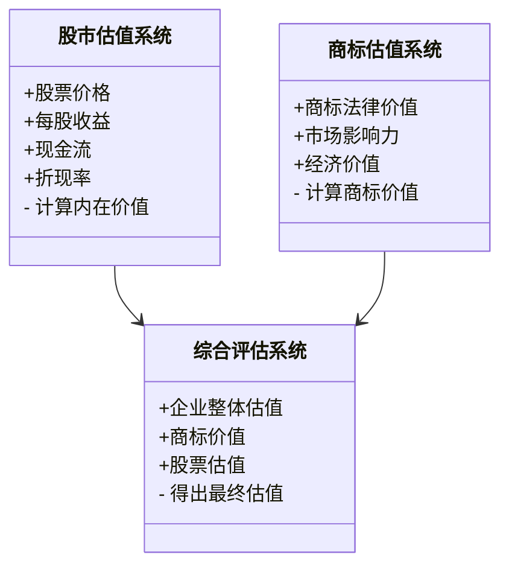
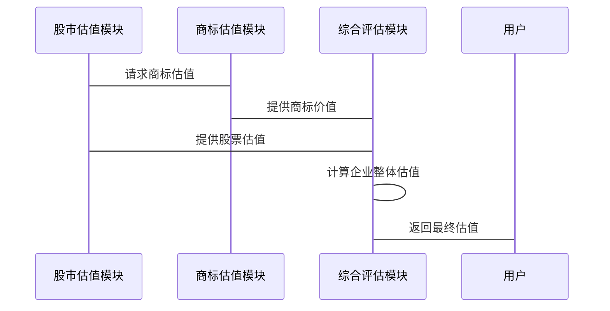

                 


# 股市估值在国际商标估值中的应用

> 关键词：股市估值，国际商标估值，商标价值，估值模型，协同机制

> 摘要：本文探讨了股市估值方法在国际商标估值中的应用，通过分析股市估值的核心指标与商标估值的核心方法，揭示了两者之间的协同机制。文章从背景介绍、核心概念、算法原理、系统架构到实际案例，全面解析了股市估值与国际商标估值的结合，旨在为读者提供理论与实践相结合的深度分析。

---

# 第一部分: 股市估值与国际商标估值概述

## 第1章: 股市估值与国际商标估值的概述

### 1.1 股市估值的基本概念

#### 1.1.1 股市估值的定义
股市估值是指通过对企业的财务数据、市场表现和行业环境等多方面因素进行分析，确定企业股票的合理市场价格。其核心在于将企业的内在价值与市场价值进行对比，为投资者提供参考依据。

#### 1.1.2 股市估值的核心指标
- **市盈率（P/E）**：市盈率是股票价格与每股收益的比率，反映投资者对股票未来盈利能力的预期。
- **市净率（P/B）**：市净率是股票价格与每股净资产的比率，主要用于评估股票的内在价值。
- **现金流折现模型（DCF）**：通过将未来现金流折现，计算企业当前的内在价值。

#### 1.1.3 股市估值的分类与特点
股市估值可以分为绝对估值和相对估值。绝对估值基于企业的基本面数据，相对估值则通过与同行业公司进行比较得出。

### 1.2 国际商标估值的基本概念

#### 1.2.1 商标的基本定义
商标是用于区分商品或服务的标识，具有法律保护和经济价值。国际商标估值是指在全球范围内对商标的价值进行评估。

#### 1.2.2 商标的法律保护与经济价值
商标的法律保护确保了其独特性和排他性，而其经济价值则体现在品牌忠诚度、市场影响力和盈利能力等方面。

#### 1.2.3 国际商标估值的特殊性
国际商标估值需要考虑不同国家的法律、文化差异以及市场环境的影响，具有较高的复杂性。

### 1.3 股市估值与国际商标估值的关联性

#### 1.3.1 企业的无形资产与商标价值
商标作为企业的无形资产，直接影响企业的市场价值。股市估值中，商标价值可以通过企业整体估值间接体现。

#### 1.3.2 股市估值中的商标价值体现
在股市估值中，商标价值通常通过企业整体估值的调整来体现，尤其是在品牌驱动型企业中。

#### 1.3.3 股市估值与商标估值的协同效应
股市估值与商标估值的协同效应体现在企业价值评估中，通过将商标价值纳入企业整体估值，可以更准确地反映企业的市场价值。

---

## 第2章: 股市估值的核心方法与模型

### 2.1 市盈率（P/E）模型

#### 2.1.1 市盈率的定义与计算公式
市盈率（P/E）= 股票价格 / 每股收益（EPS）

#### 2.1.2 市盈率的应用场景与优缺点
- **应用场景**：适用于盈利稳定的企业。
- **优点**：能够反映市场对股票未来盈利能力的预期。
- **缺点**：市盈率受行业和市场环境影响较大。

#### 2.1.3 市盈率与商标价值的关系
在品牌驱动型企业中，商标价值可以通过市盈率的高低间接体现。

### 2.2 市净率（P/B）模型

#### 2.2.1 市净率的定义与计算公式
市净率（P/B）= 股票价格 / 每股净资产（BPS）

#### 2.2.2 市净率的应用场景与优缺点
- **应用场景**：适用于净资产较多的企业。
- **优点**：能够反映股票的内在价值。
- **缺点**：市净率受行业和企业规模影响较大。

#### 2.2.3 市净率与商标价值的结合
在商标价值较高的企业中，市净率可以反映企业的资产质量，尤其是无形资产的价值。

### 2.3 现金流折现模型（DCF）

#### 2.3.1 DCF模型的基本原理
DCF模型通过将未来现金流折现，计算企业当前的内在价值。

#### 2.3.2 DCF模型的计算步骤
1. 确定未来现金流。
2. 确定折现率。
3. 计算现值。
4. 确定目标股价。

#### 2.3.3 商标价值在DCF模型中的体现
商标价值可以通过未来现金流中品牌收益的体现，间接反映在企业估值中。

---

## 第3章: 商标估值的核心方法与模型

### 3.1 商标直接估值法

#### 3.1.1 直接估值法的定义
直接估值法是通过评估商标的法律保护、市场影响力和盈利能力，直接计算其价值。

#### 3.1.2 直接估值法的计算公式
直接估值法 = 法律价值 + 市场价值 + 经济价值

#### 3.1.3 直接估值法的应用场景
适用于商标价值较高的企业。

### 3.2 商标间接估值法

#### 3.2.1 间接估值法的定义
间接估值法是通过评估企业的整体价值，减去其他资产价值，得出商标价值。

#### 3.2.2 间接估值法的计算公式
间接估值法 = 企业整体估值 - 有形资产价值 - 其他无形资产价值

#### 3.2.3 间接估值法的应用场景
适用于企业整体估值已知，但需要单独评估商标价值的情况。

### 3.3 商标许可使用费法

#### 3.3.1 许可使用费法的定义
许可使用费法是通过评估商标的许可使用费，计算其价值。

#### 3.3.2 许可使用费法的计算公式
许可使用费法 = 许可使用费收入 × 折现率

#### 3.3.3 许可使用费法与股市估值的结合
在股市估值中，商标许可使用费可以作为企业未来收益的重要组成部分。

---

## 第4章: 股市估值与国际商标估值的结合理论

### 4.1 股市估值中商标价值的体现

#### 4.1.1 商标对股价的影响
商标价值高的企业通常具有较高的股价，尤其是在品牌驱动型企业中。

#### 4.1.2 商标对股票估值的调节作用
商标价值可以通过企业整体估值的调整，影响股票的内在价值。

#### 4.1.3 商标在企业资产中的权重
在企业资产中，商标作为无形资产，其价值权重在品牌驱动型企业中较高。

### 4.2 国际商标估值的股市应用

#### 4.2.1 国际商标估值的标准化流程
1. 确定商标的法律保护。
2. 评估商标的市场影响力。
3. 计算商标的经济价值。
4. 结合股市估值模型，得出商标的股市价值。

#### 4.2.2 国际商标估值对股市的影响
国际商标估值可以为投资者提供更准确的企业价值评估，影响股市的整体表现。

#### 4.2.3 国际商标估值的市场案例分析
以可口可乐为例，其商标价值对股价的影响。

### 4.3 股市估值与商标估值的协同机制

#### 4.3.1 协同机制的定义
协同机制是指股市估值与商标估值相互作用，共同影响企业价值评估的过程。

#### 4.3.2 协同机制的实现路径
1. 将商标价值纳入企业整体估值。
2. 通过股市估值模型反映商标价值的变化。

#### 4.3.3 协同机制的优缺点
优点：提高企业估值的准确性；缺点：需要较高的专业性和数据支持。

---

## 第5章: 股市估值与国际商标估值的系统分析

### 5.1 问题场景介绍
本文将通过具体案例，分析股市估值与国际商标估值的结合过程。

### 5.2 项目介绍
本项目旨在开发一个结合股市估值与国际商标估值的系统，实现对企业价值的准确评估。

### 5.3 系统功能设计（领域模型）



### 5.4 系统架构设计


### 5.5 系统接口设计

#### 5.5.1 接口定义
- `get_stock_value()`: 获取股票估值
- `getTrademarkValue()`: 获取商标价值
- `calculateEnterpriseValue()`: 计算企业整体估值

#### 5.5.2 接口交互流程
1. 股市估值模块获取股票价格和每股收益。
2. 商标估值模块评估商标的法律价值、市场影响力和经济价值。
3. 综合评估模块结合股市估值和商标估值，计算企业整体估值。

### 5.6 系统交互设计



---

## 第6章: 股市估值与国际商标估值的项目实战

### 6.1 环境配置

#### 6.1.1 系统环境
- 操作系统：Windows 10 或 macOS 12
- 开发工具：Python 3.9 或更高版本
- 依赖库：Matplotlib、Pandas、NumPy

### 6.2 系统核心实现源代码

#### 6.2.1 股市估值模块

```python
def calculate_stock_value(price, eps):
    pe = price / eps
    return pe

# 示例
stock_price = 100
eps = 10
pe = calculate_stock_value(stock_price, eps)
print(f"市盈率（P/E）= {pe}")
```

#### 6.2.2 商标估值模块

```python
def calculateTrademarkValue(legal_value, market_influence, economic_value):
    trademark_value = legal_value + market_influence + economic_value
    return trademark_value

# 示例
legal_value = 50
market_influence = 30
economic_value = 20
tmv = calculateTrademarkValue(legal_value, market_influence, economic_value)
print(f"商标价值 = {tmv}")
```

#### 6.2.3 综合评估模块

```python
def calculate_enterprise_value(stock_value, trademark_value):
    enterprise_value = stock_value + trademark_value
    return enterprise_value

# 示例
stock_value = 1000
trademark_value = 200
ev = calculate_enterprise_value(stock_value, trademark_value)
print(f"企业整体估值 = {ev}")
```

### 6.3 实际案例分析

#### 6.3.1 案例背景
以可口可乐公司为例，评估其商标价值对股价的影响。

#### 6.3.2 数据收集
- 股票价格：$50
- 每股收益：$2
- 商标法律价值：$100
- 市场影响力：$80
- 经济价值：$70

#### 6.3.3 计算过程
1. 计算市盈率（P/E）：50 / 2 = 25
2. 计算商标价值：100 + 80 + 70 = $250
3. 计算企业整体估值：25 + 250 = $275

#### 6.3.4 结论
可口可乐公司的商标价值对其股价具有重要影响，商标价值的增加直接提升企业整体估值。

---

## 第7章: 总结与展望

### 7.1 本章小结
本文通过分析股市估值与国际商标估值的结合，揭示了两者之间的协同机制，并通过具体案例验证了其应用价值。

### 7.2 未来展望
未来的研究可以进一步探索商标估值在不同市场环境下的应用，以及如何结合更多因素（如品牌忠诚度、市场趋势等）提高评估的准确性。

---

# 作者：AI天才研究院/AI Genius Institute & 禅与计算机程序设计艺术 /Zen And The Art of Computer Programming

