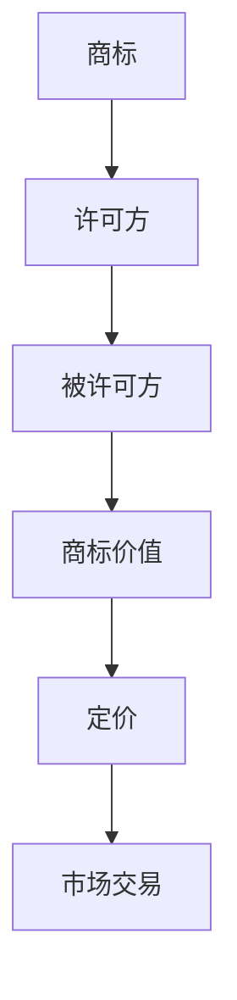
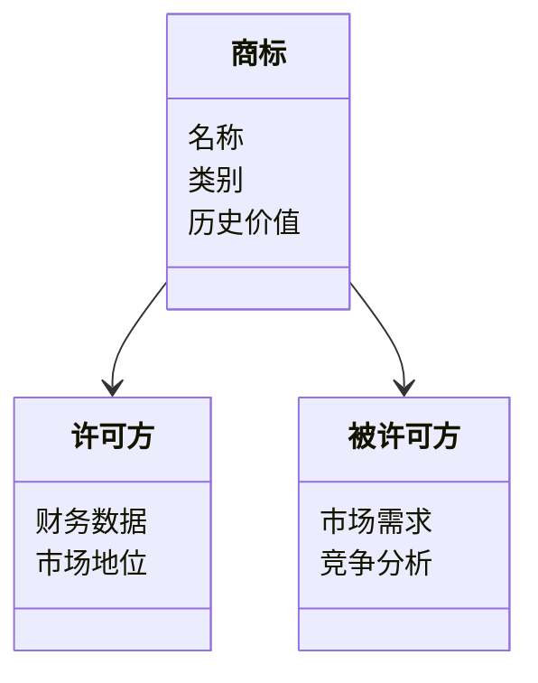

                 

# 股市估值在国际商标许可定价中的应用

## 关键词：股市估值、商标许可定价、金融模型、知识产权价值、期权定价模型

## 摘要：  
本文探讨了股市估值方法在国际商标许可定价中的应用，通过分析商标的市场价值、风险因素和经济指标，结合金融数学模型，提出了一种创新的商标定价方法。文章从理论基础、模型构建、案例分析到实际应用，详细阐述了如何利用股市估值来优化商标许可定价，为知识产权管理和商业决策提供了新的思路。

---

# 第一部分：背景与基础

## 第1章：股市估值与商标许可定价概述

### 1.1 股市估值的基本概念
股市估值是通过分析公司财务数据和市场表现，评估其股票价值的过程。常用的指标包括市盈率（P/E）、市净率（P/B）和市值等。这些指标帮助投资者判断股票的合理价格区间。

### 1.2 商标许可定价的基本原理
商标许可定价是指将商标使用权授权给第三方使用并收取费用的过程。定价需考虑商标的知名度、市场影响力、行业地位等因素。常见的定价方法包括协商定价、成本加成法和市场比较法。

### 1.3 问题背景与意义
将股市估值应用于商标许可定价，可以更准确地反映商标的市场价值，尤其在跨国交易中，有助于解决定价不公和信息不对称的问题。

---

## 第2章：核心概念与联系

### 2.1 核心概念原理
- 股市估值基于市场供需和公司基本面，商标许可定价基于商标的市场影响力和法律地位。
- 两者都需要考虑时间和风险因素，但侧重点不同。

### 2.2 概念属性对比表格
| 核心概念 | 股市估值 | 商标许可定价 |
|----------|----------|--------------|
| 定价依据 | 市盈率、市净率 | 商标知名度、市场影响力 |
| 影响因素 | 宏观经济、行业趋势 | 商标历史、品牌价值 |
| 适用场景 | 企业上市、投资决策 | 商标授权、转让 |

### 2.3 ER实体关系图

---

# 第二部分：理论与模型

## 第3章：股市估值模型与商标许可定价模型

### 3.1 股市估值模型
#### 3.1.1 CAPM模型
$$ E(r_i) = r_f + β_i (E(r_m) - r_f) $$

#### 3.1.2 APT模型
$$ P_i = \sum \lambda_j x_{ij} $$

### 3.2 商标许可定价模型
#### 3.2.1 基于期权定价的模型
$$ C = S_0 e^{-qT} N(d_1) - K e^{-rT} N(d_2) $$

#### 3.2.2 商标价值评估模型
$$ V = \sum \lambda_j x_j $$

---

## 第4章：算法原理与数学模型

### 4.1 股市估值算法
- 使用CAPM模型评估商标的市场价值。
- 结合历史数据和市场趋势预测未来价值。

### 4.2 商标许可定价算法
- 基于Black-Scholes模型，评估商标的期权价值。
- 结合实际市场需求和竞争环境调整定价。

---

# 第三部分：系统分析与架构设计

## 第5章：系统架构设计

### 5.1 领域模型

### 5.2 系统架构

---

## 第6章：案例分析与实际应用

### 6.1 案例分析
- 某国际品牌商标许可定价的案例，分析其市场价值和定价策略。

### 6.2 实际应用
- 使用CAPM和Black-Scholes模型评估商标价值，制定合理许可价格。

---

## 第7章：高级主题与未来趋势

### 7.1 动态调整模型
- 根据市场变化实时调整商标价值评估。

### 7.2 跨国商标定价的特殊考虑
- 考虑不同国家的市场环境和法律差异。

### 7.3 人工智能在商标定价中的应用
- 利用机器学习模型预测商标价值和市场趋势。

---

## 结语

通过结合股市估值和商标许可定价，企业可以更科学地评估商标价值，制定合理的许可策略，提升市场竞争力。未来，随着技术的进步，商标定价将更加精准和动态。

---

## 作者：AI天才研究院 & 禅与计算机程序设计艺术

