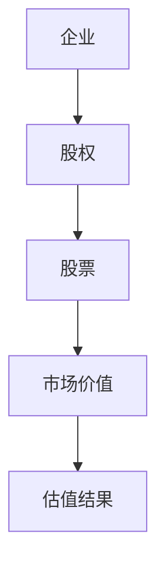
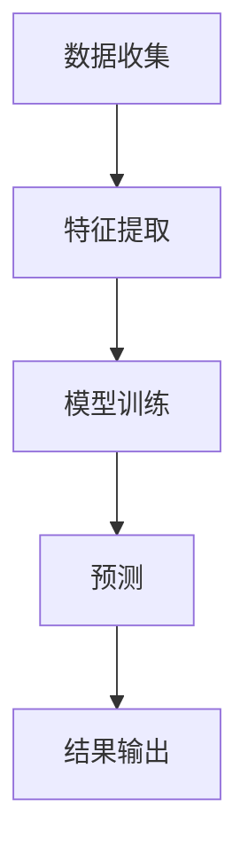
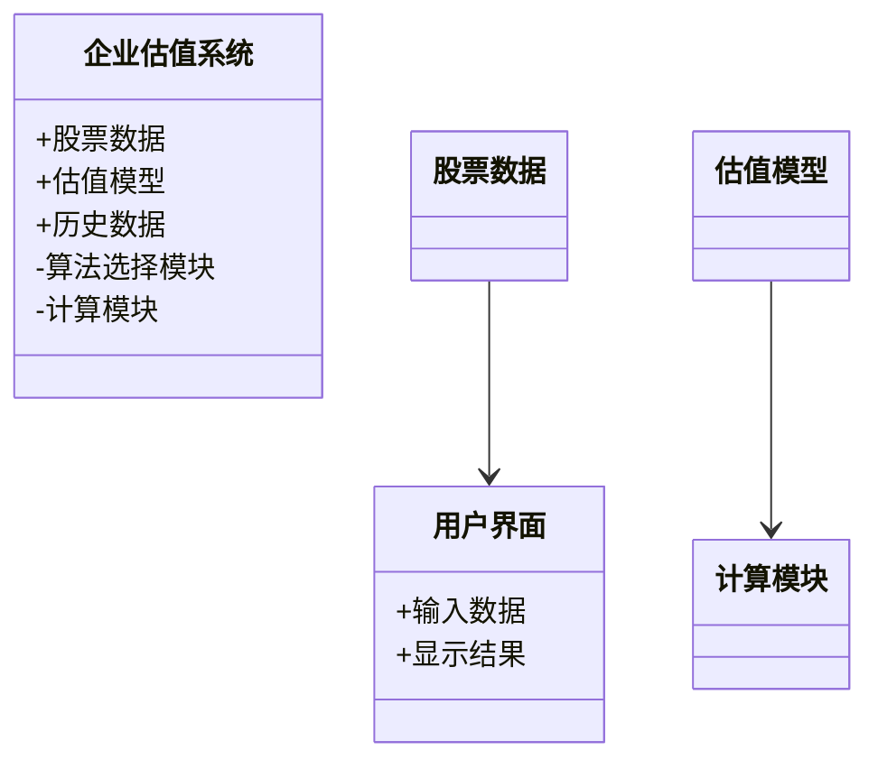

                 


# 股市估值在国际投资仲裁中的应用

> 关键词：股市估值、国际投资仲裁、法律纠纷、市盈率、市净率、现金流折现模型

> 摘要：本文深入探讨了股市估值在国际投资仲裁中的应用，分析了估值的核心概念、数学模型、算法原理及系统架构设计，结合实际案例，展示了如何在法律争议中利用估值方法解决复杂的经济问题。

---

# 引言

在全球化的经济环境中，国际投资仲裁日益频繁，而股市估值作为评估企业价值的重要工具，其在仲裁中的应用也变得至关重要。本文将从基础概念到实际应用，系统地分析股市估值在国际投资仲裁中的作用。

---

# 第一部分: 股市估值在国际投资仲裁中的应用概述

## 第1章: 背景介绍

### 1.1 问题背景

#### 1.1.1 股市估值的核心概念
- **定义**：股市估值是通过特定方法对股票或企业进行价值评估的过程。
- **重要性**：在国际投资仲裁中，估值用于确定赔偿金额、企业价值等关键问题。

#### 1.1.2 问题描述
- **法律争议**：仲裁中常涉及股权争议、赔偿计算等，需要准确的估值支持。
- **解决方法**：采用多种估值方法，结合法律框架，确保结果公正。

#### 1.1.3 问题解决
- **方法选择**：根据案件特点选择合适的估值模型，如市盈率、市净率或现金流折现模型。

#### 1.1.4 边界与外延
- **适用范围**：适用于企业价值评估，但需考虑市场波动和行业特性。
- **局限性**：估值结果受假设影响，可能存在误差。

### 1.2 核心概念与联系

#### 1.2.1 实体关系图


---

# 第二部分: 核心概念与联系

## 第2章: 核心概念与联系

### 2.1 股市估值的核心原理

#### 2.1.1 市盈率（P/E）模型
- **定义**：市盈率 = 市场价格 / 每股收益。
- **应用场景**：适用于盈利稳定的公司。
- **优缺点**：简单但受行业影响较大。

#### 2.1.2 市净率（P/B）模型
- **定义**：市净率 = 市场价格 / 每股净资产。
- **应用场景**：适用于资产密集型行业。

#### 2.1.3 现金流折现模型（DCF）
- **定义**：DCF模型基于未来现金流的现值。
- **应用场景**：用于评估企业的内在价值。

### 2.2 核心概念对比分析

#### 2.2.1 常用估值方法对比
| 方法名称 | 定义 | 适用场景 | 优缺点 |
|----------|------|----------|--------|
| 市盈率   | 市场价格与每股收益的比率 | 评估股票的相对价值 | 简单易用，但受行业影响较大 |
| 市净率   | 市场价格与每股净资产的比率 | 评估股票的安全边际 | 更适合资产密集型行业 |
| DCF模型  | 未来现金流的现值 | 评估企业的内在价值 | 计算复杂，依赖假设 |

---

# 第三部分: 算法原理与数学模型

## 第3章: 算法原理

### 3.1 机器学习在估值中的应用

#### 3.1.1 算法流程


#### 3.1.2 代码实现
```python
import pandas as pd
from sklearn.linear_model import LinearRegression

# 数据预处理
data = pd.read_csv('stock_data.csv')
X = data[['PE', 'PB', 'ROE']]
y = data['Price']

# 模型训练
model = LinearRegression()
model.fit(X, y)

# 预测
predictions = model.predict(X)
```

---

## 第4章: 数学模型

### 4.1 CAPM模型
- **公式**：$$ E(R_i) = R_f + \beta_i (R_m - R_f) $$
- **应用**：用于评估资产的预期回报率。

### 4.2 DCF模型
- **公式**：$$ V = \sum_{t=1}^{n} \frac{CF_t}{(1 + r)^t} $$
- **应用**：用于计算企业的内在价值。

---

# 第四部分: 系统分析与架构设计

## 第5章: 系统分析

### 5.1 系统架构设计

#### 5.1.1 类图


---

# 第五部分: 项目实战

## 第6章: 项目实战

### 6.1 环境安装

#### 6.1.1 安装Python和相关库
```bash
pip install numpy pandas scikit-learn
```

### 6.2 核心实现

#### 6.2.1 代码实现
```python
import numpy as np
import pandas as pd
from sklearn.metrics import mean_squared_error

# 数据加载
data = pd.read_csv('stock.csv')

# 模型训练
X = data[['PE', 'PB']]
y = data['Target']

# 模型选择与训练
from sklearn.linear_model import LinearRegression
model = LinearRegression()
model.fit(X, y)

# 预测与评估
predictions = model.predict(X)
print(mean_squared_error(y, predictions))
```

### 6.3 案例分析

#### 6.3.1 实际案例
- **案例背景**：某公司股权纠纷，需估值确定赔偿金额。
- **估值结果**：采用市盈率和DCF模型，综合得出估值结果。

---

# 第六部分: 最佳实践与总结

## 第7章: 最佳实践

### 7.1 小结

- **总结**：股市估值在国际投资仲裁中具有重要意义，需结合多种方法和模型，确保结果的准确性和可靠性。

### 7.2 注意事项

- **数据质量**：确保数据的准确性和完整性。
- **模型选择**：根据具体情况选择合适的估值方法。
- **法律框架**：结合法律条款，确保估值结果符合法律规定。

### 7.3 拓展阅读

- 建议阅读《投资学原理》和《仲裁法》相关书籍，深入了解估值与法律结合的应用。

---

# 结语

股市估值在国际投资仲裁中的应用不仅需要扎实的金融知识，还需结合法律框架和实际案例。通过本文的分析，读者可以更好地理解如何在复杂的法律环境中应用估值方法，解决实际问题。

---

# 作者

作者：AI天才研究院 & 禅与计算机程序设计艺术

