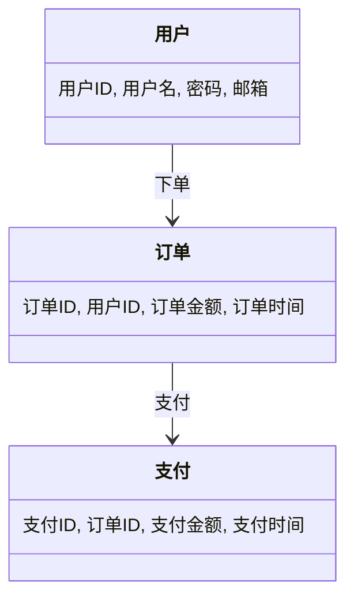

                 


---

# 股市估值在国际数字服务价值评估中的应用

> **关键词**：股市估值、数字服务、价值评估、DCF模型、市盈率、用户数据、数据资产

> **摘要**：本文探讨了股市估值方法在国际数字服务价值评估中的应用，重点分析了数字服务的特殊性及其对传统估值方法的挑战。通过介绍常用估值算法（如现金流贴现模型和市盈率法）在数字服务评估中的应用，结合实际案例，展示了如何将股市估值技术创新应用于数字服务价值评估。本文还详细讲解了数字服务价值评估的系统架构设计和实现方案，并提出了在实际应用中的注意事项和最佳实践建议。

---

## 第1章: 股市估值与数字服务价值评估概述

### 1.1 股市估值的基本概念
#### 1.1.1 股市估值的定义
股市估值是通过对公司财务数据、市场环境和行业趋势等多方面因素的分析，估算公司股票的内在价值。其核心目标是确定股票的合理价格区间，帮助投资者做出理性决策。

#### 1.1.2 股市估值的核心要素
- **财务数据**：收入、利润、现金流等。
- **市场环境**：宏观经济、行业趋势、政策法规。
- **公司基本面**：资产、负债、股东权益等。
- **市场情绪**：投资者心理、市场波动等。

#### 1.1.3 数字服务在现代经济中的地位
数字服务是指通过互联网、大数据、人工智能等技术提供在线服务的商业模式。其特点包括：
- **无形性**：主要通过数据和算法提供服务。
- **边际成本低**：随着用户增长，边际成本几乎不变。
- **数据驱动**：用户行为数据是核心资产。

### 1.2 数字服务价值评估的背景
#### 1.2.1 数字服务的定义与特点
数字服务涵盖的内容包括但不限于：
- **SaaS（软件即服务）**：如云服务、在线教育平台。
- **PaaS（平台即服务）**：如移动应用开发平台。
- **IaaS（基础设施即服务）**：如云存储、虚拟服务器。

#### 1.2.2 国际化数字服务的挑战
- **多市场风险**：不同国家的政策、法规差异。
- **文化差异**：用户行为习惯的差异影响服务设计。
- **技术门槛**：需要应对不同地区的网络环境和技术标准。

#### 1.2.3 数字服务价值评估的重要性
随着全球经济的数字化转型，数字服务的价值评估成为企业战略决策的关键。准确的估值能够帮助投资者识别高潜力项目，优化资源配置。

### 1.3 股市估值在数字服务中的应用前景
#### 1.3.1 数字服务价值评估的现状
目前，数字服务的价值评估主要依赖于传统的财务指标，但这些指标无法完全反映数字服务的无形资产价值。

#### 1.3.2 股市估值在数字服务中的潜力
- **数据资产化**：将用户数据的价值纳入估值模型。
- **动态调整**：根据市场反馈实时调整估值。
- **跨市场比较**：利用股市估值方法进行国际化数字服务的横向比较。

#### 1.3.3 应用中的主要问题与挑战
- **数据隐私问题**：如何在不泄露用户隐私的前提下进行数据估值。
- **模型复杂性**：数字服务的多维度特性增加了估值模型的复杂性。
- **监管不确定性**：不同国家对数字服务的监管政策差异较大。

### 1.4 本章小结
本章从股市估值的基本概念出发，分析了数字服务的特殊性及其在现代经济中的地位，探讨了股市估值在数字服务价值评估中的潜力和挑战。

---

## 第2章: 股市估值的核心概念与原理

### 2.1 股市估值的关键指标
#### 2.1.1 市盈率（P/E）
市盈率 = 股票价格 / 每股净利润。

#### 2.1.2 市净率（P/B）
市净率 = 股票价格 / 每股净资产。

#### 2.1.3 股息率
股息率 = 每股股息 / 股票价格。

### 2.2 数字服务价值评估的特殊性
#### 2.2.1 数字服务的无形资产特性
数字服务的核心资产是数据和算法，而非有形资产。

#### 2.2.2 用户数据的价值
用户数据是数字服务的核心资产，具有可量化和可交易的特性。

#### 2.2.3 数字服务的边际成本
数字服务的边际成本接近于零，但规模效应显著。

### 2.3 股市估值与数字服务的关联
#### 2.3.1 股市估值对数字服务的适用性
股市估值方法需要结合数字服务的特殊性进行调整。

#### 2.3.2 数字服务对股市估值的影响
数字服务的普及改变了传统估值方法的适用性。

#### 2.3.3 股市估值在数字服务中的创新应用
- **数据驱动估值**：将用户数据的价值纳入估值模型。
- **动态调整估值**：根据市场反馈实时调整估值参数。

### 2.4 本章小结
本章详细讲解了股市估值的关键指标，分析了数字服务价值评估的特殊性，并探讨了股市估值在数字服务中的创新应用。

---

## 第3章: 数字服务价值评估的算法与模型

### 3.1 现金流贴现模型（DCF）
#### 3.1.1 DCF模型的原理
DCF模型通过预测未来现金流，按照适当折现率计算其现值，以确定股票的内在价值。

#### 3.1.2 自由现金流的计算
自由现金流 = 营业现金流量 - 资本支出。

#### 3.1.3 折现率的确定
折现率通常基于无风险利率和市场风险溢价。

#### 3.1.4 DCF模型的步骤
1. 预测未来现金流。
2. 确定合适的折现率。
3. 计算未来现金流的现值。
4. 确定目标公司的内在价值。

#### 3.1.5 DCF模型的优缺点
- **优点**：能够准确反映公司未来现金流情况。
- **缺点**：预测未来现金流具有不确定性。

#### 3.1.6 DCF模型在数字服务中的应用
数字服务的现金流预测需要考虑用户增长、数据资产等因素。

### 3.2 市盈率法与市净率法
#### 3.2.1 市盈率法的应用
市盈率法适用于净利润稳定的公司，特别适合评估数字服务的盈利能力。

#### 3.2.2 市净率法的优缺点
市净率法适用于资产密集型行业，但在数字服务中应用较少。

#### 3.2.3 结合市盈率与市净率的综合评估
综合考虑市盈率和市净率，可以更全面地评估数字服务的价值。

### 3.3 数字服务的特殊估值方法
#### 3.3.1 用户生命周期价值（CLV）
用户生命周期价值 = 用户的年收入贡献 × 用户生命周期长度。

#### 3.3.2 数据资产的估值
数据资产的估值需要考虑数据的可用性和准确性。

#### 3.3.3 数字服务的边际成本
数字服务的边际成本接近于零，但规模效应显著。

#### 3.3.4 数字服务的无形资产
无形资产的评估需要考虑技术壁垒和市场竞争情况。

### 3.4 本章小结
本章介绍了常用的估值方法，重点分析了DCF模型、市盈率法和市净率法在数字服务中的应用，并提出了数据资产估值和用户生命周期价值等特殊估值方法。

---

## 第4章: 数字服务价值评估的系统分析与架构设计

### 4.1 系统功能设计
#### 4.1.1 领域模型


#### 4.1.2 系统架构


### 4.2 系统接口设计
#### 4.2.1 接口定义
- **GET /api/users**: 获取用户列表。
- **POST /api/orders**: 创建订单。
- **PUT /api/payments**: 更新支付状态。

#### 4.2.2 接口交互
```mermaid
sequenceDiagram
    participant 用户
    participant API网关
    participant 服务层
    participant 数据库
    用户->API网关: 请求
    API网关->服务层: 转发请求
    服务层->数据库: 查询数据
    服务层<-数据库: 返回数据
    API网关<-服务层: 返回响应
    用户<-API网关: 返回响应
```

### 4.3 本章小结
本章详细讲解了数字服务价值评估系统的功能设计、系统架构和接口设计，为后续的实现奠定了基础。

---

## 第5章: 数字服务价值评估的项目实战

### 5.1 环境安装
- **Python 3.8以上版本**
- **Jupyter Notebook**
- **Pandas、Numpy、Matplotlib等库**

### 5.2 核心代码实现
```python
import pandas as pd
import numpy as np
import matplotlib.pyplot as plt

# 示例数据：用户增长情况
data = {
    '月份': ['2023-01', '2023-02', '2023-03', '2023-04'],
    '用户数': [1000, 1200, 1500, 1800]
}

df = pd.DataFrame(data)
df.plot(kind='line', x='月份', y='用户数', title='用户增长趋势')
plt.show()
```

### 5.3 案例分析
假设我们评估一家国际化数字服务公司，用户增长率为20%，年收入增长率为15%，净利润率为10%。假设无风险利率为3%，市场风险溢价为5%，则折现率为8%。

#### 5.3.1 现金流预测
假设未来5年的自由现金流分别为100万、120万、140万、160万、180万。

#### 5.3.2 现金流现值计算
现值 = 100/(1.08) + 120/(1.08)^2 + 140/(1.08)^3 + 160/(1.08)^4 + 180/(1.08)^5 ≈ 541.5万。

#### 5.3.3 公司估值
假设目标回报率为15%，则公司估值 = 541.5万 / (1.15) ≈ 470.9万。

### 5.4 本章小结
本章通过实际案例分析，展示了如何将股市估值方法应用于数字服务价值评估，并提供了详细的代码实现。

---

## 第6章: 最佳实践与注意事项

### 6.1 最佳实践
- **数据隐私保护**：在估值过程中，确保用户数据的安全性和隐私性。
- **动态调整模型**：根据市场变化及时调整估值模型的参数。
- **多维度评估**：结合财务指标和非财务指标进行综合评估。

### 6.2 小结
通过本文的分析，读者可以全面了解股市估值在国际数字服务价值评估中的应用，并掌握相关的算法和系统设计方法。

### 6.3 注意事项
- **模型的局限性**：估值模型的预测结果仅供参考，实际操作中需结合市场实际情况。
- **数据质量**：数据的准确性和完整性对估值结果有重要影响。
- **监管风险**：需密切关注各国对数字服务的监管政策变化。

### 6.4 拓展阅读
- 建议进一步阅读《投资学》（教材）和《大数据时代》（书籍）。

---

## 作者：AI天才研究院/AI Genius Institute & 禅与计算机程序设计艺术 /Zen And The Art of Computer Programming

---

**注**：以上目录和内容仅为示例，实际文章应根据具体需求进行调整和补充。

