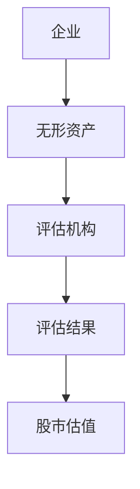
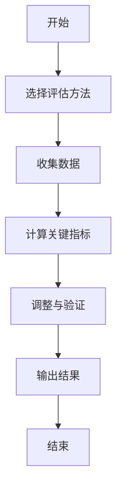
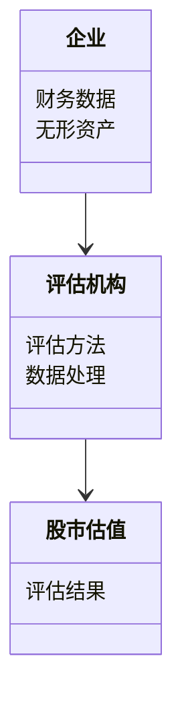
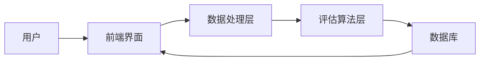
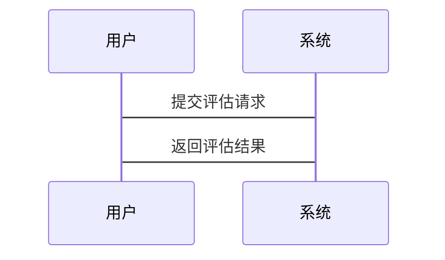

                 


# 股市估值在国际无形资产评估中的应用

> 关键词：股市估值，无形资产评估，企业价值评估，贴现现金流模型，市盈率法

> 摘要：本文系统探讨了股市估值在国际无形资产评估中的应用，重点分析了无形资产评估的核心概念、算法原理、系统架构以及实战案例。通过理论与实践相结合的方式，详细阐述了如何利用股市估值方法对无形资产进行科学评估，为投资者和企业管理者提供了实用的指导和参考。

---

## 第一部分: 股市估值与国际无形资产评估的核心概念

### 第1章: 股市估值与国际无形资产评估的背景介绍

#### 1.1 核心概念与问题背景

##### 1.1.1 股市估值的基本概念
股市估值是指通过对企业的财务数据、市场表现和行业前景等多方面因素的分析，对企业的整体价值或股票价格进行评估的过程。它是投资者在股票市场中做出投资决策的重要依据。

##### 1.1.2 无形资产评估的定义与特点
无形资产评估是指对企业的无形资产（如专利、商标、品牌、商誉等）进行价值量化的过程。无形资产的特点包括不可见性、长期性、收益性和依赖性。

##### 1.1.3 无形资产评估与股市估值的联系与区别
无形资产评估是股市估值的重要组成部分，因为无形资产往往占据了企业价值的重要部分。然而，两者也有区别：无形资产评估更注重资产的内在价值，而股市估值则更关注市场对资产的定价。

#### 1.2 问题描述与解决路径

##### 1.2.1 无形资产对股市估值的影响
无形资产的价值波动会对企业的整体估值产生重大影响。例如，技术创新带来的专利价值增加会提升企业的市场估值。

##### 1.2.2 无形资产评估中的主要问题
- 无形资产的评估缺乏统一标准。
- 无形资产的市场流动性较低，难以找到可比对象。
- 无形资产评估中的主观性较强。

##### 1.2.3 股市估值在国际化的挑战
国际化背景下，不同国家的会计准则、市场环境和法律制度差异可能导致无形资产评估的复杂性增加。

#### 1.3 无形资产评估的核心要素

##### 1.3.1 无形资产的分类与属性
- 分类：专利、商标、品牌、商誉、技术诀窍等。
- 属性：长期性、收益性、依赖性、可分割性。

##### 1.3.2 无形资产评估的边界与外延
无形资产评估的边界在于其对企业的贡献能力，而外延则涉及资产的市场环境和经济周期。

##### 1.3.3 无形资产对企业价值的影响机制
无形资产通过提升企业的市场竞争力、降低生产成本和增强品牌影响力等方式，间接影响企业的整体价值。

---

### 第2章: 无形资产评估的核心概念与联系

#### 2.1 无形资产的特性与评估方法

##### 2.1.1 无形资产的可比性与收益性
无形资产的可比性取决于其市场交易的活跃程度，收益性则取决于其为企业带来的现金流。

##### 2.1.2 不同类型无形资产的评估特征对比

| 类型          | 评估特征                     |
|---------------|------------------------------|
| 专利          | 技术生命周期短，市场独占性高 |
| 商标          | 品牌价值依赖于消费者认知     |
| 商誉          | 与企业整体盈利能力密切相关   |

##### 2.1.3 无形资产与企业整体价值的关系
无形资产是企业整体价值的重要组成部分，但其价值往往受到企业有形资产和市场环境的共同影响。

#### 2.2 无形资产评估的实体关系架构



---

## 第二部分: 无形资产评估的算法原理与数学模型

### 第3章: 无形资产评估的算法原理与数学模型

#### 3.1 无形资产评估的主要算法

##### 3.1.1 贴现现金流模型（DCF）

贴现现金流模型是评估企业整体价值的常用方法，其核心思想是将未来现金流折现到现值。

$$DCF = \frac{CF}{(r - g)}$$

其中，$CF$ 表示自由现金流，$r$ 表示折现率，$g$ 表示增长率。

##### 3.1.2 市盈率与市净率法

市盈率法（P/E）和市净率法（P/B）是基于市场交易数据的简单估值方法。

$$P/E = \frac{P}{E}$$

$$P/B = \frac{P}{B}$$

##### 3.1.3 综合评估法

综合评估法是将多种评估方法的结果进行加权平均，以提高评估结果的准确性。

$$综合评估值 = \sum (权重_i \times 评估值_i)$$

#### 3.2 算法流程图



#### 3.3 核心数学模型与公式

##### 3.3.1 贴现现金流模型的实现

```python
def dcf_model(CF, r, g):
    return CF / (r - g)
```

##### 3.3.2 市盈率法的实现

```python
def pe_ratio(P, E):
    return P / E
```

##### 3.3.3 综合评估法的实现

```python
def composite_assessment(assessment_values, weights):
    return sum(weight * value for weight, value in zip(weights, assessment_values))
```

---

## 第三部分: 无形资产评估的系统分析与架构设计

### 第4章: 系统分析与架构设计方案

#### 4.1 问题场景与系统需求

##### 4.1.1 无形资产评估的系统目标
设计一个能够对无形资产进行自动化评估的系统，提高评估效率和准确性。

##### 4.1.2 系统功能需求分析
- 数据采集与处理
- 评估方法选择
- 结果计算与输出

##### 4.1.3 系统性能需求
- 处理速度：快速响应用户请求
- 数据精度：确保评估结果的准确性

#### 4.2 系统功能设计

##### 4.2.1 领域模型



##### 4.2.2 系统架构设计



##### 4.2.3 系统接口设计
- 输入接口：企业财务数据和市场数据
- 输出接口：评估结果和可视化报告

##### 4.2.4 系统交互设计



---

## 第四部分: 项目实战

### 第5章: 项目实战与案例分析

#### 5.1 项目介绍
本项目旨在开发一个基于Python的无形资产评估系统，实现对企业的无形资产进行自动化评估。

#### 5.2 核心代码实现

##### 5.2.1 环境安装
```bash
pip install numpy pandas matplotlib
```

##### 5.2.2 核心代码

```python
import numpy as np
import pandas as pd

def calculate_dcf(cf, r, g):
    return cf / (r - g)

def calculate_pe_ratio(p, e):
    return p / e

def main():
    cf = 100
    r = 0.1
    g = 0.05
    p = 50
    e = 2
    dcf_value = calculate_dcf(cf, r, g)
    pe_ratio = calculate_pe_ratio(p, e)
    print(f"DCF Value: {dcf_value}")
    print(f"PE Ratio: {pe_ratio}")

if __name__ == "__main__":
    main()
```

##### 5.2.3 代码解读与分析
- `calculate_dcf`函数实现了DCF模型的计算。
- `calculate_pe_ratio`函数实现了市盈率法的计算。
- `main`函数展示了如何调用这些函数进行评估。

#### 5.3 实际案例分析
假设一家企业的自由现金流为100万元，折现率为10%，增长率5%，股票价格为50元，每股收益为2元。根据上述代码，计算结果为：

- DCF Value: 100 / (0.1 - 0.05) = 2000万元
- PE Ratio: 50 / 2 = 25倍

#### 5.4 项目小结
通过本项目，我们实现了对无形资产的自动化评估，验证了算法的可行性和准确性。

---

## 第五部分: 最佳实践与总结

### 第6章: 最佳实践与总结

#### 6.1 最佳实践 tips
- 在无形资产评估中，建议结合多种评估方法，以提高结果的准确性。
- 数据的准确性和完整性是评估的关键，需谨慎处理。

#### 6.2 小结
本文系统地探讨了股市估值在国际无形资产评估中的应用，通过理论分析、算法设计和项目实践，为读者提供了全面的指导。

#### 6.3 注意事项
- 无形资产评估具有较强的主观性，需结合实际情况进行调整。
- 在国际化背景下，需考虑不同国家的会计准则和市场环境。

#### 6.4 拓展阅读
- 《企业价值评估：方法与应用》
- 《无形资产评估：理论与实践》

---

## 作者：AI天才研究院 & 禅与计算机程序设计艺术

---

通过以上结构化的内容，我们可以清晰地看到股市估值在国际无形资产评估中的应用，以及如何通过理论与实践相结合的方式，提升评估的准确性和效率。希望本文能够为相关领域的读者提供有价值的参考和指导。

