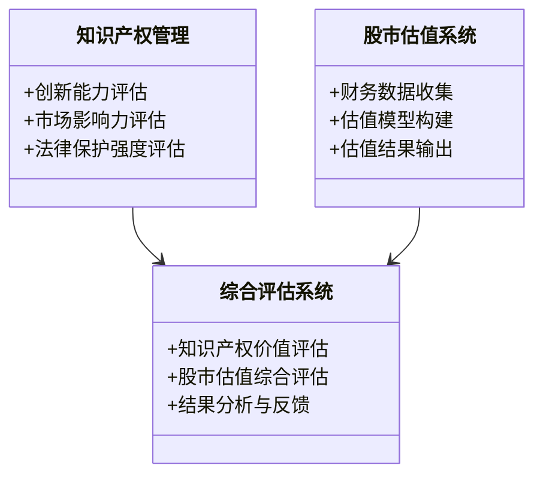
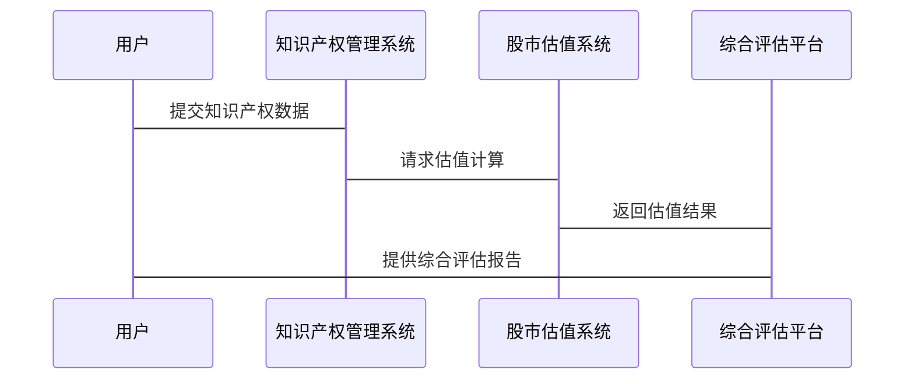

                 


# 股市估值在国际知识产权价值链中的应用

> 关键词：股市估值，知识产权，价值链，企业价值，经济分析，投资策略

> 摘要：本文探讨了如何将股市估值的方法应用于国际知识产权的价值链管理中，分析了知识产权与股市估值的核心概念及其联系，详细讲解了相关算法原理，并通过实际案例展示了其在项目中的应用。本文旨在为知识产权管理和投资决策提供新的视角和方法。

---

## 第1章 股市估值与国际知识产权价值链的背景介绍

### 1.1 知识产权的基本概念

- **1.1.1 知识产权的定义与核心要素**
  - 知识产权的定义
  - 核心要素：创新性、独创性、可复制性
- **1.1.2 知识产权的分类与保护机制**
  - 专利、商标、版权的分类
  - 法律保护机制：专利法、版权法、反不正当竞争法
- **1.1.3 知识产权在国际经济中的地位**
  - 知识产权作为无形资产的重要性
  - 知识产权在国际贸易中的作用

### 1.2 股市估值的基本原理

- **1.2.1 股市估值的核心概念**
  - 企业价值评估的定义
  - 影响股市估值的主要因素：盈利能力、成长性、风险
- **1.2.2 股市估值的主要方法**
  - 市盈率法、市净率法、现金流折现法
  - 估值模型的选择与应用
- **1.2.3 股市估值与企业价值的关系**
  - 企业价值的多维度评估
  - 股市估值的市场反映机制

### 1.3 知识产权与股市估值的结合

- **1.3.1 知识产权在企业价值中的作用**
  - 知识产权对企业竞争力的影响
  - 知识产权的市场价值评估
- **1.3.2 股市估值在知识产权管理中的应用**
  - 知识产权的价值评估对企业估值的影响
  - 股市估值对知识产权保护策略的反馈作用
- **1.3.3 国际知识产权价值链的形成**
  - 知识产权价值链的概念
  - 国际化背景下的价值链管理

### 1.4 本章小结

---

## 第2章 知识产权与股市估值的核心概念与联系

### 2.1 知识产权的核心原理

- **2.1.1 知识产权的法律保护**
  - 专利权、商标权、版权的法律保护
  - 知识产权的侵权风险与应对策略
- **2.1.2 知识产权的经济价值**
  - 知识产权的市场价值评估方法
  - 知识产权的经济收益模型
- **2.1.3 知识产权的生命周期**
  - 从创造到市场的生命周期管理
  - 知识产权的贬值与更新机制

### 2.2 股市估值的核心原理

- **2.2.1 股市估值的数学模型**
  - 市盈率模型：$$ P/E = \frac{P}{E} $$
  - 现金流折现模型：$$ V = \sum_{t=1}^{n} \frac{CF_t}{(1+r)^t} $$
- **2.2.2 股市估值的关键因素**
  - 盈利能力、成长性、风险
  - 市场情绪与宏观经济环境
- **2.2.3 股市估值的动态变化**
  - 市场波动对估值的影响
  - 企业基本面变化对估值的调整

### 2.3 知识产权与股市估值的联系

- **2.3.1 知识产权对股市估值的影响**
  - 知识产权的市场价值对企业估值的贡献
  - 知识产权的创新能力对股价的推动作用
- **2.3.2 股市估值对知识产权管理的反馈作用**
  - 估值结果对企业知识产权战略的指导意义
  - 知识产权保护与企业市值的关系
- **2.3.3 知识产权价值链的系统性分析**
  - 价值链各环节的协同效应
  - 价值链的整体优化策略

### 2.4 本章小结

---

## 第3章 股市估值在国际知识产权价值链中的算法原理

### 3.1 知识产权价值评估模型

- **3.1.1 知识产权价值评估的数学模型**
  - 综合评估模型：$$ V = a \cdot P + b \cdot Q + c \cdot R $$
    - 其中，P为创新能力，Q为市场影响力，R为法律保护强度
  - 评估模型的权重确定方法
- **3.1.2 知识产权价值评估的步骤**
  - 数据收集与整理
  - 模型构建与参数校准
  - 评估结果的验证与调整
- **3.1.3 知识产权价值评估的案例分析**
  - 某高科技企业的专利价值评估
  - 案例分析的步骤与结果解读

### 3.2 股市估值的核心算法

- **3.2.1 股市估值的主要方法**
  - 市盈率法、市净率法、现金流折现法的优缺点
  - 方法选择的依据与策略
- **3.2.2 股市估值的数学公式**
  - 现金流折现模型：$$ V = \sum_{t=1}^{n} \frac{CF_t}{(1+r)^t} $$
  - 市盈率模型：$$ P = E \cdot EBIT \cdot (1 - \frac{D}{E}) $$
- **3.2.3 股市估值的算法流程图**

```mermaid
graph TD
    A[开始] -> B[收集企业财务数据]
    B -> C[选择估值方法]
    C -> D[计算初步估值]
    D -> E[验证与调整]
    E -> F[输出最终估值]
    F -> G[结束]
```

### 3.3 知识产权与股市估值的结合算法

- **3.3.1 知识产权价值与股市估值的关联**
  - 知识产权价值对股价的影响
  - 知识产权保护强度与估值的关系
- **3.3.2 知识产权价值链的动态评估**
  - 价值链各环节的动态调整
  - 评估结果的实时更新与反馈
- **3.3.3 知识产权与股市估值的协同优化**
  - 知识产权管理与投资策略的协同
  - 优化知识产权保护与企业估值的关系

### 3.4 本章小结

---

## 第4章 知识产权与股市估值的系统分析与架构设计

### 4.1 问题场景介绍

- 知识产权价值链管理的复杂性
- 股市估值在其中的关键作用
- 系统设计的目标与范围

### 4.2 系统功能设计

- **4.2.1 领域模型（Mermaid 类图）**



### 4.3 系统架构设计

- **4.3.1 系统架构图（Mermaid 架构图）**


### 4.4 系统接口设计

- 接口定义与交互流程
- 数据流与信息传递机制

### 4.5 系统交互设计

- **4.5.1 系统交互流程图（Mermaid 序列图）**



### 4.6 本章小结

---

## 第5章 项目实战：基于股市估值的知识产权价值评估系统实现

### 5.1 环境安装与配置

- 开发环境：Python、Jupyter Notebook、Mermaid工具
- 安装依赖：pandas、numpy、scipy、matplotlib

### 5.2 核心系统实现

- **5.2.1 知识产权价值评估模型实现**

```python
import pandas as pd
import numpy as np

def calculate_ip_value(P, Q, R):
    a = 0.5
    b = 0.3
    c = 0.2
    return a * P + b * Q + c * R

# 示例数据
P = 80  # 创新能力
Q = 70  # 市场影响力
R = 90  # 法律保护强度

value = calculate_ip_value(P, Q, R)
print(f"知识产权价值评估结果为：{value}")
```

- **5.2.2 股市估值模型实现**

```python
def discounted_cash_flow(CF, r, n):
    return sum(CF / (1 + r)**t for t in range(1, n+1))

CF = [100, 120, 130, 150]
r = 0.08
n = 4

value = discounted_cash_flow(CF, r, n)
print(f"现金流折现模型估值结果为：{value}")
```

### 5.3 案例分析与结果解读

- 某科技企业的知识产权价值评估
- 股市估值结果的分析与优化建议

### 5.4 项目小结

---

## 第6章 总结与展望

### 6.1 本章总结

- 本文的核心内容回顾
- 知识产权与股市估值结合的主要成果

### 6.2 未来研究方向

- 更复杂的数学模型开发
- 大数据与人工智能在知识产权估值中的应用
- 全球化背景下的知识产权管理策略

### 6.3 最佳实践 tips

- 知识产权保护的重要性
- 股市估值在企业战略中的作用
- 知识产权与股市估值结合的注意事项

### 6.4 小结

---

## 作者

作者：AI天才研究院/AI Genius Institute & 禅与计算机程序设计艺术 /Zen And The Art of Computer Programming

