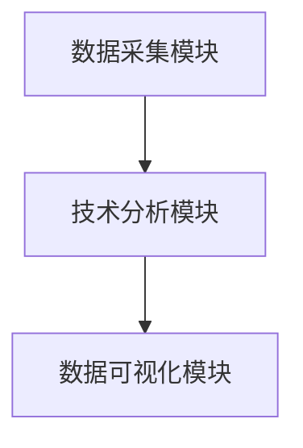

                 


# 股市估值在跨境技术价值链分析中的应用

> **关键词**：股市估值、技术分析、跨境技术、价值链分析、投资策略

> **摘要**：本文探讨了股市估值在跨境技术价值链分析中的应用，通过技术分析方法、数学模型和系统架构设计，结合实际案例，详细分析了如何利用技术分析工具和算法模型对跨境技术公司的价值进行评估，并提出了相应的投资策略和最佳实践。

---

# 第1章: 股市估值的基本概念

## 1.1 股市估值的核心概念

### 1.1.1 股市估值的定义与作用

股市估值是通过对公司财务数据、市场环境和行业趋势的分析，评估公司股票的内在价值。其作用在于帮助投资者做出合理的投资决策，识别被低估或高估的股票。

### 1.1.2 传统估值方法与现代技术分析的对比

传统估值方法依赖于基本面分析，如市盈率（P/E）和市净率（P/B）等指标，而现代技术分析则通过价格走势、成交量和图表形态预测市场趋势。

### 1.1.3 技术分析在股市估值中的地位

技术分析是股市估值的重要组成部分，通过分析历史价格数据，预测未来的价格走势，帮助投资者识别买入和卖出的最佳时机。

---

## 1.2 技术分析的基本原理

### 1.2.1 技术分析的核心假设

技术分析基于以下假设：
1. 市场价格反映所有信息（有效市场假说）。
2. 历史价格走势具有重复性。
3. 市场趋势具有持续性。

### 1.2.2 技术分析的主要工具与指标

- **K线图**：展示价格的开盘、收盘、最高和最低价。
- **均线系统**：通过计算一定时期内的平均价格，判断价格趋势。
- **成交量分析**：成交量是价格变动的确认指标。

### 1.2.3 技术分析与基本面分析的结合

技术分析关注价格走势，基本面分析关注公司财务数据，两者结合可以更全面地评估股票价值。

---

## 1.3 跨境技术价值链的基本概念

### 1.3.1 技术价值链的定义

技术价值链是指从技术研发、生产、销售到服务的完整过程，涉及多个环节和技术节点。

### 1.3.2 跨境技术价值链的特点

- 全球化：跨越国界的技术研发和应用。
- 复杂性：涉及多个国家和地区的政策、法规和市场环境。
- 协作性：需要不同国家的企业和技术团队协作。

### 1.3.3 跨境技术价值链的构成要素

- 技术研发：技术创新的核心。
- 生产制造：技术产品的规模化生产。
- 市场推广：技术产品的市场拓展。
- 客户服务：技术支持和服务。

---

## 1.4 本章小结

本章介绍了股市估值的基本概念、技术分析的核心原理以及跨境技术价值链的基本概念。技术分析是股市估值的重要工具，而跨境技术价值链的复杂性要求我们从全球化视角进行分析。

---

# 第2章: 技术分析在股市估值中的应用

## 2.1 技术分析的核心方法

### 2.1.1 K线图与价格走势分析

K线图通过记录价格的开盘、收盘、最高和最低价，帮助投资者识别价格趋势和关键点位。

### 2.1.2 均线系统与趋势判断

均线系统通过计算一定时期内的平均价格，帮助投资者判断价格趋势的强弱。例如，5日均线和10日均线常用于短期趋势分析。

### 2.1.3 成交量分析与市场情绪

成交量是价格走势的确认指标。高成交量通常意味着市场情绪高涨，低成交量则可能表示市场犹豫不决。

---

## 2.2 技术指标的分类与应用

### 2.2.1 动量指标（如RSI）

**相对强弱指数（RSI）**用于衡量价格的超买或超卖状态，通常取值范围为0到100。

### 2.2.2 移动平均收敛散度（MACD）

**MACD**由两条移动平均线组成，用于判断价格趋势的强度和方向。

### 2.2.3 相对强弱指数（RVI）

RVI通过比较一定时期内的最高价和最低价，判断价格的强弱。

---

## 2.3 技术分析在跨境技术价值链中的应用

### 2.3.1 跨境技术公司的技术分析框架

- 选择具有技术优势的公司。
- 分析公司的财务数据和市场表现。
- 利用技术分析工具预测公司股票的走势。

### 2.3.2 跨境技术公司估值的关键指标

- 市盈率（P/E）：衡量公司股票的估值是否合理。
- 市净率（P/B）：衡量公司股票相对于其账面价值的高低。
- 现金流（CF）：衡量公司的盈利能力和现金流健康状况。

### 2.3.3 跨境技术公司的投资策略

- 长期投资：选择具有持续技术优势的公司。
- 短期投资：利用技术分析工具捕捉短期价格波动。

---

## 2.4 本章小结

本章详细介绍了技术分析的核心方法及其在跨境技术价值链中的应用。通过技术分析工具和指标，投资者可以更好地评估跨境技术公司的价值，并制定相应的投资策略。

---

# 第3章: 股市估值的数学模型与算法

## 3.1 常见估值模型概述

### 3.1.1 市盈率（P/E）模型

$$ P/E = \frac{Price}{Earnings} $$

### 3.1.2 市净率（P/B）模型

$$ P/B = \frac{Price}{Book\ Value} $$

### 3.1.3 现金流折现模型（DCF）

$$ DCF = \sum_{t=1}^{n} \frac{CF_t}{(1+r)^t} + \frac{TV}{(1+r)^n} $$

---

## 3.2 技术分析中的数学模型

### 3.2.1 移动平均模型

$$ MA_n = \frac{1}{n} \sum_{i=1}^{n} P_i $$

### 3.2.2 布林格带模型

- 中线（MA）：$$ MA = \frac{1}{n} \sum_{i=1}^{n} P_i $$
- 上轨：$$ MA + n \times SD $$
- 下轨：$$ MA - n \times SD $$

### 3.2.3 相关性分析与回归模型

通过相关系数（Pearson相关系数）和回归分析，判断技术指标与价格走势的相关性。

---

## 3.3 股市估值算法的实现

### 3.3.1 市盈率计算公式

$$ P/E = \frac{Price}{Earnings} $$

### 3.3.2 市净率计算公式

$$ P/B = \frac{Price}{Book\ Value} $$

### 3.3.3 现金流折现模型

$$ DCF = \sum_{t=1}^{n} \frac{CF_t}{(1+r)^t} + \frac{TV}{(1+r)^n} $$

---

## 3.4 本章小结

本章介绍了股市估值中的常见模型和相关数学算法，包括市盈率、市净率和现金流折现模型。这些模型为技术分析提供了理论基础。

---

# 第4章: 系统架构与技术实现

## 4.1 系统架构设计

### 4.1.1 系统功能模块划分

- 数据采集模块：收集股票数据。
- 技术分析模块：计算技术指标。
- 数据可视化模块：展示分析结果。

### 4.1.2 数据流与模块交互

- 数据采集模块将数据传递给技术分析模块。
- 技术分析模块将结果传递给数据可视化模块。

### 4.1.3 系统架构图



---

## 4.2 数据收集与处理

### 4.2.1 数据来源与采集

- 数据来源：股票交易所API。
- 数据采集工具：Python的`pandas`和`requests`库。

### 4.2.2 数据清洗与预处理

- 去除缺失值。
- 标准化数据格式。

### 4.2.3 数据存储与管理

- 数据库：MySQL或MongoDB。

---

## 4.3 技术分析模块实现

### 4.3.1 技术指标计算

- 移动平均线：使用Python的`numpy`库计算。
- 相关性分析：使用`pandas`的`corr()`函数。

### 4.3.2 图表绘制与可视化

- 使用`matplotlib`或`plotly`绘制K线图和指标图。

### 4.3.3 算法实现与优化

- 优化技术指标计算效率。
- 采用并行计算加速处理。

---

## 4.4 本章小结

本章详细介绍了系统架构设计、数据处理和算法实现，为后续的项目实战奠定了基础。

---

# 第5章: 项目实战

## 5.1 环境安装

- 安装Python和相关库：`pandas`, `numpy`, `matplotlib`, `requests`。

## 5.2 系统核心实现源代码

```python
import pandas as pd
import numpy as np
import matplotlib.pyplot as plt
import requests

# 数据采集
def get_data(ticker):
    url = f'https://api.example.com/stock/{ticker}'
    response = requests.get(url)
    data = response.json()
    df = pd.DataFrame(data['historical_data'])
    return df

# 技术分析
def technical_analysis(df):
    df['MA_5'] = df['close'].rolling(5).mean()
    df['MA_10'] = df['close'].rolling(10).mean()
    df['RSI'] = df['close'].rolling(14).apply(lambda x: (x[-1] - x[:-1].mean()) / x.std())
    return df

# 数据可视化
def visualize(df):
    plt.figure(figsize=(12, 6))
    plt.plot(df['close'], label='Close Price')
    plt.plot(df['MA_5'], label='5-day MA')
    plt.plot(df['MA_10'], label='10-day MA')
    plt.legend()
    plt.show()

# 主函数
def main():
    ticker = 'AAPL'
    data = get_data(ticker)
    df_ta = technical_analysis(data)
    visualize(df_ta)

if __name__ == '__main__':
    main()
```

---

## 5.3 代码应用解读与分析

- `get_data`函数：从API获取股票数据。
- `technical_analysis`函数：计算移动平均线和RSI指标。
- `visualize`函数：绘制价格走势和指标图。

---

## 5.4 案例分析

以苹果公司（AAPL）为例，通过技术分析模型计算其市盈率、市净率和RSI指标，判断其股票的估值是否合理。

---

## 5.5 本章小结

本章通过实际案例展示了如何利用技术分析工具对跨境技术公司的股票进行估值，并给出了相应的代码实现。

---

# 第6章: 总结与展望

## 6.1 总结

本文从技术分析的基本原理出发，结合数学模型和系统架构设计，详细探讨了股市估值在跨境技术价值链分析中的应用。通过实际案例的分析，验证了技术分析方法的有效性。

## 6.2 展望

未来，随着人工智能和大数据技术的发展，技术分析在股市估值中的应用将更加广泛和深入。投资者可以通过更复杂的算法和模型，进一步提高股票估值的准确性。

---

# 作者：AI天才研究院 & 禅与计算机程序设计艺术

---

感谢您的阅读！希望本文能为您提供有价值的见解和启发！

