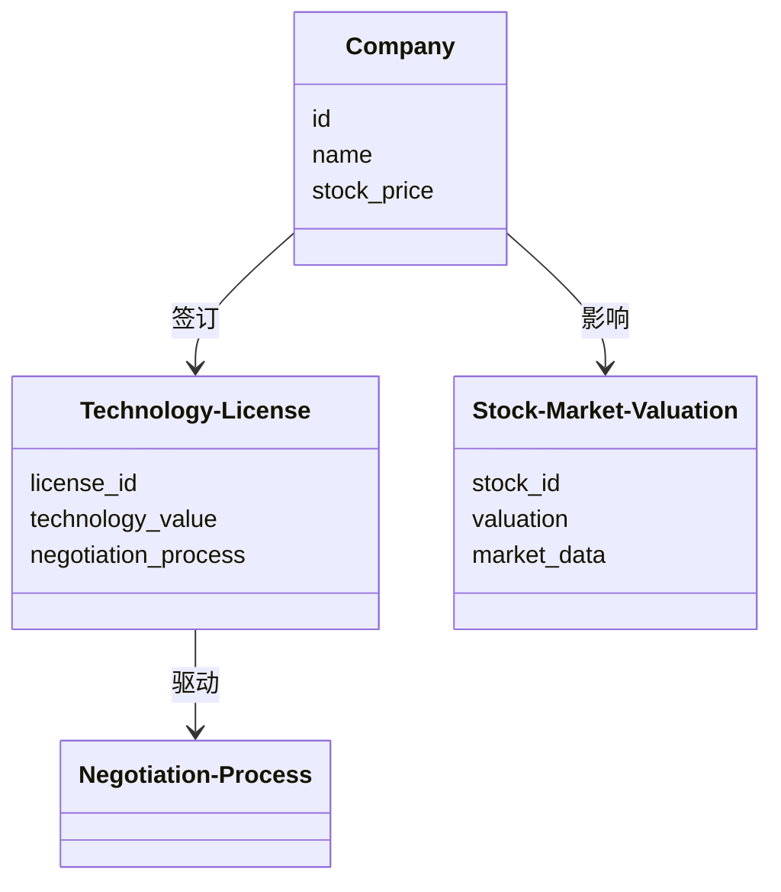
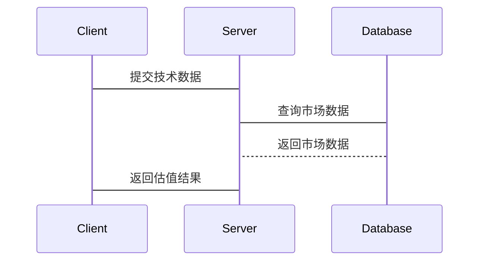

                 


# 股市估值在跨境技术许可谈判中的应用

## 关键词：
- 股市估值
- 技术许可谈判
- 跨境谈判
- 企业价值评估
- 技术价值评估

## 摘要：
股市估值是企业在技术许可谈判中的关键因素，特别是在跨境谈判中，技术的价值往往决定了谈判的结果。本文通过分析股市估值的核心算法、技术许可谈判的核心要素，以及两者之间的关系，深入探讨股市估值在技术许可谈判中的应用。同时，本文结合实际案例，分析股市估值在技术许可谈判中的应用场景，并提出相应的解决方案。

---

# 第一部分: 股市估值在跨境技术许可谈判中的应用概述

## 第1章: 股市估值与跨境技术许可谈判的背景

### 1.1 股市估值的基本概念
#### 1.1.1 股市估值的定义与核心要素
股市估值是通过对企业财务数据和市场表现的分析，对其股票价值进行评估的过程。核心要素包括市盈率（P/E）、市净率（P/B）、净现值（NPV）等。

#### 1.1.2 股市估值在企业价值评估中的作用
股市估值不仅是企业价值的重要指标，还能反映企业的市场地位和发展潜力。它是投资者和企业管理者在决策过程中的重要参考。

#### 1.1.3 股市估值与技术许可谈判的关联性
技术许可谈判的核心是技术的价值评估。股市估值为企业提供了评估技术价值的参考，特别是在跨境谈判中，股市估值可以帮助双方确定技术的市场价值。

### 1.2 跨境技术许可谈判的核心要素
#### 1.2.1 技术许可的基本概念
技术许可是指一方将其技术授权给另一方使用，并收取许可费的过程。跨境技术许可涉及多个国家和法律体系，复杂性更高。

#### 1.2.2 跨境技术许可的主要模式
跨境技术许可的主要模式包括独占许可、排他许可和普通许可。每种模式的谈判策略和估值方法有所不同。

#### 1.2.3 跨境技术许可谈判的关键问题
跨境技术许可谈判的关键问题包括技术价值评估、许可费的确定、知识产权保护、法律风险等。

### 1.3 股市估值在技术许可谈判中的应用背景
#### 1.3.1 股市估值与企业价值评估的关系
股市估值是企业价值评估的重要组成部分，可以帮助企业在技术许可谈判中确定技术的市场价值。

#### 1.3.2 技术许可谈判中的估值挑战
技术许可谈判中的估值挑战包括技术的不确定性、市场波动性、法律风险等。

#### 1.3.3 股市估值在跨境谈判中的独特价值
股市估值在跨境技术许可谈判中的独特价值在于其能够提供技术的市场价值参考，帮助双方确定合理的许可费。

## 第2章: 股市估值与技术许可谈判的核心概念对比

### 2.1 股市估值与技术许可谈判的核心要素对比
#### 2.1.1 股市估值的核心属性
股市估值的核心属性包括市盈率、市净率、净现值等。

#### 2.1.2 技术许可谈判的核心属性
技术许可谈判的核心属性包括技术价值、许可费、知识产权保护等。

#### 2.1.3 两者的核心要素对比分析
通过对比分析，可以发现股市估值和技术许可谈判的核心要素既有相似之处，也有不同之处。

### 2.2 股市估值与技术许可谈判的对比分析表
| 对比维度 | 股市估值 | 技术许可谈判 |
|----------|----------|--------------|
| 核心指标 | 市盈率、市净率 | 技术价值、许可费 |
| 应用场景 | 企业价值评估 | 技术授权与合作 |

### 2.3 股市估值与技术许可谈判的ER实体关系图
```mermaid
erDiagram
    company : 公司
    technology_license : 技术许可协议
    stock_market_valuation : 股市估值
    negotiation_process : 谈判过程
    company --> technology_license : 签订
    company --> stock_market_valuation : 影响
    technology_license --> negotiation_process : 驱动
```

## 第3章: 股市估值在技术许可谈判中的算法原理

### 3.1 股市估值的核心算法
#### 3.1.1 市盈率（P/E）计算公式
$$ P/E = \frac{\text{股价}}{\text{每股收益}} $$

#### 3.1.2 市净率（P/B）计算公式
$$ P/B = \frac{\text{股价}}{\text{每股净资产}} $$

#### 3.1.3 净现值法（NPV）计算公式
$$ NPV = \sum_{t=1}^{n} \frac{C_t}{(1+r)^t} $$

### 3.2 技术许可谈判中的算法应用
#### 3.2.1 技术价值评估的算法流程
1. 收集技术的市场数据
2. 确定技术的评估指标
3. 计算技术的市场价值
4. 确定合理的许可费

### 3.3 技术许可谈判中的Python实现
```python
def calculate_technology_value(revenue, cost, discount_rate, years):
    npv = 0
    for year in range(years):
        cash_flow = revenue - cost
        npv += cash_flow / (1 + discount_rate) ** (year + 1)
    return npv
```

---

# 第四部分: 系统分析与架构设计方案

## 第4章: 系统分析与架构设计

### 4.1 问题场景介绍
技术许可谈判涉及多个利益相关者，包括企业、律师、财务团队等。如何利用股市估值进行技术价值评估是关键问题。

### 4.2 项目介绍
本项目旨在构建一个基于股市估值的技术许可谈判支持系统，帮助企业在跨境谈判中确定技术的市场价值。

### 4.3 系统功能设计
#### 4.3.1 领域模型


### 4.4 系统架构设计


### 4.5 系统接口设计
#### 4.5.1 系统接口
- 输入接口：技术数据、市场数据
- 输出接口：估值结果、许可费建议

#### 4.5.2 系统交互


---

# 第五部分: 项目实战

## 第5章: 项目实战

### 5.1 项目背景
本项目以苹果和华为的跨境技术许可谈判为例，分析股市估值在谈判中的应用。

### 5.2 项目实施过程
1. 收集相关数据
2. 确定估值方法
3. 计算技术价值
4. 确定许可费

### 5.3 项目代码实现
```python
def calculate_technology_value(revenue, cost, discount_rate, years):
    npv = 0
    for year in range(years):
        cash_flow = revenue - cost
        npv += cash_flow / (1 + discount_rate) ** (year + 1)
    return npv

# 示例数据
revenue = 1000
cost = 500
discount_rate = 0.1
years = 5

value = calculate_technology_value(revenue, cost, discount_rate, years)
print(f"技术价值为：{value}")
```

### 5.4 项目小结
通过实际案例分析，可以发现股市估值在技术许可谈判中的重要性。合理的估值方法能够帮助企业在谈判中确定技术的市场价值，从而制定合理的许可费。

---

# 第六部分: 总结与展望

## 第6章: 总结与展望

### 6.1 最佳实践 tips
- 在技术许可谈判中，合理运用股市估值方法
- 结合实际市场数据，调整估值模型

### 6.2 小结
股市估值是技术许可谈判中的重要工具，能够帮助企业确定技术的市场价值，从而制定合理的谈判策略。

### 6.3 注意事项
- 确保数据的准确性和完整性
- 考虑市场波动和法律风险

### 6.4 拓展阅读
- 《股市估值与企业价值评估》
- 《技术许可谈判的法律与商业策略》

---

# 作者：AI天才研究院/AI Genius Institute & 禅与计算机程序设计艺术 /Zen And The Art of Computer Programming

