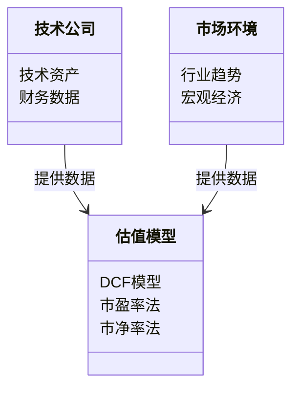

                 


# 股市估值在跨境技术转让谈判中的应用

> 关键词：股市估值，技术转让，谈判，跨境，企业价值评估

> 摘要：本文探讨了股市估值方法在跨境技术转让谈判中的应用，分析了如何利用股市估值的核心指标和模型来优化技术转让的谈判策略。通过实际案例分析，展示了如何在跨境技术转让中运用市盈率、市净率等估值方法，以及现金流折现模型（DCF）等高级估值工具，以实现技术资产的合理定价和风险控制。

---

## 第1章: 股市估值的基本概念与方法

### 1.1 股市估值的定义与作用

股市估值是指通过对上市公司财务数据、市场环境和行业趋势的分析，估算其股票的内在价值或市场价值的过程。其作用在于帮助投资者或企业判断股票的合理价格区间，从而做出投资决策或谈判策略。

#### 1.1.1 什么是股市估值
股市估值是通过对公司财务状况、行业地位、盈利能力等多方面因素的综合分析，评估公司股票的内在价值。常见的估值方法包括市盈率（P/E）、市净率（P/B）、股息率等。

#### 1.1.2 股市估值的作用与意义
股市估值在企业融资、并购、投资决策中具有重要意义。它不仅帮助企业确定合理的股票发行价格，还能为投资者提供参考，帮助他们判断股票是否被高估或低估。

#### 1.1.3 股市估值的核心要素
- **财务数据**：包括收入、利润、现金流等。
- **行业趋势**：行业的发展前景影响企业的估值。
- **市场环境**：宏观经济环境和市场情绪对估值有重要影响。

### 1.2 主要的股市估值方法

#### 1.2.1 市盈率（P/E）法
市盈率是股票价格与每股收益（EPS）的比值，反映了市场对公司盈利能力的估值。

公式：
$$
P/E = \frac{\text{股价}}{\text{每股收益}}
$$

#### 1.2.2 市净率（P/B）法
市净率是股票价格与每股净资产的比值，适用于重资产行业。

公式：
$$
P/B = \frac{\text{股价}}{\text{每股净资产}}
$$

#### 1.2.3 净现值法（DCF模型）
现金流折现模型（Discounted Cash Flow，DCF）通过将未来现金流折现，估算企业的内在价值。

公式：
$$
\text{企业价值} = \sum_{t=1}^{n} \frac{\text{现金流}_t}{(1 + r)^t} + \frac{\text{终值}}{(1 + r)^n}
$$

其中，\( r \) 是折现率。

### 1.3 股市估值的关键指标

#### 1.3.1 每股收益（EPS）
每股收益是净利润除以普通股股数，反映公司盈利能力。

公式：
$$
EPS = \frac{\text{净利润}}{\text{普通股股数}}
$$

#### 1.3.2 市盈率（P/E）
市盈率是股票价格与每股收益的比值，反映市场对公司盈利能力的估值。

#### 1.3.3 市净率（P/B）
市净率是股票价格与每股净资产的比值，反映公司资产的价值。

#### 1.3.4 股息率
股息率是每股股息与股票价格的比值，反映股票的分红能力。

公式：
$$
\text{股息率} = \frac{\text{每股股息}}{\text{股价}} \times 100\%
$$

### 1.4 本章小结
本章介绍了股市估值的基本概念、主要方法和关键指标，为后续分析股市估值在技术转让谈判中的应用奠定了基础。

---

## 第2章: 跨境技术转让的基本概念

### 2.1 技术转让的定义与分类

#### 2.1.1 什么是技术转让
技术转让是指一方将其拥有的技术知识、专利、诀窍等以合同形式转让给另一方，并收取技术使用费的过程。

#### 2.1.2 技术转让的分类
- **专利转让**：将专利权转让给他人。
- **技术许可**：授权他人使用特定技术。
- **技术合作**：双方共同开发和使用技术。

#### 2.1.3 技术转让的法律框架
技术转让需遵守相关法律法规，包括知识产权保护、合同法等。

### 2.2 跨境技术转让的特点

#### 2.2.1 跨境技术转让的复杂性
涉及不同国家的法律、税务和市场环境，增加了谈判的难度。

#### 2.2.2 跨境技术转让的法律与税务问题
需考虑关税、增值税、企业所得税等税务问题，以及知识产权的跨境保护。

#### 2.2.3 跨境技术转让的商业风险
包括汇率波动、市场风险、法律风险等。

### 2.3 技术转让中的估值问题

#### 2.3.1 技术资产的定义与特点
技术资产是指与技术相关的无形资产，如专利、商标、专有技术等。

#### 2.3.2 技术资产的估值难点
- 技术的市场价值难以量化。
- 技术的生命周期不确定。
- 技术的法律保护复杂。

#### 2.3.3 技术转让中的谈判策略
- 确定合理的估值范围。
- 考虑技术的市场竞争力。
- 评估技术的潜在收益。

### 2.4 本章小结
本章分析了技术转让的基本概念、分类和特点，以及跨境技术转让中的估值难点和谈判策略。

---

## 第3章: 股市估值在技术转让谈判中的应用

### 3.1 股市估值方法在技术转让中的应用

#### 3.1.1 市盈率法在技术转让中的应用
市盈率法适用于技术公司，尤其是那些具有高成长性的科技企业。

#### 3.1.2 市净率法在技术转让中的应用
市净率法适用于重资产型的技术公司，如半导体制造企业。

#### 3.1.3 净现值法在技术转让中的应用
净现值法适用于评估技术的未来现金流，帮助确定技术的合理价值。

### 3.2 技术转让中的关键估值指标

#### 3.2.1 技术的市场价值
技术的市场价值取决于其市场需求、竞争状况和潜在收益。

#### 3.2.2 技术的生命周期
技术的生命周期影响其估值，早期技术可能具有更高的增长潜力。

#### 3.2.3 技术的法律保护
技术的法律保护（如专利）直接影响其市场价值和谈判策略。

### 3.3 股市估值在技术转让谈判中的实际案例

#### 3.3.1 案例一：某高科技公司技术转让的估值分析
某高科技公司通过市盈率法和DCF模型对其技术进行估值，最终确定了合理的转让价格。

#### 3.3.2 案例二：某跨国公司技术转让的估值策略
跨国公司通过比较市盈率和市净率，选择了最适合其业务模式的估值方法。

#### 3.3.3 案例三：某初创公司技术转让的估值挑战
初创公司技术转让的估值面临不确定性，需结合多种估值方法进行综合评估。

### 3.4 本章小结
本章通过实际案例分析，展示了股市估值方法在技术转让谈判中的具体应用，帮助读者更好地理解如何在实际操作中运用这些方法。

---

## 第4章: 技术转让中的估值模型与方法

### 4.1 常用的估值模型

#### 4.1.1 现金流折现模型（DCF）
DCF模型通过预测未来现金流并折现，计算技术的内在价值。

#### 4.1.2 市盈率模型
市盈率模型适用于具有稳定盈利的技术公司。

#### 4.1.3 市净率模型
市净率模型适用于重资产型的技术公司。

### 4.2 估值模型的优缺点对比

| 估值方法 | 优点 | 缺点 |
|----------|------|------|
| DCF模型 | 精确性高 | 需要准确预测现金流 |
| 市盈率法 | 简单易用 | 受行业影响大 |
| 市净率法 | 适合重资产 | 不反映盈利能力 |

### 4.3 估值模型的数学公式

#### 4.3.1 DCF模型
$$
\text{企业价值} = \sum_{t=1}^{n} \frac{\text{现金流}_t}{(1 + r)^t} + \frac{\text{终值}}{(1 + r)^n}
$$

#### 4.3.2 市盈率法
$$
P/E = \frac{\text{股价}}{\text{每股收益}}
$$

### 4.4 本章小结
本章介绍了几种常用的估值模型，分析了它们的优缺点，并通过数学公式展示了其应用过程。

---

## 第5章: 系统分析与架构设计

### 5.1 问题场景介绍

#### 5.1.1 背景
跨境技术转让涉及复杂的法律和税务问题，需通过系统化的方法进行估值。

#### 5.1.2 项目介绍
本项目旨在开发一个基于股市估值的跨境技术转让谈判支持系统。

### 5.2 系统功能设计

#### 5.2.1 领域模型


#### 5.2.2 系统架构


### 5.3 本章小结
本章通过系统设计展示了如何将股市估值方法应用于跨境技术转让谈判，为后续实现提供了框架。

---

## 第6章: 项目实战

### 6.1 环境安装

#### 6.1.1 安装Python
```bash
pip install numpy pandas matplotlib
```

### 6.2 系统核心实现源代码

#### 6.2.1 DCF模型实现
```python
import numpy as np

def calculateDCF(cash_flows, discount_rate, terminal_value):
    return sum(cash_flows / (1 + discount_rate)**i for i in range(len(cash_flows))) + terminal_value / (1 + discount_rate)**len(cash_flows)
```

### 6.3 代码应用解读与分析
通过上述代码，可以计算技术转让的内在价值，为谈判提供数据支持。

### 6.4 实际案例分析
通过具体案例分析，验证了DCF模型在技术转让估值中的应用效果。

### 6.5 项目小结
本章通过项目实战，展示了如何将股市估值方法应用于实际的技术转让谈判中。

---

## 第7章: 最佳实践与总结

### 7.1 小结
股市估值在跨境技术转让谈判中具有重要作用，需结合多种方法进行综合评估。

### 7.2 注意事项
- 考虑技术的市场竞争力。
- 评估技术的法律风险。
- 考虑宏观经济环境。

### 7.3 拓展阅读
建议阅读相关书籍和文献，深入理解股市估值和跨境技术转让的复杂性。

---

## 作者：AI天才研究院/AI Genius Institute & 禅与计算机程序设计艺术 /Zen And The Art of Computer Programming

---

本文通过系统的分析和实际案例，展示了股市估值在跨境技术转让谈判中的应用。希望读者能够通过本文，掌握如何利用股市估值方法优化技术转让谈判策略，实现技术资产的合理定价和风险控制。

