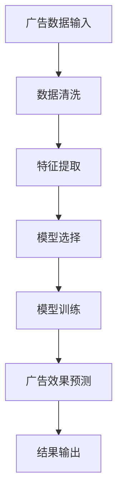
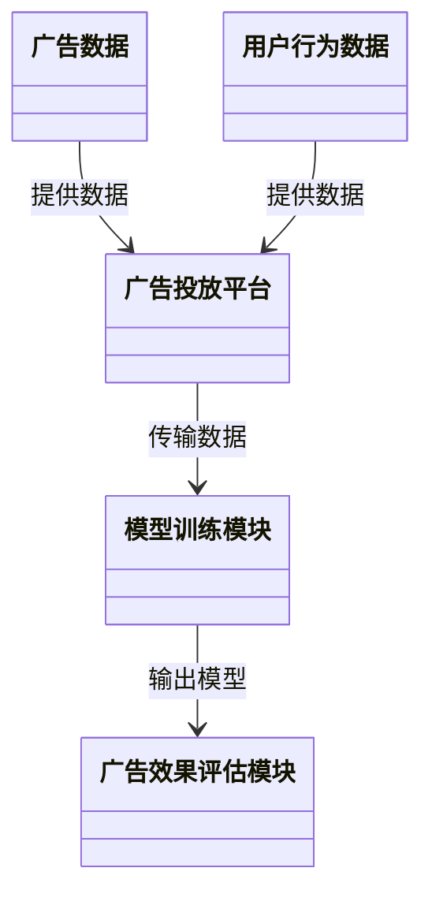
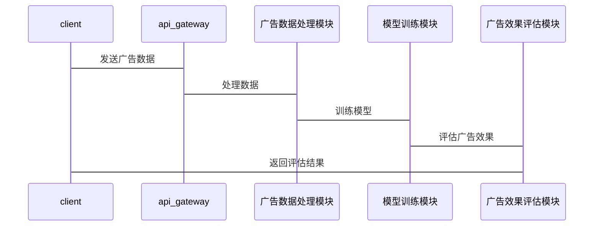

                 


# 股市估值在跨境数字广告效果评估中的应用

> **关键词**：股市估值，数字广告，效果评估，跨境广告，数据分析

> **摘要**：本文探讨了股市估值方法在数字广告效果评估中的应用，尤其是在跨国市场中。通过分析股市估值的核心概念和数字广告效果评估的主要指标，结合实际案例和系统架构设计，提出了基于股市估值的数字广告效果评估模型，并详细阐述了其实现方法和应用场景。

---

## 第1章: 股市估值与数字广告效果评估的结合

### 1.1 股市估值的核心概念

#### 1.1.1 股票估值的定义与作用
股票估值是通过对公司财务数据、市场环境和行业趋势等多方面因素的分析，确定股票的内在价值和市场价值。其作用在于帮助投资者做出理性的投资决策。

#### 1.1.2 股市估值的主要方法
- **相对估值法**：如市盈率（P/E）、市净率（P/B）等。
- **绝对估值法**：如股息贴现模型（DDM）和现金流折现模型（DCF）。
- **其他方法**：指数加权法、行业对标法等。

#### 1.1.3 股市估值与企业价值的关系
股票估值是企业价值的体现，企业价值包括资产价值、品牌价值、客户价值等多个方面。

### 1.2 跨境数字广告效果评估的挑战

#### 1.2.1 数字广告的基本概念
数字广告是指通过互联网媒介（如网站、社交媒体、搜索引擎等）投放的广告，具有精准投放、数据可追踪等特点。

#### 1.2.2 跨境广告的独特性
- 跨境广告需要考虑不同国家的市场环境、文化差异和法律法规。
- 广告投放和效果评估涉及多货币、多语言、多时区的协调。

#### 1.2.3 广告效果评估的难点
- 数据分散：广告投放平台和数据来源多样化。
- 跨境数据隐私问题：不同国家的数据保护法规差异大。
- 效果衡量标准不统一：不同市场对广告效果的定义和衡量标准不同。

### 1.3 股市估值在广告效果评估中的应用背景

#### 1.3.1 股市估值与广告效果的关联性
股市估值的核心是通过数据和模型评估企业的内在价值，而广告效果评估的核心是通过数据和模型衡量广告的实际效果，两者在方法论上有相似之处。

#### 1.3.2 数字广告行业的现状与趋势
- 数字广告市场规模持续增长。
- 数据驱动的广告效果评估成为行业趋势。
- 跨境广告需求日益增加，但评估方法相对滞后。

#### 1.3.3 股市估值方法的可迁移性
股市估值的许多方法和工具，如相对估值法、多因子模型等，可以借鉴到广告效果评估中。

### 1.4 本章小结
本章介绍了股市估值的核心概念和数字广告效果评估的主要挑战，分析了股市估值方法在广告效果评估中的应用背景。

---

## 第2章: 股市估值与数字广告效果评估的核心概念

### 2.1 股市估值的关键指标

#### 2.1.1 市盈率（P/E）
$$ P/E = \frac{\text{股价}}{\text{每股净利润}} $$

#### 2.1.2 市净率（P/B）
$$ P/B = \frac{\text{股价}}{\text{每股净资产}} $$

#### 2.1.3 股息率
$$ \text{股息率} = \frac{\text{每股股息}}{\text{股价}} $$

### 2.2 数字广告效果评估的主要指标

#### 2.2.1 点击率（CTR）
$$ CTR = \frac{\text{点击次数}}{\text{展现次数}} $$

#### 2.2.2 展现量（Impressions）
$$ Impressions = \text{广告被展示的次数} $$

#### 2.2.3 转化率（Conversion Rate）
$$ Conversion Rate = \frac{\text{转化次数}}{\text{点击次数}} $$

### 2.3 股市估值与广告效果评估的对比分析

#### 2.3.1 指标对比
| 指标类型 | 股市估值指标 | 广告效果评估指标 |
|----------|---------------|-------------------|
| 相对估值 | 市盈率（P/E） | 点击率（CTR）     |
| 绝对估值 | 股息贴现模型   | 转化率           |
| 其他     | 市净率（P/B） | 展现量           |

#### 2.3.2 方法论对比
| 方法论 | 股市估值 | 广告效果评估 |
|--------|----------|--------------|
| 数据来源 | 公司财务报表 | 广告投放数据 |
| 数据处理 | 财务指标计算 | 广告效果计算 |
| 模型应用 | 估值模型 | 预测模型     |

#### 2.3.3 数据来源对比
| 数据来源 | 股市估值 | 广告效果评估 |
|----------|----------|--------------|
| 财务数据 | 公司收入、利润、资产 | 广告点击、转化、展现数据 |
| 市场数据 | 行业指数、市场情绪 | 广告投放平台、用户行为数据 |

### 2.4 核心概念的ER实体关系图

```mermaid
er
actor: 用户
model: 股市估值模型
data: 广告数据
goal: 广告效果评估
actor --> model: 输入广告数据
model --> data: 加工处理
model --> goal: 输出评估结果
```

### 2.5 本章小结
本章详细讲解了股市估值的关键指标和数字广告效果评估的主要指标，分析了两者在方法论和数据来源上的异同，并通过ER图展示了核心概念之间的关系。

---

## 第3章: 股市估值在数字广告效果评估中的算法原理

### 3.1 股市估值的核心算法

#### 3.1.1 市盈率模型
- 通过对比目标公司的市盈率与行业平均水平，判断其估值是否合理。

#### 3.1.2 市净率模型
- 计算目标公司的市净率，与行业可比公司进行对比。

#### 3.1.3 股息贴现模型
- 根据公司未来股息的现值，计算其合理股价。

### 3.2 数字广告效果评估的算法

#### 3.2.1 点击率预测模型
- 使用逻辑回归、随机森林等算法，预测广告的点击率。

#### 3.2.2 转化率预测模型
- 通过梯度提升树（如XGBoost、LightGBM）预测广告的转化率。

#### 3.2.3 展现量与收益关系模型
- 使用线性回归或广义线性模型，分析广告展现量与收益之间的关系。

### 3.3 股市估值算法与广告效果评估算法的结合

#### 3.3.1 深度学习模型的应用
- 使用神经网络模型，同时考虑广告投放平台、用户特征、广告内容等多个因素，预测广告效果。

#### 3.3.2 时间序列分析的应用
- 利用ARIMA、Prophet等模型，分析广告效果的历史数据，预测未来的趋势。

#### 3.3.3 统计回归模型的应用
- 使用多元线性回归模型，分析多个变量对广告效果的影响。

### 3.4 算法流程图



### 3.5 本章小结
本章详细讲解了股市估值的核心算法和数字广告效果评估的算法，分析了它们的结合方式，并通过流程图展示了算法的整体流程。

---

## 第4章: 股市估值与数字广告效果评估的数学模型

### 4.1 股市估值的数学模型

#### 4.1.1 市盈率模型
$$ P/E = \frac{\text{股价}}{\text{每股净利润}} $$

#### 4.1.2 市净率模型
$$ P/B = \frac{\text{股价}}{\text{每股净资产}} $$

#### 4.1.3 股息贴现模型
$$ P = \sum_{t=1}^{n} \frac{D_t}{(1+r)^t} $$

### 4.2 数字广告效果评估的数学模型

#### 4.2.1 点击率预测模型
使用逻辑回归模型：
$$ P(\text{点击}) = \frac{1}{1 + e^{-\beta x}} $$

#### 4.2.2 转化率预测模型
使用随机森林模型：
$$ P(\text{转化}) = f(X) $$

#### 4.2.3 展现量与收益关系模型
使用线性回归模型：
$$ \text{收益} = \beta_0 + \beta_1 \times \text{展现量} + \epsilon $$

### 4.3 股市估值与广告效果评估模型的结合

#### 4.3.1 综合评估模型
$$ \text{广告效果评分} = \alpha \times \text{CTR} + \beta \times \text{转化率} + \gamma \times \text{展现量} $$

### 4.4 本章小结
本章通过数学公式详细讲解了股市估值和数字广告效果评估的主要模型，并提出了综合评估模型。

---

## 第5章: 系统分析与架构设计

### 5.1 问题场景介绍
- 广告投放跨国市场，数据分散在不同平台。
- 需要实时或近实时评估广告效果。

### 5.2 项目介绍
- 开发一个基于股市估值方法的广告效果评估系统。

### 5.3 系统功能设计

#### 5.3.1 领域模型


#### 5.3.2 系统架构设计


#### 5.3.3 系统接口设计
- API接口：提供广告数据的上传和下载接口。
- 数据格式：统一使用JSON格式。

#### 5.3.4 系统交互流程



### 5.4 本章小结
本章通过系统架构设计，展示了如何将股市估值方法应用于广告效果评估系统中。

---

## 第6章: 项目实战

### 6.1 环境安装

```bash
# 安装Python环境
pip install python3

# 安装依赖库
pip install numpy pandas scikit-learn xgboost
```

### 6.2 系统核心实现源代码

#### 6.2.1 数据处理代码

```python
import pandas as pd

# 读取广告数据
data = pd.read_csv('advertisement.csv')

# 数据清洗
data.dropna(inplace=True)
data = data[[
    'country', 'ad_id', 'clicks', 'impressions', 'conversions'
]]
```

#### 6.2.2 模型训练代码

```python
from sklearn.model

